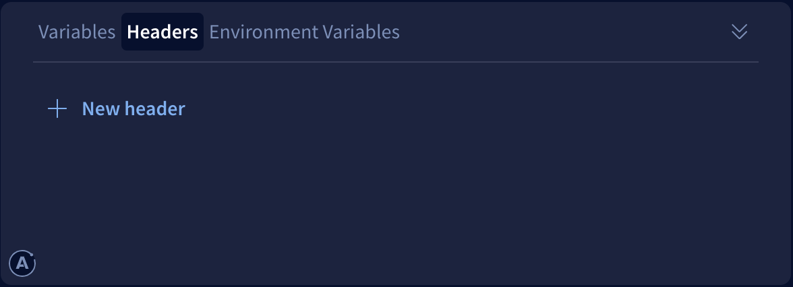

This API reference documents built-in plugins that add a landing page to Apollo Server's base URL, enabling visitors to interact with the server from their browser.

This includes plugins for:

* The default landing page for [non-production environments](#default-non-production-landing-page) (`ApolloServerPluginLandingPageLocalDefault`)
* The default landing page for [production](#default-production-landing-page) (`ApolloServerPluginLandingPageProductionDefault`)
* Using [GraphQL Playground](#graphql-playground-landing-page) as a landing page (`ApolloServerPluginLandingPageGraphQLPlayground`)
* [Disabling the landing page entirely](#disabling-the-landing-page)

These plugins work by implementing the [`renderLandingPage`](../../integrations/plugins-event-reference/#renderlandingpage) plugin event, which serves an HTML page whenever a browser includes an `accept: text/html` header. Aside from these, you can also create a  [custom plugin](../../integrations/plugins/) that renders a [custom landing page](../../testing/build-run-queries/#custom-landing-page).

## Default behavior

If you don't manually install any plugin that implements `renderLandingPage`, Apollo Server does the following by default:

* In non-production environments (`NODE_ENV` is not `production`), Apollo Server installs `ApolloServerPluginLandingPageLocalDefault`.
* In production environments (`NODE_ENV` _is_ `production`), Apollo Server installs `ApolloServerPluginLandingPageProductionDefault`.

In either case, Apollo Server provides no configuration options to the plugin. You only need to install one of these plugins manually if you want to override its default configuration.

### Configuring default landing pages

To configure these default plugins while still using same `NODE_ENV`-based logic, import them from the `apollo-server-core` package and pass them to the `ApolloServer` constructor in the `plugins` array:

```js
import { ApolloServer } from "apollo-server";
import { ApolloServerPluginLandingPageLocalDefault,
         ApolloServerPluginLandingPageProductionDefault
} from "apollo-server-core";

const server = new ApolloServer({
  typeDefs,
  resolvers,
  plugins: [
    // Install a landing page plugin based on NODE_ENV
    process.env.NODE_ENV === 'production'
      ? ApolloServerPluginLandingPageProductionDefault({
          graphRef: "my-graph-id@my-graph-variant",
          footer: false,
        })
      : ApolloServerPluginLandingPageLocalDefault({ footer: false }),
  ],
});
```

Available configuration options are listed in each plugin's reference below.

## Default non-production landing page

The `ApolloServerPluginLandingPageLocalDefault` plugin shows a landing page welcoming you to Apollo Server:


This landing page is designed for use in local development, where `NODE_ENV` is not set to `production`. It provides a copyable command-line snippet showing how to run operations via `curl`, and it also links to Apollo Sandbox (a hosted GraphQL IDE that runs entirely inside your browser and doesn't require an account).

### Options

<table class="field-table">
  <thead>
    <tr>
      <th>Name /<br/>Type</th>
      <th>Description</th>
    </tr>
  </thead>

<tbody>

<tr>
<td>

###### `version`

`string`
</td>
<td>

By default, this plugin uses the latest version of the landing page published to Apollo's CDN. If you'd like to pin the current version, you can specify it here.

The current latest version is available at [this link](https://apollo-server-landing-page.cdn.apollographql.com/_latest/version.txt).

</td>
</tr>

<tr>
<td>

###### `footer`

`boolean`
</td>
<td>

By default, the landing page displays a footer that links to the documentation telling you how to configure it. To remove this footer, pass `footer: false`.

</td>
</tr>

</tbody>
</table>


## Default production landing page

The `ApolloServerPluginLandingPageProductionDefault` shows a minimalist landing page:


This landing page is designed for use in production. It provides a copyable command-line snippet showing how to run operations with your server. By default, the only visible reference to Apollo is a footer explaining how to customize the page. You can also configure it to add a link to query your graph with the Apollo Studio Explorer.

### Options

<table class="field-table">
  <thead>
    <tr>
      <th>Name /<br/>Type</th>
      <th>Description</th>
    </tr>
  </thead>

<tbody>

<tr>
<td>

###### `version`

`string`
</td>
<td>

By default, this plugin uses the latest version of the landing page published to Apollo's CDN. If you'd like to pin the current version, you can specify it here.

The current latest version is available at [this link](https://apollo-server-landing-page.cdn.apollographql.com/_latest/version.txt).

</td>
</tr>

<tr>
<td>

###### `footer`

`boolean`
</td>
<td>

By default, the landing page displays a footer that links to the documentation telling you how to configure it. To remove this footer, pass `footer: false`.

</td>
</tr>

<tr>
<td>

###### `graphRef`

`string`
</td>
<td>

If provided, the landing page includes a link (with opt-in auto-redirect) to the Apollo Studio page for the graph with the corresponding [graph ref](https://www.apollographql.com/docs/rover/conventions/#graph-refs). An example graph ref is `my-graph@my-variant`.

To enable this link, you need to provide `graphRef` here even if you already provide it elsewhere for usage reporting and other purposes. This is because if your server is publicly accessible, you might not want to display the graph ref publicly.

</td>
</tr>

<tr>
<td>

###### `document`

`string`
</td>
<td>

A GraphQL document (eg, query or mutation) to populate in the Studio Explorer's editor on load.

If you omit this, the Explorer initially loads an example query based on your schema.

</td>
</tr>

<tr>
<td>

###### `variables`

`Record<string, string>`
</td>
<td>

An object containing initial variable values to populate in the Explorer on load.

If provided, these variables should apply to the initial query you provide in `document`.

</td>
</tr>

<tr>
<td>

###### `headers`

`Record<string, string>`
</td>
<td>

An object containing initial HTTP header values to populate in the Explorer on load.

</td>
</tr>
<tr>
<td>

###### `includeCookies`

`boolean`
</td>
<td>

A boolean used to set whether Studio Explorer should include cookies in its GraphQL requests to your server.

If you omit this, the Explorer defaults `includeCookies` to `false` or the current user setting.

</td>
</tr>

</tbody>
</table>

## Embedded Explorer landing page

The `ApolloServerPluginLandingPageEmbeddedExplorer` renders the Apollo Studio Explorer embedded on your origin:

TODO image when we have added all the features we want to to public & private embeds

This landing page is available for use in production or local development. If you include this plugin, the Apollo Studio embedded Explorer will be rendered via an iframe on your origin. The JS used to render this iframe will run on your origin, and you should make sure you are comfortable with that before choosing the embedded Explorer. All of the JS used to render the Explorer is in the open source repo [`studio-landing-page`](https://github.com/apollographql/studio-landing-page) which calls an apollo npm package `@apollo/explorer` which runs code from https://github.com/apollographql/embeddable-explorer.

We are offering the embedded Explorer as a maintained option while other options, like GraphQL Playground are not currently being maintained. While the Apollo team treats security issues in both GraphQL Playground and the embedded Explorer landing page plugins with equally high urgency, the embedded Explorer plugin serves an up-to-date deploy of Studio, which may change.

All requests made from the embedded Explorer will come from your origin, so you don't need to whitelist any origins for CORS purposes. You have the option to populate the embedded Explorer with your Apollo Server schema, or with the schema from a registered Studio graph.

### Options

<table class="field-table">
  <thead>
    <tr>
      <th>Name /<br/>Type</th>
      <th>Description</th>
    </tr>
  </thead>

<tbody>

<tr>
<td>

###### `version`

`string`
</td>
<td>

By default, this plugin uses the latest version of the embedded Explorer landing page published to Apollo's CDN. If you'd like to pin the current version, you can specify it here.

The current latest version is available at [this link](https://apollo-server-landing-page.cdn.apollographql.com/_latest/version.txt).

</td>
</tr>

<tr>
<td>

###### `graphRef`

`string`
</td>
<td>

If provided, the embedded Explorer landing page will populate with your registered graph's schema.

If you have a public graph, no authentication is needed for anyone to access the embedded Explorer. If the graphRef you pass is a private graph, folks will have to log in and approve your origin before using the embedded Explorer.

To use a registered graph for the embedded Explorer, you need to provide `graphRef` here even if you already provide it elsewhere for usage reporting and other purposes. This is because if your server is publicly accessible, you might not want to display the graph ref publicly.

</td>
</tr>

<tr>
<td>

###### `document`

`string`
</td>
<td>

A GraphQL document (eg, query or mutation) to populate in the Explorer's editor on load.

If you omit this, the Explorer initially loads an example query based on your schema.

</td>
</tr>

<tr>
<td>

###### `variables`

`Record<string, string>`
</td>
<td>

An object containing initial variable values to populate in the Explorer on load.

If provided, these variables should apply to the initial query you provide in `document`.

</td>
</tr>

<tr>
<td>

###### `headers`

`Record<string, string>`
</td>
<td>

An object containing initial HTTP header values to populate in the Explorer on load.

</td>
</tr>
<tr>
<td>

###### `includeCookies`

`boolean`
</td>
<td>

A boolean used to set whether Studio Explorer should include cookies in its GraphQL requests to your server.

If you omit this, the Explorer defaults `includeCookies` to `false` or the current user setting.

</td>
</tr>
<tr>
<td>

###### `schemaPollIntervalMs`

`number`
</td>
<td>

If you specify a graphRef for the embedded Explorer landing page, we will never introspect your endpoint for a schema regardless of what you pass here.

If you don't specify a graphRef, you have the option to specify a poll interval in milliseconds. If your server is a Gateway, this number defaults to 5000 ms and your Gateway will be updated with any local changes. Non federated servers and subgraph servers  do not update dynamically, so schemaPollIntervalMs defaults to 0, and will not introspect your endpoint for a schema. You can choose to override that behavior and pass a number here, and the embedded Explorer will poll your endpoint for a schema every schemaPollIntervalMs ms.

</td>
</tr>

<tr>
<td>

###### `persistExplorerState`

`boolean`
</td>
<td>

If `true`, the embedded Explorer uses `localStorage` to persist its state (including operations, tabs, variables, and headers) between user sessions. This state is automatically populated in the Explorer on page load.

If `false`, the embedded Explorer loads with an example query based on your schema (unless you provide [`document`](#document)).

The default value is `false`.

</td>
</tr>

<tr>
<td>

##### `displayOptions`

`Object`

</td>
<td>

An object containing additional display options related to the visual state of the embedded Explorer on page load.

For supported subfields, see [`displayOptions` options](#displayOptions-options).

</td>
</tr>

</tbody>
</table>

### `displayOptions` options

These are the fields you can include in the `displayOptions` option you pass to the embedded Explorer plugin:

<table class="field-table api-ref">
  <thead>
    <tr>
      <th>Name /<br/>Type</th>
      <th>Description</th>
    </tr>
  </thead>

<tbody>
<tr>
<td>

##### `docsPanelState`

`"open" | "closed"`

</td>
<td>

If `open`, the Explorer's Documentation panel (the left column) is initially expanded. If `closed`, the panel is initially collapsed.

The default value is `open`.

</td>
</tr>

<tr>
<td>

##### `showHeadersAndEnvVars`

`true | false`

</td>
<td>

If `true`, the embedded Explorer includes the panels for setting request headers and environment variables. If `false`, those panels are not present.

The default value is `true`.



</td>
</tr>

<tr>
<td>

##### `theme`

`"dark" | "light"`

</td>
<td>

If `dark`, the Explorer's dark theme is used. If `light`, the light theme is used.

The default value is `dark`.

</td>
</tr>
</tbody>
</table>

## GraphQL Playground landing page

The `ApolloServerPluginLandingPageGraphQLPlayground` plugin serves the [GraphQL Playground IDE](https://github.com/graphql/graphql-playground) as a landing page.

> **Note:** The GraphQL Playground project is [retired](https://github.com/graphql/graphql-playground/issues/1143) in favor of GraphiQL. This functionality is provided to help developers migrating from Apollo Server 2.

The GraphQL Playground plugin is not installed by default. To install it, import it from `apollo-server-core` and provide it to the `ApolloServer` constructor:

```js
import { ApolloServer } from "apollo-server";
import {
  ApolloServerPluginLandingPageGraphQLPlayground
} from "apollo-server-core";

const server = new ApolloServer({
  typeDefs,
  resolvers,
  plugins: [
    ApolloServerPluginLandingPageGraphQLPlayground(),
  ],
});
```

This plugin takes the same arguments as the [`renderPlaygroundPage` function](https://github.com/apollographql/graphql-playground/blob/apollo/packages/graphql-playground-html/src/render-playground-page.ts#L63) from the `graphql-playground-html` package (or specifically, the `@apollographql/graphql-playground-html` fork).

[The table below](#options-2) mentions a few of the more common options and is not exhaustive.

### Options

<table class="field-table">
  <thead>
    <tr>
      <th>Name /<br/>Type</th>
      <th>Description</th>
    </tr>
  </thead>

<tbody>

<tr>
<td>

###### `version`

`string`
</td>
<td>

By default, this plugin loads a specific npm version of `@apollographql/graphql-playground-react` from a CDN. The version is hard-coded in `apollo-server-core` and is typically incremented when new versions of the Playground fork are released (this is rare because the project is retired).

You can specify a different version here.

</td>
</tr>

<tr>
<td>

###### `endpoint`

`string`
</td>
<td>

By default, GraphQL Playground connects to a GraphQL server hosted at the same URL as Playground itself. To specify a different GraphQL endpoint, use this option.

</td>
</tr>

<tr>
<td>

###### `settings`

`Object`
</td>
<td>

If specified, allows you to override the default values of GraphQL Playground's settings. Documentation of supported settings is available in [GraphQL Playground's README](https://github.com/graphql/graphql-playground#settings).

</td>
</tr>


</tbody>
</table>

## Disabling the landing page

The `ApolloServerPluginLandingPageDisabled` plugin serves _no_ landing page from Apollo Server's base URL. Install it to disable the default landing page in some or all environments:

```js
import { ApolloServer } from "apollo-server";
import {
  ApolloServerPluginLandingPageDisabled
} from "apollo-server-core";

const server = new ApolloServer({
  typeDefs,
  resolvers,
  plugins: [
    ApolloServerPluginLandingPageDisabled(),
  ],
});
```

This plugin takes no arguments.
