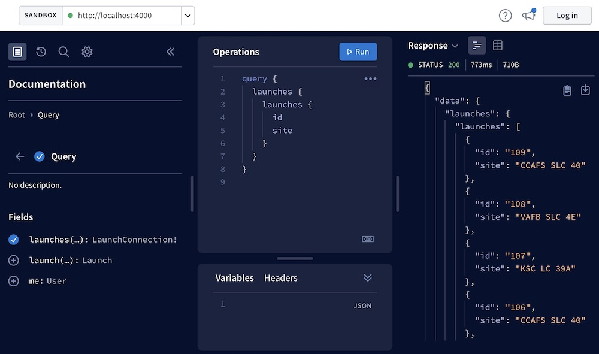
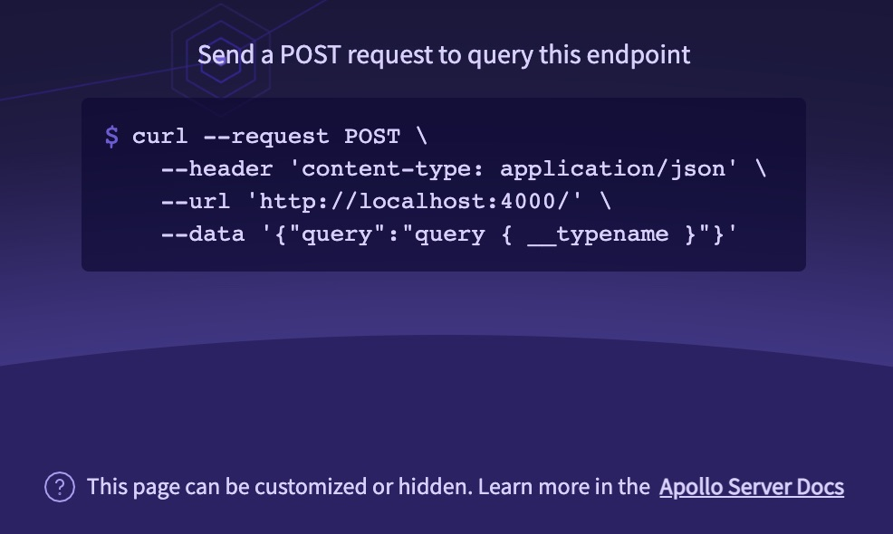

This API reference documents built-in plugins that add a landing page to Apollo Server's base URL, enabling visitors to interact with the server from their browser.

This includes plugins for:

* The default landing page for [non-production environments](#default-non-production-landing-page) (`ApolloServerPluginLandingPageLocalDefault`)
* The default landing page for [production](#default-production-landing-page) (`ApolloServerPluginLandingPageProductionDefault`)
* Using [GraphQL Playground](#graphql-playground-landing-page) as a landing page (`ApolloServerPluginLandingPageGraphQLPlayground`)
* [Disabling the landing page entirely](#disabling-the-landing-page)

These plugins work by implementing the [`renderLandingPage`](../../integrations/plugins-event-reference/#renderlandingpage) plugin event, which serves an HTML page whenever a browser includes an `accept: text/html` header. Aside from these, you can also create a  [custom plugin](../../integrations/plugins/) that renders a [custom landing page](../../workflow/build-run-queries/#custom-landing-page).

## Default behavior

If you don't manually install any plugin that implements `renderLandingPage`, Apollo Server does the following by default:

* In non-production environments (`NODE_ENV` is not `production`), Apollo Server installs `ApolloServerPluginLandingPageLocalDefault`.
* In production environments (`NODE_ENV` _is_ `production`), Apollo Server installs `ApolloServerPluginLandingPageProductionDefault`.

In either case, Apollo Server provides no configuration options to the plugin. You only need to install one of these plugins manually if you want to override its default configuration.

### Configuring default landing pages

To configure these default plugins while still using the same `NODE_ENV`-based logic, import them from `@apollo/server/plugin/landingPage/default` and pass them to the `ApolloServer` constructor in the `plugins` array:

<MultiCodeBlock>

```ts
import { ApolloServer } from '@apollo/server';
import { ApolloServerPluginLandingPageLocalDefault, ApolloServerPluginLandingPageProductionDefault } from '@apollo/server/plugin/landingPage/default';

const server = new ApolloServer({
  typeDefs,
  resolvers,
  plugins: [
    // Install a landing page plugin based on NODE_ENV
    process.env.NODE_ENV === 'production'
      ? ApolloServerPluginLandingPageProductionDefault({
          graphRef: 'my-graph-id@my-graph-variant',
          footer: false,
        })
      : ApolloServerPluginLandingPageLocalDefault({ footer: false }),
  ],
});

```

</MultiCodeBlock>

Available configuration options are listed in each plugin's reference below.

## Default non-production landing page

In non-production environments, Apollo Server 4's landing page is an embedded version of [Apollo Sandbox](/graphos/explorer/sandbox) (served at `http://localhost:4000` by default):



This landing page is designed for use in local development, where `NODE_ENV` is *not* set to `production`.

[Apollo Sandbox](https://studio.apollographql.com/sandbox) is a special mode of Apollo Studio used for local development, which doesn't require an Apollo account. Sandbox includes the [Apollo Studio Explorer](/graphos/explorer/explorer), a powerful web IDE that enables you to build and run operations against your server (or any other reachable server).
### Options

<table class="field-table">
  <thead>
    <tr>
      <th>Name /<br/>Type</th>
      <th>Description</th>
    </tr>
  </thead>

<tbody>

<tr>
<td>

###### `version`

`string`
</td>
<td>

By default, this plugin uses the latest version of the landing page published to Apollo's CDN. If you'd like to pin the current version, you can specify it here.

The current latest version is available at [this link](https://apollo-server-landing-page.cdn.apollographql.com/_latest/version.txt).

</td>
</tr>

<tr>
<td>

###### `footer`

`boolean`
</td>
<td>

If you aren't using the embedded Apollo Sandbox (i.e., you are using `{embed: false}`), the landing splash page displays a footer that links to the documentation telling you how to configure it. To remove this footer, pass `footer: false`.

</td>
</tr>

<tr>
<td>

###### `document`

`string`
</td>
<td>

A GraphQL document (e.g., query or mutation) to populate in the Studio Sandbox Explorer's editor on load.

If you omit this, the Explorer initially loads an example query based on your schema.

</td>
</tr>

<tr>
<td>

###### `variables`

`Record<string, any>`
</td>
<td>

An object containing initial variable values to populate in the Explorer on load.

If provided, these variables should apply to the initial query you provide in `document`.

</td>
</tr>

<tr>
<td>

###### `headers`

`Record<string, string>`
</td>
<td>

An object containing initial HTTP header values to populate in the Explorer on load.

</td>
</tr>

<tr>
<td>

###### `collectionId` & `operationId`

`string`

</td>
<td>

The ID of a collection, paired with an operation ID to populate in the Sandbox on load. You can find these values from a registered graph in Studio by clicking the **...** menu next to an operation in the Explorer of that graph and selecting **View operation details**.


</td>
</tr>

<tr>
<td>

###### `includeCookies`

`boolean`
</td>
<td>

If `true`, the embedded Apollo Studio Explorer includes cookies in its GraphQL requests to your server.

The default value is `false`, unless the user changes the setting in the Explorer UI.

If you omit this, the Explorer defaults `includeCookies` to `false`.

</td>
</tr>

<tr>
<td>

###### `embed`

`boolean | ApolloServerPluginEmbedded`
`LandingPageLocalConfigOptions`
</td>
<td>

If `true` or an options object, the Apollo Server landing page renders an embedded version of [Apollo Sandbox](/graphos/explorer/sandbox/) at its GraphQL endpoint URL. This is the default behavior.

If you set this option to `false`, your server's landing page is a splash page containing a copyable command-line snippet showing how to run operations via `curl` alongside a link to Apollo Sandbox.

</td>
</tr>

</tbody>
</table>

### `embed` options

These are the fields you can include in the `embed` option you pass to the `ApolloServerPluginLandingPageLocalDefault`:

<table class="field-table api-ref">
  <thead>
    <tr>
      <th>Name /<br/>Type</th>
      <th>Description</th>
    </tr>
  </thead>

<tbody>

<tr>
<td>

###### `initialState`

`Object`

</td>
<td>

An object containing additional display options related to the visual state of the embedded Explorer on page load.

For supported subfields, see [`initialState` options](#embedinitialstate-options).

</td>
</tr>

<tr>
<td>

###### `endpointIsEditable`

`boolean`

</td>
<td>

By default, the embedded Sandbox has a URL input box that is editable by users.

Set `endpointIsEditable` to `false` to prevent users of your Apollo Server instance from changing the endpoint URL.
</td>
</tr>


</tbody>
</table>


### `initialState` options

These are the fields you can include in the `initialState` option you pass to `embed` under `ApolloServerPluginLandingPageLocalDefault`:

<table class="field-table api-ref">
  <thead>
    <tr>
      <th>Name /<br/>Type</th>
      <th>Description</th>
    </tr>
  </thead>

<tbody>
<tr>
<td>


###### `pollForSchemaUpdates`

`boolean`
</td>
<td>

If `true`, the embedded Sandbox periodically polls your `initialEndpoint` for schema updates.

The default value is `true`.

</td>
</tr>

<tr>
<td>

###### `sharedHeaders`

`Record<string, string>`

</td>
<td>

Headers that are applied by default to every operation executed by the embedded Sandbox. Users can disable the application of these headers, but they can't modify their values.

The embedded Sandbox _always_ includes these headers in its introspection queries to your `initialEndpoint`.

Example:

```jsx
initialState: {
  sharedHeaders: {
    authorization: "Bearer abc123";
  }
}
```

</td>
</tr>

</tbody>
</table>


## Default production landing page

The `ApolloServerPluginLandingPageProductionDefault` shows a minimalist landing page:



This landing page is designed for use in production. It provides a copyable command-line snippet showing how to run operations with your server. By default, the only visible reference to Apollo is a footer explaining how to customize the page. You can also configure it to add a link to query your graph with the [Apollo Explorer](/graphos/explorer/explorer/). You can choose to embed the Apollo Explorer on your endpoint if you pass the `embed` [option](#embed-options).

### Options

<table class="field-table">
  <thead>
    <tr>
      <th>Name /<br/>Type</th>
      <th>Description</th>
    </tr>
  </thead>

<tbody>

<tr>
<td>

###### `version`

`string`
</td>
<td>

By default, this plugin uses the latest version of the landing page published to Apollo's CDN. If you'd like to pin the current version, you can specify it here.

The current latest version is available at [this link](https://apollo-server-landing-page.cdn.apollographql.com/_latest/version.txt).

</td>
</tr>

<tr>
<td>

###### `footer`

`boolean`
</td>
<td>

By default, the landing page displays a footer that links to the documentation telling you how to configure it. To remove this footer, pass `footer: false`.

</td>
</tr>

<tr>
<td>

###### `graphRef`

`string`
</td>
<td>

If provided, the landing page includes a link (with opt-in auto-redirect) to the Apollo Studio page for the graph with the corresponding [graph ref](https://www.apollographql.com/docs/rover/conventions/#graph-refs). An example graph ref is `my-graph@my-variant`.

To enable this link, you need to provide `graphRef` here even if you already provide it elsewhere for usage reporting and other purposes. This is because if your server is publicly accessible, you might not want to display the graph ref publicly.

</td>
</tr>

<tr>
<td>

###### `document`

`string`
</td>
<td>

A GraphQL document (eg, query or mutation) to populate in the Studio Explorer's editor on load.

If you omit this, the Explorer initially loads an example query based on your schema.

</td>
</tr>

<tr>
<td>

###### `variables`

`Record<string, any>`
</td>
<td>

An object containing initial variable values to populate in the Explorer on load.

If provided, these variables should apply to the initial query you provide in `document`.

</td>
</tr>

<tr>
<td>

###### `headers`

`Record<string, string>`
</td>
<td>

An object containing initial HTTP header values to populate in the Explorer on load.

</td>
</tr>
<tr>
<td>

###### `embed`

`boolean | ApolloServerPluginEmbedded`
`LandingPageProductionConfigOptions`
</td>
<td>

If `true` or you provide an options object, the Apollo Server landing page renders an embedded version of the [Apollo Sandbox](https://studio.apollographql.com/sandbox) at its GraphQL endpoint URL. This enables visitors to query the endpoint directly and use additional Studio features if signed in with their Apollo account.

To embed the Apollo Sandbox, you must _also_ provide Apollo Server with the **graph ref** of the Studio graph to use, usually via the `APOLLO_GRAPH_REF` environment variable.

The default value is `false`, in which case the landing page displays a basic `curl` command.

You can configure the Explorer embedded on your Apollo Server endpoint with display and functional options. For supported options, see [`embed` options](#embed-options).

</td>
</tr>

<tr>
<td>

###### `collectionId` & `operationId`

`string`

</td>
<td>

The ID of a collection, paired with an operation ID to populate in the Explorer on load. You can find these values from a registered graph in Studio by clicking the **...** menu next to an operation in the Explorer of that graph and selecting **View operation details**.


</td>
</tr>


<tr>
<td>

###### `includeCookies`

`boolean`
</td>
<td>

A boolean used to set whether Studio Explorer should include cookies in its GraphQL requests to your server.

If you omit this, the Explorer defaults `includeCookies` to `false`.

</td>
</tr>

</tbody>
</table>

### `embed` options

These are the fields you can include in the `embed` option you pass to the `ApolloServerPluginLandingPageProductionDefault`:

<table class="field-table api-ref">
  <thead>
    <tr>
      <th>Name /<br/>Type</th>
      <th>Description</th>
    </tr>
  </thead>

<tbody>

<tr>
<td>

###### `displayOptions`

`Object`

</td>
<td>

An object containing additional display options related to the visual state of the embedded Explorer on page load.

For supported subfields, see [`displayOptions` options](#embeddisplayoptions-options).

</td>
</tr>

<tr>
<td>

###### `persistExplorerState`

`boolean`
</td>
<td>

If `true`, the embedded Explorer uses `localStorage` to persist its state (including operations, tabs, variables, and headers) between user sessions. This state is automatically populated in the Explorer on page load.

If `false`, the embedded Explorer loads with an example query based on your schema (unless you provide [`document`](#document)).

The default value is `false`.

</td>
</tr>

</tbody>
</table>


### `embed.displayOptions` options

These are the fields you can include in the `displayOptions` option you pass to the embedded Explorer plugin:

<table class="field-table api-ref">
  <thead>
    <tr>
      <th>Name /<br/>Type</th>
      <th>Description</th>
    </tr>
  </thead>

<tbody>
<tr>
<td>

###### `docsPanelState`

`"open" | "closed"`

</td>
<td>

If `open`, the Explorer's Documentation panel (the left column) is initially expanded. If `closed`, the panel is initially collapsed.

The default value is `open`.

</td>
</tr>

<tr>
<td>

###### `showHeadersAndEnvVars`

`true | false`

</td>
<td>

If `true`, the embedded Explorer includes the panels for setting request headers and environment variables. If `false`, those panels are not present.

The default value is `true`.

</td>
</tr>

<tr>
<td>

###### `theme`

`"dark" | "light"`

</td>
<td>

If `dark`, the Explorer's dark theme is used. If `light`, the light theme is used.

The default value is `dark`.

</td>
</tr>
</tbody>
</table>

## GraphQL Playground landing page

By default, Apollo Server 2 provided a GraphQL Playground landing page. For migration purposes, we've published the [`@apollo/server-plugin-landing-page-graphql-playground`](https://www.npmjs.com/package/@apollo/server-plugin-landing-page-graphql-playground) package, a GraphQL Playground plugin compatible with Apollo Server 4. However, we aren't supporting this plugin with documentation or security updates since the GraphQL Playground project is officially [retired](https://github.com/graphql/graphql-playground/issues/1143) and we do not recommend its continued use. Instead, we recommend migrating to the actively maintained [Apollo Sandbox](/graphos/explorer/sandbox) (the default landing page in Apollo Server 4) at your earliest convenience.

## Disabling the landing page

The `ApolloServerPluginLandingPageDisabled` plugin serves _no_ landing page from Apollo Server's base URL. Install it to disable the default landing page in some or all environments:

<MultiCodeBlock>

```ts
import { ApolloServer } from '@apollo/server';
import { ApolloServerPluginLandingPageDisabled } from '@apollo/server/plugin/disabled';

const server = new ApolloServer({
  typeDefs,
  resolvers,
  plugins: [ApolloServerPluginLandingPageDisabled()],
});
```

</MultiCodeBlock>

This plugin takes no arguments.
