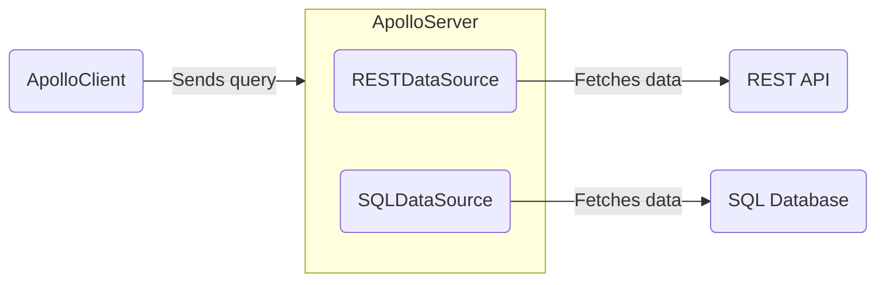

**Data sources** are classes that your server's [resolvers](./resolvers/) can use to encapsulate fetching data from a particular source, such as a database or a REST API. These classes help handle caching, deduplication, and errors while resolving operations.

Your server can use any number of different data sources. You don't _have_ to use data sources to fetch data, but they're strongly recommended.




## Open-source implementations

All data source implementations extend the [`DataSource` abstract class](https://github.com/apollographql/apollo-server/blob/main/packages/apollo-datasource/src/index.ts), which is included in the `apollo-server` library.

Apollo and the larger community maintain the following open-source implementatons:

> Do you maintain a `DataSource` implementation that isn't listed here? Please [submit a PR](https://github.com/apollographql/apollo-server/blob/main/docs/source/data/data-sources.md) to be added to the list!

| Class            | Source    | For Use With          |
|------------------|-----------|-----------------------|
| `RESTDataSource` | Apollo    | REST APIs ([see below](#rest-data-source)) |
| [`SQLDataSource`](https://github.com/cvburgess/SQLDataSource)  | Community | SQL databases (via [Knex.js](http://knexjs.org/)) |
| [`MongoDataSource`](https://github.com/GraphQLGuide/apollo-datasource-mongodb/) | Community | MongoDB |
| [`CosmosDataSource`](https://github.com/andrejpk/apollo-datasource-cosmosdb) | Community | Azure Cosmos DB |
| [`FirestoreDataSource`](https://github.com/swantzter/apollo-datasource-firestore) | Community | Cloud Firestore |

> Apollo does not provide offiical support for community-maintained libraries. We cannot guarantee that community-maintained libraries adhere to best practices, or that they will continue to be maintained.


## Adding data sources to Apollo Server

You provide your `DataSource` subclasses to the `ApolloServer` constructor, like so:

```js{4-9}:title=index.js
const server = new ApolloServer({
  typeDefs,
  resolvers,
  dataSources: () => {
    return {
      moviesAPI: new MoviesAPI(),
      personalizationAPI: new PersonalizationAPI(),
    };
  },
});
```

* As shown, the `dataSources` option is a _function_. This function returns an _object_ containing instances of your `DataSource` subclasses (in this case, `MoviesAPI` and `PersonalizationAPI`).
* Apollo Server calls this function for _every incoming operation_. It automatically assigns the return value to the `dataSources` field of [the `context` object](./resolvers/#the-context-argument) that's passed between your server's resolvers.
* Also as shown, **the function should create a new instance of each data source for each operation.** If multiple operations share a data source instance, you might accidentally combine results from multiple operations.

Your resolvers can now access your data sources from the shared `context` object and use them to fetch data:

```js:title=resolvers.js
const resolvers = {
  Query: {
    movie: async (_, { id }, { dataSources }) => {
      return dataSources.moviesAPI.getMovie(id);
    },
    mostViewedMovies: async (_, __, { dataSources }) => {
      return dataSources.moviesAPI.getMostViewedMovies();
    },
    favorites: async (_, __, { dataSources }) => {
      return dataSources.personalizationAPI.getFavorites();
    },
  },
};
```

## Using `RESTDataSource`

A `RESTDataSource` is responsible for fetching data from a given REST API.

To get started, install the REST data source package:

```bash
npm install apollo-datasource-rest
```

To define a data source, extend the `RESTDataSource` class and implement the data fetching methods that your resolvers require. Your implementation of these methods can call on convenience methods built into the `RESTDataSource` class to perform HTTP requests, while making it easy to build up query parameters, parse JSON results, and handle errors.

```js
const { RESTDataSource } = require('apollo-datasource-rest');

class MoviesAPI extends RESTDataSource {
  constructor() {
    super();
    this.baseURL = 'https://movies-api.example.com/';
  }

  async getMovie(id) {
    return this.get(`movies/${id}`);
  }

  async getMostViewedMovies(limit = 10) {
    const data = await this.get('movies', {
      per_page: limit,
      order_by: 'most_viewed',
    });
    return data.results;
  }
}
```

### HTTP Methods

The `get` method on the `RESTDataSource` makes an HTTP `GET` request. Similarly, there are methods built-in to allow for `POST`, `PUT`, `PATCH`, and `DELETE` requests.

```js
class MoviesAPI extends RESTDataSource {
  constructor() {
    super();
    this.baseURL = 'https://movies-api.example.com/';
  }

  // an example making an HTTP POST request
  async postMovie(movie) {
    return this.post(
      `movies`, // path
      movie, // request body
    );
  }

  // an example making an HTTP PUT request
  async newMovie(movie) {
    return this.put(
      `movies`, // path
      movie, // request body
    );
  }

  // an example making an HTTP PATCH request
  async updateMovie(movie) {
    return this.patch(
      `movies`, // path
      { id: movie.id, movie }, // request body
    );
  }

  // an example making an HTTP DELETE request
  async deleteMovie(movie) {
    return this.delete(
      `movies/${movie.id}`, // path
    );
  }
}
```

All of the HTTP helper functions (`get`, `put`, `post`, `patch`, and `delete`) accept a third `options` parameter, which can be used to set things like headers and referrers. For more info on the options available, see MDN's [fetch docs](https://developer.mozilla.org/en-US/docs/Web/API/WindowOrWorkerGlobalScope/fetch#Parameters).

### Intercepting fetches

Data sources allow you to intercept fetches to set headers, query parameters, or make other changes to the outgoing request. This is most often used for authorization or other common concerns that apply to all requests. Data sources also get access to the GraphQL context, which is a great place to store a user token or other information you need to have available.

You can easily set a header on every request:

```js
class PersonalizationAPI extends RESTDataSource {
  willSendRequest(request) {
    request.headers.set('Authorization', this.context.token);
  }
}
```

Or add a query parameter:

```js
class PersonalizationAPI extends RESTDataSource {
  willSendRequest(request) {
    request.params.set('api_key', this.context.token);
  }
}
```

If you're using TypeScript, make sure to import the `RequestOptions` type:

```typescript
import { RESTDataSource, RequestOptions } from 'apollo-datasource-rest';

class PersonalizationAPI extends RESTDataSource {
  baseURL = 'https://personalization-api.example.com/';

  willSendRequest(request: RequestOptions) {
    request.headers.set('Authorization', this.context.token);
  }
}
```

### Resolving URLs dynamically

In some cases, you'll want to set the URL based on the environment or other contextual values. You can use a getter for this:

```js
get baseURL() {
  if (this.context.env === 'development') {
    return 'https://movies-api-dev.example.com/';
  } else {
    return 'https://movies-api.example.com/';
  }
}
```

If you need more customization, including the ability to resolve a URL asynchronously, you can also override `resolveURL`:

```js
async resolveURL(request: RequestOptions) {
  if (!this.baseURL) {
    const addresses = await resolveSrv(request.path.split("/")[1] + ".service.consul");
    this.baseURL = addresses[0];
  }
  return super.resolveURL(request);
}
```


## What about DataLoader?

[DataLoader](https://github.com/graphql/dataloader) was designed by Facebook with a specific use case in mind: deduplicating and batching object loads from a data store. It provides a memoization cache, which avoids loading the same object multiple times during a single GraphQL request, and it coalesces loads that occur during a single tick of the event loop into a batched request that fetches multiple objects at once.

Although DataLoader is great for that use case, it’s less helpful when loading data from REST APIs because its primary feature is _batching_, not _caching_. What we’ve found to be far more important when layering GraphQL over REST APIs is having a resource cache that saves data across multiple GraphQL requests, can be shared across multiple GraphQL servers, and has cache management features like expiry and invalidation that leverage standard HTTP cache control headers.

#### Batching

Most REST APIs don't support batching, and if they do, using a batched endpoint may actually jeopardize caching. When you fetch data in a batch request, the response you receive is for the exact combination of resources you're requesting. Unless you request that same combination again, future requests for the same resource won't be served from cache.
Our recommendation is to restrict batching to requests that can't be cached. In those cases, you can actually take advantage of DataLoader as a private implementation detail inside your data source.

```js
class PersonalizationAPI extends RESTDataSource {
  constructor() {
    super();
    this.baseURL = 'https://personalization-api.example.com/';
  }

  willSendRequest(request) {
    request.headers.set('Authorization', this.context.token);
  }

  private progressLoader = new DataLoader(async (ids) => {
    const progressList = await this.get('progress', {
      ids: ids.join(','),
    });
    return ids.map(id =>
      progressList.find((progress) => progress.id === id),
    );
  });

  async getProgressFor(id) {
    return this.progressLoader.load(id);
  }
```

## Using Memcached/Redis as a cache storage backend

By default, resource caching will use an in-memory LRU cache. When running multiple server instances, you'll want to use a shared cache backend instead. That's why Apollo Server also includes support for using [Memcached](https://memcached.org/) or [Redis](https://redis.io/) as cache stores via the [`apollo-server-cache-memcached`](https://www.npmjs.com/package/apollo-server-cache-memcached) and [`apollo-server-cache-redis`](https://www.npmjs.com/package/apollo-server-cache-redis) packages. You can specify which one to use by creating an instance and passing it into the `ApolloServer` constructor:

```js
const { MemcachedCache } = require('apollo-server-cache-memcached');

const server = new ApolloServer({
  typeDefs,
  resolvers,
  cache: new MemcachedCache(
    ['memcached-server-1', 'memcached-server-2', 'memcached-server-3'],
    { retries: 10, retry: 10000 }, // Options
  ),
  dataSources: () => ({
    moviesAPI: new MoviesAPI(),
  }),
});
```

For documentation of the options you can pass to the underlying Memcached client, look [here](https://github.com/3rd-Eden/memcached).

```js
const { BaseRedisCache } = require('apollo-server-cache-redis');
const Redis = require('ioredis');

const server = new ApolloServer({
  typeDefs,
  resolvers,
  cache: new BaseRedisCache({
    client: new Redis({
      host: 'redis-server',
    }),
  }),
  dataSources: () => ({
    moviesAPI: new MoviesAPI(),
  }),
});
```

For documentation of the options you can pass to the underlying Redis client, look [here](https://github.com/luin/ioredis).

## Implementing your own cache backend

Apollo Server exposes a `KeyValueCache` interface that you can use to implement connectors to other data stores, or to optimize for the query characteristics of your application. More information can be found in the package readme for [apollo-server-caching](https://www.npmjs.com/package/apollo-server-caching).
