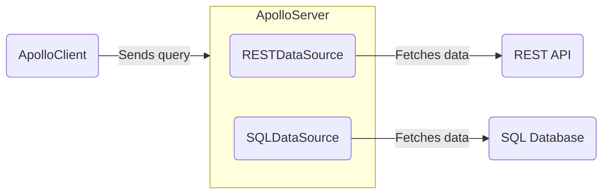

import {
  ExpansionPanel,
} from 'gatsby-theme-apollo-docs/src/components/expansion-panel';

**Data sources** are classes that Apollo Server can use to encapsulate fetching data from a particular source, such as a database or a REST API. These classes help handle caching, deduplication, and errors while resolving operations.

Your server can use any number of different data sources. You don't _have_ to use data sources to fetch data, but they're strongly recommended.




## Open-source implementations

All data source implementations extend the generic [`DataSource` abstract class](https://github.com/apollographql/apollo-server/blob/main/packages/apollo-datasource/src/index.ts), which is included in the `apollo-datasource` package. Subclasses of a `DataSource` should define whatever logic is required to communicate with a particular store or API.

Apollo and the larger community maintain the following open-source implementatons:

> Do you maintain a `DataSource` implementation that isn't listed here? Please [submit a PR](https://github.com/apollographql/apollo-server/blob/main/docs/source/data/data-sources.md) to be added to the list!

| Class            | Source    | For Use With          |
|------------------|-----------|-----------------------|
| [`RESTDataSource`](https://github.com/apollographql/apollo-server/tree/main/packages/apollo-datasource-rest) | Apollo    | REST APIs ([see below](#restdatasource-reference)) |
| [`HTTPDataSource`](https://github.com/StarpTech/apollo-datasource-http)  | Community | HTTP/REST APIs (newer community alternative to `RESTDataSource`) |
| [`SQLDataSource`](https://github.com/cvburgess/SQLDataSource)  | Community | SQL databases (via [Knex.js](http://knexjs.org/)) |
| [`MongoDataSource`](https://github.com/GraphQLGuide/apollo-datasource-mongodb/) | Community | MongoDB |
| [`CosmosDataSource`](https://github.com/andrejpk/apollo-datasource-cosmosdb) | Community | Azure Cosmos DB |
| [`FirestoreDataSource`](https://github.com/swantzter/apollo-datasource-firestore) | Community | Cloud Firestore |

If none of these implementations applies to your use case, you can create your own custom `DataSource` subclass.

> Apollo does not provide official support for community-maintained libraries. We cannot guarantee that community-maintained libraries adhere to best practices, or that they will continue to be maintained.


## Adding data sources to Apollo Server

You provide your `DataSource` subclasses to the `ApolloServer` constructor, like so:

```js{4-9}:title=index.js
const server = new ApolloServer({
  typeDefs,
  resolvers,
  dataSources: () => {
    return {
      moviesAPI: new MoviesAPI(),
      personalizationAPI: new PersonalizationAPI(),
    };
  },
});
```

* As shown, the `dataSources` option is a _function_. This function returns an _object_ containing instances of your `DataSource` subclasses (in this case, `MoviesAPI` and `PersonalizationAPI`).
* Apollo Server calls this function for _every incoming operation_. It automatically assigns the returned object to the `dataSources` field of [the `context` object](./resolvers/#the-context-argument) that's passed between your server's resolvers.
* Also as shown, **the function should create a new instance of each data source for each operation.** If multiple operations share a single data source instance, you might accidentally combine results from multiple operations.

Your resolvers can now access your data sources from the shared `context` object and use them to fetch data:

```js:title=resolvers.js
const resolvers = {
  Query: {
    movie: async (_, { id }, { dataSources }) => {
      return dataSources.moviesAPI.getMovie(id);
    },
    mostViewedMovies: async (_, __, { dataSources }) => {
      return dataSources.moviesAPI.getMostViewedMovies();
    },
    favorites: async (_, __, { dataSources }) => {
      return dataSources.personalizationAPI.getFavorites();
    },
  },
};
```

## Caching

By default, data source implementations use Apollo Server's [`InMemoryLRUCache`](https://github.com/apollographql/apollo-server/blob/0aa0e4b20ef97576ce92733698a7842b61d8280e/packages/apollo-server-caching/src/InMemoryLRUCache.ts#L14) to store the results of past fetches.

When you initialize Apollo Server, you can provide its constructor a _different_ cache object that implements the [`KeyValueCache` interface](https://github.com/apollographql/apollo-server/blob/0aa0e4b20ef97576ce92733698a7842b61d8280e/packages/apollo-server-caching/src/KeyValueCache.ts#L10-L14). This enables you to back your cache with shared stores like Memcached or Redis.

### Using Memcached/Redis as a cache storage backend

 When running multiple instances of your server, you should use a shared cache backend. This enables one server instance to use the cached result from _another_ instance.

Apollo Server supports using [Memcached](https://memcached.org/) or [Redis](https://redis.io/) as cache stores via the [`apollo-server-cache-memcached`](https://www.npmjs.com/package/apollo-server-cache-memcached) and [`apollo-server-cache-redis`](https://www.npmjs.com/package/apollo-server-cache-redis) packages. You can specify which one to use by creating an instance and passing it into the `ApolloServer` constructor.

#### Memcached

```js
const { MemcachedCache } = require('apollo-server-cache-memcached');

const server = new ApolloServer({
  typeDefs,
  resolvers,
  cache: new MemcachedCache(
    ['memcached-server-1', 'memcached-server-2', 'memcached-server-3'],
    { retries: 10, retry: 10000 }, // Options
  ),
  dataSources: () => ({
    moviesAPI: new MoviesAPI(),
  }),
});
```

For the options you can pass to the underlying Memcached client, [see the documentation](https://github.com/3rd-Eden/memcached).

#### Redis

```js:title=Redis
const { BaseRedisCache } = require('apollo-server-cache-redis');
const Redis = require('ioredis');

const server = new ApolloServer({
  typeDefs,
  resolvers,
  cache: new BaseRedisCache({
    client: new Redis({
      host: 'redis-server',
    }),
  }),
  dataSources: () => ({
    moviesAPI: new MoviesAPI(),
  }),
});
```

For the options you can pass to the underlying Redis client, [see the documentation](https://github.com/luin/ioredis).

### Implementing your own cache backend

You can create your own implementation of the [`KeyValueCache` interface](https://github.com/apollographql/apollo-server/blob/0aa0e4b20ef97576ce92733698a7842b61d8280e/packages/apollo-server-caching/src/KeyValueCache.ts#L10-L14) to connect to other caching data stores, or to optimize for your application's query characteristics.

For more information, see the README in for [apollo-server-caching](https://www.npmjs.com/package/apollo-server-caching).


## `RESTDataSource` reference

The `RESTDataSource` abstract class helps you fetch data from REST APIs. Your server defines a separate subclass of `RESTDataSource` for each REST API it communicates with.

To get started, install the `apollo-datasource-rest` package:

```bash
npm install apollo-datasource-rest
```

You then extend the `RESTDataSource` class and implement whatever data-fetching methods your resolvers need. These methods can use built-in convenience methods (like `get` and `post`) to perform HTTP requests, helping you add query parameters, parse JSON results, and handle errors.

### Example

Here's an example `RESTDataSource` subclass that defines two data-fetching methods, `getMovie` and `getMostViewedMovies`:

```js:title=movies-api.js
const { RESTDataSource } = require('apollo-datasource-rest');

class MoviesAPI extends RESTDataSource {
  constructor() {
    // Always call super()
    super();
    // Sets the base URL for the REST API
    this.baseURL = 'https://movies-api.example.com/';
  }

  async getMovie(id) {
    // Send a GET request to the specified endpoint
    return this.get(`movies/${encodeURIComponent(id)}`);
  }

  async getMostViewedMovies(limit = 10) {
    const data = await this.get('movies', {
      // Query parameters
      per_page: limit,
      order_by: 'most_viewed',
    });
    return data.results;
  }
}
```

### HTTP Methods

`RESTDataSource` includes convenience methods for common REST API request methods: `get`, `post`, `put`, `patch`, and `delete` ([see the source](https://github.com/apollographql/apollo-server/blob/main/packages/apollo-datasource-rest/src/RESTDataSource.ts#L154-L202)).

An example of each is shown below:

<ExpansionPanel title="Click to expand">

```js
class MoviesAPI extends RESTDataSource {
  constructor() {
    super();
    this.baseURL = 'https://movies-api.example.com/';
  }

  // GET
  async getMovie(id) {
    return this.get(
      `movies/${encodeURIComponent(id)}` // path
    );
  }

  // POST
  async postMovie(movie) {
    return this.post(
      `movies`, // path
      movie, // request body
    );
  }

  // PUT
  async newMovie(movie) {
    return this.put(
      `movies`, // path
      movie, // request body
    );
  }

  // PATCH
  async updateMovie(movie) {
    return this.patch(
      `movies`, // path
      { id: movie.id, movie }, // request body
    );
  }

  // DELETE
  async deleteMovie(movie) {
    return this.delete(
      `movies/${encodeURIComponent(movie.id)}`, // path
    );
  }
}
```
> Note the use of [`encodeURIComponent`](https://developer.mozilla.org/en-US/docs/Web/JavaScript/Reference/Global_Objects/encodeURIComponent). This is a standard JavaScript function that encodes special characters in a URI, preventing a possible injection attack vector.

For a simple example, suppose our REST endpoint responded to the following URLs:
* DELETE `/movies/:id`
* DELETE `/movies/:id/characters`

A "malicious" client could provide an `:id` of `1/characters` to target the delete `characters` endpoint when it was the singular `movie` endpoint that we were trying to delete. URI encoding prevents this kind of injection by transforming the `/` into `%2F`. This can then be correctly decoded and interpreted by the server and won't be treated as a path segment.

</ExpansionPanel>

#### Method parameters

For all HTTP convenience methods, the **first parameter** is the relative path of the endpoint you're sending the request to (e.g., `movies`).

The **second parameter** depends on the HTTP method:

* For HTTP methods with a request body (`post`, `put`, `patch`), the second parameter _is_ the request body.
* For HTTP methods _without_ a request body, the second parameter is an object with keys and values corresponding to the request's query parameters.

For all methods, the **third parameter** is an `init` object that enables you to provide additional options (such as headers and referrers) to the `fetch` API that's used to send the request. For details, [see MDN's fetch docs](https://developer.mozilla.org/en-US/docs/Web/API/WindowOrWorkerGlobalScope/fetch#Parameters).

### Intercepting fetches

`RESTDataSource` includes a `willSendRequest` method that you can override to modify outgoing requests before they're sent. For example, you can use this method to add headers or query parameters. This method is most commonly used for authorization or other concerns that apply to all sent requests.

Data sources also have access to the GraphQL operation context, which is useful for storing a user token or other relevant information.


#### Setting a header

```js
class PersonalizationAPI extends RESTDataSource {
  willSendRequest(request) {
    request.headers.set('Authorization', this.context.token);
  }
}
```

#### Adding a query parameter

```js
class PersonalizationAPI extends RESTDataSource {
  willSendRequest(request) {
    request.params.set('api_key', this.context.token);
  }
}
```

#### Using with TypeScript

If you're using TypeScript, make sure to import the `RequestOptions` type:

```typescript
import { RESTDataSource, RequestOptions } from 'apollo-datasource-rest';

class PersonalizationAPI extends RESTDataSource {
  baseURL = 'https://personalization-api.example.com/';

  willSendRequest(request: RequestOptions) {
    request.headers.set('Authorization', this.context.token);
  }
}
```

### Resolving URLs dynamically

In some cases, you'll want to set the URL based on the environment or other contextual values. To do this, you can override `resolveURL`:

```js
async resolveURL(request: RequestOptions) {
  if (!this.baseURL) {
    const addresses = await resolveSrv(request.path.split("/")[1] + ".service.consul");
    this.baseURL = addresses[0];
  }
  return super.resolveURL(request);
}
```

### Using with DataLoader

The [DataLoader](https://github.com/graphql/dataloader) utility was designed for a specific use case: deduplicating and batching object loads from a data store. It provides a memoization cache, which avoids loading the same object multiple times during a single GraphQL request. It also combines loads that occur during a single tick of the event loop into a batched request that fetches multiple objects at once.

DataLoader is great for its intended use case, but it’s less helpful when loading data from REST APIs. This is because its primary feature is _batching_, not _caching_.

When layering GraphQL over REST APIs, it's most helpful to have a resource cache that:

* Saves data across multiple GraphQL requests
* Can be shared across multiple GraphQL servers
* Provides cache management features like expiry and invalidation that use standard HTTP cache control headers

#### Batching with REST APIs

Most REST APIs don't support batching. When they do, using a batched endpoint can _jeopardize_ caching. When you fetch data in a batch request, the response you receive is for the exact combination of resources you're requesting. Unless you request that same combination again, future requests for the same resource won't be served from cache.

We recommend that you restrict batching to requests that _can't_ be cached. In these cases, you can take advantage of DataLoader as a private implementation detail inside your `RESTDataSource`:

```js
class PersonalizationAPI extends RESTDataSource {
  constructor() {
    super();
    this.baseURL = 'https://personalization-api.example.com/';
  }

  willSendRequest(request) {
    request.headers.set('Authorization', this.context.token);
  }

  private progressLoader = new DataLoader(async (ids) => {
    const progressList = await this.get('progress', {
      ids: ids.join(','),
    });
    return ids.map(id =>
      progressList.find((progress) => progress.id === id),
    );
  });

  async getProgressFor(id) {
    return this.progressLoader.load(id);
  }
```
