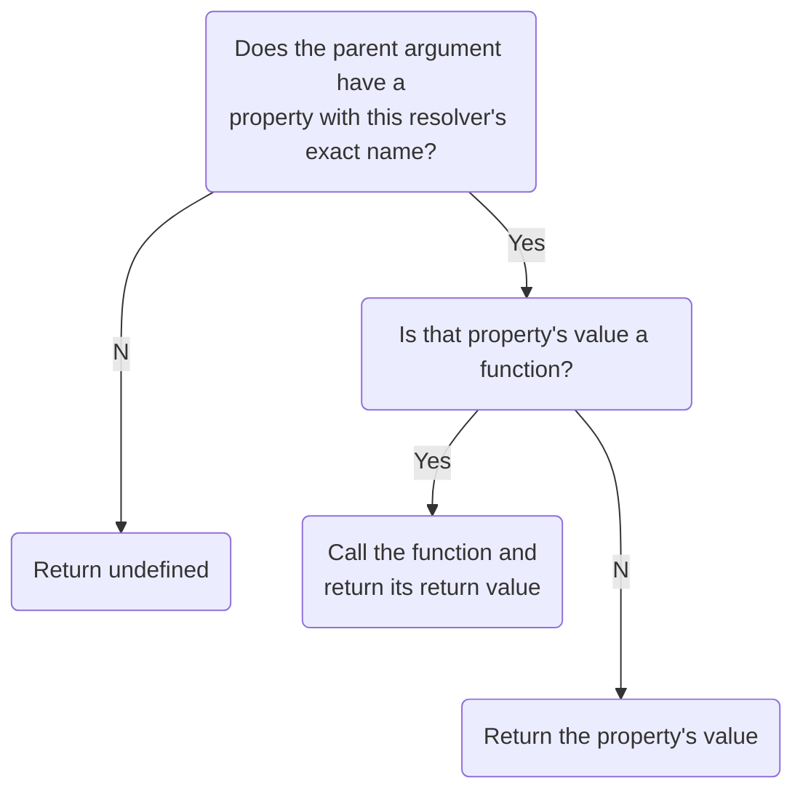

Whenever Apollo Server receives a GraphQL query, it needs to know how to populate each field included in that query. To accomplish this, it uses resolvers.

**A resolver is a function that's responsible for populating the data for a single field in your schema.** It can populate that data in any way you define, such as by fetching data from a back-end database or a third-party API.

If you _don't_ define a resolver for a particular field, Apollo Server automatically defines a [default resolver](#default-resolvers) for it.

## Defining a resolver

### Base syntax

Let's say our server defines the following (very short) schema:

```graphql
type Query {
  numberSix: Int! # Should always return the number 6 when queried
  numberSeven: Int! # Should always return 7
}
```

We want to define resolvers for the `numberSix` and `numberSeven` fields of the `Query` type so that they always return `6` and `7` when they're queried.

Those resolver definitions look like this:

```js
const resolvers = {
  Query: {
    numberSix() {
      return 6;
    },
    numberSeven() {
      return 7;
    }
  }
};
```

#### As this example shows:

* You define all of your server's resolvers in a single JavaScript object (named `resolvers` above). This object is also known as your **resolver map**.
* The resolver map has top-level fields that correspond to your schema's types (such as `Query`).
* Each resolver belongs to whichever type its corresponding field belongs to.

### Handling arguments

Now let's say our server defines the following (slightly longer) schema:

```graphql
type User {
  id: ID!
  name: String
}

type Query {
  user(id: ID!): User
}
```

With this schema, we want the `user` field of the `Query` type to fetch a user by its `id`.

To achieve this, our server needs access to user data. For this example, assume our server defines the following hardcoded array:

```js
const users = [
  {
    id: '1',
    name: 'Elizabeth Bennet'
  },
  {
    id: '2',
    name: 'Fitzwilliam Darcy'
  }
];
```

Now we can define a resolver for the `user` field, like so:

```js
const { find } = require('lodash');

const resolvers = {
  Query: {
    user(parent, args, context, info) {
      return find(users, { id: args.id });
    }
  }
}
```

#### As this example shows:

* A resolver can optionally accept four positional arguments: `(parent, args, context, info)`.

    _[Learn more about these arguments](#arguments)_
* The `args` argument is an object that contains all _GraphQL_ arguments that were provided for the field by the GraphQL operation.

> Notice that this example _doesn't_ define resolvers for `User` fields (`id` and `name`). That's because the [default resolver](#default-resolvers) that Apollo Server creates for each of these fields does the right thing: obtain the value directly from the object returned by the `user` resolver.

### Chaining resolvers

TODO

```js
const { find, filter } = require('lodash');

const resolvers = {
  Query: {
    author(parent, args, context, info) {
      return find(authors, { id: args.id });
    },
  },
  Author: {
    books(author) {
      return filter(books, { author: author.name });
    },
  },
};
```

With the resolver map above, the query, `{ author { books } }`, will call the `Query.author` resolver first and pass its result to `Author.books`. The query result will contain the return value of `Author.books` nested under `data.author.books`.

Note that you don't have to put all of your resolvers in one object. Refer to the ["modularizing resolvers"](#modularizing-resolvers) section to learn how to combine multiple resolver maps into one.

## Arguments

Resolver functions take the following positional arguments, in order:

| Argument  | Description  |
|---|---|
| `parent` | <p>The result returned by the resolver of this field's _parent_ field. <p>See [The `parent` argument](#the-parent-argument) for more information.  |
| `args` |  <p>An object that contains all GraphQL arguments provided for this field.<p> For example, when executing `query{ user(id: "4") }`, the `args` object passed to the `user` resolver is `{ "id": "4" }`. |
| `context` | <p>An object shared across all resolvers that are executing for a particular operation. Use this to share per-operation state, including authentication information, dataloader instances, and anything else to track across resolvers. <p>See [The `context` argument](#the-context-argument) for more information. |
| `info` | <p>Contains information about the operation's execution state, including the field name, the path to the field from the root, and more. <p>Its core fields are listed in the [GraphQL.js source code](https://github.com/graphql/graphql-js/blob/master/src/type/definition.js#L917-L928), and it is extended with additional functionality by other modules, like [`apollo-cache-control`](https://github.com/apollographql/apollo-server/tree/master/packages/apollo-cache-control). |

### The `parent` argument

The first argument to every resolver, `parent`, can be a bit confusing at first, but it makes sense when you consider what a GraphQL query looks like:

```graphql
query {
  getAuthor(id: 5){
    name
    posts {
      title
      author {
        name # this will be the same as the name above
      }
    }
  }
}
```

Every GraphQL query is a tree of function calls in the server. So the `parent` contains the result of parent resolver, in this case:

1. `parent` in `Query.getAuthor` will be whatever the server configuration passed for `rootValue`.
2. `parent` in `Author.name` and `Author.posts` will be the result from `getAuthor`, likely an Author object from the backend.
3. `parent` in `Post.title` and `Post.author` will be one item from the `posts` result array.
4. `parent` in `Author.name` is the result from the above `Post.author` call.

For resolvers of top-level fields with no parent (such as fields of `Query`), this value is obtained from the `rootValue` function passed to [Apollo Server's constructor](/api/apollo-server/#apolloserver).


Every resolver function is called according to the nesting of the query. To understand this transition from query to resolvers from another perspective, read this [blog post](https://blog.apollographql.com/graphql-explained-5844742f195e#.fq5jjdw7t).

### The `context` argument

The context is how you access your shared connections and fetchers in resolvers to get data.

The `context` is the third argument passed to every resolver. It is useful for passing things that any resolver may need, like [authentication scope](https://blog.apollographql.com/authorization-in-graphql-452b1c402a9), database connections, and custom fetch functions. Additionally, if you're using [dataloaders to batch requests](/data/data-sources/#what-about-dataloader) across resolvers, you can attach them to the `context` as well.

As a best practice, `context` should be the same for all resolvers, no matter the particular query or mutation, and resolvers should never modify it. This ensures consistency across resolvers, and helps increase development velocity.

To provide a `context` to your resolvers, add a `context` object to the Apollo Server constructor. This constructor gets called with every request, so you can set the context based off the details of the request (like HTTP headers).

```js
const server = new ApolloServer({
  typeDefs,
  resolvers,
  context: ({ req }) => ({
    authScope: getScope(req.headers.authorization)
  })
}));

// resolver
(parent, _, context) => {
  if(context.authScope !== ADMIN) throw AuthenticationError('not admin');
  ...
}
```

The context can also be created asynchronously, allowing database connections and other operations to complete.

```js
context: async () => ({
  db: await client.connect(),
})

// resolver
(parent, _, context) => {
  return context.db.query('SELECT * FROM table_name');
}
```

## Return values

A resolver function's return value is treated differently by Apollo Server depending on its type:

| Type  | Description  |
|---|---|
| Scalar / object | <p>A resolver can return a single value or an object, as shown in [Defining a resolver](#defining-a-resolver). This return value is passed down to any nested resolvers via the `parent` argument. |
| `Array` | <p>Return an array if and only if your schema indicates that the resolver's associated field contains a list.<p>After you return an array, Apollo Server executes nested resolvers for each item in the array. |
| `null` / `undefined` | <p>Indicates that the value for the field could not be found. <p>If your schema indicates that this resolver's field is nullable, then the operation result has a `null` value at the field's position.<p>If this resolver's field is _not_ nullable, Apollo Server sets the field's _parent_ to `null`. If necessary, this process continues up the resolver chain until it reaches a field that _is_ nullable. This ensures that a response never includes a `null` value for a non-nullable field. |
| [`Promise`](https://developer.mozilla.org/en-US/docs/Web/JavaScript/Guide/Using_promises) | <p>Resolvers often perform asynchronous actions, such as fetching from a database or back-end API. To support this, a resolver can return a promise that resolves to any other supported return type. |


## Default resolvers

If you don't define a resolver for a particular schema field, Apollo Server defines a [default resolver](https://github.com/graphql/graphql-js/blob/master/src/execution/execute.js#L1181-L1199) for it.

The default resolver function uses the following logic:



As an example, consider the following schema excerpt: 

```graphql
type Book {
  title: String
}

type Author {
  books: [Book]
}
```

If the resolver for the `books` field returns an array of objects that each contain a `title` field, then you can use a default resolver for the `title` field. The default resolver will correctly return `parent.title`.

## Modularizing resolvers

TODO

We can accomplish the same modularity with resolvers by passing around multiple resolver objects and combining them together with Lodash's `merge` or other equivalent:

```js
// comment.js
const resolvers = {
  Comment: { ... }
}

export resolvers;
```

```js
// post.js
const { merge } = require('lodash');

const Comment = require('./comment');
const resolvers = merge({
  Post: { ... }
}, Comment.resolvers);

export resolvers;
```

```js
// schema.js
const { merge } = require('lodash');
const Post = require('./post.js');

// Merge all of the resolver objects together
const resolvers = merge({
  Query: { ... }
}, Post.resolvers);

const server = new ApolloServer({
  typeDefs,
  resolvers,
});

server.listen().then(({ url }) => {
  console.log(`🚀 Server ready at ${url}`)
});
```

## Monitoring resolvers

TODO

As with all code, the performance of individual resolvers will be dependent on the workload embedded within them.  The actual resolvers invoked by a client's request will depend on the operation itself.  GraphQL allows the avoidance of most costly fields when their return data is not necessary by not including them in the request, but it's still important to understand what those computationally costly fields are.

It's recommended that you use a tool which can track field-level metrics within a data graph, aggregate them, and help you understand the performance of your data graph over time.  Apollo Graph Manager integrates with Apollo Server and offers performance analysis, error tracking and schema management features.  For more information, read our article about [monitoring a graph's performance](https://www.apollographql.com/docs/graph-manager/performance/).

In local development, using the `tracing: true` option to Apollo Server will enable a tracing panel


```javascript
const server = new ApolloServer({
  typeDefs,
  resolvers,
  tracing: true,
});
```
