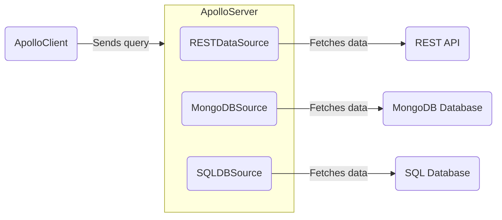

> Looking to fetch data from a REST API? Check out [Fetching from REST](./fetching-rest).

Apollo Server can fetch data from any source you need, such as a [REST API](./fetching-rest) or a database. Your server can use any number of different data sources:



Because your server can use multiple various data sources, keeping your [resolvers](./resolvers) tidy becomes _even more_ important.

For this reason, we recommend creating individual data source classes to encapsulate the logic of fetching data from a particular source, providing methods that resolvers can use to access data neatly. You can additionally customize your data source classes to help with caching, deduplication, or errors while resolving operations.

## Creating data source classes

Your data source class can be as straightforward or complex as you need it to be. You know what data your server needs, and you can let that be the guide for the methods your class includes.

Below is an example of a data source class that connects to a database storing reservations:

<MultiCodeBlock>

```ts title="reservations.ts"
export class ReservationsDataSource {
  private dbConnection;
  private token;
  private user;

  constructor(options: { token: string }) {
    this.dbConnection = this.initializeDBConnection();
    this.token = options.token;
  }

  async initializeDBConnection() {
    // set up our database details, instantiate our connection,
    // and return that database connection
    return dbConnection;
  }

  async getUser() {
    if (!this.user) {
      // store the user, lookup by token
      this.user = await this.dbConnection.User.findByToken(this.token);
    }
    return this.user;
  }

  async getReservation(reservationId) {
    const user = await this.getUser(this.token);
    if (user) {
      return await this.dbConnection.Reservation.findByPk(reservationId);
    } else {
      // handle invalid user
    }
  }

  //... more methods for finding and creating reservations
}
```

</MultiCodeBlock>

> Apollo's [`RestDataSource`](https://github.com/apollographql/datasource-rest/blob/main/src/RESTDataSource.ts) class is a built-out example of how a data source class can handle caching, deduplication, and errors.

### Batching and caching

If you want to add batching and caching to your data source we recommend using the [DataLoader package](https://github.com/graphql/dataloader).

DataLoader enables you to cache, deduplicate, and batch object loads in your data source. It provides a memoization cache, which avoids loading the same object multiple times during a single GraphQL request. It also combines loads that occur during a single tick of the event loop into a batched request that fetches multiple objects at once.

DataLoader instances are pre-request, so if you use a DataLoader in your data source, ensure you create a _new instance_ of that class with every request:

```ts
import DataLoader from 'dataloader';
import { RESTDataSource } from '@apollo/datasource-rest';
import type { KeyValueCache } from '@apollo/utils.keyvaluecache';

class PersonalizationDataSource extends RESTDataSource {
  private dbConnection;

  constructor() {
    this.dbConnection = this.initializeDBConnection();
  }

  async initializeDBConnection() {
    // set up our database details, instantiate our connection,
    // and return that database connection
    return dbConnection;
  }

  private progressLoader = new DataLoader(async (ids) => {
    const progressList = await db.fetchAllKeys(keys) await this.get('progress', {
      params: { ids: ids.join(',') },
    });
    return ids.map((id) => progressList.find((progress) => progress.id === id));
  });

  async getProgressFor(id) {
    return this.progressLoader.load(id);
  }
}

// in your server file

const { url } = await startStandaloneServer(server, {
  context: async () => {
    return {
      dataSources: {
        dogsDB: new DogsDataSource({ cache, token: contextValue.token }),
        catsApi: new CatsAPI({ cache }),
      },
    };
  },
});
```

## Adding data sources to your context

You can add data sources to your server's `context` initialization function, like so:

<MultiCodeBlock>

```ts title="index.ts"
//highlight-start
interface ContextValue {
  dataSources: {
    dogsDB: DogsDataSource;
    catsApi: CatsAPI;
  };
  token: string;
}
//highlight-end

const server = new ApolloServer<ContextValue>({
  typeDefs,
  resolvers,
});

const { url } = await startStandaloneServer(server, {
  context: async () => {
    const { cache } = server; // highlight-line
    const token = req.headers.token;
    return {
      // We create new instances of our data sources with each request.
      // We can pass in our server's cache, contextValue, or any other
      // info our data sources require.
      // highlight-start
      dataSources: {
        dogsDB: new DogsDataSource({ cache, token: contextValue.token }),
        catsApi: new CatsAPI({ cache }),
      },
      //highlight-end
      token,
    };
  },
});

console.log(`🚀  Server ready at ${url}`);
```

</MultiCodeBlock>

<!-- TODO(AS4) add link to context article once exists and link to REST article once we cover caching -->

Apollo Server calls [the `context` initialization](./resolvers/#the-context-argument) function for _every incoming operation_. This means:

- For every operation, `context` returns an _object_ containing new instances of your data source classes (in this case, `DogsDataSource` and `CatsAPI`).
- If your data source constructor accepts an argument _or_ uses an in-memory cache, the `context` function should create a **new instance of your data source class for each operation**. This ensures that your data source doesn't accidentally share values across requests.

Your resolvers can then access your data sources from the shared `contextValue` object and use them to fetch data:

```ts title="resolvers.ts"
const resolvers = {
  Query: {
    dog: async (_, { id }, { dataSources }) => {
      return dataSources.dogsDB.getDog(id);
    },
    popularDogs: async (_, __, { dataSources }) => {
      return dataSources.dogsDB.getMostLikedDogs();
    },
    bigCats: async (_, __, { dataSources }) => {
      return dataSources.catsApi.getCats({ size: 10 });
    },
  },
};
```

## Open-source implementations

## Modern data sources

Apollo maintains the following open-source data source implementations for Apollo Server 4:

<!-- prettier-ignore -->
| Class | Examples | For Use With |
| --- | --- | --- | 
| [`RESTDataSource`](https://github.com/apollographql/datasource-rest) | [See Fetching Rest](./fetching-rest)|  HTTP/REST APIs |

### Legacy data source classes

Apollo Server 3 contained [an abstract class named `DataSource`](/apollo-server/v3/data/data-sources) that each of your data sources could subclass. You'd then initialize each of your `DataSource` subclasses using a special `dataSources` function, which would attach your data sources to your `context` behind the scenes.

In Apollo Server 4, you can now create your data sources in the same `context` function as the rest of your per-request setup, avoiding the `DataSource` superclass entirely. We recommend [making a custom class for each data source](#creating-data-source-classes), with each class best suited for that particular source of data.

> ⚠️ **Note**: The community built each data source package below for use with Apollo Server 3. [As shown below](#using-datasource-subclasses), you can still use these packages in Apollo Server 4 with a bit of extra setup.

The below data source implementations extend the generic [`DataSource` abstract class](https://github.com/apollographql/apollo-server/blob/main/packages/apollo-datasource/src/index.ts), from the deprecated `apollo-datasource` package. Subclasses of `DataSource` define the logic required to communicate with a particular store or API.

The larger community maintains the following open-source implementations:

<!-- prettier-ignore -->
| Class | Source | For Use With |
| --- | --- | --- | 
| [`HTTPDataSource`](https://github.com/StarpTech/apollo-datasource-http) | Community | HTTP/REST APIs |
| [`SQLDataSource`](https://github.com/cvburgess/SQLDataSource) | Community | SQL databases (via [Knex.js](http://knexjs.org/)) |
| [`MongoDataSource`](https://github.com/GraphQLGuide/apollo-datasource-mongodb/) | Community | MongoDB |
| [`CosmosDataSource`](https://github.com/andrejpk/apollo-datasource-cosmosdb) | Community | Azure Cosmos DB |
| [`FirestoreDataSource`](https://github.com/swantzter/apollo-datasource-firestore) | Community | Cloud Firestore |

> Apollo does not provide official support for community-maintained libraries. We cannot guarantee that community-maintained libraries adhere to best practices, or that they will continue to be maintained.

#### Using `DataSource` subclasses

In Apollo Server 3, immediately after constructing each `DataSource` subclass, your server would invoke the `initialize({ cache, context })` method on each new `DataSource` behind the scenes.

To replicate this in Apollo Sever 4, you can manually invoke the `initialize` method in the constructor function of each `DataSource` subclass, like so:

<MultiCodeBlock>

```ts
import { ApolloServer } from '@apollo/server';
import { startStandaloneServer } from '@apollo/server/standalone';
import { KeyValueCache } from '@apollo/utils.keyvaluecache';
import { Pool } from 'undici';
import { HTTPDataSource } from 'apollo-datasource-http';

class BooksAPI extends HTTPDataSource {
  override baseURL = 'https://movies-api.example.com/';

  //highlight-start
  constructor(options: { cache: KeyValueCache<string>; token: string }) {
    //highlight-end
    // the necessary arguments for HTTPDataSource
    const pool = new Pool(baseURL);
    super(baseURL, { pool });

    // We need to call the initialize method in our data source's
    // constructor, passing in our cache and contextValue.
    //highlight-start
    this.initialize({ cache: options.cache, context: options.token });
    //highlight-end

  async getMovie(id: string): Promise<Movie> {
    return this.get<Movie>(`movies/${encodeURIComponent(id)}`);
  }
}

interface MyContext {
  dataSources: {
    moviesApi: MoviesAPI;
  };
  token?: string;
}

const server = new ApolloServer<MyContext>({
  typeDefs,
  resolvers,
});

const { url } = await startStandaloneServer(server, {
  context: async () => {
    //highlight-start
    const { cache } = server;
    const token = req.headers.token;
    return {
      dataSources: {
        moviesApi: new MoviesAPI({ cache, token }),
      },
      //highlight-end
      token,
    };
  },
});
```

</MultiCodeBlock>
