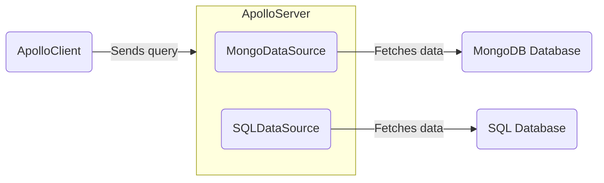

> Looking to fetch data from a REST API? Check out [Fetching from REST](./fetching-rest).

Apollo Server can fetch data from any source you choose, from a local JSON file, to a database, to a [REST API](./fetching-rest). We recommend some common conventions for fetching from different sources of data byt creating and using a data source class. Your server can use any number of different data sources.



You can create data source classes to encapsulate the logic of fetching data from a particular source, then providing methods that resolvers can access to neatly fetch data. You don't _have_ to use data sources to fetch data, but they're recommended because they help keep your resolvers tidy.


## Adding data sources to Apollo Server's context

You can add data sources to the `context` initialization function, like so:

<MultiCodeBlock>

```ts title="index.ts"
//highlight-start
interface ContextValue {
  dataSources: {
    dogsDB: DogsDataSource;
    catsAPI: CatsAPI;
  };
}
//highlight-end

const server = new ApolloServer<ContextValue>({
  typeDefs,
  resolvers,
});

const { url } = await startStandaloneServer(server, {
  context: async () => {
    const { cache } = server; // highlight-line
    return {
      // We create new instances of our data sources with each request,
      // passing in our server's cache.
      //highlight-start
      dataSources: {
        moviesAPI: new DogsDataSource({ cache }),
        personalizationAPI: new CatsAPI(),
      },
      //highlight-end
    };
  },
});

console.log(`🚀  Server ready at ${url}`);
```

</MultiCodeBlock>

<!-- TODO(AS4) add link to context article once exists  -->
Apollo Server calls [the `context` initialization](./resolvers/#the-context-argument) function for _every incoming operation_. This means:
- For every operation, `context` returns an _object_ containing new instances of your `RESTDataSource` subclasses (in this case, `MoviesAPI` and `PersonalizationAPI`).
- The **`context` function should create a new instance of each `RESTDataSource` subclass for each operation.** 

Your resolvers can then access your data sources from the shared `context` object and use them to fetch data:

```ts title="resolvers.ts"
const resolvers = {
  Query: {
    movie: async (_, { id }, { dataSources }) => {
      return dataSources.moviesAPI.getMovie(id);
    },
    mostViewedMovies: async (_, __, { dataSources }) => {
      return dataSources.moviesAPI.getMostViewedMovies();
    },
    favorites: async (_, __, { dataSources }) => {
      return dataSources.personalizationAPI.getFavorites();
    },
  },
};
```


## Create your own data source class

Creating your own Data source class (which, unlike AS3, doesn’t extend RESTDataSource) as a nice layer of abstraction for folks to clean up their resolvers
Is there anything else I should add here? Anything about caching? Or anything else?

## Open-source implementations

> **Note**: The following data source libraries were built for use with Apollo Server 3. We do show how to use them with Apollo Sever 4, below.

All of the below data source implementations extend the generic [`DataSource` abstract class](https://github.com/apollographql/apollo-server/blob/main/packages/apollo-datasource/src/index.ts), which is included in the `apollo-datasource` package. Subclasses of a `DataSource` should define whatever logic is required to communicate with a particular store or API.

Apollo and the larger community maintain the following open-source implementations:

> Do you maintain a `DataSource` implementation that isn't listed here? Please [submit a PR](https://github.com/apollographql/apollo-server/blob/main/docs/source/data/data-sources.md) to be added to the list!

| Class            | Source    | For Use With          |
|------------------|-----------|-----------------------|
| [`HTTPDataSource`](https://github.com/StarpTech/apollo-datasource-http)  | Community | HTTP/REST APIs |
| [`SQLDataSource`](https://github.com/cvburgess/SQLDataSource)  | Community | SQL databases (via [Knex.js](http://knexjs.org/)) |
| [`MongoDataSource`](https://github.com/GraphQLGuide/apollo-datasource-mongodb/) | Community | MongoDB |
| [`CosmosDataSource`](https://github.com/andrejpk/apollo-datasource-cosmosdb) | Community | Azure Cosmos DB |
| [`FirestoreDataSource`](https://github.com/swantzter/apollo-datasource-firestore) | Community | Cloud Firestore |

If none of these implementations applies to your use case, you can create your own custom `DataSource` subclass.

> Apollo does not provide official support for community-maintained libraries. We cannot guarantee that community-maintained libraries adhere to best practices, or that they will continue to be maintained.

If you are using any of the above data sources in Apollo Sever 4, you'll need to call on the instance of that data source with the `cache` and `context` for each source, like so:
