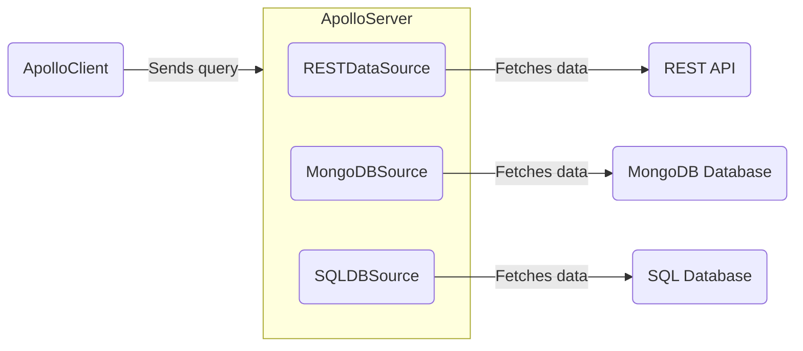

> Looking to fetch data from a REST API? Check out [Fetching from REST](./fetching-rest).

Apollo Server can fetch data from any source you need, such as a [REST API](./fetching-rest) or a database. Your server can use any number of different data sources:



Because your server can use any number of various data sources, keeping your [resolvers](./resolvers) tidy becomes _even more_ important. 

For this reason, we recommend creating individual data source classes to encapsulate the logic of fetching data from a particular source, providing methods that resolvers can use to access data neatly. You can additionally customize your data source classes to help with caching, deduplication, or errors while resolving operations.

## Creating data source classes

Your data source class can be as straightforward or complex as you need it to be. You know what data your server needs, and you can let that be the guide for the methods your class should include. 

Below is an example of a data source class that connects to a database:

<MultiCodeBlock>

```ts title="bookings.ts"
export class BookingsDataSource {
  private dbConnection;
  private token;

  constructor(options: { contextValue: { token: string } }) {
    this.dbConnection = this.initializeDBConnection();
    this.token = options.contextValue.token;
  }

  async initializeDBConnection() {
    // set up our database details, instantiate our connection,
    // and return that database connection
    return dbConnection;
  }

  async getBooking(bookingId) {
    const user = await getUser(this.token);
    if (user) {
      return await this.dbConnection.Booking.findByPk(bookingId);
    } else {
      // handle invalid user
    }
  }

  //... more methods for finding and creating bookings
}
```

</MultiCodeBlock>

> Apollo's [`RestDataSource`](https://github.com/apollographql/datasource-rest/blob/main/src/RESTDataSource.ts) class is a built-out example of how a data source class can handle caching, deduplication, and errors.

## Adding data sources to your context

You can add data sources to your server's `context` initialization function, like so:

<MultiCodeBlock>

```ts title="index.ts"
//highlight-start
interface ContextValue {
  dataSources: {
    dogsDB: DogsDataSource;
    catsApi: CatsAPI;
  };
  token: string
}
//highlight-end

const server = new ApolloServer<ContextValue>({
  typeDefs,
  resolvers,
});

const { url } = await startStandaloneServer(server, {
  context: async () => {
    const { cache } = server; // highlight-line
    const token = req.headers.token;
    return {
      // We create new instances of our data sources with each request.
      // We can pass in our server's cache, contextValue, or any other
      // info our data sources require. 
      // highlight-start
      dataSources: {
        dogsDB: new DogsDataSource({ cache, contextValue: token }),
        catsApi: new CatsAPI({ cache }),
      },
      //highlight-end
      token
    };
  },
});

console.log(`🚀  Server ready at ${url}`);
```

</MultiCodeBlock>

<!-- TODO(AS4) add link to context article once exists  -->
Apollo Server calls [the `context` initialization](./resolvers/#the-context-argument) function for _every incoming operation_. This means:
- For every operation, `context` returns an _object_ containing new instances of your data source classes (in this case, `DogsDataSource` and `CatsAPI`).
- The **`context` function should create a new instance of each data source class for each operation.** You might accidentally combine results from multiple operations if multiple operations share a single data source instance.

Your resolvers can then access your data sources from the shared `contextValue` object and use them to fetch data:

```ts title="resolvers.ts"
const resolvers = {
  Query: {
    dog: async (_, { id }, { dataSources }) => {
      return dataSources.dogsDB.getDog(id);
    },
    popularDogs: async (_, __, { dataSources }) => {
      return dataSources.dogsDB.getMostLikedDogs();
    },
    bigCats: async (_, __, { dataSources }) => {
      return dataSources.catsApi.getCats({ size: 10 });
    },
  },
};
```

## Open-source implementations

[In Apollo Server 3](/apollo-server/v3/data/data-sources), you'd subclass the `DataSource` abstract class for each of your data sources. In Apollo Server 4, we recommend [making a custom class for each data source](#creating-data-source-classes), with each class best suited for that particular source of data.

> ⚠️ **Note**: The community built each data source package below for use with Apollo Server 3. [As shown below](#using-datasource-subclasses), you can still use these packages in Apollo Server 4 with a bit of extra setup.

The below data source implementations extend the generic [`DataSource` abstract class](https://github.com/apollographql/apollo-server/blob/main/packages/apollo-datasource/src/index.ts), from the deprecated `apollo-datasource` package. Subclasses of `DataSource` define the logic required to communicate with a particular store or API.

The larger community maintains the following open-source implementations:

| Class            | Source    | For Use With          |
|------------------|-----------|-----------------------|
| [`HTTPDataSource`](https://github.com/StarpTech/apollo-datasource-http)  | Community | HTTP/REST APIs |
| [`SQLDataSource`](https://github.com/cvburgess/SQLDataSource)  | Community | SQL databases (via [Knex.js](http://knexjs.org/)) |
| [`MongoDataSource`](https://github.com/GraphQLGuide/apollo-datasource-mongodb/) | Community | MongoDB |
| [`CosmosDataSource`](https://github.com/andrejpk/apollo-datasource-cosmosdb) | Community | Azure Cosmos DB |
| [`FirestoreDataSource`](https://github.com/swantzter/apollo-datasource-firestore) | Community | Cloud Firestore |

> Apollo does not provide official support for community-maintained libraries. We cannot guarantee that community-maintained libraries adhere to best practices, or that they will continue to be maintained.

### Using `DataSource` subclasses

In Apollo Server 3, immediately after constructing each `DataSource` subclass, your server would invoke the `initialize({ cache, contextValue })` method on each new `DataSource` behind the scenes.

To replicate this in Apollo Sever 4, you can manually invoke the `initialize` method in the constructor function of each `DataSource` subclass, like so:

<MultiCodeBlock>

```ts
import { ApolloServer } from '@apollo/server';
import { startStandaloneServer } from '@apollo/server/standalone';
import { KeyValueCache } from '@apollo/utils.keyvaluecache';
import { Pool } from 'undici';
import { HTTPDataSource } from 'apollo-datasource-http';

class BooksAPI extends HTTPDataSource {
  override baseURL = 'https://movies-api.example.com/';

  //highlight-start
  constructor(options: { cache: KeyValueCache<string>; contextValue: string }) {
  //highlight-end
    // the necessary arguments for HTTPDataSource
    const pool = new Pool(baseURL);
    super(baseURL, { pool });

    // We need to call the initialize method in our data source's
    // constructor, passing in our cache and contextValue.
    this.initialize(options); //highlight-line
  }

  async getMovie(id: string): Promise<Movie> {
    return this.get<Movie>(`movies/${encodeURIComponent(id)}`);
  }
}

interface MyContext {
  dataSources: {
    moviesApi: MoviesAPI;
  };
  token?: string;
}

const server = new ApolloServer<MyContext>({
  typeDefs,
  resolvers,
});

const { url } = await startStandaloneServer(server, {
  context: async () => {
    //highlight-start
    const { cache } = server;
    const token = req.headers.token;
    return {
      dataSources: {
        moviesApi: new MoviesAPI({ cache, contextValue: token }),
      },
    //highlight-end
      token 
    };
  },
});
```

</MultiCodeBlock>