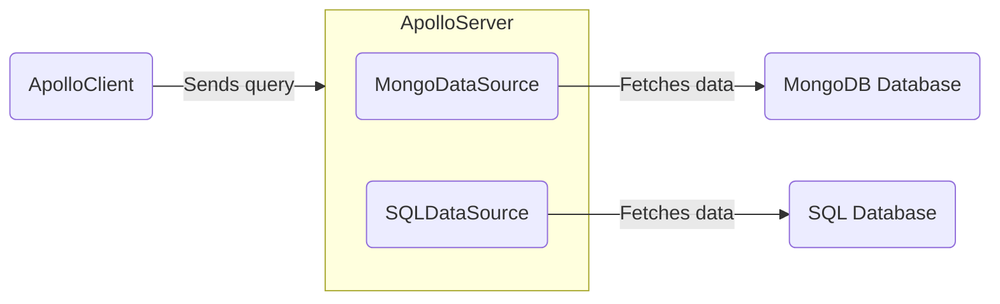

> Looking to fetch information from a REST API? Check out [Fetching from REST] (./fetching-rest).

Data sources are classes that Apollo Server can use to encapsulate fetching data from a particular source, such as a database. Your server can use any number of different data sources. You don't _have_ to use data sources to fetch data, but they're recommended because they help keep your resolvers tidy.



## Open-source implementations

> **Note**: The following data source libraries were built for use with Apollo Server 3. [Below]() we show how to use them with Apollo Sever 4.

All of the below data source implementations extend the generic [`DataSource` abstract class](https://github.com/apollographql/apollo-server/blob/main/packages/apollo-datasource/src/index.ts), which is included in the `apollo-datasource` package. Subclasses of a `DataSource` should define whatever logic is required to communicate with a particular store or API.

Apollo and the larger community maintain the following open-source implementations:

> Do you maintain a `DataSource` implementation that isn't listed here? Please [submit a PR](https://github.com/apollographql/apollo-server/blob/main/docs/source/data/data-sources.md) to be added to the list!

| Class            | Source    | For Use With          |
|------------------|-----------|-----------------------|
| [`HTTPDataSource`](https://github.com/StarpTech/apollo-datasource-http)  | Community | HTTP/REST APIs (newer community alternative to `RESTDataSource`) |
| [`SQLDataSource`](https://github.com/cvburgess/SQLDataSource)  | Community | SQL databases (via [Knex.js](http://knexjs.org/)) |
| [`MongoDataSource`](https://github.com/GraphQLGuide/apollo-datasource-mongodb/) | Community | MongoDB |
| [`CosmosDataSource`](https://github.com/andrejpk/apollo-datasource-cosmosdb) | Community | Azure Cosmos DB |
| [`FirestoreDataSource`](https://github.com/swantzter/apollo-datasource-firestore) | Community | Cloud Firestore |

If none of these implementations applies to your use case, you can create your own custom `DataSource` subclass.

> Apollo does not provide official support for community-maintained libraries. We cannot guarantee that community-maintained libraries adhere to best practices, or that they will continue to be maintained.

If you are using any of the above data sources in Apollo Sever 4, you'll need to call on the instance of that data source with the `cache` and `context` for each source, like so:

<MultiCodeBlock>

```ts
console.log("heel")

```

</MultiCodeBlock>

