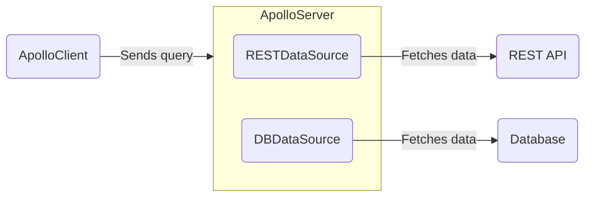

<!--  (TODO) this whole article!
MOVE THIS to separate article:

3. RESTDS has a response cache that provides caching when fetching from rest
  - in the past uses the AS cache
  - these other data sources provide a wrapper cache
    - EX: pass SQL DB connection and pass to data source class with wrapper functions
      - or could pass that connect DIRECTLY in context
    - Data sources can provide structured way to use DB
  - Build a *wrapper* around a data source (no extends) constructor is DB connection (i.e., 'getUser, getUsers')
    - would still build a new data source per request depends on what your data source requires
        - default: if your data source requires the req and response object then will need to construct per request OR access cache
          - Add callout saying this might be the scenario:
            - if DB only needs DB connection and query info then
            - only create one DB class then pass into context
 -->

Apollo Server can use to encapsulate fetching data from a particular source, such as a database or a REST API. These classes help handle caching, deduplication, and errors while resolving operations.

Your server can use any number of different data sources. You don't _have_ to use data sources to fetch data, but they're strongly recommended.




<!--
Make collapsible and show how to do this

Do we want to tell people how to create data sources themselves? Is there an example I can toss in here are break down to show people how to create their own DataSource subclasses? Especially the caching stuff? That was a little over my head
-->

## Open-source implementations

> **New in Apollo Server 4**: if you are using an open-source data source implementation from Apollo Server 3 expand the below example to see how to make it work in Apollo Server 4. 
<!-- 2. old data sources can be used but need to construct then initialize
  - The below packages could be used but they'd need to initialize themselves with the correct args (cache)
    - but we don't want to tell folks this
      - Could make a expandable "How to make V3 data source work"
-->
<ExpansionPanel title="Using an Apollo Server 3 data source?">

All data source implementations extend the generic [`DataSource` abstract class](https://github.com/apollographql/apollo-server/blob/main/packages/apollo-datasource/src/index.ts), which is included in the `apollo-datasource` package. Subclasses of a `DataSource` should define whatever logic is required to communicate with a particular store or API.

Apollo and the larger community maintain the following open-source implementations:

> Do you maintain a `DataSource` implementation that isn't listed here? Please [submit a PR](https://github.com/apollographql/apollo-server/blob/main/docs/source/data/data-sources.md) to be added to the list!

| Class            | Source    | For Use With          |
|------------------|-----------|-----------------------|
| [`RESTDataSource`](https://github.com/apollographql/apollo-server/tree/main/packages/apollo-datasource-rest) | Apollo    | REST APIs ([see below](#restdatasource-reference)) |
| [`HTTPDataSource`](https://github.com/StarpTech/apollo-datasource-http)  | Community | HTTP/REST APIs (newer community alternative to `RESTDataSource`) |
| [`SQLDataSource`](https://github.com/cvburgess/SQLDataSource)  | Community | SQL databases (via [Knex.js](http://knexjs.org/)) |
| [`MongoDataSource`](https://github.com/GraphQLGuide/apollo-datasource-mongodb/) | Community | MongoDB |
| [`CosmosDataSource`](https://github.com/andrejpk/apollo-datasource-cosmosdb) | Community | Azure Cosmos DB |
| [`FirestoreDataSource`](https://github.com/swantzter/apollo-datasource-firestore) | Community | Cloud Firestore |

To make any of the Above Apollo Server 3 data sources work you have to first construct the data source before calling `intialize` and passing in Apollo Server's cache, like so:

```ts

```

</ ExpansionPanel>

## Adding data sources to Apollo Server's context

You provide your `DataSource` subclasses to the `context` initialization function, like so:

<MultiCodeBlock>

```ts title="index.ts"
//highlight-start
interface ContextValue {
  dataSources: {
    moviesAPI: MoviesAPI;
    personalizationAPI: PersonalizationAPI;
  };
}
//highlight-end

const server = new ApolloServer<ContextValue>({
  typeDefs,
  resolvers,
});

const { url } = await startStandaloneServer(server, {
  context: async ({ req }) => {
    return {
      //highlight-start
      // We create new instances of our data sources with each request
      dataSources: {
        moviesAPI: new MoviesAPI(),
        personalizationAPI: new PersonalizationAPI(),
      },
      //highlight-end
    };
  },
});

console.log(`🚀  Server ready at ${url}`);
```

</MultiCodeBlock>

<!-- TODO(AS4) add link to context article once exists  -->
Apollo Server calls the [the `context` initialization](../resolvers/#the-context-argument) function for _every incoming operation_. This means:
- As shown above, with every operation `context` returns an _object_ containing new instances of your `DataSource` subclasses (in this case, `MoviesAPI` and `PersonalizationAPI`).
-  These subclasses are accessible from the [the `context` value argument](./resolvers/#the-context-argument) that's passed between your server's resolvers.
- The **`context` function should create a new instance of each data source for each operation.** If multiple operations share a single data source instance, you might accidentally combine results from multiple operations.

Your resolvers can now access your data sources from the shared `context` object and use them to fetch data:

```ts title="resolvers.ts"
const resolvers = {
  Query: {
    movie: async (_, { id }, { dataSources }) => {
      return dataSources.moviesAPI.getMovie(id);
    },
    mostViewedMovies: async (_, __, { dataSources }) => {
      return dataSources.moviesAPI.getMostViewedMovies();
    },
    favorites: async (_, __, { dataSources }) => {
      return dataSources.personalizationAPI.getFavorites();
    },
  },
};
```

## Caching

By default, data source implementations use Apollo Server's in-memory cache to store the results of past fetches.

When you initialize Apollo Server, you can provide its constructor a _different_ cache object that implements the [`KeyValueCache` interface](https://github.com/apollographql/apollo-utils/tree/main/packages/keyValueCache#keyvaluecache-interface). This enables you to back your cache with shared stores like Memcached or Redis.

```ts title="server.ts"
const server = new ApolloServer({
  typeDefs,
  resolvers,
  cache: new MyCustomKeyValueCache()
});
```

### Using an external cache backend

When running multiple instances of your server, you should use a shared cache backend. This enables one server instance to use the cached result from _another_ instance.

Apollo Server supports using [Memcached](https://memcached.org/), [Redis](https://redis.io/), or other cache backends via the [`keyv`](https://www.npmjs.com/package/keyv) package. For examples, see [Configuring external caching](../performance/cache-backends#configuring-external-caching).

You can also choose to implement your own cache backend. For more information, see [Implementing your own cache backend](../performance/cache-backends#implementing-your-own-cache-backend).

