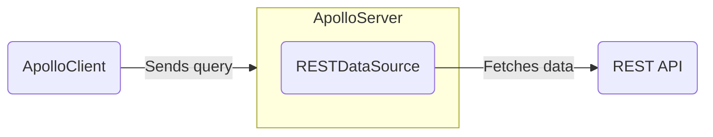

> See the [`@apollo/datasource-rest` page](https://github.com/apollographql/datasource-rest) for the full details of the `RESTDataSource` API.

The `RESTDataSource` class helps you fetch data from REST APIs. The `RESTDataSource` class helps handle caching, deduplication, and errors while resolving operations.



<!-- TODO(AS4) add this note back in when fetching data article is ready
> For more information about fetching from data sources other than a REST API, see [Fetching Data](./fetching-data).
-->

## Creating subclasses

To get started, install the [`@apollo/datasource-rest` package](https://www.npmjs.com/package/@apollo/datasource-rest):

```bash
npm install @apollo/datasource-rest
```

Your server should define a separate subclass of `RESTDataSource` for each REST API it communicates with. Here's an example of a `RESTDataSource` subclass that defines two data-fetching methods, `getMovie` and `getMostViewedMovies`:
<MultiCodeBlock>

```ts title="movies-api.ts"
import { RESTDataSource } from '@apollo/datasource-rest';

class MoviesAPI extends RESTDataSource {
  override baseURL = 'https://movies-api.example.com/';

  async getMovie(id): Promise<Movie> {
    return this.get<Movie>(`movies/${encodeURIComponent(id)}`);
  }

  async getMostViewedMovies(limit = '10'): Promise<Movie[]> {
    const data = await this.get('movies', {
      params: {
        per_page: limit,
        order_by: 'most_viewed',
      },
    });
    return data.results;
  }
}
```

</MultiCodeBlock>

You can extend the `RESTDataSource` class to implement whatever data-fetching methods your resolvers need. These methods should use the built-in convenience methods (e.g., `get` and `post`) to perform HTTP requests, helping you add query parameters, parse and cache JSON results, dedupe requests, and handle errors.

## Adding data sources to Apollo Server's context

You can add data sources to the `context` initialization function, like so:

<MultiCodeBlock>

```ts title="index.ts"
//highlight-start
interface ContextValue {
  dataSources: {
    moviesAPI: MoviesAPI;
    personalizationAPI: PersonalizationAPI;
  };
}
//highlight-end

const server = new ApolloServer<ContextValue>({
  typeDefs,
  resolvers,
});

const { url } = await startStandaloneServer(server, {
  context: async () => {
    const { cache } = server; // highlight-line
    return {
      // We create new instances of our data sources with each request,
      // passing in our server's cache.
      //highlight-start
      dataSources: {
        moviesAPI: new MoviesAPI({ cache }),
        personalizationAPI: new PersonalizationAPI({ cache }),
      },
      //highlight-end
    };
  },
});

console.log(`🚀  Server ready at ${url}`);
```

</MultiCodeBlock>

<!-- TODO(AS4) add link to context article once exists  -->
Apollo Server calls [the `context` initialization](./resolvers/#the-context-argument) function for _every incoming operation_. This means:
- For every operation, `context` returns an _object_ containing new instances of your `RESTDataSource` subclasses (in this case, `MoviesAPI` and `PersonalizationAPI`).
- The **`context` function should create a new instance of each `RESTDataSource` subclass for each operation.** 

Your resolvers can then access your data sources from the shared `context` object and use them to fetch data:

```ts title="resolvers.ts"
const resolvers = {
  Query: {
    movie: async (_, { id }, { dataSources }) => {
      return dataSources.moviesAPI.getMovie(id);
    },
    mostViewedMovies: async (_, __, { dataSources }) => {
      return dataSources.moviesAPI.getMostViewedMovies();
    },
    favorites: async (_, __, { dataSources }) => {
      return dataSources.personalizationAPI.getFavorites();
    },
  },
};
```

## Caching

> 📣 **New in Apollo Server 4**: Apollo Server no longer automatically provides its cache to data sources. [See here for more details](#datasources).

The `RESTDataSource` class can cache results if the REST API it fetches from specifies caching headers in its HTTP responses (e.g., [`cache-control`](https://developer.mozilla.org/en-US/docs/Web/HTTP/Headers/Cache-Control)). 

As shown in the above code snippet, by default, each `RESTDataSource` subclass accepts a `cache` argument (e.g., Apollo Server's default cache) to store the results of past fetches:

```ts disableCopy
class MoviesAPI extends RESTDataSource {
  override baseURL = 'https://movies-api.example.com/';

  // We omit the constructor function here because
  // RESTDataSource accepts a cache argument by default
}

// server set up, etc.

const { url } = await startStandaloneServer(server, {
  context: async ({ req }) => {
    const { cache } = server; // highlight-line
    return {
      dataSources: {
        // highlight-start
        moviesAPI: new MoviesAPI({ cache }),
        personalizationAPI: new PersonalizationAPI({ cache }),
        // highlight-end
      },
    };
  },
});
```

If your `RESTDataSource` subclass accepts multiple arguments, make sure you add a constructor function, like so:

<MultiCodeBlock>

```ts
import { ApolloServer } from '@apollo/server';
import { startStandaloneServer } from '@apollo/server/standalone';
import { RESTDataSource } from '@apollo/datasource-rest';
// KeyValueCache is the type of Apollo server's default cache
import type { KeyValueCache } from '@apollo/utils.keyvaluecache';

class PersonalizationAPI extends RESTDataSource {
  override baseURL = 'https://movies-api.example.com/';
  private token: string;

  //highlight-start
  constructor(options: { token: string; cache: KeyValueCache }) {
    super(options); // this sends our server's `cache` through
    this.token = options.token;
  }
  //highlight-end

  // data fetching methods, etc.
}

// set up server, context typing, etc.

const { url } = await startStandaloneServer(server, {
  context: async ({ req }) => {
    const token = getTokenFromRequest(req);
    const { cache } = server;
    return {
      //highlight-start
      dataSources: {
        personalizationApi: new PersonalizationAPI({ cache, token }),
      },
      //highlight-end
    };
  },
});
```

</MultiCodeBlock>


When running multiple instances of your server, you should use a shared cache backend. This enables one server instance to use the cached result from _another_ instance.

> If you want to configure or replace Apollo Server's default cache, see [Configuring external caching](../performance/cache-backends) for more details.

## HTTP Methods

`RESTDataSource` includes convenience methods for common REST API request methods: `get`, `post`, `put`, `patch`, and `delete` ([see the source](https://github.com/apollographql/datasource-rest/blob/25862e18d8b35e324c150654c5686ed317b3fca8/src/RESTDataSource.ts#L163)).

An example of each is shown below:

<ExpansionPanel title="Click to expand">

```ts
class MoviesAPI extends RESTDataSource {
  override baseURL = 'https://movies-api.example.com/';

  // GET
  async getMovie(id) {
    return this.get(
      `movies/${encodeURIComponent(id)}`, // path
    );
  }

  // POST
  async postMovie(movie) {
    return this.post(
      `movies`, // path
       { body: { movie } }, // request body
    );
  }

  // PUT
  async newMovie(movie) {
    return this.put(
      `movies`, // path
      { body: { movie } }, // request body
    );
  }

  // PATCH
  async updateMovie(movie) {
    return this.patch(
      `movies`, // path
      { body: { id: movie.id, movie } }, // request body
    );
  }

  // DELETE
  async deleteMovie(movie) {
    return this.delete(
      `movies/${encodeURIComponent(movie.id)}`, // path
    );
  }
}

```

</ExpansionPanel>

Note the use of [`encodeURIComponent`](https://developer.mozilla.org/en-US/docs/Web/JavaScript/Reference/Global_Objects/encodeURIComponent) in the above snippet. This is a standard function that encodes special characters in a URI, preventing a possible injection attack vector.

For a simple example, suppose our REST endpoint responded to the following URLs:

- DELETE `/movies/:id`
- DELETE `/movies/:id/characters`

A "malicious" client could provide an `:id` of `1/characters` to target the delete `characters` endpoint when it was the singular `movie` endpoint that we were trying to delete. URI encoding prevents this kind of injection by transforming the `/` into `%2F`. This can then be correctly decoded and interpreted by the server and won't be treated as a path segment.

### Method parameters

For all HTTP convenience methods, the first parameter is the relative path of the endpoint you're sending the request to (e.g., `movies`). The second parameter is an object where you can set a request's `headers`, `params`, `cacheOptions`, and `body`:

```ts
class MoviesAPI extends RESTDataSource {
  override baseURL = 'https://movies-api.example.com/';

  // an example making an HTTP POST request
  async postMovie(movie) {
    return this.post(
      `movies`, // path
      { body: movie }, // request body
    );
  }
}
```

## Intercepting fetches

> **New in Apollo Server 4**: Apollo Server 4 now uses the [`@apollo/utils.fetcher`](../migration#apolloutilsfetcher-replaces-apollo-server-env) interface under the hood for fetching. This interface lets you choose your own implementation of the Fetch API. To ensure compatibility with all Fetch implementations, the request provided to hooks like `willSendRequest` is a plain JS object rather than a `Request` object with methods.

`RESTDataSource` includes a `willSendRequest` method that you can override to modify outgoing requests before they're sent. For example, you can use this method to add headers or query parameters. This method is most commonly used for authorization or other concerns that apply to all sent requests.

Data sources also have access to the GraphQL operation context, which is useful for storing a user token or other relevant information.

> If you're using TypeScript, make sure to import the `WillSendRequestOptions` type.

### Setting a header

<MultiCodeBlock>

```ts
import { RESTDataSource, WillSendRequestOptions } from '@apollo/datasource-rest';
import type { KeyValueCache } from '@apollo/utils.keyvaluecache';

class PersonalizationAPI extends RESTDataSource {
  override baseURL = 'https://movies-api.example.com/';
  private token: string;

  constructor(options: { token: string; cache: KeyValueCache }) {
    super(options);
    this.token = options.token;
  }

  // highlight-start
  override willSendRequest(request: WillSendRequestOptions) {
    request.headers['authorization'] = this.token;
  }
  // highlight-end
}
```

</MultiCodeBlock>

### Adding a query parameter

<MultiCodeBlock>

```ts
import { RESTDataSource, WillSendRequestOptions } from '@apollo/datasource-rest';
import type { KeyValueCache } from '@apollo/utils.keyvaluecache';

class PersonalizationAPI extends RESTDataSource {
  override baseURL = 'https://movies-api.example.com/';
  private token: string;

  constructor(options: { token: string; cache: KeyValueCache }) {
    super(options);
    this.token = options.token;
  }

  // highlight-start
  override willSendRequest(request: WillSendRequestOptions) {
    request.params.set('api_key', this.token);
  }
  // highlight-end
}
```

</MultiCodeBlock>

## Resolving URLs dynamically

In some cases, you'll want to set the URL based on the environment or other contextual values. To do this, you can override `resolveURL`:

<MultiCodeBlock>

```ts
import { RESTDataSource, RequestOptions } from '@apollo/datasource-rest';
import type { KeyValueCache } from '@apollo/utils.keyvaluecache';

class PersonalizationAPI extends RESTDataSource {
  private token: string;

  constructor(options: { token: string; cache: KeyValueCache }) {
    super(options);
    this.token = options.token;
  }

  override async resolveURL(path: string, request: RequestOptions) {
    if (!this.baseURL) {
      const addresses = await resolveSrv(path.split('/')[1] + '.service.consul');
      this.baseURL = addresses[0];
    }
    return super.resolveURL(path, request);
  }
}

```

</MultiCodeBlock>


## Using with DataLoader

The [DataLoader](https://github.com/graphql/dataloader) utility was designed for a specific use case: deduplicating and batching object loads from a data store. It provides a memoization cache, which avoids loading the same object multiple times during a single GraphQL request. It also combines loads that occur during a single tick of the event loop into a batched request that fetches multiple objects at once.

DataLoader is great for its intended use case, but it’s less helpful when loading data from REST APIs. This is because its primary feature is _batching_, not _caching_.

When layering GraphQL over REST APIs, it's most helpful to have a resource cache that:

- Saves data across multiple GraphQL requests
- Can be shared across multiple GraphQL servers
- Provides cache management features like expiry and invalidation that use standard HTTP cache control headers

### Batching with REST APIs

Most REST APIs don't support batching. When they do, using a batched endpoint can _jeopardize_ caching. When you fetch data in a batch request, the response you receive is for the exact combination of resources you're requesting. Unless you request that same combination again, future requests for the same resource won't be served from cache.

We recommend that you restrict batching to requests that _can't_ be cached. In these cases, you can take advantage of DataLoader as a private implementation detail inside your `RESTDataSource`:

```ts
import DataLoader from 'dataloader';
import { RESTDataSource, WillSendRequestOptions } from '@apollo/datasource-rest';
import type { KeyValueCache } from '@apollo/utils.keyvaluecache';

class PersonalizationAPI extends RESTDataSource {
  override baseURL = 'https://movies-api.example.com/';
  private token: string;

  constructor(options: { token: string; cache: KeyValueCache }) {
    super(options); // this should send our server's `cache` through
    this.token = options.token;
  }

  override willSendRequest(request: WillSendRequestOptions) {
    request.headers['authorization'] = this.token;
  }

  private progressLoader = new DataLoader(async (ids) => {
    const progressList = await this.get('progress', { params: { ids: ids.join(',') } });
    return ids.map((id) => progressList.find((progress) => progress.id === id));
  });

  async getProgressFor(id) {
    return this.progressLoader.load(id);
  }
}
```
