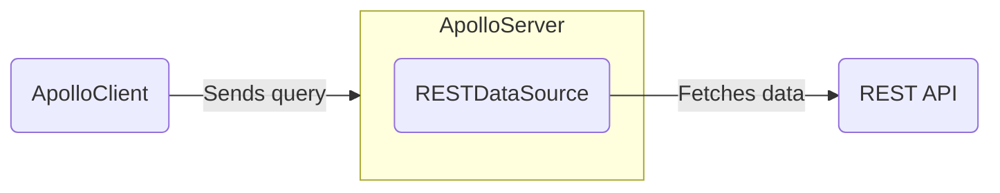

The `RESTDataSource` class helps you fetch data from REST APIs. The `RESTDataSource` class helps handle caching, deduplication, and errors while resolving operations.



> For more information about fetching from data sources other than a REST API, see [Fetching Data](./fetching-data). 

See the [`@apollo/datasource-rest` page](https://www.npmjs.com/package/@apollo/datasource-rest) for the full details of the `RESTDataSource` API.

## Creating subclasses

To get started, install the [`@apollo/datasource-rest` package](https://www.npmjs.com/package/@apollo/datasource-rest):

```bash
npm install @apollo/datasource-rest
```

Your server should define a separate subclass of `RESTDataSource` for each REST API it communicates with. Here's an example of a `RESTDataSource` subclass that defines two data-fetching methods, `getMovie` and `getMostViewedMovies`:
<MultiCodeBlock>

```ts title="movies-api.ts"
import { RESTDataSource } from '@apollo/datasource-rest';

class MoviesAPI extends RESTDataSource {
  baseURL = 'https://movies-api.example.com/';
  constructor() {
    super();
  }

  async getMovie(id):Promise<Movie> {
    return this.get(`movies/${encodeURIComponent(id)}`);
  }

  async getMostViewedMovies(limit = '10'):Promise<Movie[]> {
    const data = await this.get('movies', {
      params: {
        per_page: limit,
        order_by: 'most_viewed',
      },
    });
    return data.results;
  }
}
```

</MultiCodeBlock>

You can extend the `RESTDataSource` class to implement whatever data-fetching methods your resolvers need. These methods can use built-in convenience methods (like `get` and `post`) to perform HTTP requests, helping you add query parameters, parse JSON results, and handle errors.

## Adding subclasses to Apollo Server's context

You can then provide your `RESTDataSource` subclasses to the `context` initialization function, like so:

<MultiCodeBlock>

```ts title="index.ts"
//highlight-start
interface ContextValue {
  dataSources: {
    moviesAPI: MoviesAPI;
    personalizationAPI: PersonalizationAPI;
  };
}
//highlight-end

const server = new ApolloServer<ContextValue>({
  typeDefs,
  resolvers,
});

const { url } = await startStandaloneServer(server, {
  context: async ({ req }) => {
    return {
      //highlight-start
      // We create new instances of our data sources with each request
      dataSources: {
        moviesAPI: new MoviesAPI(),
        personalizationAPI: new PersonalizationAPI(),
      },
      //highlight-end
    };
  },
});

console.log(`🚀  Server ready at ${url}`);
```

</MultiCodeBlock>

<!-- TODO(AS4) add link to context article once exists  -->
Apollo Server calls the [the `context` initialization](../resolvers/#the-context-argument) function for _every incoming operation_. This means:
- As shown above, with every operation `context` returns an _object_ containing new instances of your `RESTDataSource` subclasses (in this case, `MoviesAPI` and `PersonalizationAPI`).
-  These subclasses are accessible from the [the `context` argument](./resolvers/#the-context-argument) that's passed between your server's resolvers.
- The **`context` function should create a new instance of each `RESTDataSource` subclass for each operation.** If multiple operations share a single data source instance, you might accidentally combine results from multiple operations.

Your resolvers can now access your data sources from the shared `context` object and use them to fetch data:

```ts title="resolvers.ts"
const resolvers = {
  Query: {
    movie: async (_, { id }, { dataSources }) => {
      return dataSources.moviesAPI.getMovie(id);
    },
    mostViewedMovies: async (_, __, { dataSources }) => {
      return dataSources.moviesAPI.getMostViewedMovies();
    },
    favorites: async (_, __, { dataSources }) => {
      return dataSources.personalizationAPI.getFavorites();
    },
  },
};
```

## Caching

> 📣 **New in Apollo Server 4**: Apollo Server no longer automatically provides it's cache to data sources. [See here for more details](#datasources).

You can pass your `RESTDataSource` subclasses a cache (such as Apollo Server's default cache) to store the results of past fetches:

<MultiCodeBlock>

```ts
import { RESTDataSource } from '@apollo/datasource-rest';
// KeyValueCache is the type of Apollo server's default cache
import { KeyValueCache } from '@apollo/utils.keyvaluecache';
import { ApolloServer } from '@apollo/server';
import { startStandaloneServer } from '@apollo/server/standalone';

class MoviesAPI extends RESTDataSource {
  baseURL = 'https://movies-api.example.com/';

  //highlight-start
  constructor(options: {cache: KeyValueCache }) { 
    super(options); // this should send our server's `cache` through
  }
  //highlight-end

  // data fetching methods, etc.
}

interface ContextValue {
  dataSources: {
    moviesAPI: MoviesAPI;
  };
}

const server = new ApolloServer<ContextValue>({
  typeDefs,
  resolvers,
});

const { url } = await startStandaloneServer(server, {
  context: async ({ req }) => {
    const { cache } = server;
    return {
      token,
      //highlight-start
      dataSources: {
        moviesAPI: new MoviesAPI({ cache, token }),
      },
      //highlight-end
    };
  },
});
```

</MultiCodeBlock>

If you want Apollo Server to use another cache backend, you can provide its constructor a _different_ cache object that implements the [`KeyValueCache` interface](https://github.com/apollographql/apollo-utils/tree/main/packages/keyValueCache#keyvaluecache-interface):

```ts title="server.ts"
const server = new ApolloServer({
  typeDefs,
  resolvers,
  cache: new MyCustomKeyValueCache()
});
```

### Using an external cache backend

When running multiple instances of your server, you should use a shared cache backend. This enables one server instance to use the cached result from _another_ instance.

Apollo Server supports using [Memcached](https://memcached.org/), [Redis](https://redis.io/), or other cache backends via the [`keyv`](https://www.npmjs.com/package/keyv) package. For examples, see [Configuring external caching](../performance/cache-backends#configuring-external-caching).

You can also choose to implement your own cache backend. For more information, see [Implementing your own cache backend](../performance/cache-backends#implementing-your-own-cache-backend).

## HTTP Methods

`RESTDataSource` includes convenience methods for common REST API request methods: `get`, `post`, `put`, `patch`, and `delete` ([see the source](https://github.com/apollographql/datasource-rest/blob/main/src/RESTDataSource.ts#L163)).

An example of each is shown below:

<ExpansionPanel title="Click to expand">

```ts
class MoviesAPI extends RESTDataSource {
  baseURL = 'https://movies-api.example.com/';

  // GET
  async getMovie(id) {
    return this.get(
      `movies/${encodeURIComponent(id)}`, // path
    );
  }

  // POST
  async postMovie(movie) {
    return this.post(
      `movies`, // path
      movie, // request body
    );
  }

  // PUT
  async newMovie(movie) {
    return this.put(
      `movies`, // path
      movie, // request body
    );
  }

  // PATCH
  async updateMovie(movie) {
    return this.patch(
      `movies`, // path
      { body: { id: movie.id, movie } }, // request body
    );
  }

  // DELETE
  async deleteMovie(movie) {
    return this.delete(
      `movies/${encodeURIComponent(movie.id)}`, // path
    );
  }
}

```

</ExpansionPanel>

> Note the use of [`encodeURIComponent`](https://developer.mozilla.org/en-US/docs/Web/JavaScript/Reference/Global_Objects/encodeURIComponent). This is a standard function that encodes special characters in a URI, preventing a possible injection attack vector.

For a simple example, suppose our REST endpoint responded to the following URLs:

- DELETE `/movies/:id`
- DELETE `/movies/:id/characters`

A "malicious" client could provide an `:id` of `1/characters` to target the delete `characters` endpoint when it was the singular `movie` endpoint that we were trying to delete. URI encoding prevents this kind of injection by transforming the `/` into `%2F`. This can then be correctly decoded and interpreted by the server and won't be treated as a path segment.

### Method parameters

For all HTTP convenience methods, the **first parameter** is the relative path of the endpoint you're sending the request to (e.g., `movies`).

The **second parameter** depends on the HTTP method:

- For HTTP methods with a request body (`post`, `put`, `patch`), the second parameter _is_ the request body (e.g., `{ body: { id: movie.id } }`).
- For HTTP methods _without_ a request body, the second parameter is an object with keys and values corresponding to the request's query parameters.

For all methods, the **third parameter** is an `init` object that enables you to provide additional options (such as headers and referrers) to the `fetch` API that's used to send the request. For details, [see MDN's fetch docs](https://developer.mozilla.org/en-US/docs/Web/API/WindowOrWorkerGlobalScope/fetch#Parameters).

## Intercepting fetches

`RESTDataSource` includes a `willSendRequest` method that you can override to modify outgoing requests before they're sent. For example, you can use this method to add headers or query parameters. This method is most commonly used for authorization or other concerns that apply to all sent requests.

Data sources also have access to the GraphQL operation context, which is useful for storing a user token or other relevant information.

### Setting a header

<MultiCodeBlock>

```ts
import { RESTDataSource, WillSendRequestOptions } from '@apollo/datasource-rest';

class PersonalizationAPI extends RESTDataSource {
  override baseURL = 'https://personalization-api.example.com/';

  constructor(private token: string) {
    super();
  }

  override willSendRequest(request: WillSendRequestOptions) {
    request.headers['authorization'] = this.token;
  }
}
```

</MultiCodeBlock>

> If you're using TypeScript, make sure to import the `WillSendRequestOptions` type.

### Adding a query parameter

<MultiCodeBlock>

```ts
import { RESTDataSource } from '@apollo/datasource-rest';

class PersonalizationAPI extends RESTDataSource {
  willSendRequest(request) {
    request.params.set('api_key', this.token);
  }
}
```

</MultiCodeBlock>

## Resolving URLs dynamically

In some cases, you'll want to set the URL based on the environment or other contextual values. To do this, you can override `resolveURL`:

<MultiCodeBlock>

```ts
import { RESTDataSource, RequestOptions } from '@apollo/datasource-rest';

class PersonalizationAPI extends RESTDataSource {
  constructor(private token: string) {
    super();
  }

  override async resolveURL(path: string, request: RequestOptions) {
    if (!this.baseURL) {
      const addresses = await resolveSrv(path.split('/')[1] + '.service.consul');
      this.baseURL = addresses[0];
    }
    return super.resolveURL(path, request);
  }
}

```

</MultiCodeBlock>


## Using with DataLoader

The [DataLoader](https://github.com/graphql/dataloader) utility was designed for a specific use case: deduplicating and batching object loads from a data store. It provides a memoization cache, which avoids loading the same object multiple times during a single GraphQL request. It also combines loads that occur during a single tick of the event loop into a batched request that fetches multiple objects at once.

DataLoader is great for its intended use case, but it’s less helpful when loading data from REST APIs. This is because its primary feature is _batching_, not _caching_.

When layering GraphQL over REST APIs, it's most helpful to have a resource cache that:

- Saves data across multiple GraphQL requests
- Can be shared across multiple GraphQL servers
- Provides cache management features like expiry and invalidation that use standard HTTP cache control headers

### Batching with REST APIs

Most REST APIs don't support batching. When they do, using a batched endpoint can _jeopardize_ caching. When you fetch data in a batch request, the response you receive is for the exact combination of resources you're requesting. Unless you request that same combination again, future requests for the same resource won't be served from cache.

We recommend that you restrict batching to requests that _can't_ be cached. In these cases, you can take advantage of DataLoader as a private implementation detail inside your `RESTDataSource`:

```ts
class PersonalizationAPI extends RESTDataSource {
  constructor() {
    super();
    this.baseURL = 'https://personalization-api.example.com/';
  }

  willSendRequest(request) {
    request.headers.set('Authorization', this.context.token);
  }

  private progressLoader = new DataLoader(async (ids) => {
    const progressList = await this.get('progress', {
      ids: ids.join(','),
    });
    return ids.map(id =>
      progressList.find((progress) => progress.id === id),
    );
  });

  async getProgressFor(id) {
    return this.progressLoader.load(id);
  }
}
```


