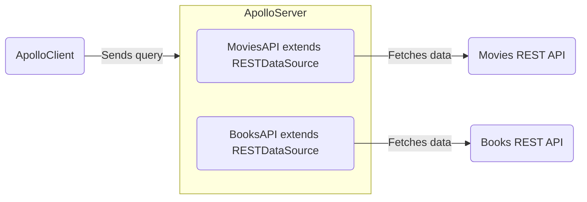

import TopLevelAwait from "../shared/top-level-await.mdx"

<Tip>

[Learn how Apollo Connectors](/graphos/schema-design/connectors/) simplify incorporating REST APIs into your graph.

</Tip>

> See the [`@apollo/datasource-rest` README](https://github.com/apollographql/datasource-rest) for the full details of the `RESTDataSource` API.

The `RESTDataSource` class simplifies fetching data from REST APIs and helps handle caching, request deduplication, and errors while resolving operations.



> For more information about fetching from data sources other than a REST API, see [Fetching Data](./fetching-data).

## Creating subclasses

To get started, install the [`@apollo/datasource-rest` package](https://www.npmjs.com/package/@apollo/datasource-rest):

```bash
npm install @apollo/datasource-rest
```

Your server should define a separate subclass of `RESTDataSource` for each REST API it communicates with. Here's an example of a `RESTDataSource` subclass that defines two data-fetching methods, `getMovie` and `getMostViewedMovies`:

<MultiCodeBlock>

```ts title="movies-api.ts"
import { RESTDataSource } from '@apollo/datasource-rest';

class MoviesAPI extends RESTDataSource {
  override baseURL = 'https://movies-api.example.com/';

  async getMovie(id: string): Promise<Movie> {
    return this.get<Movie>(`movies/${encodeURIComponent(id)}`);
  }

  async getMostViewedMovies(limit = '10'): Promise<Movie[]> {
    const data = await this.get('movies', {
      params: {
        per_page: limit.toString(), // all params entries should be strings,
        order_by: 'most_viewed',
      },
    });
    return data.results;
  }
}
```

</MultiCodeBlock>

You can extend the `RESTDataSource` class to implement whatever data-fetching methods your resolvers need. These methods should use the built-in convenience methods (e.g., `get` and `post`) to perform HTTP requests, helping you add query parameters, parse and cache JSON results, dedupe requests, and handle errors. More complex use cases can use the `fetch` method directly. The `fetch` method returns both the parsed body and the response object, which provides more flexibility for use cases like reading response headers.

## Adding data sources to your server's context function

<TopLevelAwait />

You can add data sources to the `context` initialization function, like so:

<MultiCodeBlock>

```ts title="index.ts"
//highlight-start
interface ContextValue {
  dataSources: {
    moviesAPI: MoviesAPI;
    personalizationAPI: PersonalizationAPI;
  };
}
//highlight-end

const server = new ApolloServer<ContextValue>({
  typeDefs,
  resolvers,
});

const { url } = await startStandaloneServer(server, {
  context: async () => {
    const { cache } = server; // highlight-line
    return {
      // We create new instances of our data sources with each request,
      // passing in our server's cache.
      //highlight-start
      dataSources: {
        moviesAPI: new MoviesAPI({ cache }),
        personalizationAPI: new PersonalizationAPI({ cache }),
      },
      //highlight-end
    };
  },
});

console.log(`🚀  Server ready at ${url}`);
```

</MultiCodeBlock>

Apollo Server calls [the `context` initialization](./context/#the-context-function) function for _every incoming operation_. This means:

- For every operation, `context` returns an _object_ containing new instances of your `RESTDataSource` subclasses (in this case, `MoviesAPI` and `PersonalizationAPI`).
- The **`context` function should create a new instance of each `RESTDataSource` subclass for each operation**. [More details on why below.](#get-and-head-requests-and-responses)

Your resolvers can then access your data sources from the shared `contextValue` object and use them to fetch data:

```ts title="resolvers.ts"
const resolvers = {
  Query: {
    movie: async (_, { id }, { dataSources }) => {
      return dataSources.moviesAPI.getMovie(id);
    },
    mostViewedMovies: async (_, __, { dataSources }) => {
      return dataSources.moviesAPI.getMostViewedMovies();
    },
    favorites: async (_, __, { dataSources }) => {
      return dataSources.personalizationAPI.getFavorites();
    },
  },
};
```

## Caching

The `RESTDataSource` class provides its subclasses with _two_ layers of caching:

- The first layer deduplicates _concurrent_ outgoing `GET` (and `HEAD`) requests by default. Deduplication is keyed on the request's method and URL. You can configure this behavior by overriding the `requestDeduplicationPolicyFor` method. For more details, see [the README](https://github.com/apollographql/datasource-rest#requestdeduplicationpolicyfor).

> **Note:** In versions of `RESTDataSource` prior to v5, _all_ outgoing `GET` requests are deduplicated. You can achieve this same behavior with the `deduplicate-until-invalidated` policy (explained further in [the README](https://github.com/apollographql/datasource-rest#requestdeduplicationpolicyfor)).

- The second layer caches the results from **HTTP responses that specify HTTP caching headers**.

These caching layers effectively make the `RESTDataSource` class a Node HTTP client that offers browser-style caching. Below, we'll dive into each layer of caching and the advantage that layer provides.

### `GET` (and `HEAD`) requests and responses

Every time you instantiate a `RESTDataSource` subclass, under the hood that instance creates an internal cache. By default, `RESTDataSource` automatically deduplicates _concurrent_ `GET` (and `HEAD`) requests (keyed by their method and URLs) alongside their results in this internal cache. This behavior is called request deduplication. You can configure this default behavior by overriding the [`requestDeduplicationPolicyFor`](https://github.com/apollographql/datasource-rest/blob/main/README.md#requestdeduplicationpolicyfor) method on the class.

> The `RESTDataSource` class caches `GET` (and `HEAD`) requests and responses _regardless_ of HTTP caching headers.

The request deduplication cache enables `RESTDataSource` to optimize the current operation by eliminating redundant `GET` (and `HEAD`) requests from different resolvers trying to get the same information. This works much like [`DataLoader`'s caching functionality](https://github.com/graphql/dataloader#caching).

As an example, let's say we have two `RESTDataSource` subclasses for fetching data from a Posts API and an Authors API. We can write a query fetching a post's content and that post's author's name:

```graphql
query GetPosts {
  posts {
    body
    author {
      name
    }
  }
}
```

The above query provides an example of the classic N+1 problem. For every `N` number of posts, we'd supposedly make one more request to find the post's author's name (from an endpoint such as `/authors/id_1`).

This is a situation where `RESTDataSource` can optimize an operation using its cache of memoized `GET` requests and their responses.

The first time `RESTDataSource` makes a `GET` request (e.g., to `/authors/id_1`), it stores the request's URL _before_ making that request. `RESTDataSource` then performs the request and stores the result alongside the request's URL in its memoized cache forever.

If any resolver in the current operation attempts a parallel `GET` request to the same URL, `RESTDataSource` checks its memoized cache _before_ performing that request. If a request _or_ a result exists in the cache, `RESTDataSource` returns (or waits to return) that stored result **without** making another request.

> This internal caching mechanism is why we create a new `RESTDataSource` instance for _every_ request. Otherwise, responses would be cached across requests even if they specify they shouldn't be!

You can change how `GET` (and `HEAD`) requests are stored in `RESTDataSource`'s deduplication cache by overwriting the [`cacheKeyFor` method](https://github.com/apollographql/datasource-rest#cachekeyfor). By default, a request's cache key is the combination of its HTTP method and URL.

To restore the deduplication policy from before `RESTDataSource` v5, you can configure `requestDeduplicationPolicyFor` like so:

<MultiCodeBlock>

```ts
class MoviesAPI extends RESTDataSource {
  override baseURL = 'https://movies-api.example.com/';
  private token: string;

  constructor(options: { token: string; cache: KeyValueCache }) {
    super(options); // this sends our server's `cache` through
    this.token = options.token;
  }

  // highlight-start
  protected override requestDeduplicationPolicyFor(
    url: URL,
    request: RequestOptions,
  ) {
    const cacheKey = this.cacheKeyFor(url, request);
    return {
      policy: 'deduplicate-until-invalidated',
      deduplicationKey: `${request.method ?? 'GET'} ${cacheKey}`
    };
  }
  // highlight-end

  // Duplicate requests are cached indefinitely
  async getMovie(id) {
    return this.get(`movies/${encodeURIComponent(id)}`);
  }
}
```

</MultiCodeBlock>

To disable request deduplication entirely, you can configure `requestDeduplicationPolicyFor` like so:

<MultiCodeBlock>

```ts
class MoviesAPI extends RESTDataSource {
  override baseURL = 'https://movies-api.example.com/';
  private token: string;

  constructor(options: { token: string; cache: KeyValueCache }) {
    super(options); // this sends our server's `cache` through
    this.token = options.token;
  }

  // highlight-start
  protected override requestDeduplicationPolicyFor(
    url: URL,
    request: RequestOptions,
  ) {
    const cacheKey = this.cacheKeyFor(url, request);
    return { policy: 'do-not-deduplicate' } as const;
  }
  // highlight-end

  // Outgoing requests aren't cached, but the HTTP response cache still works!
  async getMovie(id) {
    return this.get(`movies/${encodeURIComponent(id)}`);
  }
}
```

</MultiCodeBlock>

### Specifying cache TTL

> 📣 **New in Apollo Server 4**: Apollo Server no longer automatically provides its cache to data sources. [See here for more details](../migration/#datasources).

The `RESTDataSource` class can cache results from the REST API it fetches from **if either of the following is true**:

- The request method is `GET` (or `HEAD`), and the response specifies caching headers (e.g., [`cache-control`](https://developer.mozilla.org/en-US/docs/Web/HTTP/Headers/Cache-Control)).
- The `RESTDataSource` instance's [`cacheOptions`](https://github.com/apollographql/datasource-rest/blob/e9c6e1bd5498a44fce3046aeb6556ef9d4c0fc6a/src/RESTDataSource.ts#L46) specify a TTL.
  - You can do this by overriding the [`cacheOptionsFor`](https://github.com/apollographql/datasource-rest/blob/e9c6e1bd5498a44fce3046aeb6556ef9d4c0fc6a/src/RESTDataSource.ts#L98) method or in the HTTP method making the request.

`RESTDataSource` ensures that the cached information honors the [TTL (Time To Live)](https://developer.mozilla.org/en-US/docs/Glossary/TTL) rules established by those caching headers.

Each `RESTDataSource` subclass accepts a `cache` argument where you can specify which cache to use (e.g., Apollo Server's default cache) to store the results of past fetches:

<MultiCodeBlock>

```ts disableCopy
// KeyValueCache is the type of Apollo server's default cache
import type { KeyValueCache } from '@apollo/utils.keyvaluecache';

class PersonalizationAPI extends RESTDataSource {
  override baseURL = 'https://person.example.com/';
  private token: string;

  constructor(options: { cache: KeyValueCache; token: string }) {
    super(options); // this sends our server's `cache` through
    this.token = options.token;
  }
}

// server set up, etc.

const { url } = await startStandaloneServer(server, {
  context: async ({ req }) => {
    const token = getTokenFromRequest(req);
    // We'll take Apollo Server's cache
    // and pass it to each of our data sources
    const { cache } = server; // highlight-line
    return {
      dataSources: {
        // highlight-start
        moviesAPI: new MoviesAPI({ cache, token }),
        personalizationAPI: new PersonalizationAPI({ cache }),
        // highlight-end
      },
    };
  },
});
```

</MultiCodeBlock>

Passing the same `cache` to multiple `RESTDataSource` subclass instances enables those instances to _share_ the cached results.

When running _multiple instances_ of your server, you should use an external shared cache backend. This enables one server instance to use the cached result from _another_ instance.

> If you want to configure or replace Apollo Server's default cache, see [Configuring external caching](../performance/cache-backends) for more details.

## HTTP Methods

`RESTDataSource` includes convenience methods for common REST API request methods: `get`, `post`, `put`, `patch`, and `delete` ([see the source](https://github.com/apollographql/datasource-rest/blob/25862e18d8b35e324c150654c5686ed317b3fca8/src/RESTDataSource.ts#L163)).

An example of each is shown below:

<ExpansionPanel title="Click to expand">

```ts
class MoviesAPI extends RESTDataSource {
  override baseURL = 'https://movies-api.example.com/';

  // GET
  async getMovie(id) {
    return this.get(
      `movies/${encodeURIComponent(id)}`, // path
    );
  }

  // POST
  async postMovie(movie) {
    return this.post(
      `movies`, // path
      { body: { movie } }, // request body
    );
  }

  // PUT
  async newMovie(movie) {
    return this.put(
      `movies`, // path
      { body: { movie } }, // request body
    );
  }

  // PATCH
  async updateMovie(movie) {
    return this.patch(
      `movies`, // path
      { body: { id: movie.id, movie } }, // request body
    );
  }

  // DELETE
  async deleteMovie(movie) {
    return this.delete(
      `movies/${encodeURIComponent(movie.id)}`, // path
    );
  }
}
```

</ExpansionPanel>

Note the use of [`encodeURIComponent`](https://developer.mozilla.org/en-US/docs/Web/JavaScript/Reference/Global_Objects/encodeURIComponent) in the above snippet. This is a standard function that encodes special characters in a URI, preventing a possible injection attack vector.

For a simple example, suppose our REST endpoint responded to the following URLs:

- DELETE `/movies/:id`
- DELETE `/movies/:id/characters`

A "malicious" client could provide an `:id` of `1/characters` to target the delete `characters` endpoint when it was the singular `movie` endpoint that we were trying to delete. URI encoding prevents this kind of injection by transforming the `/` into `%2F`. This can then be correctly decoded and interpreted by the server and won't be treated as a path segment.

### Method parameters

For all HTTP convenience methods, the first parameter is the relative path of the endpoint you're sending the request to (e.g., `movies`). The second parameter is an object where you can set a request's `headers`, `params`, `cacheOptions`, and `body`:

```ts
class MoviesAPI extends RESTDataSource {
  override baseURL = 'https://movies-api.example.com/';

  // an example making an HTTP POST request
  async postMovie(movie) {
    return this.post(
      `movies`, // path
      { body: movie }, // request body
    );
  }
}
```

## Setting fetch options
The second parameter passed to each REST method is an object containing request options. These include options commonly passed to [`fetch`](https://developer.mozilla.org/en-US/docs/Web/API/fetch#syntax), including `method`, `headers`, `body`, and `signal`.

> If you're looking for other advanced options that aren't covered in the Apollo docs, you can set them here and refer to your Fetch API docs.

```ts
this.get('/movies/1', options);
```

### Setting timeouts
To set a `fetch` timeout, provide an [`AbortSignal`](https://developer.mozilla.org/en-US/docs/Web/API/AbortSignal) via the `signal` option, which enables you to abort the request with custom logic.

Here's an example of a simple timeout after a fixed time for every request:

```ts
this.get('/movies/1', { signal: AbortSignal.timeout(myTimeoutMilliseconds) });
```

## Intercepting fetches

> **New in Apollo Server 4**: Apollo Server 4 now uses the [`@apollo/utils.fetcher`](../migration#apolloutilsfetcher-replaces-apollo-server-env) interface under the hood for fetching. This interface lets you choose your own implementation of the Fetch API. To ensure compatibility with all Fetch implementations, the request provided to hooks like `willSendRequest` is a plain JS object rather than a `Request` object with methods.

`RESTDataSource` includes a `willSendRequest` method that you can override to modify outgoing requests before they're sent. For example, you can use this method to add headers or query parameters. This method is most commonly used for authorization or other concerns that apply to all sent requests.

Data sources also have access to the GraphQL operation context, which is useful for storing a user token or other relevant information.

> If you're using TypeScript, make sure to import the `AugmentedRequest` type.

### Setting a header

<MultiCodeBlock>

```ts
import {
  RESTDataSource,
  AugmentedRequest,
} from '@apollo/datasource-rest';
import type { KeyValueCache } from '@apollo/utils.keyvaluecache';

class PersonalizationAPI extends RESTDataSource {
  override baseURL = 'https://movies-api.example.com/';
  private token: string;

  constructor(options: { token: string; cache: KeyValueCache }) {
    super(options);
    this.token = options.token;
  }

  // highlight-start
  override willSendRequest(_path: string, request: AugmentedRequest) {
    request.headers['authorization'] = this.token;
  }
  // highlight-end
}
```

</MultiCodeBlock>

### Adding a query parameter

<MultiCodeBlock>

```ts
import {
  RESTDataSource,
  AugmentedRequest,
} from '@apollo/datasource-rest';
import type { KeyValueCache } from '@apollo/utils.keyvaluecache';

class PersonalizationAPI extends RESTDataSource {
  override baseURL = 'https://movies-api.example.com/';
  private token: string;

  constructor(options: { token: string; cache: KeyValueCache }) {
    super(options);
    this.token = options.token;
  }

  // highlight-start
  override willSendRequest(_path: string, request: AugmentedRequest) {
    request.params.set('api_key', this.token);
  }
  // highlight-end
}
```

</MultiCodeBlock>

## Resolving URLs dynamically

In some cases, you'll want to set the URL based on the environment or other contextual values. To do this, you can override `resolveURL`:

<MultiCodeBlock>

```ts
import { RESTDataSource, AugmentedRequest } from '@apollo/datasource-rest';
import type { KeyValueCache } from '@apollo/utils.keyvaluecache';

class PersonalizationAPI extends RESTDataSource {
  private token: string;

  constructor(options: { token: string; cache: KeyValueCache }) {
    super(options);
    this.token = options.token;
  }

  override async resolveURL(path: string, request: AugmentedRequest) {
    if (!this.baseURL) {
      const addresses = await resolveSrv(
        path.split('/')[1] + '.service.consul',
      );
      this.baseURL = addresses[0];
    }
    return super.resolveURL(path, request);
  }
}
```

</MultiCodeBlock>

## Using with DataLoader

The [DataLoader](https://github.com/graphql/dataloader) utility was designed for a specific use case: deduplicating and batching object loads from a data store. It provides a memoization cache, which avoids loading the same object multiple times during a single GraphQL request. It also combines loads that occur during a single tick of the event loop into a batched request that fetches multiple objects at once.

DataLoader is great for its intended use case, but it’s less helpful when loading data from REST APIs. This is because its primary feature is _batching_, not _caching_.

When layering GraphQL over REST APIs, it's most helpful to have a resource cache that:

- Saves data across multiple GraphQL requests
- Can be shared across multiple GraphQL servers
- Provides cache management features like expiry and invalidation that use standard HTTP cache control headers

### Batching with REST APIs

Most REST APIs don't support batching. When they do, using a batched endpoint can _jeopardize_ caching. When you fetch data in a batch request, the response you receive is for the exact combination of resources you're requesting. Unless you request that same combination again, future requests for the same resource won't be served from cache.

We recommend that you restrict batching to requests that _can't_ be cached. In these cases, you can take advantage of DataLoader as a private implementation detail inside your `RESTDataSource`:

```ts
import DataLoader from 'dataloader';
import {
  RESTDataSource,
  AugmentedRequest,
} from '@apollo/datasource-rest';
import type { KeyValueCache } from '@apollo/utils.keyvaluecache';

class PersonalizationAPI extends RESTDataSource {
  override baseURL = 'https://movies-api.example.com/';
  private token: string;

  constructor(options: { token: string; cache: KeyValueCache }) {
    super(options); // this should send our server's `cache` through
    this.token = options.token;
  }

  override willSendRequest(_path: string, request: AugmentedRequest) {
    request.headers['authorization'] = this.token;
  }

  private progressLoader = new DataLoader(async (ids) => {
    const progressList = await this.get('progress', {
      params: { ids: ids.join(',') },
    });
    return ids.map((id) => progressList.find((progress) => progress.id === id));
  });

  async getProgressFor(id) {
    return this.progressLoader.load(id);
  }
}
```
