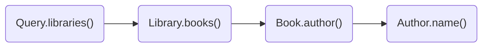
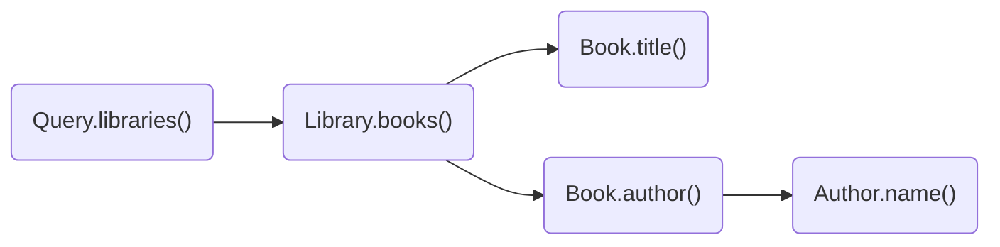
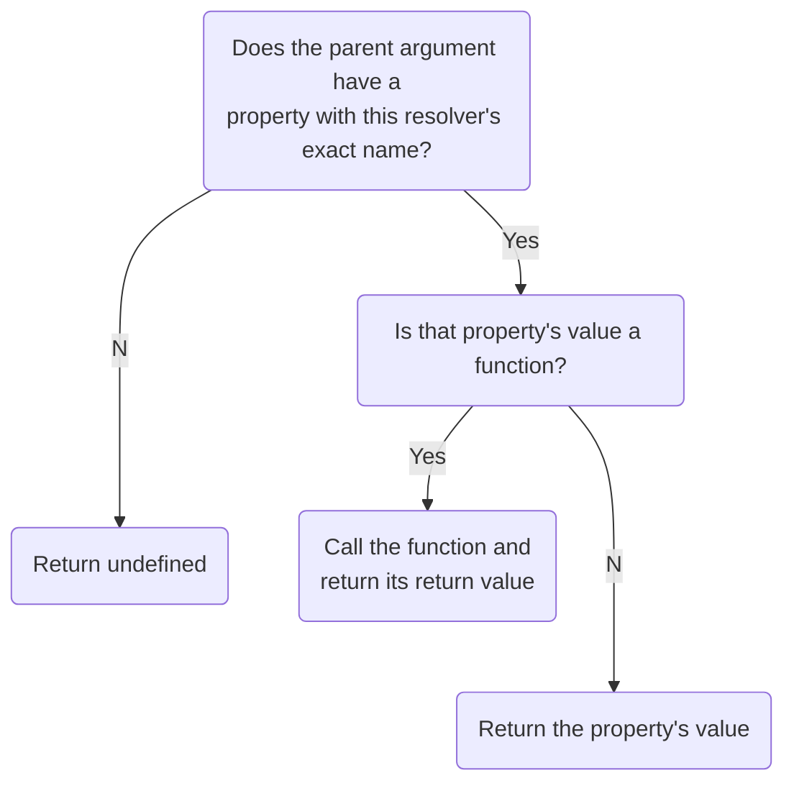

import {
  ExpansionPanel,
} from 'gatsby-theme-apollo-docs/src/components/expansion-panel';

Apollo Server needs to know how to populate data for every field in your schema so that it can respond to requests for that data. To accomplish this, it uses resolvers.

**A resolver is a function that's responsible for populating the data for a single field in your schema.** It can populate that data in any way you define, such as by fetching data from a back-end database or a third-party API.

If you _don't_ define a resolver for a particular field, Apollo Server automatically defines a [default resolver](#default-resolvers) for it.

## Defining a resolver

### Base syntax

Let's say our server defines the following (very short) schema:

```graphql
type Query {
  numberSix: Int! # Should always return the number 6 when queried
  numberSeven: Int! # Should always return 7
}
```

We want to define resolvers for the `numberSix` and `numberSeven` fields of the root `Query` type so that they always return `6` and `7` when they're queried.

Those resolver definitions look like this:

```js
const resolvers = {
  Query: {
    numberSix() {
      return 6;
    },
    numberSeven() {
      return 7;
    }
  }
};
```

#### As this example shows:

* You define all of your server's resolvers in a single JavaScript object (named `resolvers` above). This object is called the **resolver map**.
* The resolver map has top-level fields that correspond to your schema's types (such as `Query` above).
* Each resolver function belongs to whichever type its corresponding field belongs to.

### Handling arguments

Now let's say our server defines the following (slightly longer) schema:

```graphql
type User {
  id: ID!
  name: String
}

type Query {
  user(id: ID!): User
}
```

We want to be able to query the `user` field to fetch a user by its `id`.

To achieve this, our server needs access to user data. For this contrived example, assume our server defines the following hardcoded array:

```js
const users = [
  {
    id: '1',
    name: 'Elizabeth Bennet'
  },
  {
    id: '2',
    name: 'Fitzwilliam Darcy'
  }
];
```

> To learn how to fetch data from an external source (like a database or REST API), see [Data sources](./data-sources/).

Now we can define a resolver for the `user` field, like so:

```js
const resolvers = {
  Query: {
    user(parent, args, context, info) {
      return users.find(user => user.id === args.id);
    }
  }
}
```

#### As this example shows:

* A resolver can optionally accept four positional arguments: `(parent, args, context, info)`.

    _[Learn more about these arguments](#resolver-arguments)_
* The `args` argument is an object that contains all _GraphQL_ arguments that were provided for the field by the GraphQL operation.

> Notice that this example _doesn't_ define resolvers for `User` fields (`id` and `name`). That's because the [default resolver](#default-resolvers) that Apollo Server creates for each of these fields does the right thing: it obtains the value directly from the object returned by the `user` resolver.

## Passing resolvers to Apollo Server

After you define all of your resolvers, you pass them to the constructor of `ApolloServer` (as the `resolvers` property), along with your schema's definition (as the `typeDefs` property).

The following example defines a hardcoded data set, a schema, and a resolver map. It then initializes an `ApolloServer` instance, passing the schema and resolvers to it.

<ExpansionPanel title="Expand example">

```javascript
const { ApolloServer, gql } = require('apollo-server');

// Hardcoded data store
const books = [
  {
    title: 'Harry Potter and the Chamber of Secrets',
    author: 'J.K. Rowling',
  },
  {
    title: 'Jurassic Park',
    author: 'Michael Crichton',
  },
];

// Schema definition
const typeDefs = gql`
  type Book {
    title: String
    author: String
  }

  type Query {
    books: [Book]
  }
`;

// Resolver map
const resolvers = {
  Query: {
    books() {
      return books;
    }
  },
};

// Pass schema definition and resolvers to the
// ApolloServer constructor
const server = new ApolloServer({ typeDefs, resolvers });

// Launch the server
server.listen().then(({ url }) => {
  console.log(`🚀  Server ready at ${url}`);
});
```

</ExpansionPanel>

Note that you can define your resolvers across as many different files and objects as you want, as long as you merge all of them into a single resolver map that's passed to the `ApolloServer` constructor.

## Resolver chains

Whenever a query asks for a field that contains an object type, the query _also_ asks for _at least one field_ of that object (if it didn't, there would be no reason to include the object in the query). A query always "bottoms out" on fields that contain either a scalar or a list of scalars.

Therefore, whenever Apollo Server _resolves_ a field that contains an object type, it always then resolves one or more fields of that object. Those subfields might in turn _also_ contain object types. Depending on your schema, this object-field pattern can continue to an arbitrary depth, creating what's called a **resolver chain**.

### Example

Let's say our server defines the following schema:

```graphql
# A library has a branch and books
type Library {
  branch: String!
  books: [Book!]
}

# A book has a title and author
type Book {
  title: String!
  author: Author!
}

# An author has a name
type Author {
  name: String!
}

type Query {
  libraries: [Library]
}
```

Here's a valid query against that schema:

```graphql
query GetBooksByLibrary {
  libraries {
    books {
      author {
        name
      }
    }
  }
}
```

The resulting resolver chain for this query matches the hierarchical structure of the query itself:



These resolvers execute in the order shown above, passing their return value to the next resolver in the chain via the [`parent` argument](#resolver-arguments).

Here's a code sample that can resolve the query above with this resolver chain:

<ExpansionPanel title="Expand example">

```javascript
const { ApolloServer, gql } = require('apollo-server');

const libraries = [
  {
    branch: 'downtown'
  },
  {
    branch: 'riverside'
  },
];

// The branch field of a book indicates which library has it in stock
const books = [
  {
    title: 'Harry Potter and the Chamber of Secrets',
    author: 'J.K. Rowling',
    branch: 'riverside'
  },
  {
    title: 'Jurassic Park',
    author: 'Michael Crichton',
    branch: 'downtown'
  },
];

// Schema definition
const typeDefs = gql`

# A library has a branch and books
  type Library {
    branch: String!
    books: [Book!]
  }

  # A book has a title and author
  type Book {
    title: String!
    author: Author!
  }

  # An author has a name
  type Author {
    name: String!
  }

  # Queries can fetch a list of libraries
  type Query {
    libraries: [Library]
  }
`;

// Resolver map
const resolvers = {
  Query: {
    libraries() {

      // Return our hardcoded array of libraries
      return libraries;
    }
  },
  Library: {
    books(parent) {

      // Filter the hardcoded array of books to only include
      // books that are located at the correct branch
      return books.filter(book => book.branch === parent.branch);
    }
  },
  Book: {

    // The parent resolver (Library.books) returns an object with the
    // author's name in the "author" field. Return a JSON object containing
    // the name, because this field expects an object.
    author(parent) {
      return {
        name: parent.author
      };
    }
  }

  // Because Book.author returns an object with a "name" field,
  // Apollo Server's default resolver for Author.name will work.
  // We don't need to define one.
};

// Pass schema definition and resolvers to the
// ApolloServer constructor
const server = new ApolloServer({ typeDefs, resolvers });

// Launch the server
server.listen().then(({ url }) => {
  console.log(`🚀  Server ready at ${url}`);
});
```

</ExpansionPanel>

If we now update our query to also ask for each book's `title`:

```graphql{4}
query GetBooksByLibrary {
  libraries {
    books {
      title
      author {
        name
      }
    }
  }
}
```

Then the resolver chain looks like this:



When a chain "diverges" like this, each subchain executes in parallel.

## Resolver arguments

Resolver functions take the following positional arguments, in order:

| Argument  | Description  |
|---|---|
| `parent` | <p>The return value of the resolver for this field's parent (i.e., the previous resolver in the [resolver chain](#resolver-chains)).</p><p>For resolvers of top-level fields with no parent (such as fields of `Query`), this value is obtained from the `rootValue` function passed to [Apollo Server's constructor](/api/apollo-server/#apolloserver).</p>  |
| `args` |  <p>An object that contains all GraphQL arguments provided for this field.</p><p> For example, when executing `query{ user(id: "4") }`, the `args` object passed to the `user` resolver is `{ "id": "4" }`.</p> |
| `context` | <p>An object shared across all resolvers that are executing for a particular operation. Use this to share per-operation state, including authentication information, dataloader instances, and anything else to track across resolvers. </p><p>See [The `context` argument](#the-context-argument) for more information.</p> |
| `info` | <p>Contains information about the operation's execution state, including the field name, the path to the field from the root, and more. </p><p>Its core fields are listed in the [GraphQL.js source code](https://github.com/graphql/graphql-js/blob/master/src/type/definition.js#L917-L928), and it is extended with additional functionality by other modules, like [`apollo-cache-control`](https://github.com/apollographql/apollo-server/tree/570f548b887/packages/apollo-cache-control).</p> |

### The `context` argument

The `context` argument is useful for passing things that any resolver might need, like [authentication scope](https://blog.apollographql.com/authorization-in-graphql-452b1c402a9), database connections, and custom fetch functions. If you're using [dataloaders to batch requests](/data/data-sources/#what-about-dataloader) across resolvers, you can attach them to the `context` as well.

**Resolvers should never destructively modify the `context` argument.** This ensures consistency across all resolvers and prevents unexpected errors.

To provide a `context` to your resolvers, add a `context` initialization function to the `ApolloServer` constructor. This function is called with every request, so you can set the context based on the request's details (such as HTTP headers).

```js

// Constructor
const server = new ApolloServer({
  typeDefs,
  resolvers,
  context: ({ req }) => ({
    authScope: getScope(req.headers.authorization)
  })
}));

// Example resolver
(parent, args, context, info) => {
  if(context.authScope !== ADMIN) throw AuthenticationError('not admin');
  // Proceed
}
```

> The fields of the object passed to your `context` function differ if you're using middleware besides Express. [See the API reference for details.](/api/apollo-server/#apolloserver)

Context initialization can be asynchronous, allowing database connections and other operations to complete:

```js
context: async () => ({
  db: await client.connect(),
})

// Resolver
(parent, args, context, info) => {
  return context.db.query('SELECT * FROM table_name');
}
```

## Return values

A resolver function's return value is treated differently by Apollo Server depending on its type:

| Type  | Description  |
|---|---|
| Scalar / object | <p>A resolver can return a single value or an object, as shown in [Defining a resolver](#defining-a-resolver). This return value is passed down to any nested resolvers via the `parent` argument.</p> |
| `Array` | <p>Return an array if and only if your schema indicates that the resolver's associated field contains a list.</p><p>After you return an array, Apollo Server executes nested resolvers for each item in the array. </p>|
| `null` / `undefined` | <p>Indicates that the value for the field could not be found.</p> <p>If your schema indicates that this resolver's field is nullable, then the operation result has a `null` value at the field's position.</p><p>If this resolver's field is _not_ nullable, Apollo Server sets the field's _parent_ to `null`. If necessary, this process continues up the resolver chain until it reaches a field that _is_ nullable. This ensures that a response never includes a `null` value for a non-nullable field.</p>|
| [`Promise`](https://developer.mozilla.org/en-US/docs/Web/JavaScript/Guide/Using_promises) | <p>Resolvers often perform asynchronous actions, such as fetching from a database or back-end API. To support this, a resolver can return a promise that resolves to any other supported return type.</p> |


## Default resolvers

If you don't define a resolver for a particular schema field, Apollo Server defines a default resolver for it ([see the source](https://github.com/graphql/graphql-js/blob/master/src/execution/execute.js#L1181-L1199)).

The default resolver function uses the following logic:



As an example, consider the following schema excerpt:

```graphql
type Book {
  title: String
}

type Author {
  books: [Book]
}
```

If the resolver for the `books` field returns an array of objects that each contain a `title` field, then you can use a default resolver for the `title` field. The default resolver will correctly return `parent.title`.

## Monitoring resolver performance

As with all code, a resolver's performance depends on its logic. It's important to understand which of your schema's fields are computationally expensive or otherwise slow to resolve, so that you can either improve their performance or make sure you only query them when necessary.

[Apollo Studio](https://www.apollographql.com/docs/graph-manager/) integrates directly with Apollo Server to provide field-level metrics that help you understand the performance of your data graph over time. For more information, see [Analyzing performance](https://www.apollographql.com/docs/graph-manager/performance/).

While developing locally, you can provide `tracing: true` to the `ApolloServer` constructor to enable a tracing panel:

```javascript
const server = new ApolloServer({
  typeDefs,
  resolvers,
  tracing: true,
});
```
