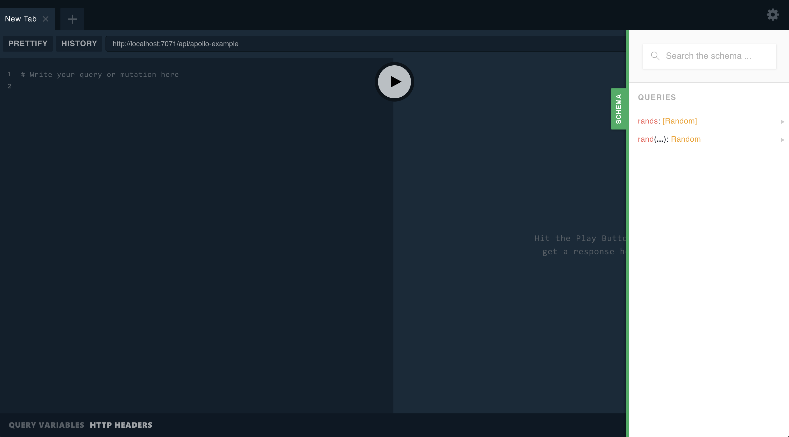
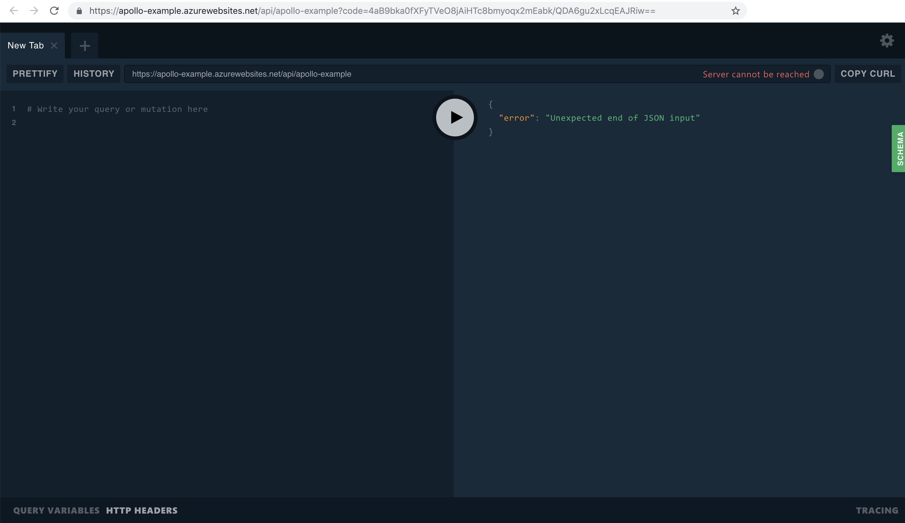
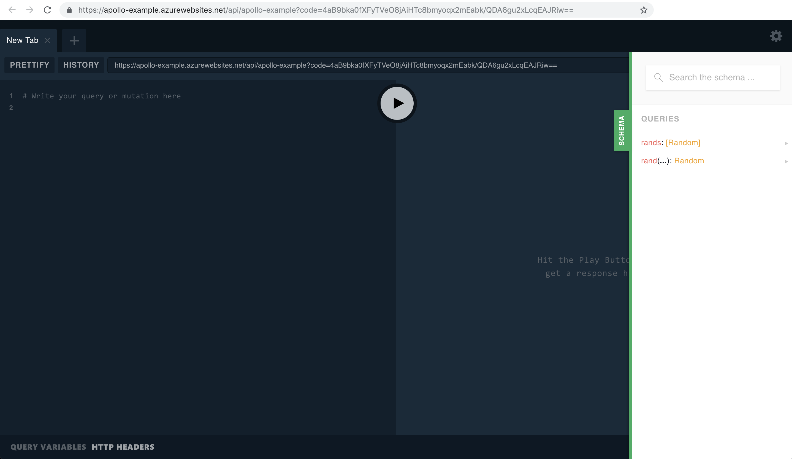

This is the Azure Functions integration for the Apollo community GraphQL Server. [Read Docs](https://www.npmjs.com/package/apollo-server-azure-functions)

All examples below was created using Linux environments, if you are working with Windows-based platforms some commands couldn’t work fine.

## Prerequisites

The following must be done before following this guide:

- Setup an [Azure](https://azure.com) account.
- Install [Azure Functions Core Tools CLI version 2.x](https://docs.microsoft.com/en-us/azure/azure-functions/functions-run-local#v2).
- [Install the Azure CLI 2.0.x](https://docs.microsoft.com/en-us/cli/azure/install-azure-cli?view=azure-cli-latest) to deploy to Azure.

## Setting up the project

We will need to create our local project, installing the node.js dependencies and testing locally to make sure that all process will happen fine.

```shell
func init apollo-example --worker-runtime node
cd apollo-example
func new --template "Http Trigger" --name graphql
```

Now, our project is prepared to start! Run `func host start` command to see the output below.

```shell
Hosting environment: Production
Content root path: /root/apollo-example
Now listening on: http://0.0.0.0:7071
Application started. Press Ctrl+C to shut down.

Http Functions:
        graphql: http://localhost:7071/api/graphql
```

Go to [http://localhost:7071/api/apollo-example?name=Apollo](http://localhost:7071/api/apollo-example?name=Apollo) and verify if the text with the content: **Hello Apollo** is appearing at your browser.

If you would like to remove the `api` from the url structure, set the prefix in your `host.json` file like below:

```json
{
  "version": "2.0",
  "extensions": {
    "http": {
        "routePrefix": ""
    }
  }
}
```

This will make your url look like `http://{my-url}/graphql` like we would expect for most GraphQL projects.

## Sample Code

We will now install the dependencies and test our azure function app using apollo server and graphql. Run the following commands to perform the node.js initialization project and to install the node.js dependencies.

```shell
cd apollo-example
npm init -y
npm install apollo-server-azure-functions graphql
```

Copy the code below and paste at you **index.js** file.

```javascript
const { ApolloServer, gql } = require('apollo-server-azure-functions');

// Construct a schema, using GraphQL schema language
const typeDefs = gql`
  type Query {
    hello: String
  }
`;

// Provide resolver functions for your schema fields
const resolvers = {
  Query: {
    hello: () => 'Hello world!',
  },
};

const server = new ApolloServer({ typeDefs, resolvers });

exports.graphqlHandler = server.createHandler();
```

It is important to set output binding name to **$return** to work correctly at the `function.json` file.

```json
{
  "disabled": false,
  "bindings": [
    {
      "authLevel": "function",
      "type": "httpTrigger",
      "direction": "in",
      "name": "req",
      "methods": [
        "get",
        "post"
      ]
    },
    {
      "type": "http",
      "direction": "out",
      "name": "$return"
    }
  ]
}
```

Finally, we need to return to the base folder and run the `func host start` command again after that, go back to your browser and refresh your page to see the apollo server running.

```shell
func host start
```



## Debugging the project locally in VS Code

### Prerequisites

You will need to install the [Azure Functions](https://marketplace.visualstudio.com/items?itemName=ms-azuretools.vscode-azurefunctions) extension in VS Code (extension is currently in preview from Microsoft).

### Configuring the project

In VS Code, open the root folder of your project and accept dialogs about setting up your project to work with VS Code. You should have one available debug configuration automatically created for you Attach to JavaScript Functions. If not, make sure your launch.json in the .vscode folder is setup correctly to launch the functions runtime:

```json
{
  "version": "0.2.0",
  "configurations": [
    {
      "name": "Attach to JavaScript Functions",
      "type": "node",
      "request": "attach",
      "port": 5858,
      "preLaunchTask": "runFunctionsHost"
    }
  ]
}
```

## Deploying the project to Azure using the Azure CLI

### Setting up resources in Azure for deployment

Before deploying, a new application must be setup. To do this, we need to create some azure requirements. First, you will need a resource group, to create one run the code below on your terminal, where the **--name** is the name for the group and **--location** the region.

```shell
az group create --name apollo-examples --location eastus
```

After creating a resource group, we need to create a storage account to store our code on Azure.

```shell
az storage account create \
    --name apolloexample \
    --location eastus \
    --resource-group apollo-examples \
    --sku Standard_LRS
```

We will publish our application to Azure now using the CLI as well. We need to create a `functionapp` running the following command.

Note: The your function name must be unique.

```shell
az functionapp create \
    --resource-group apollo-examples \
    --name apollo-example \
    --consumption-plan-location eastus \
    --runtime node \
    --storage-account apolloexample
```

### Publishing our project to the function app

After creating a functionapp, it is just to publish our function to azure. The command below could be used to perform releases to all of your functions.

```shell
func azure functionapp publish apollo-example
```

```shell
Getting site publishing info...
Preparing archive...
Uploading 4.45 MB [###############################################################################]
Upload completed successfully.
Deployment completed successfully.
Syncing triggers...
Functions in apollo-example:
    graphql - [httpTrigger]
        Invoke url: https://apollo-example.azurewebsites.net/graphql?code=4aB9bka0fXFyTVeO8jAiHTc8bmyoqx2mEabk/QDA6gu2xLcqEAJRiw==
```

Finally, going to the Invoke URL shown at the output above, we will see our result.

Note: When GraphQL Playground starts, It won't have the correct URL containing the security `code`, and a message **"Server cannot be reached"** as shown at your browser.



We just need to put the full URL that includes the security `code` in the Playground url box. The background polling should refresh the screen momentarily. Click the **Schema** button to see if the docs are loaded correctly as the image below.



### Cleaning Up

After complete this tutorial, you can delete all resources at your Azure platform by removing the **az group**. We can delete manually each resource using the following commands:

```shell
az functionapp delete \
    --resource-group apollo-examples \
    --name apollo-example

az storage account delete \
    --name apolloexample \
    --resource-group apollo-examples \
    --yes

az group delete \
    --name apollo-examples \
    --yes
```

## Deploying to Azure from VS Code

It is also possible to publish your project from VS Code using the Azure Functions Extension, we recommend referring to [Microsoft's documentation on publishing to Azure from VS Code](https://docs.microsoft.com/en-us/azure/azure-functions/functions-create-first-function-vs-code#publish-the-project-to-azure).

Once deployment is complete, view the output in VS Code and you should be able to see the url of your GraphQL endpoint. It will look something like **https://our-graphql-project.azurewebsites.net/api/graphql**. Navigate to the url and you should find GraphQL Playground.

Note: When GraphQL Playground starts, It won't have the correct URL containing the security `code`, and a message **"Server cannot be reached"** as shown at your browser.


We just need to put the full URL that includes the security `code` in the Playground url box. The background polling should refresh the screen momentarily. Click the **Schema** button to see if the docs are loaded correctly as the image below.

Need more details? See the [Docs](https://www.npmjs.com/package/apollo-server-azure-functions)
 at the NPM repository.

See ya!
