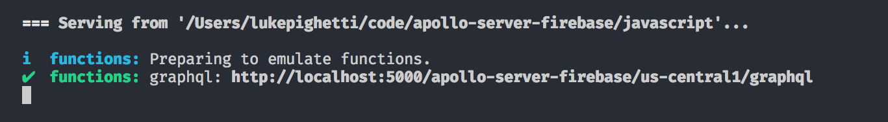
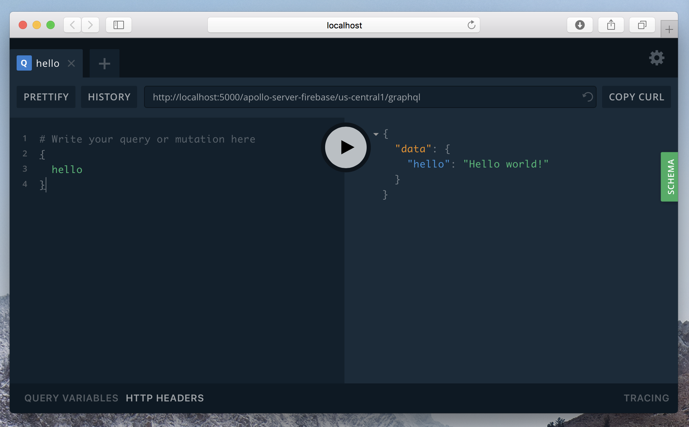
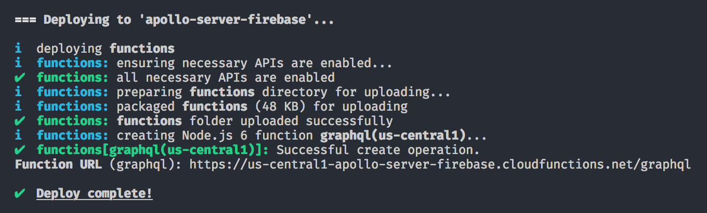
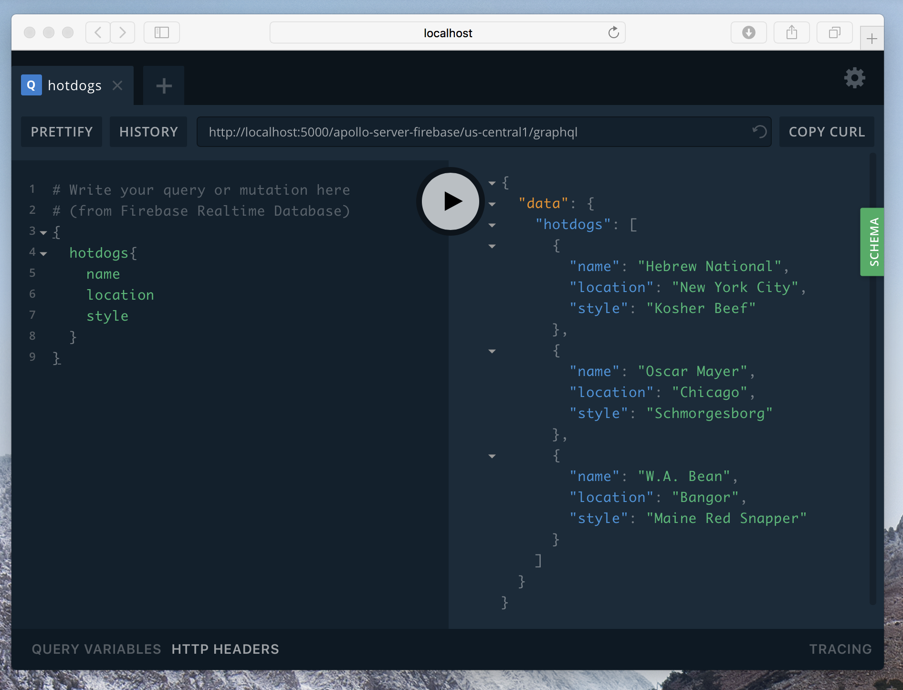

[Firebase](https://firebase.google.com) is a service that provides developers with a collection of tools including serverless cloud functions. Cost is based on the compute time that is consumed, and there is no charge when code is not running.

This guide explains how to setup Apollo Server 2 to run on Firebase Cloud Functions.

## Prerequisites

The following must be done before following this guide:

- [Setup a Firebase Account](https://firebase.google.com)
- [Setup a Firebase Project](https://console.firebase.google.com)
- [Install the Firebase CLI and login](https://firebase.google.com/docs/cli/)


## Setting up your project

Initialize a local Firebase project, selecting `Functions` and your existing project when prompted. This tutorial uses JavaScript.

```
firebase init
```


Install required dependencies.

```
cd functions
npm install apollo-express graphql express
```

## Craft your Cloud Function

```
// index.js
const functions = require("firebase-functions");
const express = require("express");

const { ApolloServer, gql } = require("apollo-server-express");

// Construct a schema, using GraphQL schema language
const typeDefs = gql`
  type Query {
    hello: String
  }
`;

// Provide resolver functions for your schema fields
const resolvers = {
  Query: {
    hello: () => "Hello world!"
  }
};

// setup Cloud Function
const app = express();
const server = new ApolloServer({ typeDefs, resolvers });
server.applyMiddleware({ app, path: "/", cors: true });

exports.graphql = functions.https.onRequest(app);
```

### Run development server with Firebase CLI

Start a development server to access GraphiQL and a development endpoint.

```
firebase serve
```




Follow the link provided in the command line, make sure the endpoint is correct, and make a query!



*NOTE: On first load, GraphiQL may not show the correct endpoint. Paste the link into GraphiQL's address bar to connect.*


### Deploy to Firebase Cloud Functions

When you're ready to deploy, do so!

```
firebase deploy
```




Your production GraphQL endpoint will be shown in your console on your first deployment, after that it will be shown in the Functions section of your project console in [Firebase Console]()

You can test that the endpoint is functioning by passing it a raw query

Test request
```
https://us-central1-apollo-server-firebase.cloudfunctions.net/graphql/?query={hello}
```

Response
```
{"data":{"hello":"Hello world!"}}
```

*Note: introspection is only available on the development server by default*


**Congratulations!**
You now have GraphQL running on Firebase Cloud Functions!


## Querying Realtime Database

A GraphQL endpoint is only as useful as the data it can provide. You can write resolvers fetching data from a Firebase Database, such as Realtime Database or Cloud Firestore. This will require the use of [Firebase Admin SDK](https://firebase.google.com/docs/admin/setup) and the proper credentials. 

If you have experience with this method of fetching data from Firebase services, you will find that the only thing you need to do is write a simple resolver.

An example of a Realtime Database resolver is as follows.

```
// index.js
const admin = require("firebase-admin");
const functions = require("firebase-functions");
const express = require("express");

admin.initializeApp();

const { ApolloServer, gql } = require("apollo-server-express");

// Construct a schema, using GraphQL schema language
const typeDefs = gql`
  type Hotdog {
    isKosher: Boolean
    location: String
    name: String
    style: String
    website: String
  }
  type Query {
    hotdogs: [Hotdog]
  }
`;

// Provide resolver functions for your schema fields
const resolvers = {
  Query: {
    hotdogs: () =>
      admin
        .database()
        .ref("hotdogs")
        .once("value")
        .then(snap => snap.val())
        .then(val => Object.keys(val).map(key => val[key]))
  }
};

// setup express cloud function
const app = express();
const server = new ApolloServer({ typeDefs, resolvers });
server.applyMiddleware({ app, path: "/", cors: true });

exports.graphql = functions.https.onRequest(app);
```

We can now query Realtime Database as expected, grabbing only what we need.



