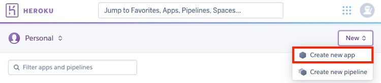
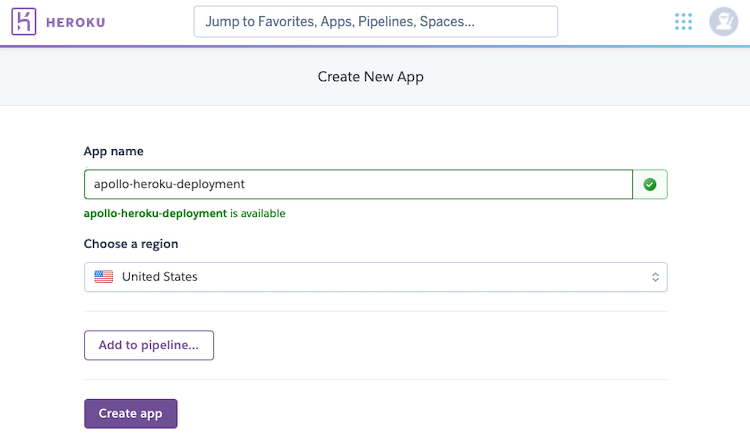
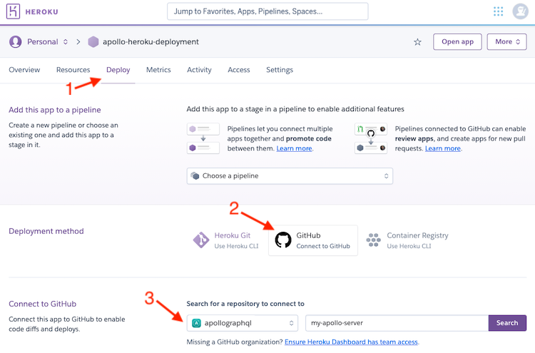
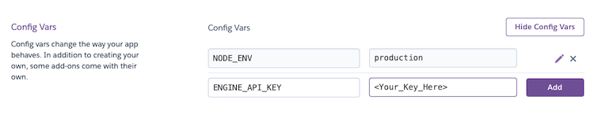

Heroku is a common platform-as-a-service solution that enables you to deploy Apollo Server and have a running GraphQL endpoint in a matter of minutes.

## Prerequisites

Make sure you've completed the following before proceeding with this guide:

- [Get started with Apollo Server](../getting-started)
- [Create a Heroku account](https://heroku.com)

In addition, to help you [push to Heroku manually](./heroku/#deploying-with-git) from the command line:

- [Install the Heroku CLI](https://devcenter.heroku.com/articles/heroku-cli)

> Note that the Heroku operations covered in this article can also be performed with the [Heroku CLI](https://devcenter.heroku.com/articles/heroku-cli). See the [Heroku CLI documentation](https://devcenter.heroku.com/categories/command-line) for more detailed help.

## Set up a new Heroku application

First, create a new application from your [Heroku dashboard](https://dashboard.heroku.com/apps) by clicking the **Create new app** button in the top right:

</img>

Choose a name your app (this will be your `<HEROKU_APP_NAME>`) and click **Create app**.

</img>

## Setting up the project

For Heroku, you can set up your project using Apollo Server's core library or any of its [supported middleware](../integrations/middleware) (such as Express or Hapi).

### Manually setting the port

When deployed to Heroku, your server _must_ `listen` on the port specified by the `PORT` environment variable (which is set by Heroku itself). Otherwise, your server will not receive requests and will time out.

The following example server `listen`s on the port specified by `process.env.PORT` and defaults to `4000` if none is specified:

```js
server.listen({ port: process.env.PORT || 4000 }).then(({ url }) => {
  console.log(`
    🚀  Server is ready at ${url}
    📭  Query at https://studio.apollographql.com/dev
  `);
});
```

### Adding a Procfile

By default, Heroku apps look for a [Procfile](https://devcenter.heroku.com/articles/procfile) in your root directory that contains commands run by the app on startup. For a basic Apollo Server application, this file should at least contain a line similar to the following:

```shell:title=Procfile
web: node index.js
```

Replace `node index.js` with whichever command you use to start your Apollo Server instance.

> A Procfile is not _required_ to run Apollo Server on Heroku. If you don't provide a Procfile, attempts to run the `start script` that's defined in your `package.json` file.

## Deploying the project

There are a couple ways to push projects to Heroku:

- Manually with [Heroku CLI](https://devcenter.heroku.com/articles/heroku-cli)
- Automatically via GitHub integration

### Deploying with Git

Again, make sure you have [Heroku CLI](https://devcenter.heroku.com/articles/heroku-cli) installed. Then, log into the Heroku CLI from your terminal.

```shell
$ heroku login
```

After you have successfully logged in, navigate to the **root directory of your project** and run:

```shell
$ git init # existing git repositories can skip this
$ heroku git:remote -a <HEROKU_APP_NAME>

$ git add .
$ git commit -m "initial apollo server deployment"
$ git push heroku # specify your branch name, if necessary
```

After deployment completes, your Apollo Server project is up and running! You can send a query to your Heroku-hosted GraphQL endpoint at `<HEROKU\_APP\_NAME>.herokuapp.com`.

Some things to note:
- `git push heroku` does _not_ push to your `origin` remote or any other remote. You must run `git push` again separately.
- By default, Heroku sets the `NODE_ENV` variable to `production`. If you wish to change this, run this command in your project directory:

    ```shell
    $ heroku config:set NODE_ENV=development
    ```

    Alternatively, you can [configure environment variables](./heroku/#configuring-environment-variables) through the Heroku dashboard.

- Remember that [GraphQL Playground](../testing/graphql-playground) is disabled by default when Apollo Server is in a production environment.

### Automatically deploying with GitHub

If your project is already pushed to GitHub, you might prefer to set up automatic deployments from the project's repository.

From your Heroku dashboard, select the app that you want to deploy from GitHub.

Then from the app's detail page, select the **Deploy** tab. On that tab, you can choose a deployment method and configure the app to integrate with GitHub:

</img>

## Configuring environment variables

To enable the production mode of Apollo Server, you need to set the `NODE_ENV` variable to `production`. To ensure you have visibility into your GraphQL performance in Apollo Server, you'll want to add the `APOLLO_KEY` environment variable to Heroku. For the API key, log in to [Apollo Studio](https://studio.apollographql.com) and navigate to your graph or create a new one.

Under your Heroku app's Settings tab, click **Reveal Config Vars**. Next, set `NODE_ENV` to `production` and copy your graph API key from [Apollo Studio](http://studio.apollographql.com/) as the value for `APOLLO_KEY`.



Send a query to your Heroku app's GraphQL service at **<HEROKU\_APP\_NAME>.herokuapp.com** and then check out the tracing data in [Apollo Studio](http://studio.apollographql.com/).
