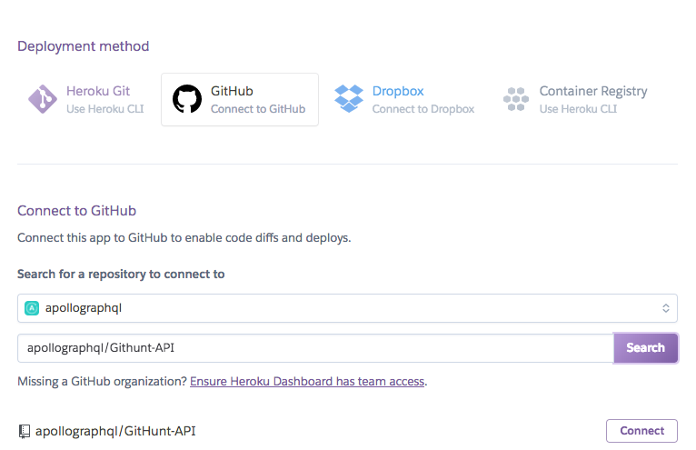

Heroku is a common Platform as a Service that allows you to deploy your Apollo Server and have a functional GraphQL endpoint.


<h3 id="configure-heroku" title="Configure Heroku">1. Create and set up a new Heroku application</h3>

Log into the [Heroku dashboard](https://dashboard.heroku.com/apps). Then click “New” > “Create New App” in the top right. The name you choose will be used later in this tutorial as <HEROKU_APP_NAME>, so be sure to replace it in the later sections.

<div style="text-align:center">

<br></br>
</div>

Name your app and hit “Create app”

<div style="text-align:center">

<br></br>
</div>

<h3 id="deploy" title="Deploy with Heroku Push">2. Push project to Heroku</h3>

Install the [Heroku Cli](https://devcenter.heroku.com/articles/heroku-cli), then inside of your project, run:

```shell
$ git init #existing git repositories can skip this
$ heroku git:remote -a <HEROKU_APP_NAME>

$ git add .
$ git commit -am "make it better"
$ git push heroku master
```

Send a query to your GraphQL service at your Heroku Application at `<HEROKU_APP_NAME>.herokuapp.com`

> Note: If you are using a project pushed to GitHub, you may want to setup automatic deployments from your repository, which you can do by following the steps in [this section](#github-deploy).

<h3 id="env-vars" title="Environment variables">3. Configure environment variables</h3>

In order to enable the production mode of Apollo Server, you will need to set the `NODE_ENV` variable to production. To ensure you have visibility into your GraphQL performance in Apollo Server, you'll want to add the `ENGINE_API_KEY` environment variable to Heroku. For the API key, log into the [Engine UI](https://engine.apollographql.com) and navigate to your service or create a new one.

Then under the “Settings” tab, click “Reveal Config Vars". Next set `NODE_ENV` to `production` and copy your key from the [Engine UI](http://engine.apollographql.com/) as the value for `ENGINE_API_KEY`.

<div style="text-align:center">

<br></br>
</div>

Send a query to your GraphQL service at your Heroku Application at `<HEROKU_APP_NAME>.herokuapp.com` and then check out the tracing data in the [Engine UI](http://engine.apollographql.com/).

> If you would like your GraphQL service to be exposed on a different port, you can also add a PORT environment variable.

<h3 id="github-deploy" title="Github Deploy">Deploying directly from GitHub</h3>

If you have your project published to github, you are able to setup Heroku to perform automatic deployments from branch. If you have pushed your project GitHub, you may select a branch in your repository that will trigger deploys.

<div style="text-align:center">

<br></br>
</div>

