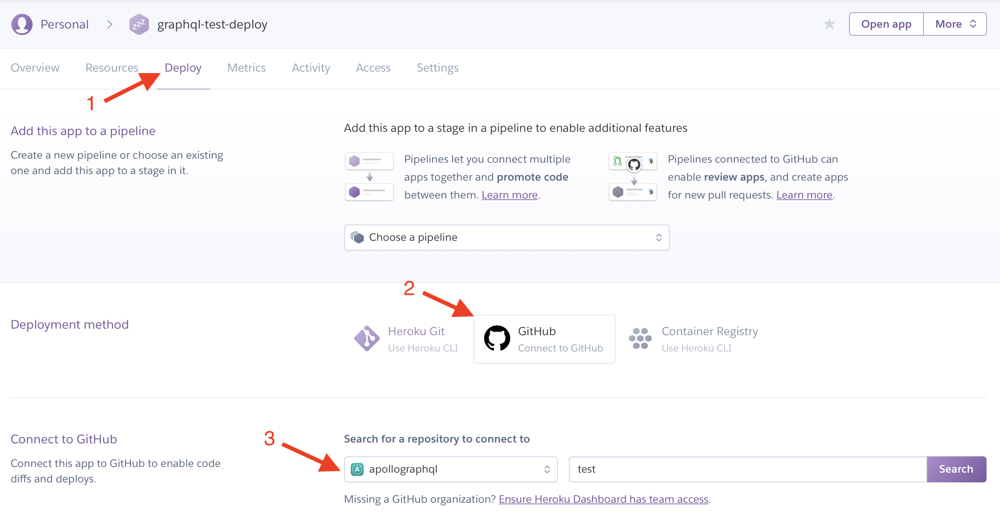

Heroku is a common Platform as a Service solution that allows users to deploy and have a functioning GraphQL endpoint running in a matter of minutes.

## Prerequisites

The following must be done before following this guide:

- Setup a [Heroku](https://heroku.com) account
- [Install the Heroku CLI](https://devcenter.heroku.com/articles/heroku-cli) if pushing to Heroku manually (see below)

## Set up a new Heroku application

Before deploying, a new application must be set up. To do this, log in to the [Heroku dashboard](https://dashboard.heroku.com/apps). Then click `New > Create New App` in the top right. The name you choose will be referred to later as `<HEROKU_APP_NAME>`, so be sure to replace it in the later sections.


Name your app and click "Create app"


## Setting up the project

For Heroku, projects can be set up using any of the `apollo-server` HTTP variants (like express, hapi, etc).

The only special consideration that needs to be made is to allow Heroku to choose the port that the server is deployed to. Otherwise, there may be errors, such as a request timeout.

To configure `apollo-server` to use a port defined by Heroku at runtime, the `listen` function in your setup file can be called with a port defined by the `PORT` environment variable:

```
server.listen({ port: process.env.PORT || 4000 }).then(({ url }) => {
  console.log(`🚀 Server ready at ${url}`);
});
```

## Deploying the project

There are a couple of ways to push projects to Heroku. Automatically, with GitHub integration, or manually using `git push`.

### Deploying with Git

Install the [Heroku CLI](https://devcenter.heroku.com/articles/heroku-cli), then inside of your project, run:

```shell
$ git init #existing git repositories can skip this
$ heroku git:remote -a <HEROKU_APP_NAME>

$ git add .
$ git commit -am "make it better"
$ git push heroku # Specify your branch name, if necessary.
```

Send a query to your GraphQL service at your Heroku Application at `<HEROKU_APP_NAME>.herokuapp.com`

### Automatically deploying with GitHub

If the project is already pushed to GitHub, it may be easier to setup automatic deployments from the project's repository.

On the Heroku dashboard, click on the name of the app that will be deployed from GitHub.

Then, on the app detail page, there is a tab bar at the top, with a "Deploy" option. On that page, the deployment method can be chosen and configured to integrate with GitHub.



## Configuring environment variables

To enable the production mode of Apollo Server, you need to set the `NODE_ENV` variable to `production`. To ensure you have visibility into your GraphQL performance in Apollo Server, you'll want to add the `APOLLO_KEY` environment variable to Heroku. For the API key, log in to [Apollo Studio](https://studio.apollographql.com) and navigate to your graph or create a new one.

Under the Settings tab, click **Reveal Config Vars**. Next, set `NODE_ENV` to `production` and copy your graph API key from [Apollo Studio](http://studio.apollographql.com/) as the value for `APOLLO_KEY`.


Send a query to your Heroku app's GraphQL service at `<HEROKU_APP_NAME>.herokuapp.com` and then check out the tracing data in [Apollo Studio](http://studio.apollographql.com/).
