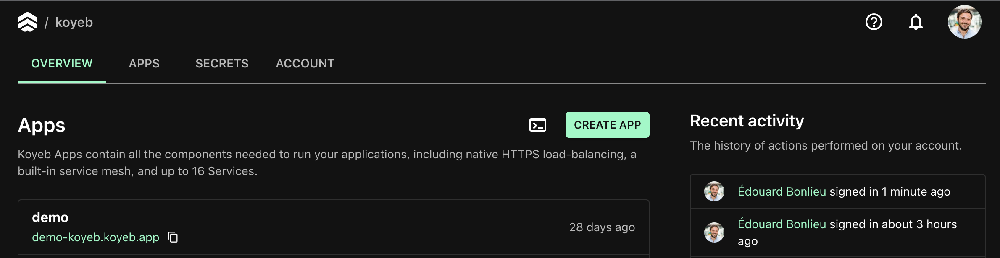
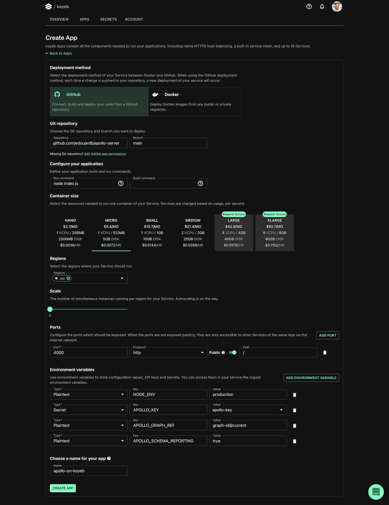

Koyeb is a developer-friendly serverless platform to deploy apps globally. The platform lets you seamlessly run Docker containers, web apps, and APIs with git-based deployment, native autoscaling, a global edge network, and built-in service mesh and discovery.

This guide explains how to deploy Apollo Server and have a running GraphQL endpoint on Koyeb using the built-in git continuous deployment.

## Prerequisites

To successfully complete this guide, make sure you have completed the following:

- [Get started with Apollo Server](../getting-started)
- [Create a Koyeb account](https://www.koyeb.com)
- Pushed the project to a GitHub repository

> Note that the action covered in this article can also be performed using the [Koyeb CLI](https://www.koyeb.com/docs/quickstart/koyeb-cli). Check out the [Koyeb CLI Reference](https://www.koyeb.com/docs/cli/reference) to discover how to use them to interact with the Koyeb platform directly from the terminal.

## Deploying the project

In this guide, we will deploy the project you created in the [Get started with Apollo Server](../getting-started) on Koyeb using the built-in git continuous deployment. With this feature, a new deployment of your application is triggered each time you push changes to the production branch of your GitHub repository.

Koyeb will promote your deployment once all health checks succeed. Once deployed, your application will benefit from automatic HTTPS (SSL), auto-healing, and global load-balancing across our edge network with zero configuration.

On the Koyeb [control panel](https://app.koyeb.com), click the **Create App** button:

</img>

You land on the Koyeb app creation page, where you are asked to provide information about the project you want to deploy.

1. Select GitHub as the deployment method and select the repository containing your Apollo Server project and branch
2. In the **Configure your application** section set the **run command** to `node index.js`. This command is required to let Koyeb know how to launch your application
3. Select the resources needed to run your project. In this guide, we will use the **NANO** container size
4. Select the regions you want to deploy your project. We will keep the default, **Paris**
5. In the **Ports** section, change the export port from `8080` to `4000`. This setting is required to let Koyeb know which port your application is listening to and adequately route incoming HTTP requests. We don't need to change the Path. Our application will be available at the root of our domain: `/`.
6. In the **Environment variables** section:
   - Add a new environment variable `NODE_ENV` with `production` as a value to run the Apollo Server in production mode
   - Create another environment variable `APOLLO_KEY` of type **Secret** to securely store your graph API key from [Apollo Studio](http://studio.apollographql.com/)
   - To enable usage reporting add an environment variable `APOLLO_GRAPH_REF` with for value `<your-graph-id>@y<your-graph-variant>` and another one `APOLLO_SCHEMA_REPORTING` with `true` as a value
7. Give your Koyeb App a name, e.g. `apollo-server-on-koyeb`
8. Click the **Create App** button

</img>

 You land on the deployment page, where you can follow your application deployment progress. Once the build and deployment are completed, you can access your application by clicking the App URL ending with `koyeb.app` in the Koyeb control panel.

 You can then send a query to your Koyeb-hosted GraphQL endpoint: `<KOYEB_APP_NAME>-<KOYEB_ORGANIZATION_NAME>.koyeb.app` and then check out the tracing data in [Apollo Studio](http://studio.apollographql.com/).
