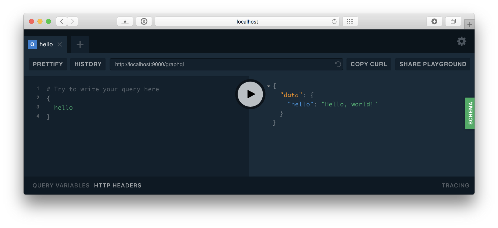
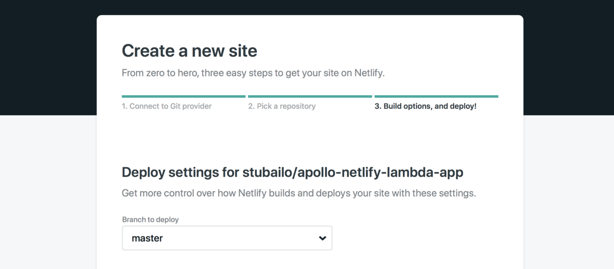
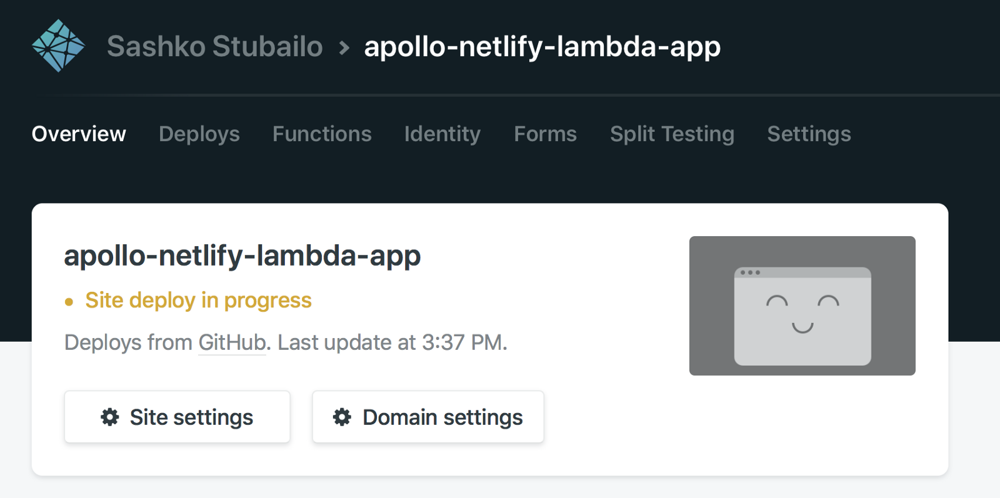

[Netlify Functions](https://www.netlify.com/docs/functions/) allow deploying server-side code, directly from GitHub, to AWS Lambda.  This guide demonstrates how to use Netlify Functions to deploy a GraphQL server and reference the server in Apollo Client. Some benefits of Netlify Functions include:

1. Use the same platform to deploy your frontend and API code.
2. Deploy previews of both your frontend and API on every pull request.
3. No need to worry about scaling containers due to a "serverless" infrastructure.

In the following sections, we'll set up a "Hello World" API and frontend for an Apollo app on Netlify. Let's get started!

## Download and Run the Netlify Starter Kit

Download and run the [official Netlify `create-react-app` and Lambda starter kit](https://github.com/netlify/create-react-app-lambda). This will set us up with a base for our frontend and API code.

```bash
git clone https://github.com/netlify/create-react-app-lambda.git
cd create-react-app-lambda
npm install
```

Let’s take a quick look at the file structure here:

* **package.json:** This application's dependencies, shared between client and server code. You can also split them up into separate directories later, depending on your preference.
* **netlify.toml:** The configuration for Netlify.
* **src/:** The source code for the React frontend app.
* **src/lambda/:** The server source code that will be deployed to Netlify Functions.

In `package.json`, you'll find scripts to run the frontend and lambda code:

```js
"scripts": {
  "start": "react-scripts start",
  "start:lambda": "netlify-lambda serve src/lambda",
  "build": "react-scripts build",
  "build:lambda": "netlify-lambda build src/lambda",
}
```

Run the code to see that everything is working. We have to open two terminal windows to run the frontend and functions at the same time:

```bash
# In the first terminal, run the local development server.
# This emulates the Netlify Functions runtime environment.
npm run start:lambda
# In the second terminal, start the React frontend application.
npm start
```

If everything looks like it started correctly, let's add a GraphQL API with Apollo Server!

### Set up Apollo Server

Netlify Functions run on AWS Lambda, so we can use the `apollo-server-lambda` package to easily integrate Apollo Server for our API layer. Let’s install the packages we need for that:

```bash
npm install --save apollo-server-lambda graphql
```

Now, we can create a "Hello world" GraphQL API. Let's put that in a new file in the `lambda` folder, at `src/lambda/graphql.js`:

```js
// src/lambda/graphql.js
const { ApolloServer, gql } = require("apollo-server-lambda");

const typeDefs = gql`
  type Query {
    hello: String
  }
`;

const resolvers = {
  Query: {
    hello: (parent, args, context) => {
      return "Hello, world!";
    }
  }
};

const server = new ApolloServer({
  typeDefs,
  resolvers
});

exports.handler = server.createHandler();
```

Now, make sure you've run `npm run start:lambda`, and navigate to `localhost:9000/graphql` in your browser. You should see GraphQL Playground, where you can run queries against your API!

<div style="text-align:center">

<br></br>
</div>

If you can see GraphQL Playground and run a simple query, you've done everything properly. Now, let's add Apollo Client to the frontend.

### Add endpoint to Apollo Client

The starter kit is set up so that requests that start with `.netlify/functions` are automatically redirected to the Lambda functions in our project. Since our API is defined with the filename `graphql.js`, we can call it with `.netlify/functions/graphql` from our frontend.

```js
// src/App.js
import ApolloClient from "apollo-boost";
const client = new ApolloClient({
  uri: "/.netlify/functions/graphql"
});
```

> For more information, take a look at the [Getting Started Guide for React](docs/react/essentials/get-started)

### Deploy to Netlify

Netlify can deploy automatically from a linked GitHub repository, so we'll use that technique for the rest of this tutorial which will allow each `git push` to automatically deploy. To enable this, first [create a new, empty repository on GitHub](https://help.github.com/articles/create-a-repo/).

To start the project, we cloned the Netlify starter kit. If we want the local repository to point to our new GitHub repo instead of the starter kit, we need to change the `origin`, like this:

```bash
# Replace the following URL with the appropriate URL obtained when
# creating the new GitHub repository in the previous step!
git remote set-url origin git@github.com:username/repository.git
```

Now, commit and push:

```bash
git add .
git commit -m "Add Apollo Server and Client"
git push -u origin master
```

Check the repository to make sure the code showed up.

[Sign up for a Netlify account](https://app.netlify.com/) if you don’t have one yet. Then, make a new site, and select the right repository:

<div style="text-align:center">

<br></br>
</div>

The starter kit came with a `netlify.toml` configuration file, so we don’t have to change any settings in the UI. Just continue to the deploy step right away.

<div style="text-align:center">

<br></br>
</div>

Wait for it to deploy, and in the meanwhile you can set a custom name for your app. Once it’s done, you’re live!

The best part is, you don’t need to do anything special to scale this up. Since the frontend is running on Netlify’s CDN and the API is a serverless function on Lambda, you don’t have to worry about adding or removing servers.
