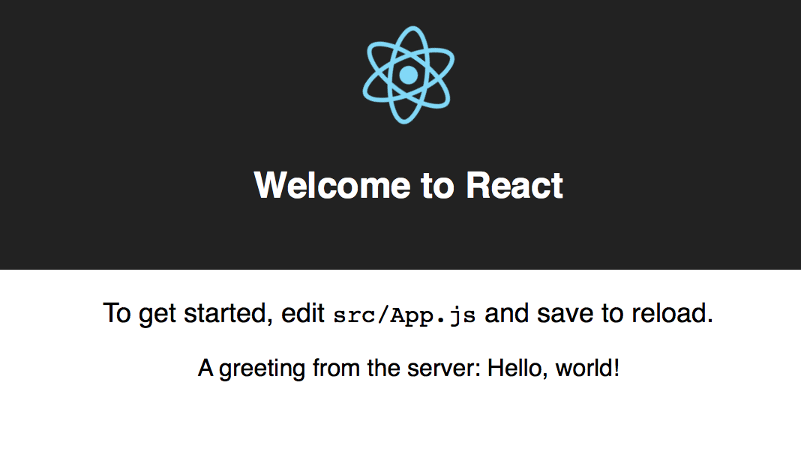

[Netlify functions](https://www.netlify.com/docs/functions/), is a new way to deploy server-side code to AWS Lambda alongside your frontend, right from GitHub. In this guide, I'll show you why Netlify's functions is a great way to run your whole Apollo app.

1. Use the same platform to deploy your frontend and API code.
2. Deploy previews of both your frontend and API on every pull request.
3. No need to worry about scaling containers due to a serverless architecture.

We'll set up a "Hello World" API and frontend for an Apollo app on Netlify. Let's get started!

## Download and Run the Netlify Starter Kit

Download and run the [official Netlify create-react-app and Lambda starter kit](https://github.com/netlify/create-react-app-lambda). This will set us up with a base for our frontend and API code.

```bash
git clone https://github.com/netlify/create-react-app-lambda.git
cd create-react-app-lambda
npm install
```

Let’s take a quick look at the file structure here:

* **package.json:** our dependencies, shared between client and server code. You can also split them up into separate directories later, depending on your preference.
* **netlify.toml:** configuration for Netlify and the Netlify functions.
* **src/:** code for our React app.
* **src/lambda/:** code that will be deployed to Lambda by Netlify.

In `package.json`, you’ll find scripts to run the frontend and lambda code:

```js
"scripts": {
  "start": "react-scripts start",
  "start:lambda": "netlify-lambda serve src/lambda",
  "build": "react-scripts build",
  "build:lambda": "netlify-lambda build src/lambda",
}
```

Run the code to see that everything is working. We have to open two terminal windows to run the frontend and functions at the same time:

```bash
# In the first terminal
npm run start:lambda
# In the second terminal
npm start
```

If everything looks like it started correctly, let’s add a GraphQL API with Apollo Server!

### Setting up Apollo Server

Netlify functions run on AWS Lambda, so we can use the `apollo-server-lambda` package to easily integrate Apollo Server for our API layer. Let’s install the packages we need for that:

```bash
npm install --save apollo-server-lambda graphql
```

Now, we can create a “Hello world” GraphQL API. Let’s put that in a new file in the lambda folder, at `src/lambda/graphql.js`:

```js
// src/lambda/graphql.js
const { ApolloServer, gql } = require("apollo-server-lambda");

const typeDefs = gql`
  type Query {
    hello: String
  }
`;

const resolvers = {
  Query: {
    hello: (root, args, context) => {
      return "Hello, world!";
    }
  }
};

const server = new ApolloServer({
  typeDefs,
  resolvers
});

exports.handler = server.createHandler();
```

Now, make sure you’ve run `npm run start:lambda`, and navigate to `localhost:9000/graphql` in your browser. You should see GraphQL Playground, where you can run queries against your API!

<div style="text-align:center">

<br></br>
</div>

If you can see GraphQL Playground and run a simple query, you’ve done everything properly! It’s pretty neat that getting an API up and running was just a few lines of code. Now let’s add Apollo to our frontend.

### Adding Apollo Client to React

Open up `src/App.js`. Let’s convert this file to load a simple query from the API we just set up. First, let’s install Apollo Client and the React integration, and we’ll use the `apollo-boost` package to get started easily:

```bash
npm install --save apollo-boost react-apollo
```

Now, add some code to initialize Apollo Client:

```js
// src/App.js
import ApolloClient from "apollo-boost";
const client = new ApolloClient({
  uri: "/.netlify/functions/graphql"
});
```

The way that the starter kit and Netlify are set up, any requests that start with `.netlify/functions` are automatically redirected to the Lambda functions in our project. So since we created our API with the filename `graphql.js`, we can call it with `.netlify/functions/graphql` from our frontend.

Let’s replace the LambdaDemo component from the starter kit with a new one that uses Apollo to query our API:

```js
import { gql } from "apollo-boost";
import { ApolloProvider, Query } from "react-apollo";
// Replace the previous LambdaDemo with the code below:
const LambdaDemo = () => (
  <ApolloProvider client={client}>
    <Query
      query={gql`
        {
          hello
        }
      `}
    >
      {({ data }) =>
        <div>A greeting from the server: {data.hello}</div>}
    </Query>
  </ApolloProvider>
);
```

If we’ve got everything set up correctly, we’ll see the greeting that we wrote in our resolver show up in the frontend:

<div style="text-align:center">

<br></br>
</div>

Sweet, now we’ve connected our client to our API, and the only thing left is to deploy it! We can deploy both our frontend and API to Netlify in just one step.

### Deploying to Netlify

The best way to deploy to Netlify is to set it up to deploy automatically from a GitHub repository. Therefore, create a new repository and push the code there.

To start the project, we cloned the Netlify starter kit. If we want the local repository to point to our new GitHub repo instead of the starter kit, we need to change the `origin`, like this:

```bash
# Replace the URL with the one to your repository, example:
git remote set-url origin git@github.com:stubailo/apollo-netlify-lambda-app.git
```

Now, commit and push:

```bash
git add .
git commit -m "Add Apollo Server and Client"
git push -u origin master
```

Check the repository to make sure the code showed up.

[Sign up for a Netlify account](https://app.netlify.com/) if you don’t have one yet. Then, make a new site, and select the right repository:

<div style="text-align:center">

<br></br>
</div>

The starter kit came with a `netlify.toml` configuration file, so we don’t have to change any settings in the UI. Just continue to the deploy step right away.

<div style="text-align:center">

<br></br>
</div>

Wait for it to deploy, and in the meanwhile you can set a custom name for your app. Once it’s done, you’re live!

The best part is, you don’t need to do anything special to scale this up. Since the frontend is running on Netlify’s CDN and the API is a serverless function on Lambda, you don’t have to worry about adding or removing servers.