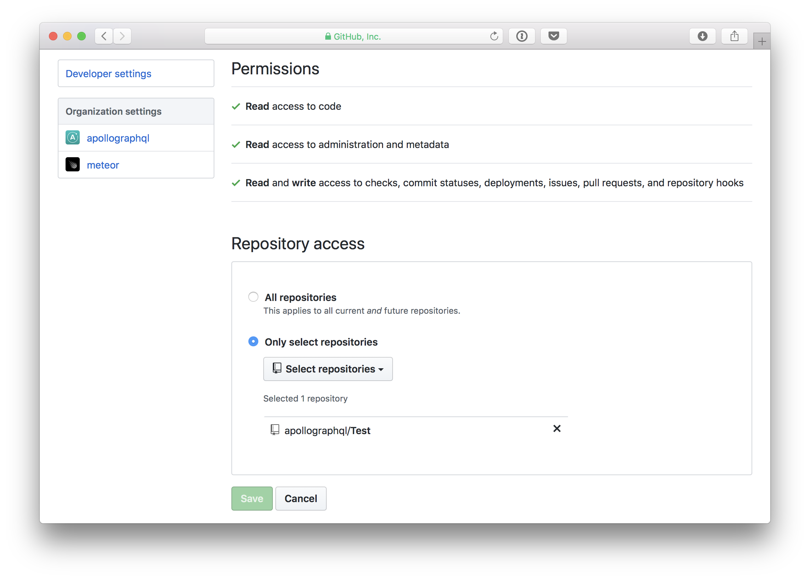

[Now](https://zeit.co/now) is a service by Zeit that allows the deployment of an instance of Apollo Server, quickly providing a functional GraphQL endpoint.

## Prerequisites

- A [Now](https://zeit.co/now) account
- The [Now CLI](https://zeit.co/download#now-cli) (unless using [automatic GitHub deployments](#automatic-github-deploys))

## Setting up the project

Deployment to [Now](https://zeit.co/now) for Node.js apps requires a `package.json` file to be present in the app's root directory.

```js
{
  "name": "graphqlservice",
  "version": "1.0.0",
  "scripts": {
    "start": "nodemon index.js"
  },
  "dependencies": {
    "apollo-server": "^2.0.0-rc.5",
    "graphql": "^0.13.2",
    "nodemon": "^1.17.5"
  }
}
```

[Now](https://zeit.co/now) looks for a `start` script to start the app. As long as that is in the `package.json`, the app should be able to start up.

## Deploying with Now

[Now](https://zeit.co/now) offers multiple options for deploying projects.

### Local Projects

If the [Now](https://zeit.co/now) CLI is installed, then running the `now` command from the root directory of the project should deploy the project.

```sh
$ now
```

The `now` command immediately deploys a server to the cloud and returns the hosted project link. After finishing, it should be possible to send a query to the GraphQL schema on `now` at `<NOW_APP_NAME>.now.sh/graphql`.

### Manual GitHub deployment

If a GraphQL server project is publically available on GitHub, [Now](https://zeit.co/now) provides the ability to deploy straight from GitHub by calling the `now` command with the user/organization name and repository name in the format `user/repository-name`.

For example, to deploy Apollo's [graphql-server-example](https://github.com/apollographql/graphql-server-example), the command would be:

```sh
$ now apollographql/graphql-server-example
```

The `now` command deploys right away and attempts to start the server. This specific example would fail though, due to missing environment variables. They can be added by following the [section](#env-variables) on environment variables.

<h3 id="automatic-github-deploys">Automatic GitHub deployment</h3>

[Now](https://zeit.co/now) supports automatic deployment from GitHub on pull requests.

To set up automatic deployment, visit [https://zeit.co/github](https://zeit.co/github) and click on the "Setup Now" button.

After signing in with GitHub, the [Now](https://zeit.co/now) GitHub app can be added to any account or organization. Once installed, it's possible to choose which repositories that [Now](https://zeit.co/now) can run on, allowing new deployments on Pull Requests.



<h2 id="env-variables">Setting environment variables</h2>

The `graphql-server-example` project requires environment variables to enable reporting to Apollo Engine. To deploy to Now with environment variables, the `-e` flag can be used followed by the variables like so:

```sh
$ now -e ENGINE_API_KEY=xxxxxxxxx apollographql/graphql-server-example
```


