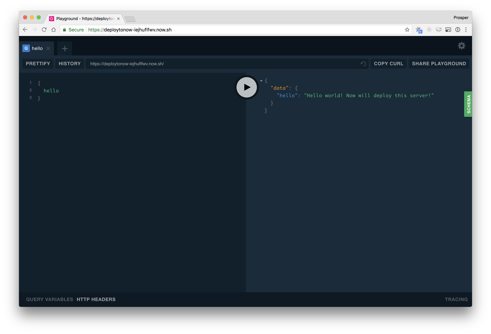

Now is a service by Zeit that allows the deployment of an instance of Apollo Server, which provides a functional GraphQL endpoint.

## Node.js Deployment

Deployment to Now for Node.js apps simply requires a `package.json` file to be present in your app directory.

```js
{
  "name": "graphqlservice",
  "version": "1.0.0",
  "dependencies": {
    "apollo-server": "^2.0.0-rc.5",
    "graphql": "^0.13.2"
  }
}
```

### Deploy server to Now

Install the [now CLI](https://zeit.co/download#now-cli), then visit your server directory and run the `now` command:

```sh
$ now
```

The `now` command immediately deploys your server to the cloud and returns the hosted project link. Send a query to your GraphQL server on `now` at `<NOW_APP_NAME>.now.sh`.

### Deploying directly from GitHub

If you have your GraphQL server published to GitHub, Now provides the ability to deploy straight from GitHub to the cloud.

Assuming you'd like to deploy an instance of [apollo](https://github.com/apollographql)'s [graphql-server-example](https://github.com/apollographql/graphql-server-example), this is what you'll do:

```sh
$ now apollographql/graphql-server-example
```

The `now` command deploys right away and gets the server up and running on the cloud. Furthermore, running the following command will automatically start delivering reports to Apollo Engine.

```sh
$ now -e ENGINE_API_KEY=xxxxxxxxx apollographql/graphql-server-example
```

<div style="text-align:center">

<br></br>
</div>