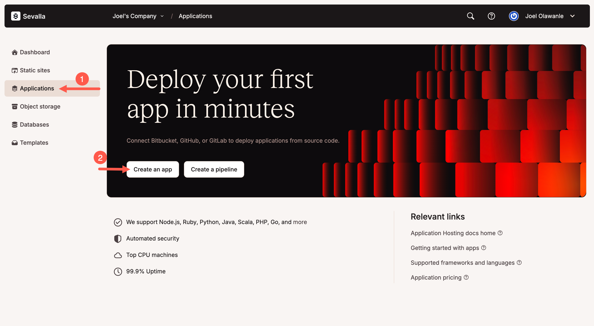
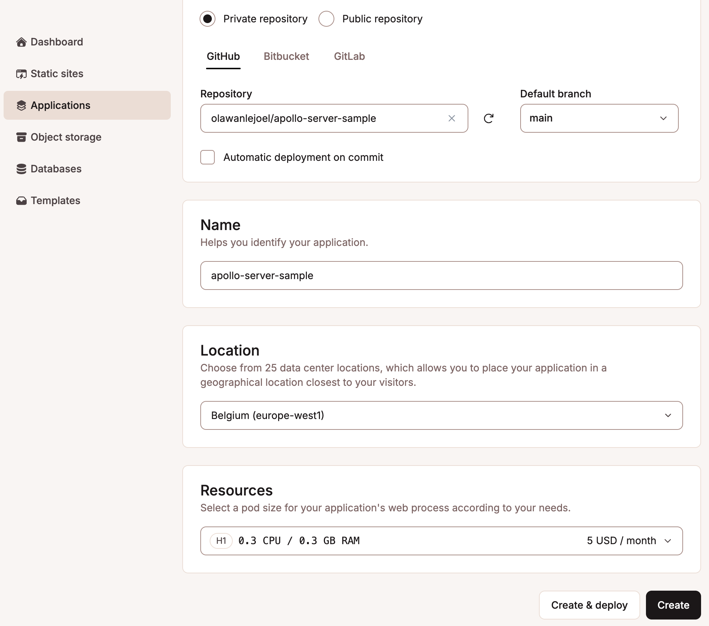
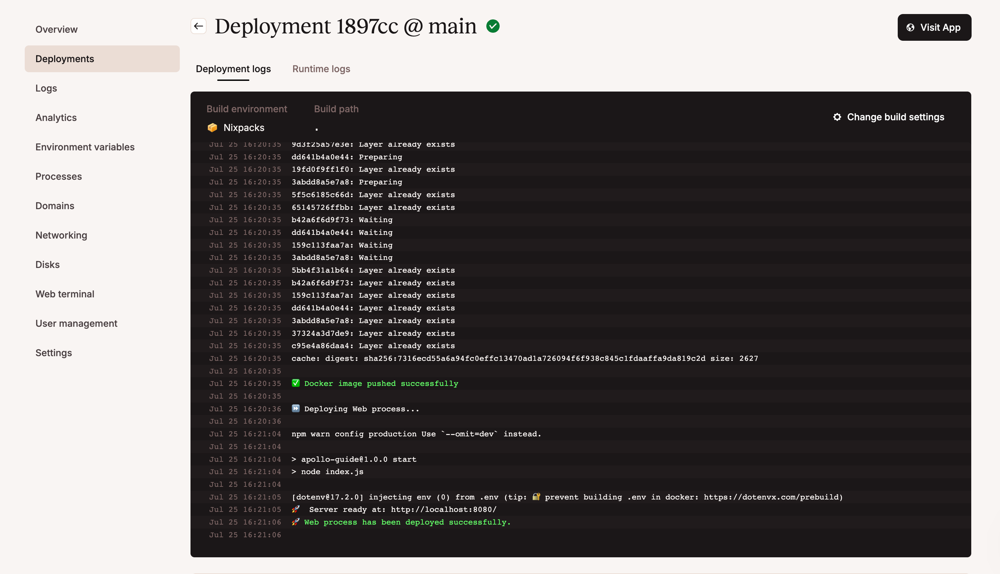
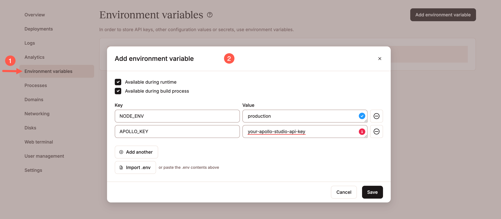
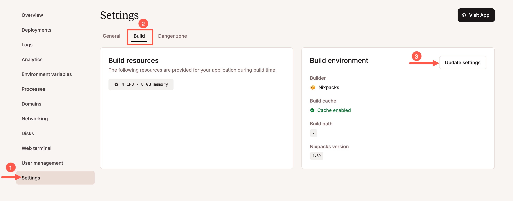
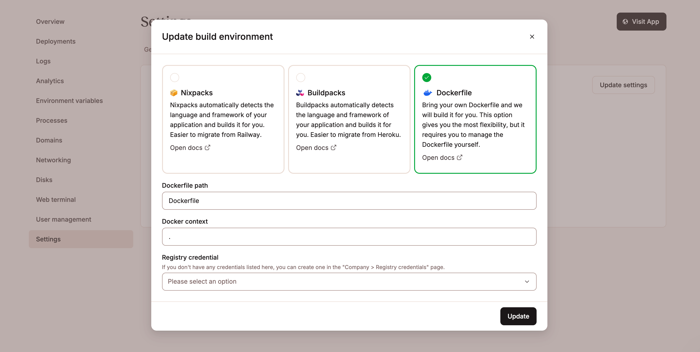

[Sevalla](https://sevalla.com) is a developer-focused PaaS platform designed to simplify application and server deployment and scaling. You can easily host your applications, databases, object storage and static sites.

It supports Git-based deployments, Dockerfiles, and Procfiles and runs on Google Kubernetes Engine with global delivery via Cloudflare. When you sign up, you get fast deployments, flexible configuration, and $50 in free credits.

This guide walks you through deploying an Apollo Server app using Sevalla’s platform.

## Prerequisites

Before getting started, make sure you've:

* Set up an [Apollo Server project](https://www.apollographql.com/docs/apollo-server/getting-started)
* Pushed your project to a GitHub repository (public or private)
* Created a free [Sevalla account](https://sevalla.com) and logged into the dashboard

## Set up a new Sevalla application

First, create a new application on your Sevalla dashboard by clicking **Applications** on the sidebar and then clicking the **Create an app** button, as shown below.

</img>

Next, select your **Git repository**, choose the correct **branch** (usually `main` or `master`) and set your app name, region, and pod size. (You can start with 0.5 CPU / 1GB RAM using your free credits)

</img>

You can now click the **Create & deploy** button, and Sevalla will set the `PORT` variable automatically as long as your server listens to `process.env.PORT`.

</img>

If you need to set other environment variables, click the **Create** button so you can do so before deploying.

## Configure environment variables

To run Apollo Server in production mode, set `NODE_ENV=production`. You’ll also need to add your `APOLLO_KEY` to get performance insights in Apollo Studio. You can find this key by logging into [Apollo Studio](https://studio.apollographql.com/?referrer=docs-content&_gl=1*104n0cn*_gcl_au*MTkwNjQ0ODkyOS4xNzUzMTAyNjc4) and navigating to your graph (or creating one).

In your Sevalla app dashboard, click **Environment Variables** in the sidebar. You can either import your `.env` file or add each variable manually. For example:

</img>

Once that’s done, head over to the **Deployment** tab and hit the **Deploy** button.

## Configure build settings (optional)

By default, [Sevalla uses Nixpacks](https://docs.sevalla.com/applications/build-options/nixpacks) to build your app. If your project has a valid `package.json` with a `start` script, it’ll auto-detect how to run it:

```json
{
  "scripts": {
    "start": "node index.js"
  }
}
```

If you prefer to use a Dockerfile, go to **Settings** \> **Build** and click **Update Settings** under the Build environment card.

</img>

There, set the build method to **Dockerfile**, and provide the Dockerfile path and context.

</img>

You can now go to the **Deployment** page and click the **Deploy** button.

> You can also use a `Procfile` if needed. Just go to **Processes**, edit your web process, and set a custom start command. For example:

```shell
web: node index.js
```

[Try Sevalla](https://sevalla.com) and get started with $50 free credits.
