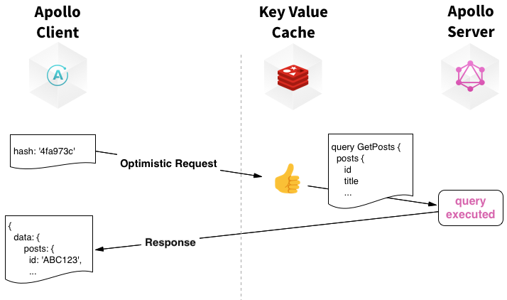
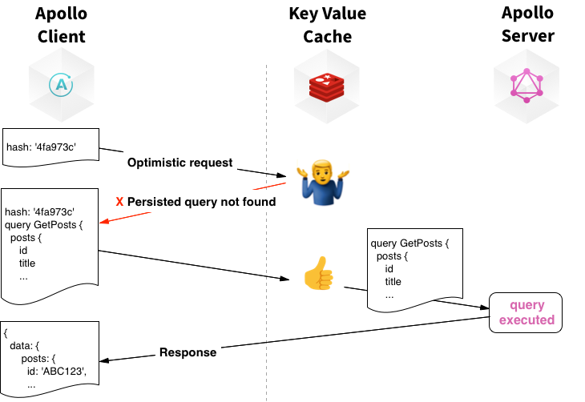

The size of individual GraphQL query strings can be a major pain point. Apollo Server implements Automatic Persisted Queries (APQ), a technique that greatly improves network performance for GraphQL with zero build-time configuration. A persisted query is a ID or hash that can be sent to the server instead of the entire GraphQL query string. This smaller signature reduces bandwidth utilization and speeds up client loading times. Persisted queries are especially nice paired with `GET` requests, enabling the browser cache and [integration with a CDN](#get).

With Automatic Persisted Queries, the ID is a deterministic hash of the input query, so we don't need a complex build step to share the ID between clients and servers. If a server doesn't know about a given hash, the client can expand the query for it; Apollo Server caches that mapping.

<h3 id="setup">Setup</h3>

Apollo Server supports automatic persisted queries without any additional configuration and only requires changes to Apollo Client.

To get started with APQ, add the [Automatic Persisted Queries Link](https://github.com/apollographql/apollo-link-persisted-queries) to the **client** codebase with `npm install apollo-link-persisted-queries`.  Next incorporate the APQ link with Apollo Client's link chain before the HTTP link:

```js
import { createPersistedQueryLink } from "apollo-link-persisted-queries";
import { createHttpLink } from "apollo-link-http";
import { InMemoryCache } from "apollo-cache-inmemory";
import ApolloClient from "apollo-client";

const link = createPersistedQueryLink().concat(createHttpLink({ uri: "/graphql" }));

const client = new ApolloClient({
  cache: new InMemoryCache(),
  link: link,
});
```

> Note: Users of `apollo-boost` should [migrate to `apollo-client`](https://www.apollographql.com/docs/react/advanced/boost-migration.html) in order to use the `apollo-link-persisted-queries` package.

Inside Apollo Server, the query registry is stored in a user-configurable cache. By default, Apollo Server uses a in-memory cache. This can be configured inside of the `ApolloServer` constructor:

```js
const { MemcachedCache } = require('apollo-server-memcached');
const { ApolloServer } = require('apollo-server');

const server = new ApolloServer({
  typeDefs,
  resolvers,
  persistedQueries: {
    cache: new MemcachedCache(
      ['memcached-server-1', 'memcached-server-2', 'memcached-server-3'],
      { retries: 10, retry: 10000 }, // Options
    ),
  },
});
```

<h3 id="verify">Verify</h3>

Apollo Server's persisted queries configuration can be tested from the command-line. The following examples assume Apollo Server is running at `localhost:4000/`.
This example persists a dummy query of `{__typename}`, using its sha256 hash: `ecf4edb46db40b5132295c0291d62fb65d6759a9eedfa4d5d612dd5ec54a6b38`.


1. Request a persisted query:

```bash
curl -g 'http://localhost:4000/?extensions={"persistedQuery":{"version":1,"sha256Hash":"ecf4edb46db40b5132295c0291d62fb65d6759a9eedfa4d5d612dd5ec54a6b38"}}'
```

   Expect a response of: `{"errors": [{"message": "PersistedQueryNotFound", "extensions": {...}}]}`.

2. Store the query to the cache:

```bash
curl -g 'http://localhost:4000/?query={__typename}&extensions={"persistedQuery":{"version":1,"sha256Hash":"ecf4edb46db40b5132295c0291d62fb65d6759a9eedfa4d5d612dd5ec54a6b38"}}'
```

   Expect a response of `{"data": {"__typename": "Query"}}"`.

3. Request the persisted query again:

```bash
curl -g 'http://localhost:4000/?extensions={"persistedQuery":{"version":1,"sha256Hash":"ecf4edb46db40b5132295c0291d62fb65d6759a9eedfa4d5d612dd5ec54a6b38"}}'
```

   Expect a response of `{"data": {"__typename": "Query"}}"`, as the query string is loaded from the cache.

<h3 id="get">Using `GET` requests with APQ on a CDN</h3>

A great application for APQ is running Apollo Server behind a CDN. Many CDNs only cache GET requests, but many GraphQL queries are too long to fit comfortably in a cacheable GET request.  When the APQ link is created with `createPersistedQueryLink({useGETForHashedQueries: true})`, Apollo Client automatically sends the short hashed queries as GET requests allowing a CDN to serve those request. For full-length queries and for all mutations, Apollo Client will continue to use POST requests.

<h3 id="how-it-works">How it works</h3>

The mechanism is based on a lightweight protocol extension between Apollo Client and Apollo Server. It works as follows:

- When the client makes a query, it will optimistically send a short (64-byte) cryptographic hash instead of the full query text.
- **Optimized Path:** If a request containing a persisted query hash is detected, Apollo Server will look it up to find a corresponding query in its registry. Upon finding a match, Apollo Server will expand the request with the full text of the query and execute it.

  

- **New Query Path:** In the unlikely event that the query is not already in the Apollo Server registry (this only happens the very first time that Apollo Server sees a query), it will ask the client to resend the request using the full text of the query. At that point Apollo Server will store the query / hash mapping in the registry for all subsequent requests to benefit from.



<h2 id="cdn">CDN Integration</h2>

Content Delivery Networks (CDNs) such as [fly.io](https://fly.io), [Cloudflare](https://www.cloudflare.com/), [Akamai](https://www.akamai.com/), or [Fastly](https://www.fastly.com/) allow content caching close to clients, delivering data with low latency from a nearby server. Apollo Server makes it straightforward to use CDNs with GraphQL queries to cache full responses while still executing more dynamic queries.

Apollo Server works well with a Content Distribution Network (CDN) to cache full GraphQL query results. By adding the appropriate cache hints, Apollo Server can calculate `Cache-Control` headers that a CDN can use to determine how long a request should be cached. For subsequent requests, the result will be served directly from the CDN's cache. A CDN paired with Apollo Server's persisted queries is especially powerful, since GraphQL operations can be shortened and sent with a HTTP GET request.

<h3 id="cache-hints" title="1. Add cache hints">Step 1: Add cache hints to the GraphQL schema</h3>

Add cache hints as [directives](./directives.html) to GraphQL schema so that Apollo Server knows which fields and types are cacheable and for how long. For example, this schema indicates that all fields that return an `Author` should be cached for 60 seconds, and that the `posts` field should itself be cached for 180 seconds:

```graphql
type Author @cacheControl(maxAge: 60) {
  id: Int
  firstName: String
  lastName: String
  posts: [Post] @cacheControl(maxAge: 180)
}
```

See [the cache control documentation](https://github.com/apollographql/apollo-server/tree/master/packages/apollo-cache-control#add-cache-hints-to-your-schema) for more details, including how to specify hints dynamically inside resolvers, how to set a default `maxAge` for all fields, and how to specify that a field should be cached for specific users only (in which case CDNs should ignore it). For example, to set a default max age other than `0` modify the Apollo Server constructor to include `cacheControl`:

```js
const server = new ApolloServer({
  typeDefs,
  resolvers,
  // The max age is calculated in seconds
  cacheControl: { defaultMaxAge: 5 },
});
```

After this step, Apollo Server will serve the HTTP `Cache-Control` header on fully cacheable responses, so that any CDN in front of Apollo Server will know which responses can be cached and for how long. A "fully cacheable" response contains only data with non-zero `maxAge`; the header will refer to the minimum `maxAge` value across the whole response, and it will be `public` unless some of the data is tagged `scope: PRIVATE`. To observe this header, use any browser's network tab in its dev tools.

<h3 id="enable-apq" title="2. Enable persisted queries">Step 2: Enable automatic persisted queries</h3>

Often, GraphQL requests are big POST requests and most CDNs will only cache GET requests. Additionally, GET requests generally work best when the URL has a bounded size. Enabling automatic persisted queries means that short hashes are sent over the wire instead of full queries, and Apollo Client can be configured to use GET requests for those hashed queries.

To do this, update the **client** code. First, add the package:

```
npm install apollo-link-persisted-queries
```

Then, add the persisted queries link to the Apollo Client constructor before the HTTP link:

```js
import { createPersistedQueryLink } from "apollo-link-persisted-queries";
import { createHttpLink } from "apollo-link-http";
import { InMemoryCache } from "apollo-cache-inmemory";
import { ApolloLink } from "apollo-link";
import ApolloClient from "apollo-client";

ApolloLink.from([
  createPersistedQueryLink({ useGETForHashedQueries: true }),
  createHttpLink({ uri: "/graphql" })
]);

const client = new ApolloClient({
  cache: new InMemoryCache(),
  link: link
});
```

Make sure to include `useGETForHashedQueries: true`. Note that the client will still use POSTs for mutations, because it's generally best to avoid GETs for non-idempotent requests.

If configured correctly, browser's dev tools should verify that queries are now sent as GET requests, and receive appropriate `Cache-Control` response headers.

<h3 id="setup-cdn" title="3. Set up a CDN">Step 3: Set up a CDN</h3>

How exactly this works depends on exactly which CDN you chose. Configure your CDN to send requests to Apollo Server. Some CDNs may need to be specially configured to honor origin Cache-Control headers; for example, here is [Akamai's documentation on that setting](https://learn.akamai.com/en-us/webhelp/ion/oca/GUID-57C31126-F745-4FFB-AA92-6A5AAC36A8DA.html). If all is well, cacheable queries should now be saved by the CDN.

> Note that requests served directly by a CDN will not show up in the Engine dashboard.
