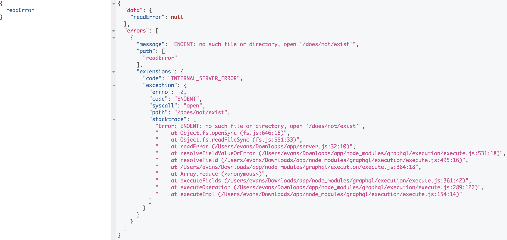

Apollo server provides a couple predefined errors, including
`AuthenticationError`, `ForbiddenError`, `UserInputError` and a generic
`ApolloError`. These errors are designed to enhance errors thrown before and during GraphQL execution. The provided errors focus on debugging a Apollo server as well as enabling the client to take specific action based on an error.

When an error occurs in Apollo server both inside and outside of resolvers, each error inside of the `errors` array will contain an object at `extensions` that contains the information added by Apollo server.

## Default information

The first step to improving the usability of a server is providing the error stack trace by default. The following example demonstrates the response returned from Apollo server with a resolver that throws a node [`SystemError`](https://nodejs.org/api/errors.html#errors_system_errors).

```js line=14-16
const {
  ApolloServer,
  gql,
} = require('apollo-server');

const typeDefs = gql`
  type Query {
    readError: String
  }
`;

const resolvers = {
  Query: {
    readError: (parent, args, context) => {
      fs.readFileSync('/does/not/exist');
    },
  },
};
```

The response will return:



> To disable stacktraces for production, pass `debug: false` to the Apollo server constructor or set the `NODE_ENV` environment variable to 'production' or 'test'. Note that this will make the stacktrace unavailable to your application. If you want to log the stacktrace, but not send it in the response to the client, see [Masking and logging errors](#Masking-and-logging-errors) below.

## Codes

In addition to stacktraces, Apollo Server's exported errors specify a human-readable string in the `code` field of `extensions` that enables the client to perform corrective actions. In addition to improving the client experience, the `code` field allows the server to categorize errors. For example, an `AuthenticationError` sets the code to `UNAUTHENTICATED`, which enables the client to reauthenticate and would generally be ignored as a server anomaly.

```js line=4,15-17
const {
  ApolloServer,
  gql,
  AuthenticationError,
} = require('apollo-server');

const typeDefs = gql`
  type Query {
    authenticationError: String
  }
`;

const resolvers = {
  Query: {
    authenticationError: (parent, args, context) => {
      throw new AuthenticationError('must authenticate');
    },
  },
};
```

The response will return:


## Augmenting error details

When clients provide bad input, you may want to return additional information
like a localized message for each field or argument that was invalid. The
following example demonstrates how you can use `UserInputError` to augment
your error messages with additional details.

```js line=15-21
const {
  ApolloServer,
  UserInputError,
  gql,
} = require('apollo-server');

const typeDefs = gql`
  type Mutation {
    userInputError(input: String): String
  }
`;

const resolvers = {
  Mutation: {
    userInputError: (parent, args, context, info) => {
      if (args.input !== 'expected') {
        throw new UserInputError('Form Arguments invalid', {
          invalidArgs: Object.keys(args),
        });
      }
    },
  },
};
```

The response will return:


## Other errors

If you need to define other error codes that are specific to your
application, you can use the base `ApolloError` class.

```js
new ApolloError(message, code, additionalProperties);
```

## Masking and logging errors

### For the client response

The Apollo server constructor accepts a `formatError` function that is run on each error passed back to the client. This can be used to mask errors as well as for logging.

> Note that while this changes the error which is sent to the client, it
> doesn't change the error which is sent to Apollo Engine.  See the
> `rewriteError` function in the _For Apollo Engine reporting_ section below
> if this behavior is desired.

This example demonstrates throwing a different error when the error's message starts with `Database Error: `:

```js line=4-10
const server = new ApolloServer({
  typeDefs,
  resolvers,
  formatError: (err) => {
    // Don't give the specific errors to the client.
    if (err.message.startsWith("Database Error: ")) {
      return new Error('Internal server error');
    }
    
    // Otherwise return the original error.  The error can also
    // be manipulated in other ways, so long as it's returned.
    return err;
  },
});

server.listen().then(({ url }) => {
  console.log(`🚀 Server ready at ${url}`);
});
```

### For Apollo Engine reporting

With the Apollo Platform, it's possible to observe error rates within Apollo
Engine, rather than simply logging them to the console. While all errors are
sent to Apollo Engine by default, depending on the severity of the error, it
may be desirable to not send particular errors which may be caused by a
user's actions. Alternatively, it may be necessary to modify or redact errors
before transmitting them.

To account for these needs, a `rewriteError` function can be provided within
the `engine` settings to Apollo Server. At a high-level, the function will
receive the error to be reported (i.e. a `GraphQLError` or an `ApolloError`)
as the first argument. The function should then return a modified form of
that error (e.g. after changing the `err.message` to remove potentially
sensitive information), or should return an explicit `null` in order to avoid
reporting the error entirely.

The following sections give some examples of various use-cases for `rewriteError`.

#### Avoid reporting lower-severity predefined errors.

If an application is utilizing the predefined errors noted above (e.g.
`AuthenticationError`, `ForbiddenError`, `UserInputError`, etc.), these can
be used with `rewriteError`.

For example, if the current server is `throw`ing the `AuthenticationError`
when a mis-typed password is supplied, an implementor can avoid reporting
this to Apollo Engine by defining `rewriteError` as follows:

```js line=5-15
const { ApolloServer, AuthenticationError } = require("apollo-server");
const server = new ApolloServer({
  typeDefs,  // (Not defined in this example)
  resolvers, //    "      "      "      "
  engine: {
    rewriteError(err) {
      // Return `null` to avoid reporting `AuthenticationError`s
      if (err instanceof AuthenticationError) {
        return null;
      }

      // All other errors will be reported.
      return err;
    }
  },
});
```

This example configuration would ensure that any `AuthenticationError` which
was thrown within a resolver would only be reported to the client, and never
sent to Apollo Engine. All other errors would be transmitted to Apollo Engine
normally.

#### Avoid reporting an error based on other properties.

When generating an error (e.g. `new ApolloError("Failure!")`), the `message`
is the most common property (i.e. `err.message`, which is `Failure!` in this
case). However, any number of properties can be attached to the error (e.g.
adding a `code` property). These properties can be checked when determining
whether an error should be reported to Apollo Engine using the `rewriteError`
function as follows:

```js line=5-16
const { ApolloServer } = require("apollo-server");
const server = new ApolloServer({
  typeDefs,  // (Not defined in this example)
  resolvers, //    "      "      "      "
  engine: {
    rewriteError(err) {
      // Using a more stable, known error property (e.g. `err.code`) would be
      // more defensive, however checking the `message` might serve most needs!
      if (err.message && err.message.startsWith("Known error message")) {
        return null;
      }

      // All other errors should still be reported!
      return err;
    }
  },
});
```

This example configuration would ensure that any error which started with
`Known error message` was not transmitted to Apollo Engine, but all other
errors would continue to be sent.

#### Redacting the error message.

If it is necessary to change the error prior to reporting it to Apollo Engine
– for example, if there is personally identifiable information in the error
`message` — the `rewriteError` function can also help.

Consider an example where the error contained a piece of information like
an API key (e.g. `throw new ApolloError("The x-api-key:12345 doesn't have
sufficient privileges.");`).

While a best practice would suggest not including such information in the
error message itself, the `rewriteError` function could be used to make sure
it it's sent to Apollo Engine and potentially revealed outside its intended
scope:

```js line=5-11
const { ApolloServer } = require("apollo-server");
const server = new ApolloServer({
  typeDefs,  // (Not defined in this example)
  resolvers, //    "      "      "      "
  engine: {
    rewriteError(err) {
      // Make sure that a specific pattern is removed from all error messages.
      err.message = err.message.replace(/x-api-key:[A-Z0-9-]+/, "REDACTED");
      return err;
    }
  },
});
```

In this case, the example error used above would be reported in Apollo Engine as:

```
The x-api-key:REDACTED doesn't have sufficient privileges.
```
