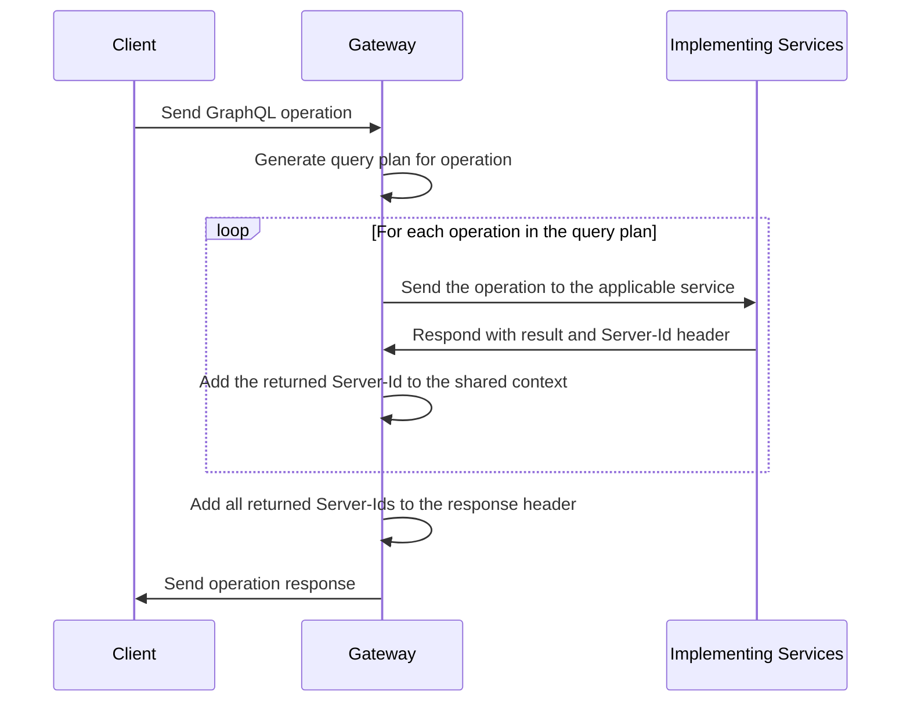

After you set up at least one federation-ready [implementing service](./implementing-services/), you can configure a **gateway** to sit in front of your services. The gateway **composes** the individual schemas of your services into a federated data graph and then executes incoming operations across those services.

The `@apollo/gateway` package extends Apollo Server's functionality, enabling it to act as a gateway for an Apollo Federation architecture.

## Setup

First, let's install the necessary packages:

```shell
npm install @apollo/gateway apollo-server graphql
```

The `@apollo/gateway` package includes the [`ApolloGateway` class](/api/apollo-gateway/). To configure Apollo Sever to act as a gateway, you pass an instance of `ApolloGateway` to the `ApolloServer` constructor, like so:

```js
const { ApolloServer } = require('apollo-server');
const { ApolloGateway } = require('@apollo/gateway');

// Initialize an ApolloGateway instance and pass it an array of
// your implementing service names and URLs
const gateway = new ApolloGateway({
  serviceList: [
    { name: 'accounts', url: 'http://localhost:4001' },
    // Define additional services here
  ],
});

// Pass the ApolloGateway to the ApolloServer constructor
const server = new ApolloServer({
  gateway,

  // Disable subscriptions (not currently supported with ApolloGateway)
  subscriptions: false,
});

server.listen().then(({ url }) => {
  console.log(`🚀 Server ready at ${url}`);
});
```

In the above example, we provide the `serviceList` configuration option to the
`ApolloGateway` constructor. This array specifies a `name` and `url` for each
of our implementing services. You can specify any string value for `name`, which
is used primarily for query planner output, error messages, and logging.

> In production, we recommend running the gateway in a **managed mode**, which relies on static files rather than introspection. For details, see the [Apollo Graph Manager documentation](https://www.apollographql.com/docs/graph-manager/federation/).

On startup, the gateway fetches each implementing service's schema from its `url` and composes those schemas into a single federated data graph. It then begins accepting incoming requests and creates query plans for them that execute across one or more services.

> If there are any composition errors, the `new ApolloServer` call throws an exception
> with a list of [validation errors](/federation/errors/).

## Customizing requests and responses

The gateway can modify the details of an incoming request before executing it across your implementing services. For example, your services might all use the same authorization token to associate an incoming request with a particular user. The gateway can add that token to each operation it sends to your services.

Similarly, the gateway can modify the details of its response to a client, based on the result of each implementing service.

### Customizing incoming requests

The following example demonstrates passing user information from the gateway
to each implementing service via the `user-id` HTTP header:

```javascript
const { ApolloServer } = require('apollo-server');
const { ApolloGateway, RemoteGraphQLDataSource } = require('@apollo/gateway');

// highlight-start
class AuthenticatedDataSource extends RemoteGraphQLDataSource {
  willSendRequest({ request, context }) {
    // pass the user's id from the context to underlying services
    // as a header called `user-id`
    request.http.headers.set('user-id', context.userId);
  }
}
// highlight-end

const gateway = new ApolloGateway({
  serviceList: [
    { name: 'products', url: 'http://localhost:4001' },
    // other services
  ],
  // highlight-start
  buildService({ name, url }) {
    return new AuthenticatedDataSource({ url });
  },
  // highlight-end
});

const server = new ApolloServer({
  gateway,

  // Disable subscriptions (not currently supported with ApolloGateway)
  subscriptions: false,

  context: ({ req }) => {
    // get the user token from the headers
    const token = req.headers.authorization || '';

    // try to retrieve a user with the token
    const userId = getUserId(token);

    // add the user to the context
    return { userId };
  },
});

server.listen().then(({ url }) => {
  console.log(`🚀 Server ready at ${url}`);
});
```

The `buildService` function enables us to customize the requests that are sent to our implementing services. In this example, we return a custom `RemoteGraphQLDataSource`. The datasource allows us to modify the outgoing request with information from the Apollo Server `context` before it's sent. Here, we add the `user-id` header to pass an authenticated user ID to downstream services.

### Customizing outgoing responses

The `didReceiveResponse` callback of the `RemoteGraphQLDataSource` class enables the gatway to inspect each implementing service's result to modify the `context` before sending a final response to the client.

Suppose our implementing services all use the `Server-Id` header to uniquely
identify themselves in a response. We want the gateway's `Server-Id` header to include _all_ of these returned values. In this case, we can tell the gateway to aggregate the various server IDs into a single, comma-separated list in its response:



 To implement this behavior, we define a `didReceiveResponse` callback and an `ApolloServerPlugin` in our gateway:

```javascript
const { ApolloServer } = require('apollo-server');
const { ApolloGateway, RemoteGraphQLDataSource } = require('@apollo/gateway');

class DataSourceWithServerId extends RemoteGraphQLDataSource {
  // highlight-start
  async didReceiveResponse({ response, request, context }) {
    // Parse the Server-Id header and add it to the array on context
    const serverId = response.http.headers.get('Server-Id');
    if (serverId) {
      context.serverIds.push(serverId);
    }

    // Return the response, even when unchanged.
    return response;
  }
  // highlight-end
}

const gateway = new ApolloGateway({
  serviceList: [
    { name: 'products', url: 'http://localhost:4001' }
    // other services
  ],
  // highlight-start
  buildService({ url }) {
    return new DataSourceWithServerId({ url });
  }
  // highlight-end
});

const server = new ApolloServer({
  gateway,
  subscriptions: false, // Must be disabled with the gateway; see above.
  context() {
    return { serverIds: [] };
  },
  plugins: [
    // highlight-start
    {
      requestDidStart() {
        return {
          willSendResponse({ context, response }) {
            // Append our final result to the outgoing response headers
            response.http.headers.append(
              'Server-Id',
              context.serverIds.join(',')
            );
          }
        };
      }
    }
    // highlight-end
  ]
});

server.listen().then(({ url }) => {
  console.log(`🚀 Server ready at ${url}`);
});
```

To learn more about `buildService` and `RemoteGraphQLDataSource`, see the [API docs](/api/apollo-gateway/).

## Implementing custom directives

The `@apollo/gateway` library provides limited support for custom directives that are implemented by your implementing services. To use this feature, there are a few requirements that must be met in order to compose a valid graph:

* Custom directives can only be used in **executable locations**, as defined in the [GraphQL specification](https://graphql.github.io/graphql-spec/June2018/#ExecutableDirectiveLocation).
* Custom directives must be implemented by *every* implementing service in the data graph. It's acceptable for a service to do nothing with a particular directive, but a directive definition must exist within every service's schema.
* Directive definitions must be identical across all services. A directive definition is identical if its name, arguments and their types, and locations are all the same.

>Apollo Server does not currently support executable directives, however they are supported by the gateway.
