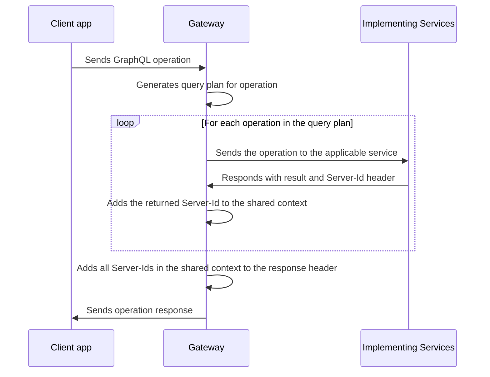

import {
  ExpansionPanel,
} from 'gatsby-theme-apollo-docs/src/components/expansion-panel';

After you set up at least one federation-ready [implementing service](./implementing-services/), you can configure a **gateway** to sit in front of your services. The gateway **composes** the individual schemas of your services into a federated data graph and then executes incoming operations across those services.

The `@apollo/gateway` package extends Apollo Server's functionality, enabling it to act as a gateway for an Apollo Federation architecture.

> We recommend against running your gateway in a serverless environment (such as AWS Lambda), because schema composition increases Apollo Server's startup time. If you do run your gateway in a serverless environment, set your function's timeout to at least 10 seconds to prevent unexpected errors.

## Setup

First, let's install the necessary packages:

```shell
npm install @apollo/gateway apollo-server graphql
```

The `@apollo/gateway` package includes the [`ApolloGateway` class](/api/apollo-gateway/). To configure Apollo Sever to act as a gateway, you pass an instance of `ApolloGateway` to the `ApolloServer` constructor, like so:

```js
const { ApolloServer } = require('apollo-server');
const { ApolloGateway } = require('@apollo/gateway');

// Initialize an ApolloGateway instance and pass it an array of
// your implementing service names and URLs
const gateway = new ApolloGateway({
  serviceList: [
    { name: 'accounts', url: 'http://localhost:4001' },
    // Define additional services here
  ],
});

// Pass the ApolloGateway to the ApolloServer constructor
const server = new ApolloServer({
  gateway,

  // Disable subscriptions (not currently supported with ApolloGateway)
  subscriptions: false,
});

server.listen().then(({ url }) => {
  console.log(`🚀 Server ready at ${url}`);
});
```

In the above example, we provide the `serviceList` configuration option to the
`ApolloGateway` constructor. This array specifies a `name` and `url` for each
of our implementing services. You can specify any string value for `name`, which
is used primarily for query planner output, error messages, and logging.

> In production, we recommend running the gateway in a **managed mode**, which relies on static files rather than introspection. For details, see the [Apollo Studio documentation](https://www.apollographql.com/docs/graph-manager/managed-federation/setup/).

On startup, the gateway fetches each implementing service's schema from its `url` and composes those schemas into a single federated data graph. It then begins accepting incoming requests and creates query plans for them that execute across one or more services.

> If there are any composition errors, the `new ApolloServer` call throws an exception
> with a list of [validation errors](/federation/errors/).

## Customizing requests and responses

The gateway can modify the details of an incoming request before executing it across your implementing services. For example, your services might all use the same authorization token to associate an incoming request with a particular user. The gateway can add that token to each operation it sends to your services.

Similarly, the gateway can modify the details of its response to a client, based on the result returned by each implementing service.

### Customizing requests

In the following example, each incoming request to the gateway includes an `Authorization` header. The gateway sets the shared `context` for an operation  by pulling the value of that header and using it to fetch the associated user's ID.

After adding the `userId` to the shared `context` object, the gateway can then add that value to a header that it includes in its requests to each implementing service.

<ExpansionPanel title="Expand example">

```javascript{4-10,17-19,28-35}
const { ApolloServer } = require('apollo-server');
const { ApolloGateway, RemoteGraphQLDataSource } = require('@apollo/gateway');

class AuthenticatedDataSource extends RemoteGraphQLDataSource {
  willSendRequest({ request, context }) {
    // Pass the user's id from the context to underlying services
    // as a header called `user-id`
    request.http.headers.set('user-id', context.userId);
  }
}

const gateway = new ApolloGateway({
  serviceList: [
    { name: 'products', url: 'http://localhost:4001' },
    // List other services here
  ],
  buildService({ name, url }) {
    return new AuthenticatedDataSource({ url });
  },
});

const server = new ApolloServer({
  gateway,

  // Disable subscriptions (not currently supported with ApolloGateway)
  subscriptions: false,

  context: ({ req }) => {
    // Get the user token from the headers
    const token = req.headers.authorization || '';
    // Try to retrieve a user with the token
    const userId = getUserId(token);
    // Add the user ID to the context
    return { userId };
  },
});

server.listen().then(({ url }) => {
  console.log(`🚀 Server ready at ${url}`);
});
```

</ExpansionPanel>

> The fields of the object passed to your `context` function differ if you're using middleware besides Express. [See the API reference for details.](/api/apollo-server/#apolloserver)

The `buildService` function enables us to customize the requests that are sent to our implementing services. In this example, we return a custom `RemoteGraphQLDataSource`. The datasource allows us to modify the outgoing request with information from the Apollo Server `context` before it's sent. Here, we add the `user-id` header to pass an authenticated user ID to downstream services.

### Customizing responses

Let's say that whenever our implementing services return an operation result to the gateway, they include a `Server-Id` header in the response. The value of the header uniquely identifies the service in our graph.

When the gateway then responds to a client, we want _its_ `Server-Id` header to include the identifier for _every_ service that contributed to the response. In this case, we can tell the gateway to aggregate the various server IDs into a single, comma-separated list.

The flow for processing a single operation from a client application then looks like this:



To implement this flow, we can use the `didReceiveResponse` callback of the `RemoteGraphQLDataSource` class to inspect each implementing service's result as it comes in. We can add the `Server-Id` to the shared `context` in this callback, then pull the full list from the `context` when sending the final response to the client.

<ExpansionPanel title="Expand example">

```javascript
const { ApolloServer } = require('apollo-server');
const { ApolloGateway, RemoteGraphQLDataSource } = require('@apollo/gateway');

class DataSourceWithServerId extends RemoteGraphQLDataSource {
  // highlight-start
  async didReceiveResponse({ response, request, context }) {
    // Parse the Server-Id header and add it to the array on context
    const serverId = response.http.headers.get('Server-Id');
    if (serverId) {
      context.serverIds.push(serverId);
    }

    // Return the response, even when unchanged.
    return response;
  }
  // highlight-end
}

const gateway = new ApolloGateway({
  serviceList: [
    { name: 'products', url: 'http://localhost:4001' }
    // other services
  ],
  // highlight-start
  buildService({ url }) {
    return new DataSourceWithServerId({ url });
  }
  // highlight-end
});

const server = new ApolloServer({
  gateway,
  subscriptions: false, // Must be disabled with the gateway; see above.
  context() {
    return { serverIds: [] };
  },
  plugins: [
    // highlight-start
    {
      requestDidStart() {
        return {
          willSendResponse({ context, response }) {
            // Append our final result to the outgoing response headers
            response.http.headers.set(
              'Server-Id',
              context.serverIds.join(',')
            );
          }
        };
      }
    }
    // highlight-end
  ]
});

server.listen().then(({ url }) => {
  console.log(`🚀 Server ready at ${url}`);
});
```

</ExpansionPanel>

> In this example, multiple calls to `didReceiveResponse` are `push`ing a value onto the shared `context.serverIds` array. The order of these calls cannot be guaranteed. If you write logic that modifies the shared `context` object, make sure that modifications are not destructive, and that the order of modifications doesn't matter.

To learn more about `buildService` and `RemoteGraphQLDataSource`, see the [API docs](/api/apollo-gateway/).

## Custom directive support

The `@apollo/gateway` library supports the use of custom [directives](/schema/directives/) in your implementing service schemas. This support differs depending on whether a given directive is a **type system directive** or an **executable directive**.

### Type system directives

Type system directives are directives that are applied to one of [these locations](http://spec.graphql.org/June2018/#TypeSystemDirectiveLocation). These directives are _not_ used within operations, but rather are applied to locations within the schema itself.

The `@deprecated` directive below is an example of a type system directive:

```graphql
directive @deprecated(
  reason: String = "No longer supported"
) on FIELD_DEFINITION | ENUM_VALUE

type ExampleType {
  newField: String
  oldField: String @deprecated(reason: "Use `newField`.")
}
```

At composition time, `ApolloGateway` strips all definitions _and_ uses of type system directives from your composed schema. This has no effect on your implementing service schemas, which retain this information.

Effectively, the gateway supports type system directives by _ignoring_ them, making them the responsibility of the implementing services that define them.

### Executable directives

Executable directives are directives that are applied to one of [these locations](http://spec.graphql.org/June2018/#ExecutableDirectiveLocation). These directives are _defined_ in your schema, but they're _used_ in operations that are sent by clients.

>**Although the `@apollo/gateway` library supports executable directives, Apollo Server itself does not**. This guidance is provided primarily for architectures that use the `@apollo/gateway` library in combination with implementing services that do _not_ use Apollo Server.

Here's an example of an executable directive definition:

```graphql
# Uppercase this field's value (assuming it's a string)
directive @uppercase on FIELD
```

And here's an example of a query that uses that directive:

```graphql
query GetUppercaseUsernames {
  users {
    name @uppercase
  }
}
```

At composition time, `ApolloGateway` makes sure that **all of your implementing services define the exact same set of executable directives**. If any service is missing a definition, or if definitions differ in their locations, arguments, or argument types, a composition error occurs.

> It's strongly recommended that all of your implementing services also use the exact same _logic_ for a given executable directive. Otherwise, operations might produce inconsistent or confusing results for clients.
