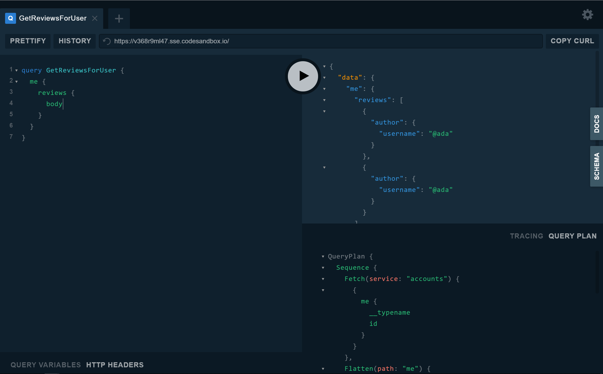

Apollo Federation is made up of two parts:
* Federated services, which are standalone parts of the graph
* A gateway which composes the overall schema and executes federated queries

To be part of a federated graph, a microservice implements the Apollo Federation spec which exposes its capabilities to tooling and the gateway. The federated service can extend types from other services and add its own types that can be extended.

Collectively, federated services form a composed graph. This composition is done by a gateway which knows how to take an incoming operation and turn it into a plan of fetches to downstream services. The gateway orchestrates requests, merges the data and errors together, and forms the overall result to send back to the client.

Let's take a look at how to get a federated graph up and running. We'll start by preparing an existing service for federation, followed by setting up a gateway in front of it.

## Defining a federated service

Converting an existing schema into a federated service is the first step in buliding a federated graph. To do this, we'll use the `buildFederatedSchema()` function from the `@apollo/federation` package.

Let's start with a basic Apollo Server and make the switch:

```javascript
const { ApolloServer, gql } = require('apollo-server');

const typeDefs = gql`
  type Query {
    me: User
  }

  type User {
    id: ID!
    username: String
  }
`;

const resolvers = {
  Query: {
    me() {
      return { id: "1", username: "@ava" }
    }
  }
};

const server = new ApolloServer({
  typeDefs,
  resolvers,
});
```

If you're already familiar with [setting up an Apollo Server](https://www.apollographql.com/docs/apollo-server/essentials/server#creating), this should look pretty familiar. If not, we recommend you first take a moment to get comfortable with this topic before jumping in to federation.

Now, let's see what this looks like as a federated service:

First step is to install the `@apollo/federation` package into the project:

```sh
npm install @apollo/federation
```

Then just define the entity's key, implement its reference resolver, and call `buildFederatedSchema`:
```javascript{2,9,21-25,29}
const { ApolloServer, gql } = require('apollo-server');
const { buildFederatedSchema } = require('@apollo/federation');

const typeDefs = gql`
  type Query {
    me: User
  }

  type User @key(fields: "id") {
    id: ID!
    username: String
  }
`;

const resolvers = {
  Query: {
    me() {
      return { id: "1", username: "@ava" }
    }
  },
  User: {
    __resolveReference(user, { fetchUserById }){
      return fetchUserById(user.id)
    }
  }
};

const server = new ApolloServer({
  schema: buildFederatedSchema([{ typeDefs, resolvers }])
});
```
> Note: we're now providing a `schema` to the `ApolloServer` constructor, rather than `typeDefs` and `resolvers`.

Now the service is running as a federated service and is ready to be composed into an overall federated graph!

## Running a gateway

Now that we have a federation-ready service, we can get started with building our gateway. First let's install the gateway package and Apollo Server:

```sh
npm install @apollo/gateway apollo-server graphql
```

Now we can create a new service that acts as a gateway to the underlying microservices:

```javascript{2,4-9,12}
const { ApolloServer } = require('apollo-server');
const { ApolloGateway } = require("@apollo/gateway");

const gateway = new ApolloGateway({
  serviceList: [
    { name: 'accounts', url: 'http://localhost:4001' },
    // more services
  ],
});

(async () => {
  const { schema, executor } = await gateway.load();

  const server = new ApolloServer({ schema, executor });

  server.listen().then(({ url }) => {
    console.log(`🚀 Server ready at ${url}`);
  });
})();
```

In this example, we provide two options to the `ApolloGateway` constructor:
* The `serviceList`, which provides a name and endpoint for each of the federated services.
* The `debug` flag, which provides some additional logging around gateway startup and query execution. This is useful for troubleshooting, as well as for viewing query plans for incoming requests.

On startup, the gateway will fetch the service capabilities from the running servers and form an overall composed graph. It will accept incoming request and create query plans to the underlying services in the service list.

> If there are any composition errors, the `gateway.load()` promise will be rejected with a list of [validation errors](/federation/errors/)

#### Gateway initialization
The call to `gateway.load()` returns a `Promise` which resolves to a `schema` and `executor`. These are intended to be passed into the constructor of `ApolloServer`.
* The `schema` is the final, composed schema which represents all services.
* The `executor` handles incoming requests. It uses the query planner to manage the various requests to our services that are necessary to construct the final result.

## Inspecting query plans

When the gateway receives a new query, it generates a query plan that defines the sequence of requests the gateway will send to the necessary downstream services. Inspecting a query plan can be a helpful tool in understanding the gateway and exploring how directives like `@requires` and `@provides` can help optimize query plans. To make it easy to access query plans, the `@apollo/gateway` package includes a build of GraphQL Playground that adds a query plan inspector.




## Sharing context across services
For existing services, it's likely that you've already implemented some form of authentication to convert a request into a user, or require some information passed to the service through request headers. `@apollo/gateway` makes it easy to reuse the context feature of Apollo Server to customize what information is sent to underlying services. Let's see what it looks like to pass user information along from the gateway to its services:

```javascript{9-18,27-36}
import { ApolloServer } from 'apollo-server';
import { ApolloGateway, RemoteGraphQLDataSource } from '@apollo/gateway';

const gateway = new ApolloGateway({
  serviceList: [
    { name: 'products', url: 'http://localhost:4001' },
    // other services
  ],
  buildService({ name, url }) {
    return new RemoteGraphQLDataSource({
      url,
      willSendRequest({ request, context }) {
        // pass the user's id from the context to underlying services
        // as a header called `user-id`
        request.http.headers.set('user-id', context.userId);
      },
    });
  },
});

(async () => {
  const { schema, executor } = await gateway.load();

  const server = new ApolloServer({
    schema,
    executor,
    context: ({ req }) => {
      // get the user token from the headers
      const token = req.headers.authorization || '';

      // try to retrieve a user with the token
      const userId = getUserId(token);

      // add the user to the context
      return { userId };
    },
  });

  server.listen().then(({ url }) => {
    console.log(`🚀 Server ready at ${url}`);
  });
})();
```

By leveraging the `buildService` function, we're able to customize how requests are sent to our federated services. In this example, we return a custom `RemoteGraphQLDataSource`. The datasource allows us to modify the outgoing request with information from the Apollo Server `context` before it's sent. Here, we're adding the `user-id` header to pass an authenticated user id to downstream services.

To learn more about `buildService` or `RemoteGraphQLDataSource`, see the [API docs](/api/apollo-gateway/).
