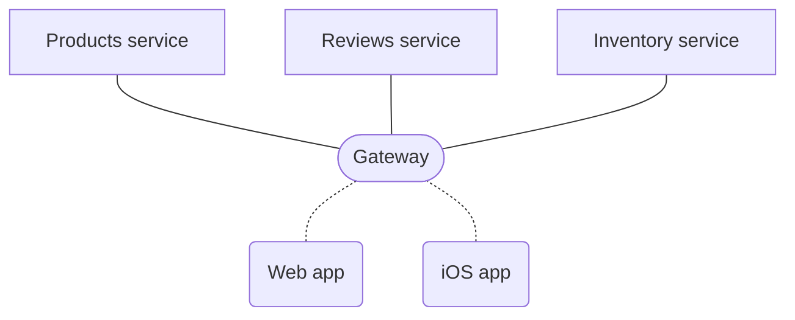

An Apollo Federation architecture consists of:

* A collection of **implementing services** that each define a distinct GraphQL schema
* A **gateway** that composes the distinct schemas into a **federated data graph** and executes queries across the services in the graph



Apollo Server provides libraries for acting both as an implementing service and as a gateway, but these components can be implemented in any language and framework.

Let's look at how to get a federated graph up and running. We'll start by preparing an existing implementing service for federation, and then we'll set up a gateway in front of it.

## Defining an implementing service

> To be part of a federated graph, an implementing service must conform to the [Apollo Federation specification](/federation/federation-spec/), which exposes the service's capabilities to the gateway, as well as to tools like Apollo Graph Manager.

Converting an existing schema into an implementing service is the first step in building a federated graph. To start, here's a *non-federated* Apollo Server setup:

```javascript:title=index.js
const { ApolloServer, gql } = require('apollo-server');

const typeDefs = gql`
  type Query {
    me: User
  }

  type User {
    id: ID!
    username: String
  }
`;

const resolvers = {
  Query: {
    me() {
      return { id: "1", username: "@ava" }
    }
  }
};

const server = new ApolloServer({
  typeDefs,
  resolvers,
});

server.listen(4001).then(({ url }) => {
    console.log(`🚀 Server ready at ${url}`);
});
```

This should look familiar if you've [set up Apollo Server](/getting-started/) before. If it doesn't, we recommend you familiarize yourself with the basics before jumping into federation.

Now, let's convert this to an implementing service. The first step is to install the `@apollo/federation` package in our project:

```shell
npm install @apollo/federation
```

### Defining an entity

As part of our federated architecture, we want _other_ implementing services to be able to extend the `User` type this service defines. To enable this, we add the `@key` directive to the `User` type's definition to designate it as an **entity**:

```js:title=index.js
const { ApolloServer, gql } = require('apollo-server');
const { buildFederatedSchema } = require('@apollo/federation');

const typeDefs = gql`
  type Query {
    me: User
  }

  type User @key(fields: "id") {
    id: ID!
    username: String
  }
`;
```

The `@key` directive tells other services which field(s) of the `User` type to use
to uniquely identify a particular instance. In this case, services should use the
single field `id`.

Next, we add a **reference resolver** for the `User` type. A reference resolver tells the gateway how to fetch an entity by its `@key` fields:

```js:title=index.js
const resolvers = {
  Query: {
    me() {
      return { id: "1", username: "@ava" }
    }
  },
  User: {
    __resolveReference(user, { fetchUserById }){
      return fetchUserById(user.id)
    }
  }
};
```

We would then define the `fetchUserById` function to obtain the appropriate `User`
from our backing data store.

> [Learn more about entities](./entities/)

### Generating a federated schema

Finally, we use the `buildFederatedSchema` function from the `@apollo/federation` package to augment our schema definition with federation support. We provide the result of this function to the `ApolloServer` constructor:

```js:title=index.js
const server = new ApolloServer({
  schema: buildFederatedSchema([{ typeDefs, resolvers }])
});

server.listen(4001).then(({ url }) => {
    console.log(`🚀 Server ready at ${url}`);
});
```

The server is now ready to act as an implementing service in a federated data graph!

### Full example

Here are the snippets above combined (again, note that for this sample to be complete,
 you must define the `fetchUserById` function for your data source):

```js:title=index.js
const { ApolloServer, gql } = require('apollo-server');
const { buildFederatedSchema } = require('@apollo/federation');

const typeDefs = gql`
  type Query {
    me: User
  }

  type User @key(fields: "id") {
    id: ID!
    username: String
  }
`;

const resolvers = {
  Query: {
    me() {
      return { id: "1", username: "@ava" }
    }
  },
  User: {
    __resolveReference(user, { fetchUserById }){
      return fetchUserById(user.id)
    }
  }
}

const server = new ApolloServer({
  schema: buildFederatedSchema([{ typeDefs, resolvers }])
});

server.listen(4001).then(({ url }) => {
    console.log(`🚀 Server ready at ${url}`);
});
```

## Defining the gateway

Now that we have a federation-ready implementing service, we can set up a federated **gateway** to sit in front of it. First, let's install the necessary packages:

```shell
npm install @apollo/gateway apollo-server graphql
```

Now we can set up an `ApolloServer` instance that acts as a gateway to our underlying
implementing services:

```js
const { ApolloServer } = require('apollo-server');
const { ApolloGateway } = require("@apollo/gateway");

// Initialize an ApolloGateway instance and pass it an array of implementing
// service names and URLs
const gateway = new ApolloGateway({
  serviceList: [
    { name: 'accounts', url: 'http://localhost:4001' },
    // more services
  ],
});

// Pass the ApolloGateway to the ApolloServer constructor
const server = new ApolloServer({
  gateway,

  // Disable subscriptions (not currently supported with ApolloGateway)
  subscriptions: false,
});

server.listen().then(({ url }) => {
  console.log(`🚀 Server ready at ${url}`);
});
```

In the above example, we provide the `serviceList` configuration option to the
`ApolloGateway` constructor. This array specifies a `name` and `url` for each
of our implementing services. You can specify any string value for `name`, which
is used primarily for query planner output, error messages, and logging.

> In production, we recommend configuring the gateway in a managed mode, which relies on static files rather than introspection. For details on how to use the [Apollo schema registry](https://www.apollographql.com/docs/graph-manager/schema-registry/) to support this workflow, see [the Graph Manager documentation](https://www.apollographql.com/docs/graph-manager/federation/).

On startup, the gateway fetches each implementing service's capabilities and composes
a federated data graph. It accepts incoming requests and creates query plans that query the graph's implementing services.

> If there are any composition errors, the `new ApolloServer` call throws an exception
> with a list of [validation errors](/federation/errors/).

### Securing implementing services

Due to the power and flexibility of federation's `_entities` field, **only the gateway should be accessible by GraphQL clients**. Individual implementing services
should **not** be accessible. Make sure to implement firewall rules, access control
lists, or other measures to ensure that individual implementing services can
be accessed only via the gateway.

## Sharing context across services

### Customizing incoming requests

If you have an existing set of services, you've probably already
implemented some form of authentication to associate each request with a user, or
you require that some information be passed to each service via request headers. The `@apollo/gateway` package enables you to reuse Apollo Server's context feature to customize which information is sent to implementing services.

The following example demonstrates passing user information from the gateway
to each implementing service via the `user-id` HTTP header:

```javascript
const { ApolloServer } = require('apollo-server');
const { ApolloGateway, RemoteGraphQLDataSource } = require('@apollo/gateway');

// highlight-start
class AuthenticatedDataSource extends RemoteGraphQLDataSource {
  willSendRequest({ request, context }) {
    // pass the user's id from the context to underlying services
    // as a header called `user-id`
    request.http.headers.set('user-id', context.userId);
  }
}
// highlight-end

const gateway = new ApolloGateway({
  serviceList: [
    { name: 'products', url: 'http://localhost:4001' },
    // other services
  ],
  // highlight-start
  buildService({ name, url }) {
    return new AuthenticatedDataSource({ url });
  },
  // highlight-end
});

const server = new ApolloServer({
  gateway,

  // Disable subscriptions (not currently supported with ApolloGateway)
  subscriptions: false,

  context: ({ req }) => {
    // get the user token from the headers
    const token = req.headers.authorization || '';

    // try to retrieve a user with the token
    const userId = getUserId(token);

    // add the user to the context
    return { userId };
  },
});

server.listen().then(({ url }) => {
  console.log(`🚀 Server ready at ${url}`);
});
```

The `buildService` function enables us to customize the requests that are sent to our implementing services. In this example, we return a custom `RemoteGraphQLDataSource`. The datasource allows us to modify the outgoing request with information from the Apollo Server `context` before it's sent. Here, we add the `user-id` header to pass an authenticated user ID to downstream services.

### Customizing outgoing responses

Similarly, the `didReceiveResponse` callback allows us to inspect an implementing
service's `response` in order to modify the `context`. The lifecycle of a request to
a federated server involves a number of responses, multiple of which might contain
headers that should be passed back to the client.

Suppose our implementing services all use the `Server-Id` header to uniquely
identify themselves in a response. We want the gateway's `Server-Id` header to include _all_ of these returned values. In this case, we can tell the gateway to aggregate the various server IDs into a single, comma-separated list in its response:


 To implement this behavior, we define a `didReceiveResponse` callback and an `ApolloServerPlugin` in our gateway:

```javascript
const { ApolloServer } = require('apollo-server');
const { ApolloGateway, RemoteGraphQLDataSource } = require('@apollo/gateway');

class DataSourceWithServerId extends RemoteGraphQLDataSource {
  // highlight-start
  async didReceiveResponse({ response, request, context }) {
    // Parse the Server-Id header and add it to the array on context
    const serverId = response.http.headers.get('Server-Id');
    if (serverId) {
      context.serverIds.push(serverId);
    }

    // Return the response, even when unchanged.
    return response;
  }
  // highlight-end
}

const gateway = new ApolloGateway({
  serviceList: [
    { name: 'products', url: 'http://localhost:4001' }
    // other services
  ],
  // highlight-start
  buildService({ url }) {
    return new DataSourceWithServerId({ url });
  }
  // highlight-end
});

const server = new ApolloServer({
  gateway,
  subscriptions: false, // Must be disabled with the gateway; see above.
  context() {
    return { serverIds: [] };
  },
  plugins: [
    // highlight-start
    {
      requestDidStart() {
        return {
          willSendResponse({ context, response }) {
            // Append our final result to the outgoing response headers
            response.http.headers.append(
              'Server-Id',
              context.serverIds.join(',')
            );
          }
        };
      }
    }
    // highlight-end
  ]
});

server.listen().then(({ url }) => {
  console.log(`🚀 Server ready at ${url}`);
});
```

To learn more about `buildService` and `RemoteGraphQLDataSource`, see the [API docs](/api/apollo-gateway/).

## Implementing custom directives

> Note: Apollo Server does not currently support executable directives, however they are supported by the gateway.

The gateway currently provides limited support for custom, service-level directives. To use this feature, there are a few requirements that must be met in order to compose a valid graph:

* Directives can only implement executable locations. Executable directive locations are documented in the [spec](https://graphql.github.io/graphql-spec/June2018/#ExecutableDirectiveLocation).
> The following locations are considered valid to the gateway: QUERY, MUTATION, SUBSCRIPTION, FIELD, FRAGMENT\_DEFINITION, FRAGMENT\_SPREAD, INLINE\_FRAGMENT
* Directives must be implemented by *every* service that's part of the graph. It's acceptable for a service to do nothing with a particular directive, but a directive definition must exist within every service's schema.
* Directive definitions must be identical across all services. A directive definition is identical if its name, arguments and their types, and locations are all the same.

## Managing a federated graph

With Apollo Federation, teams are able to move quickly as they build out their GraphQL services. However, distributed systems introduce complexities that require special tooling and coordination across teams to safely roll out changes. [Apollo Graph Manager](https://engine.apollographql.com) provides solutions to problems like schema change validation, graph update coordination, and metrics collection.  For more information on Graph Manager see [Managed federation](https://www.apollographql.com/docs/graph-manager/federation/).
