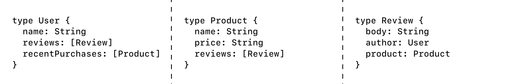
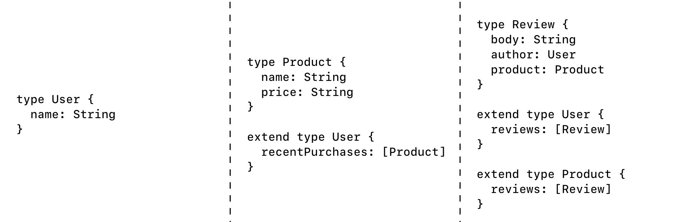

import FederationArchitecture from '../../shared/diagrams/federation-architecture.mdx';

To get the most out of GraphQL, your organization should expose a [single data
graph](https://principledgraphql.com/integrity#1-one-graph) that provides a
unified interface for querying all of your backing data sources. This
allows clients to fetch data from any number of sources simultaneously,
_without_ needing to know which data comes from which source.

As your data graph grows, however, it can become inefficient or even difficult
to represent the graph with a single, monolithic GraphQL server. To remedy this,
you can divide your data graph's implementation across multiple composable
services with **Apollo Federation**.

Unlike other distributed GraphQL
architectures (such as schema stitching), Apollo Federation uses a declarative
programming model that enables each **implementing service** to
implement _only_ the part of your data graph that it should be responsible for.
This way, your organization can represent an enterprise-scale data graph as a
collection of separately maintained GraphQL services.

## Architecture

An Apollo Federation architecture consists of:

* A collection of **implementing services** that each define a distinct GraphQL schema
* A **gateway** that composes the distinct schemas into a **federated data graph** and executes queries across the services in the graph

<FederationArchitecture />

Apollo Server provides libraries for acting both as an implementing service and as a gateway, but these components can be implemented in any language and framework.

> Apollo Federation does not currently support [GraphQL subscription operations](https://www.apollographql.com/docs/react/data/subscriptions/).

The following presentation by [Mandi Wise](https://twitter.com/mandiwise) further describes the architecture of Apollo Federation and walks through implementing a federated graph:

<iframe width="560" height="315" src="https://www.youtube.com/embed/v_1bn2sHdk4?start=81" frameborder="0" allow="accelerometer; autoplay; encrypted-media; gyroscope; picture-in-picture" allowfullscreen></iframe>

## Core principles

### Incremental adoption

Like the rest of the Apollo platform, Apollo Federation can (and should) be
adopted **incrementally**:

* If you currently use a monolithic GraphQL server, you can break its functionality out one service at a time.
* If you currently use a different federated architecture (such as schema stitching), you can [add federation support to your existing implementing services one at a time](/federation/migrating-from-stitching/).

In both of these cases, all of your clients will continue to work throughout
your incremental migration. In fact, clients have no way to distinguish between
different data graph implementations.

### Separation of concerns

Apollo Federation encourages a design principle called [separation of concerns](https://en.wikipedia.org/wiki/Separation_of_concerns). This enables different teams to work on different products and features within a single data graph, without interfering with each other.

#### Limitations of type-based separation

When considering how to split a single GraphQL schema across multiple services, it seems straightforward to divide schemas up by type. For example, a `users` service would define the entirety of a `User` type, the `products` service would define a `Product` type, and so on:

</img>

Although this separation looks clean, it quickly causes issues. Specifically, a particular feature (or concern) usually spans multiple types.

Consider the `recentPurchases` field of the `User` type in the above schema. Even though this field is a member of the `User` type, a list of `Product`s should nevertheless be populated by the `products` service, _not_ the `users` service.

By defining the `recentPurchases` field in the `products` service instead:

* The service that defines the field is also the service that knows how to populate the field. The `users` service might not even have access to the back-end data store that contains product data.
* The team that manages product data can contain all product-related logic in a single service that they own unilaterally.

#### Concern-based separation

The following schema uses Apollo Federation to divide the same set of types and fields across the same three services:

</img>

The difference is that now, each service defines the types and fields that it is capable of (and _should_ be responsible for) populating from its back-end data store.

The result is the best of both worlds: an implementation that keeps all the code for a given feature in a single service and separated from unrelated concerns, and a product-centric schema with rich types that reflects the natural way an application developer would want to consume the graph.

## Apollo Server libraries

Apollo Server supports Apollo Federation via two open-source extension libraries:

* `@apollo/federation` provides primitives that your implementing services use to make their individual GraphQL schemas composable.
* `@apollo/gateway` enables you to set up an instance of Apollo Server as a **gateway** that distributes incoming GraphQL operations across one or more  implementing services.

## Federated schema example

Let's look at an example. Below, we define the schema for a basic e-commerce
application as three _federated_ schemas, each of which is implemented as
a standalone GraphQL service:

```graphql:title=accounts
extend type Query {
  me: User
}

type User @key(fields: "id") {
  id: ID!
  username: String!
}
```

```graphql:title=products
extend type Query {
  topProducts(first: Int = 5): [Product]
}

type Product @key(fields: "upc") {
  upc: String!
  name: String!
  price: Int
}
```

```graphql:title=reviews
type Review {
  body: String
  author: User @provides(fields: "username")
  product: Product
}

extend type User @key(fields: "id") {
  id: ID! @external
  reviews: [Review]
}

extend type Product @key(fields: "upc") {
  upc: String! @external
  reviews: [Review]
}
```

These schemas illustrate several important conventions of Apollo Federation:

* An implementing service can reference a type that's defined by
_another_ implementing service. For example, the `Review` type includes a
`product` field of type `Product`, even though the `Product` type is defined in
a different service.

* An implementing service can also _extend_ a type that's defined by another
implementing service. For example, the `reviews` service extends the `User`
type by adding a `reviews` field to it.

* An implementing service must add the `@key` directive to a type's definition
in order for _other_ services to be able to reference or extend that type. This
directive tells other services which fields to use to uniquely identify a
particular instance of the type.

## Gateway example

The gateway for our federated data graph fetches the schema from each
implementing service and composes those schemas into a single graph:

```js
const gateway = new ApolloGateway({
  serviceList: [
    { name: 'accounts', url: 'http://localhost:4001' },
    { name: 'products', url: 'http://localhost:4002' },
    { name: 'reviews', url: 'http://localhost:4003' }
  ]
});

const server = new ApolloServer({ gateway });
server.listen();
```

That’s it! With Apollo Federation, schemas and resolvers live in your
implementing services. The gateway serves only to plan and execute GraphQL
operations across those implementing services.

### Managed federation

In addition to running a gateway with a static list of services, Apollo Gateway can operate in **managed federation** mode, where [Apollo Studio](https://www.apollographql.com/docs/graph-manager/) acts as the source of truth for each implementing service's schema.

This mode enables multiple teams working on a data graph to coordinate when and how underlying services change. For more information, read [Managed federation overview](https://www.apollographql.com/docs/graph-manager/managed-federation/overview/).

## Query example

Now we can execute GraphQL operations against our composed schema just as if it
were implemented as a single, monolithic service:

```graphql
# A query that the gateway resolves by calling all three services
query GetCurrentUserReviews {
  me {
    username
    reviews {
      body
      product {
        name
        upc
      }
    }
  }
}
```

Next, learn how to [define an implementing service](./implementing-services/).
