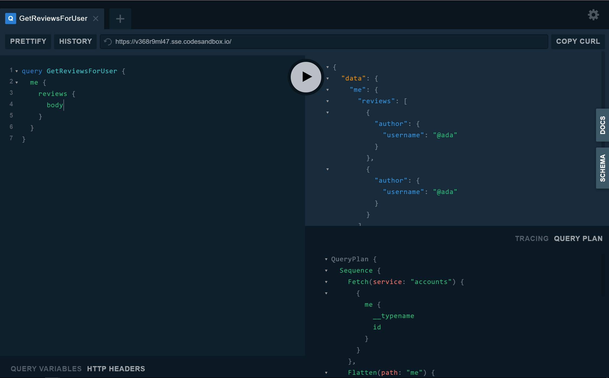

Like any distributed architecture, you should make sure that your federated GraphQL layer has proper observability and monitoring to ensure the best reliability and performance of both your gateway and the federated services underneath it. This document is meant to provide best practices and how-tos for observability and control over your federated architecture. If you're running Federation in production, we'd love to [hear from you](<LINK_TO_EMAIL>) and accept any [contribution](LINK_TO_GITHUB) to this documentation.

## Managed Federation

// TODO: Document the outline for how managed federation works, how to enable it, how it protects, etc.

#### Overview

#### Controlling rollout

#### Reliability

## Observing Gateway Changes

## Enabling Federated Metrics

## Inspecting Query Plans

When the gateway receives a new query, it generates a query plan that defines the sequence of requests the gateway will send to the necessary downstream services. Inspecting a query plan can be a helpful tool in understanding the gateway and exploring how directives like [`@requires`](/federation/advanced-features/#computed-fields) and [`@provides`](/federation/advanced-features/#using-denormalized-data) can help optimize query plans. To make it easy to access query plans, the `@apollo/gateway` package includes a build of GraphQL Playground that adds a query plan inspector.

## Observing Gateway Composition

## Observing Operation Life-cycle
