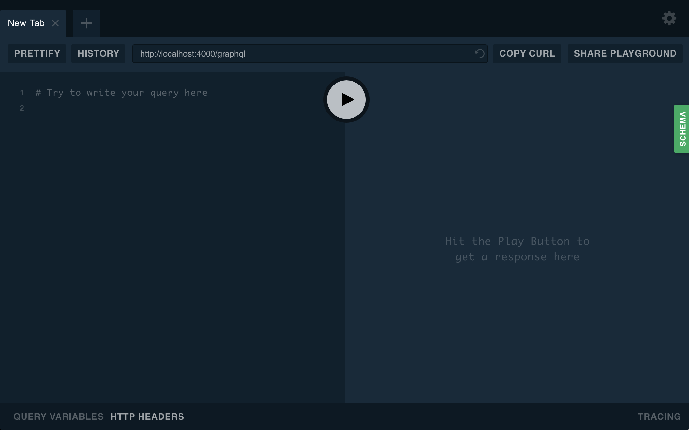
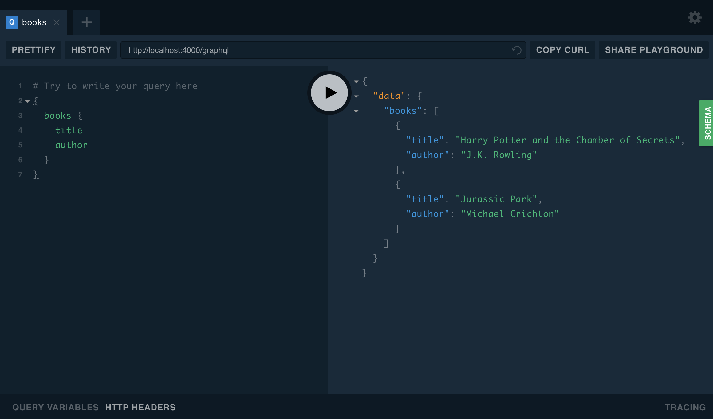

> Estimated time: About 10 minutes.

In this guide, we'll walk you through the process of creating a GraphQL server in JavaScript.  By the end of the guide you should expect to:

* Have a basic GraphQL server which will work as a foundation for a more complex server.
* Have a basic understanding of the fundamental GraphQL principles.
* Be able to send a query to the new GraphQL server and see the response using GraphQL Playground.

To be successful, make sure you already have general JavaScript knowledge and a recent version of Node.js installed (8+).

If you want to skip walking through the steps, the [More information](#More-information) section at the bottom has a link to a GitHub repository which can be cloned and run locally, and a Glitch to play around in your browser!

## Step 1: Project initialization

In this step, we'll use your terminal (e.g. Terminal, iTerm, PowerShell) to create a directory called `graphql-server-example` along with a basic Node.js configuration for a simple application.  We'll work within this directory for the rest of the steps, though we will switch back and forth between your IDE (editor)

* First, create a folder called `graphql-server-example` using the `mkdir` command.

      mkdir graphql-server-example

* Enter the directory, so the remaining work will take place within that directory.

      cd graphql-server-example

* Initialize the new directory as a Node.js project using the Node.js package manager, `npm`.

      npm init --yes

  >  We use `npm`, the default package manager which ships with Node.js.  Other package managers, such as [Yarn](http://yarnpkg.com), offer similar functionality, but will not be covered in this guide.

If the above steps all completed successfully, there should be a new `package.json` file in the directory.  You can verify this by running `ls` (list files).

## Step 2: Install dependencies

Next, we'll install the two core dependencies which are necessary for responding to GraphQL requests:

* [`apollo-server`](//npm.im/apollo-server): The Apollo server library which allows you to focus on defining the shape of your data and how to fetch it.
* [`graphql`](//npm.im/graphql): The library used to build a schema and to execute queries on that schema.
  > Note: There won't be any usage of the `graphql` package in this guide, but it is required to be installed separately as it's an important "peer dependency" of Apollo Server.

While you could write all of the necessary code yourself, these two dependencies make it easier to build a GraphQL server and are common in applications of all sizes.

Run the following command to install both of these dependencies and save them in the project:

    npm install apollo-server graphql

In the next step, we'll use these dependencies to create a server which processes and responds to incoming GraphQL requests.

## Step 3: Create the server

In this step, we'll provide a code block which sets up `apollo-server` to respond to an incoming GraphQL request.  In order to move along quickly, we'll have you copy and paste the code into an `index.js` file in your project.  When looking at the code, we hope you'll find the comments helpful in understanding the core GraphQL concepts.  Don't worry if there is something which needs more explanation; we'll point you to the right places for more details at the end of this guide.

The example code will utilize a static collection of two books.  In a more complicated example, the books might be fetched from a web resource (e.g. Amazon or a local library's website) or a database (e.g. MySQL or MongoDB).

1. Using an IDE/editor, open the `graphql-server-example` directory which we created in the first step.
2. Create a new, blank file called `index.js` in the root of the project directory.
3. "Copy" the following code block, "Paste" it into the `index.js` file you created in the previous step, then "Save" the file:

```js
const { ApolloServer, gql } = require('apollo-server');

// This is a (sample) collection of books we'll be able to query
// the GraphQL server for.  A more complete example might fetch
// from an existing data source like a REST API or database.
const books = [
  {
    title: 'Harry Potter and the Chamber of Secrets',
    author: 'J.K. Rowling',
  },
  {
    title: 'Jurassic Park',
    author: 'Michael Crichton',
  },
];

// Type definitions define the "shape" of your data and specify
// which ways the data can be fetched from the GraphQL server.
const typeDefs = gql`
  # Comments in GraphQL are defined with the hash (#) symbol.

  # This "Book" type can be used in other type declarations.
  type Book {
    title: String
    author: String
  }

  # The "Query" type is the root of all GraphQL queries.
  # (A "Mutation" type will be covered later on.)
  type Query {
    books: [Book]
  }
`;

// Resolvers define the technique for fetching the types in the
// schema.  We'll retrieve books from the "books" array above.
const resolvers = {
  Query: {
    books: () => books,
  },
};

// In the most basic sense, the ApolloServer can be started
// by passing type definitions (typeDefs) and the resolvers
// responsible for fetching the data for those types.
const server = new ApolloServer({ typeDefs, resolvers });

// This `listen` method launches a web-server.  Existing apps
// can utilize middleware options, which we'll discuss later.
server.listen().then(({ url }) => {
  console.log(`🚀  Server ready at ${url}`);
});
```

The code above includes everything that is necessary to get this basic GraphQL server running.  In the next step, we'll start the server so it's ready to respond to requests!

## Step 4: Start the server

For this step, we'll return to the terminal/console and start the server we defined in the previous steps.

* Run the `index.js` file we created in the previous step using Node.js

      node index.js

* You should see the following output from the above command:

      🚀 Server ready at http://localhost:4000/

* Open the address provided in your web browser.
* If everything is working, you should see the GraphQL Playground explorer tool, which we will use in the next step.



In the next step, we'll use the GraphQL Playground tool to send queries to the GraphQL server.

## Step 5: Running your first query

At this point, you'll be able to start sending queries to the GraphQL server using GraphQL Playground, which is split into a few parts:

* The request (on the left)
* The response (on the right)
* The documentation (available using the green "SCHEMA" button on the far right side)

Since we're trying to obtain books, we can enter the following query on the left side of the window. This query asks for a list of books, including the title and author for each book.

```
{
  books {
    title
    author
  }
}
```

If we press the play button in the middle, we should see a response on the right that looks something like this:



## Next steps

This application should be a great starting point for any GraphQL server, but the following resources are a great next step in building a GraphQL server:

* [Adding Apollo Server to an existing app.](./essentials/server.html#integrations)
* [Schema design](./essentials/schema.html)
* [Deploy with Heroku](./deployment/heroku.html)

## More information

### GitHub Repository

The code from the above examples can be accessed in our [getting started example repository](https://github.com/apollographql/graphql-server-example) on GitHub

### Online Playground

It's also possible to play with this example on Glitch, by remixing the repository.

[](https://glitch.com/edit/#!/import/github/apollographql/graphql-server-example)
