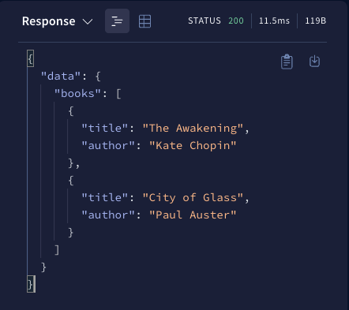

This tutorial helps you:

* Obtain a basic understanding of GraphQL principles
* Define a GraphQL **schema** that represents the structure of your data set
* Run an instance of Apollo Server that lets you execute queries against your schema

This tutorial assumes that you are familiar with the command line and
JavaScript and have installed a recent Node.js (16+) version. Additionally, for those interested, this tutorial includes an optional section describing how to set up Apollo Server with TypeScript.

<!-- TODO: before releasing, double-check imports & links -->

## Step 1: Create a new project

1. From your preferred development directory, create a directory for a new project and `cd` into it:

  ```bash
  mkdir graphql-server-example
  cd graphql-server-example
  ```

2. Initialize a new Node.js project with `npm` (or another package manager you
prefer, such as Yarn):

  ```bash
    npm init --yes
  ```

Your project directory now contains a `package.json` file.

## Step 2: Install dependencies
Applications that run Apollo Server require two top-level dependencies:
* [`@apollo/server`](https://www.npmjs.com/package/@apollo/server) is the core library for Apollo Server itself, which helps you define the shape of your data and how to fetch it.
* [`graphql`](https://npm.im/graphql) is the library used to build a GraphQL schema and execute queries against it.

Run the following command to install all of these packages and save them in
your project's `node_modules` directory:

```bash
  npm install @apollo/server graphql
```

Follow the instructions below to set up with either TypeScript or JavaScript:

<ExpansionPanel title="Set up with TypeScript (Recommended)">

#### Set up with TypeScript

1. Create a `src` directory with an empty `index.ts` file to contain **all** of the code for our example application:

```bash
mkdir src
touch src/index.ts
```

2. Run the following command to install the `typescript` package into your project's dev dependencies:

```bash
npm install --save-dev typescript
```

3. Next, create a `tsconfig.json` file in your project:

```bash
touch tsconfig.json
```

4. The `tsconfig.json` file enables you to configure how TypeScript will compile your code. Add the following configuration to your `tsconfig.json` file:

```json title="tsconfig.json"
{
  "compilerOptions": {
    "rootDirs": ["src"],
    "outDir": "dist",
    "lib": ["es2019"],
    "target": "es2019",
    "module": "esnext",
    "moduleResolution": "node",
    "esModuleInterop": true
  }
}
```

For more information on the compiler options above, see the [TypeScript Compiler docs](https://www.typescriptlang.org/tsconfig).

5. Finally, add a `type` and `scripts` to your `package.json` file:
```json title="package.json"
{
  // ...etc.
  "type": "module",
  "scripts": {
    "start": "tsc && node ./dist/index.js"
  },
  // other dependencies
}
```

The above `start` script tells TypeScript to compile your code into JavaScript before using `node` to run that compiled code. Setting your project's [`type` to `module`](https://nodejs.org/api/packages.html#approach-1-use-an-es-module-wrapper) loads your JavaScript files as ES modules, enabling you to use top-level [`await`](https://developer.mozilla.org/en-US/docs/Web/JavaScript/Reference/Statements/async_function) calls.

</ExpansionPanel>

<ExpansionPanel title="Set up with JavaScript">

#### Set up with JavaScript

If you are using JavaScript, create a `index.js` file that will contain **all** of the code for our example application:

```bash
  touch index.js
```

Then add the following script to your `package.json`:

```json title="package.json"
{
  "scripts": {
    "start": "node index.js"
  },
}
```

</ExpansionPanel>

## Step 3: Define your GraphQL schema

> The code blocks below use TypeScript by default. You can use the dropdown menu above each code block to switch to JavaScript.
>
>If you're using JavaScript, use the `.js` file extension instead of the `.ts` file extension.

Every GraphQL server (including Apollo Server) uses a **schema** to define the structure of data that clients can query. In this example, we'll create a server for querying a collection of books by title and author.

Open `index.ts` in your preferred code editor and paste the following into it:

<MultiCodeBlock>

```ts title="index.ts"
import { ApolloServer, startStandaloneServer } from '@apollo/server';

// A schema is a collection of type definitions (hence "typeDefs")
// that together define the "shape" of queries that are executed against
// your data.
const typeDefs = `#graphql
  # Comments in GraphQL strings (such as this one) start with the hash (#) symbol.

  # This "Book" type defines the queryable fields for every book in our data source.
  type Book {
    title: String
    author: String
  }

  # The "Query" type is special: it lists all of the available queries that
  # clients can execute, along with the return type for each. In this
  # case, the "books" query returns an array of zero or more Books (defined above).
  type Query {
    books: [Book]
  }
`;
```

```js title="index.js"
import { ApolloServer, startStandaloneServer } from '@apollo/server';

// A schema is a collection of type definitions (hence "typeDefs")
// that together define the "shape" of queries that are executed against
// your data.
const typeDefs = `#graphql
  # Comments in GraphQL strings (such as this one) start with the hash (#) symbol.

  # This "Book" type defines the queryable fields for every book in our data source.
  type Book {
    title: String
    author: String
  }

  # The "Query" type is special: it lists all of the available queries that
  # clients can execute, along with the return type for each. In this
  # case, the "books" query returns an array of zero or more Books (defined above).
  type Query {
    books: [Book]
  }
`;
```

</MultiCodeBlock>


> Adding `#graphql` to the beginning of a [template literal](https://developer.mozilla.org/en-US/docs/Web/JavaScript/Reference/Template_literals) provides GraphQL syntax highlighting in supporting IDEs.

This snippet defines a simple, valid GraphQL schema. Clients will be able to execute a query named `books`, and our server will return an array of zero or more `Book`s.

## Step 4: Define your data set

Now that we've defined the _structure_ of our data, we can define the data itself.

Apollo Server can fetch data from any source you connect to (including a database, a REST API, a static object storage service, or even another GraphQL
server). For the purposes of this tutorial, we'll hardcode our example data.

Add the following to the bottom of your `index.ts` file:

<MultiCodeBlock>

```ts title="index.ts"
const books = [
  {
    title: 'The Awakening',
    author: 'Kate Chopin',
  },
  {
    title: 'City of Glass',
    author: 'Paul Auster',
  },
];
```

```js title="index.js"
const books = [
  {
    title: 'The Awakening',
    author: 'Kate Chopin',
  },
  {
    title: 'City of Glass',
    author: 'Paul Auster',
  },
];
```

</MultiCodeBlock>

This snippet defines a simple data set that clients can query. Notice that the two objects in the array each match the structure of the `Book` type we defined in our schema.

## Step 5: Define a resolver

We've defined our data set, but Apollo Server doesn't know that it should _use_ that data set when it's executing a query. To fix this, we create a **resolver**.

Resolvers tell Apollo Server _how_ to fetch the data associated with a particular type. Because our `Book` array is hardcoded, the corresponding resolver is straightforward.

Add the following to the bottom of your `index.ts` file:

<MultiCodeBlock>

```ts title="index.ts"
// Resolvers define how to fetch the types defined in your schema.
// This resolver retrieves books from the "books" array above.
const resolvers = {
  Query: {
    books: () => books,
  },
};
```

</MultiCodeBlock>

## Step 6: Create an instance of `ApolloServer`

We've defined our schema, data set, and resolver. Now we need to provide
this information to Apollo Server when we initialize it.

Add the following to the bottom of your `index.ts` file:

<MultiCodeBlock>

```ts title="index.ts"
// The ApolloServer constructor requires two parameters: your schema
// definition and your set of resolvers.
const apolloServerInstance = new ApolloServer({
  typeDefs,
  resolvers,
});

// Passing an ApolloServer instance to the `startStandaloneServer` function:
//  1. creates an Express app
//  2. installs your ApolloServer instance as middleware
//  3. prepares your app to handle incoming requests
const { url } = await startStandaloneServer(apolloServerInstance, {
  listen: { port: 4000 },
});

console.log(`🚀  Server ready at: ${url}`);
```

</MultiCodeBlock>

## Step 7: Start the server

We're ready to start our server! Run the following from your project's root
directory:

```bash
npm start
```

You should now see the following output at the bottom of your terminal:

```
🚀  Server ready at: http://localhost:4000/
```

We're up and running!

## Step 8: Execute your first query

We can now execute GraphQL queries on our server. To execute our first query, we can use [**Apollo Sandbox**](/studio/explorer/sandbox/).

Visit `http://localhost:4000` in your browser, which will open the Apollo Sandbox:


The Sandbox UI includes:

* An Operations panel for writing and executing queries (in the middle)
* A Response panel for viewing query results (on the right)
* Tabs for schema exploration, search, and settings (on the left)
* A URL bar for connecting to other GraphQL servers (in the upper left)

Our server supports a single query named `books`. Let's execute it!

Here's a GraphQL **query string** for executing the `books` query:

```graphql
query GetBooks {
  books {
    title
    author
  }
}
```

Paste this string into the Operations panel and click the blue button in the upper right. The results (from our hardcoded data set) appear in the Response panel:



> **Note:** If Apollo Sandbox can't find your schema, ensure you have introspection enabled by passing `introspection: true` to the `ApolloServer` constructor. We recommend disabling introspection when using Apollo Server in a production environment.

One of the most important concepts of GraphQL is that clients can choose to query _only for the fields they need_. Delete `author` from the query string and execute it again. The response updates to include only the `title` field for each book!

## Combined example

You can view and fork this complete example on CodeSandbox:
<!-- TODO: Fix this sandbox link after docs examples is up -->
<a href="https://codesandbox.io/s/github/apollographql/docs-examples/tree/RK/add-as4-getting-started/apollo-server/v4/getting-started?fontsize=14&hidenavigation=1&theme=dark">
  
</a>

## Next steps

This example application is a great starting point for working with
Apollo Server. Check out the following resources to learn more about the basics
of schemas, resolvers, and deployment:

* [Schema basics](/apollo-server/schema/schema/)
* [Resolvers](/apollo-server/data/resolvers/)
* [Deploying with Heroku](/apollo-server/deployment/heroku/)

Want to learn how to modularize and scale a GraphQL API?  Check out the [Apollo Federation Docs](/federation) to learn how a federated architecture can create a unified *supergraph* that combines multiple GraphQL APIs.


