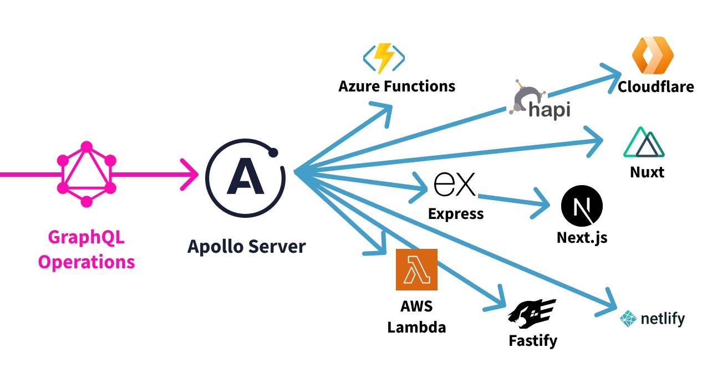

> 📣 **Apollo Server 4 is generally available!**
>
> [See what's new](/apollo-server/migration/) or check out the [tutorial for migrating from Apollo Server 3](https://www.apollographql.com/tutorials/side-quest-as4?referrer=docs-content).
>
> Docs for Apollo Server 3 are [available here](/apollo-server/v3/).

**Apollo Server is an [open-source](https://github.com/apollographql/apollo-server), spec-compliant GraphQL server** that's compatible with any GraphQL client, including [Apollo Client](/react). It's the best way to build a production-ready, self-documenting GraphQL API that can use data from any source.

#### You can use Apollo Server as:

* The GraphQL server for a [subgraph](/apollo-server/using-federation/apollo-subgraph-setup) in a federated supergraph
* An add-on to any new or existing Node.js apps—this includes apps running on [Express](/apollo-server/api/express-middleware) (including [MERN stack](/apollo-server/integrations/mern) apps), [AWS Lambda](https://www.npmjs.com/package/@as-integrations/aws-lambda), [Azure Functions](https://www.npmjs.com/package/@as-integrations/azure-functions), [Cloudflare](https://www.npmjs.com/package/@as-integrations/cloudflare-workers), [Fastify](https://www.npmjs.com/package/@as-integrations/fastify), and [more](/apollo-server/integrations/integration-index)

#### Apollo Server provides:

*  **Straightforward setup**, so your client developers can start fetching data quickly
*  **Incremental adoption**, enabling you to add features as they're needed
*  **Universal compatibility** with any data source, any build tool, and any GraphQL client
*  **Production readiness**, enabling you to confidently run your graph in production

#### Ready to try it out?

<ButtonLink href="/apollo-server/getting-started" size="lg">
  Get started!
</ButtonLink>
