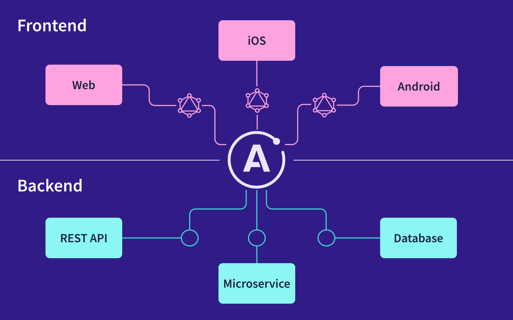

> 📣 **Apollo Server 5 is generally available!**
>
> Not much has changed since v4, the [v5 migration guide](./migration/) is a one minute read.
>
> Using Apollo Server 3? Be sure to follow the [v4 migration guide](/apollo-server/v4/migration/) first. Docs for v3 are [available here](/apollo-server/v3/).

**Apollo Server is an [open-source](https://github.com/apollographql/apollo-server), spec-compliant GraphQL server** that's compatible with any GraphQL client, including [Apollo Client](/react). It's the best way to build a production-ready, self-documenting GraphQL API that can use data from any source.

#### You can use Apollo Server as:

* The GraphQL server for a [subgraph](./using-federation/apollo-subgraph-setup) in a federated supergraph
* A [stand-alone GraphQL server](./api/standalone)
* An add-on to your application's existing Node.js [middleware](./integrations/integration-index) (such as [Express](./api/express-middleware), AWS Lambda, or Fastify)

#### Apollo Server provides:

*  **Straightforward setup**, so your client developers can start fetching data quickly
*  **Incremental adoption**, enabling you to add features as they're needed
*  **Universal compatibility** with any data source, any build tool, and any GraphQL client
*  **Production readiness**, enabling you to confidently run your graph in production

#### Ready to try it out?

  <ButtonLink href="./getting-started" size="lg">
    Get started!
  </ButtonLink>

