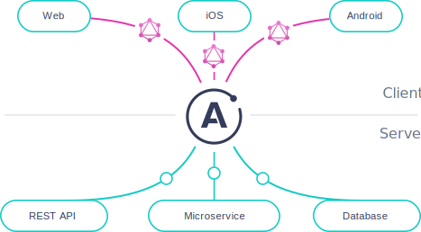

> **Apollo Server 3 is currently available as a release candidate. To install the current release candidate, specify `@rc` after the name of the Apollo Server package you are installing; for example, `npm install apollo-server@rc`.**

**Apollo Server is an [open-source](https://github.com/apollographql/apollo-server), spec-compliant GraphQL server** that's compatible with any GraphQL client, including [Apollo Client](https://www.apollographql.com/docs/react). It's the best way to build a production-ready, self-documenting GraphQL API that can use data from any source.

#### You can use Apollo Server as:

* A stand-alone GraphQL server, including in a serverless environment
* An add-on to your application's existing [Node.js middleware](./integrations/middleware/) (such as Express or Fastify)
* A gateway for a [federated data graph](https://www.apollographql.com/docs/federation/)

#### Apollo Server provides:

*  **Straightforward setup**, so your client developers can start fetching data quickly
*  **Incremental adoption**, allowing you to add features as they're needed
*  **Universal compatibility** with any data source, any build tool, and any GraphQL client
*  **Production readiness**, enabling you to ship features faster

#### Ready to try it out?

import {Button} from '@apollo/space-kit/Button';
import {Link} from 'gatsby';

  <Button as={<Link to="/getting-started/" />} size="large">
    Get started!
  </Button>

