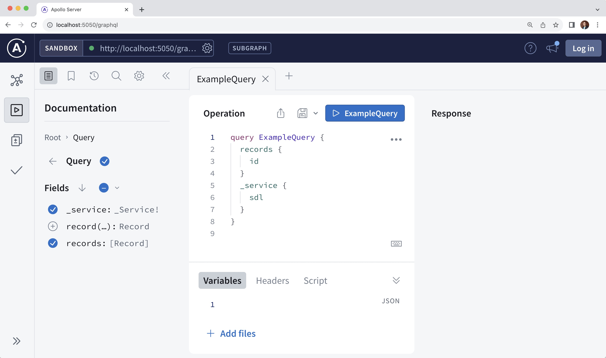

Apollo Server is designed to work seamlessly with MERN stack (MongoDB, Express, React, Node) applications. This tutorial shows how to add Apollo Server to an existing MERN stack project. Specifically, this tutorial demonstrates how to:

- Run an Apollo Server instance that lets you execute GraphQL operations
- Expose a GraphQL route in a MERN stack application

## Prerequisites

This tutorial assumes that you're familiar with the command line and JavaScript. Additionally, it requires the following:
- You've installed a recent Node.js version (`v14.16.0+`).
- You've completed MongoDB's [MERN stack tutorial](https://www.mongodb.com/languages/mern-stack-tutorial) or have your own existing MERN stack application.
    - The tutorial's code examples build off the tutorial, but you can adapt them to your application's requirements.
- You have a MongoDB database with a `records` collection that has `name`, `position`, and `level` columns.
    - The tutorial's code examples use these column names, but you can adapt them to your database's schema.

## Step 1: Install dependencies

In your server folder, run the following command to install these packages and save them in
your server project's `node_modules` directory:

```bash
  npm install graphql graphql-tag @apollo/subgraph @apollo/server
```

- [`graphql`](https://www.npmjs.com/package/graphql) is the JavaScript reference implementation for GraphQL
- [`graphql-tag` ](https://www.npmjs.com/package/graphql-tag) is a utility package to parse a GraphQL string into the standard GraphQL abstract syntax tree (AST)
- [`@apollo/subgraph`](https://www.npmjs.com/package/@apollo/subgraph) is a utility package for creating GraphQL microservices
- [`@apollo/server`](https://www.npmjs.com/package/@apollo/server) is a spec-compliant GraphQL server that exposes a `/graphql` endpoint

## Step 2: Define your GraphQL schema

Every GraphQL server (including Apollo Server) uses a schema to define the data that clients can query. The following example creates a schema for the [prerequisite tutorial](https://www.mongodb.com/languages/mern-stack-tutorial)'s `records` collection:

In your server's `/src` folder, create a `schema.graphql` file and paste in the following schema:

```graphql
type Query {
  record(id:ID!): Record
  records: [Record]
}

type Mutation {
  createRecord(name: String!, position: String, level: String): Record
  deleteRecord(id: ID!): Boolean
  updateRecord(id: ID! name: String, position: String, level: String): Record
}

type Record {
  id: ID
  name: String
  position: String
  level: String
}
```
This schema lets you perform various actions on records: fetching single or multiple records, creating new records, deleting records, and updating existing records. For more information on schema definition, check out the [schema basics](../schema/schema/) docs.

## Step 3: Define the resolvers

Resolver functions are responsible for performing the actions defined in the schema—for example, fetching and updating records. In a MERN stack application, they're how you connect the GraphQL schema to your MongoDB instance.

In your server's `/src` folder, create a new `resolvers.js` file and paste in the following resolvers:

```js
import db from "./db/connection.js";

const resolvers = {
  Record: {
    id: (parent) => parent.id ?? parent._id,
  },
  Query: {
    async record(_, { id }) {
      let collection = await db.collection("records");
      let query = { _id: new ObjectId(id) };

      return await collection.findOne(query);
    },
    async records(_, __, context) {
      let collection = await db.collection("records");
      const records = await collection.find({}).toArray();
      return records;
    },
  },
  Mutation: {
    async createRecord(_, { name, position, level }, context) {
      let collection = await db.collection("records");
      const insert = await collection.insertOne({ name, position, level });
      if (insert.acknowledged)
        return { name, position, level, id: insert.insertedId };
      return null;
    },
    async updateRecord(_, args, context) {
      const id = new ObjectId(args.id);
      let query = { _id: new ObjectId(id) };
      let collection = await db.collection("records");
      const update = await collection.updateOne(
        query,
        { $set: { ...args } }
      );

      if (update.acknowledged)
        return await collection.findOne(query);

      return null;
    },
    async deleteRecord(_, { id }, context) {
      let collection = await db.collection("records");
      const dbDelete = await collection.deleteOne({ _id: new ObjectId(id) });
      return dbDelete.acknowledged && dbDelete.deletedCount == 1 ? true : false;
    },
  },
};

export default resolvers;
```

You may have noticed the code for each resolver function is similar to the code in your application's `/record` route. That's because these resolvers provide the same logic as performing CRUD operations on your records collection.

To learn more about writing resolver functions, check out the [resolver docs](../data/resolvers).

## Step 4: Add Apollo Server to your Express server

Now you can begin integrating Apollo Server into your Express server. Wherever you instantiate your `express` server (usually `mern/server/server.js`), import `@apollo/server` and its `expressMiddleware`. Then, instantiate and `start` the Apollo Server:

```js
import express from 'express';
import cors from 'cors';
import records from "./routes/record.js";

//highlight-start
import gql from "graphql-tag";
import { ApolloServer } from '@apollo/server';
import { buildSubgraphSchema } from '@apollo/subgraph';
import { expressMiddleware } from '@apollo/server/express4';
import resolvers from "./resolvers.js";
import { readFileSync } from "fs";
//highlight-end

const PORT = process.env.PORT || 5050;
const app = express();

app.use(cors());
app.use(express.json());

//highlight-start
const typeDefs = gql(
    readFileSync("schema.graphql", {
      encoding: "utf-8",
    })
  );

const server = new ApolloServer({
    schema: buildSubgraphSchema({ typeDefs, resolvers }),
});
// Note you must call `start()` on the `ApolloServer`
// instance before passing the instance to `expressMiddleware`
await server.start();
//highlight-end

app.use("/record", records);

// start the Express server
app.listen(PORT, () => {
  console.log(`Server is running on port: ${PORT}`);
});
```

Next, you'll use the middleware to integrate the [previously defined resolvers](#step-3-define-the-resolvers) into a route.

## Step 5: Add the `/graphql` route to your server API endpoints

In the same server file, add the `/graphql` route:

```ts
app.use("/record", records);
// Specify the path to mount the server
//highlight-start
app.use(
  '/graphql',
  cors(),
  express.json(),
  expressMiddleware(server),
);
//highlight-end

app.listen(PORT, () => {
  console.log(`Server is running on port: ${PORT}`);
});
```

This route provides access to the Apollo Server's [resolver functions you previously defined](#step-3-define-the-resolvers). Note that the `/records` route hasn't been removed. That means your Express server can handle both GraphQL and RESTful routes.

## Step 6: Start the server

You're ready to start your server! Run the following from your project's server
directory:

```bash
npm start
```

Your console output should display `Server is running on port: 5050`.

## Step 7: Execute your first query

You can now execute GraphQL queries on the server. To execute your first query, you can use [**Apollo Sandbox**](/graphos/explorer/sandbox/).

Visit your MERN server in your browser at the `/graphql` route, which will open the Apollo Sandbox:



The Sandbox UI includes:

- A URL input bar for connecting to other GraphQL servers (in the upper left)
- Tabs for schema exploration, search, and settings (on the left)
- An **Operations** panel for writing and executing queries (in the middle)
- A **Response** panel for viewing query results (on the right)

To learn more about what Sandbox offers, check out the [Sandbox docs](/graphos/explorer/sandbox/).

The server supports querying the `records`, so let's do it! Paste this GraphQL query string for executing the `records` query into the **Operations** panel and click the run button.

```graphql
query GetRecords {
  records {
    name
    position
    level
  }
}
```

You should see your records appear in the **Response** panel.

## Complete example

You can view and fork the complete server example on CodeSandbox:

<ButtonLink
  href="https://codesandbox.io/s/github/apollographql/docs-examples/tree/main/apollo-server/v4/mern-stack?fontsize=14&hidenavigation=1&theme=dark"
  size="lg"
>
  Edit in CodeSandbox
</ButtonLink>

## Next steps

Congrats on completing the tutorial! 🎉 Incorporating a GraphQL server into your MERN application marks a pivotal step towards creating more efficient, flexible, and user-centric web experiences. And now that you've integrated Apollo Server into your MERN stack application, you can use [GraphOS](/graphos/) to build and scale even faster.

While this tutorial only covers the server portion of the MERN stack, the `/client` folder in the [completed example](#complete-example) picks up where the tutorial left off and implements [`@apollo/client`](/react/) to interact with the server. For more information on implementing the Apollo Client, head to the [getting started docs](/react/get-started).

For more hands-on learning on GraphQL and Apollo's server and client libraries, check out our interactive [Odyssey tutorials](https://www.apollographql.com/tutorials/). For an example that uses MongoDB Atlas in a subgraph and makes data available via the GraphOS Router, check out the [Apollo Solutions repository](https://github.com/apollosolutions/example-subgraph-mongodb).

<SolutionsNote />
