import { MultiCodeBlock } from 'gatsby-theme-apollo-docs';

Apollo Server is distributed as a collection of different packages for different environments and web frameworks. You can choose which package to use based on your project.

## Which package should I use?

**In most cases,** you should get started with the "batteries-included" `apollo-server` package.

If your project has specific requirements, we recommend choosing a package based on this flowchart:

```mermaid
graph TB;
  serverless("Am I running in a serverless environment?");
  serverless--No-->framework("Am I extending an existing HTTP server that <br>uses a particular Node.js framework?");
  serverless--Yes-->useServerless("Use the corresponding<br> serverless package");
  framework--No-->useServer("Start with apollo-server");
  framework--Yes-->useFramework("Use the corresponding<br> framework package");
  useServer--"If advanced configuration is required…"-->opinion("Do I want to use a particular<br> Node.js framework?");
  opinion--No-->useExpress("Swap to apollo-server-express");
  opinion--Yes-->usePreference("Swap to the corresponding<br> framework package");
  class useServerless,useServer,useFramework,useExpress,usePreference secondary;
```



After you choose a package, see its [basic usage](#basic-usage).

### All supported packages

<table class="field-table api-ref">
  <thead>
    <tr>
      <th>Name</th>
      <th>Description</th>
    </tr>
  </thead>

<tbody>

<tr class="required">
<td style="min-width: 175px">

`apollo-server`

</td>
<td>

This "batteries-included" package helps you get started quickly. **Recommended** for all projects that don't require serverless support or a particular Node.js framework (such as hapi).

Because it sets helpful defaults, this library is also less configurable than other Apollo Server libraries. Complex projects might eventually need to swap it out for `apollo-server-express` (this process is straightforward).

</td>
</tr>

<tr>
<td>

`apollo-server-express`

</td>
<td>

This library enables you to attach Apollo Server to an [Express](https://expressjs.com/) server.

The `apollo-server` library uses this library under the hood. Projects that start by using `apollo-server` sometimes need to swap it out for `apollo-server-express` when additional configuration is required.

</td>
</tr>

<tr>
<td>

Serverless-specific packages

</td>
<td>

The following libraries are available for running in a particular serverless environment:

* `apollo-server-lambda` (AWS Lambda)
* `apollo-server-cloud-functions` (Google Cloud Functions)
* `apollo-server-azure-functions` (Azure Functions)
* `apollo-server-cloudflare` (Cloudflare)

Use each of these libraries if and only if you're running your server in the corresponding service.

</td>
</tr>


<tr>
<td>

Framework-specific packages

</td>
<td>

The following libraries are available for integrating Apollo Server with a particular Node.js framework:


* `apollo-server-fastify` ([Fastify](https://www.fastify.io/))
* `apollo-server-hapi` ([hapi](https://hapi.dev/))
* `apollo-server-koa` ([Koa](https://koajs.com/))
* `apollo-server-micro` ([Micro](https://www.npmjs.com/package/micro))

Use each of these libraries if and only if you're integrating with the corresponding framework.

</td>
</tr>
</tbody>
</table>

## Swapping out `apollo-server`

After you get up and running with the "batteries-included" `apollo-server` package, you might want to configure its HTTP behavior in ways that this package doesn't support. For example, you might want to run some middleware before processing GraphQL requests, or you might want to serve other endpoints from the same server.

In this case, we recommend you swap out `apollo-server` for `apollo-server-express` (unless you are confident that you want to use a different Node.js framework). This change requires only a few lines and has a minimal effect on your server's existing behavior (`apollo-server` uses `apollo-server-express` under the hood).

> We recommend Express because it's the most popular Node.js web framework, and it integrates well with many _other_ popular libraries. It does have its limitations (for example, Express async support is not built around `Promise`s and `async` functions), but backward incompatible changes to the framework are rarer than in newer libraries.

### Example

Let's say our `apollo-server` implementation uses the following code:

<MultiCodeBlock>

```ts:title=index.ts
import { ApolloServer } from "apollo-server";

async function startApolloServer(typeDefs, resolvers) {
  const server = new ApolloServer({ typeDefs, resolvers });
  const { url } = await server.listen();
  console.log(`🚀 Server ready at ${url}`);
}
```

</MultiCodeBlock>

To swap this out for `apollo-server-express`, we first install the following required packages:

```bash
npm install apollo-server-express apollo-server-core express graphql
```

We can (and should) also _uninstall_ `apollo-server`.

Next, we can modify our code to match the following:

<MultiCodeBlock>

```ts:title=index.ts
import { ApolloServer } from 'apollo-server-express';
import { ApolloServerPluginDrainHttpServer } from 'apollo-server-core';
import express from 'express';
import http from 'http';

async function startApolloServer(typeDefs, resolvers) {
  // Required logic for integrating with Express
  const app = express();
  const httpServer = http.createServer(app);

  // Same ApolloServer initialization as before, plus the drain plugin.
  const server = new ApolloServer({
    typeDefs,
    resolvers,
    plugins: [ApolloServerPluginDrainHttpServer({ httpServer })],
  });

  // More required logic for integrating with Express
  await server.start();
  server.applyMiddleware({
    app,

    // By default, apollo-server hosts its GraphQL endpoint at the
    // server root. However, *other* Apollo Server packages host it at
    // /graphql. Optionally provide this to match apollo-server.
    path: '/'
  });

  // Modified server startup
  await new Promise<void>(resolve => httpServer.listen({ port: 4000 }, resolve));
  console.log(`🚀 Server ready at http://localhost:4000${server.graphqlPath}`);
}
```

</MultiCodeBlock>


## Package conventions

Each Apollo Server package exports an `ApolloServer` class. The APIs for these classes are similar but _not_ identical.

All Apollo Server packages depend on `apollo-server-core`, which contains the code that's shared by all integrations. Certain symbols, such as [built-in plugins](../builtin-plugins/), are imported directly from `apollo-server-core` instead of from a particular package.

All Apollo Server packages (and `apollo-server-core`) are published to npm with the same version number, even if certain packages have no changes for a particular version. This makes it more straightforward to discuss a particular version of Apollo Server without needing to specify a package name.

Certain support libraries (such as `apollo-server-caching`, `apollo-server-types`, and `apollo-server-plugin-base`) use their own versioning and are published only when they change or one of their dependencies changes.

### Common options

Most Apollo Server packages require calling a method named `applyMiddleware`, `getMiddleware`, or `createHandler` (depending on the package). These methods accept a (mostly) common set of options (not every package accepts every option).

For descriptions of these options, see the [API reference](../api/apollo-server/#options-1).

The set of common options supported by each package is listed under [Basic usage](#basic-usage).

## Basic usage

The sections below demonstrate how to initialize an `ApolloServer` instance with each package. More details are available in each package's [README](https://github.com/apollographql/apollo-server/tree/main/packages).

Each section also lists the options supported by each package's `applyMiddleware` or `getMiddleware` or `createHandler` function. Learn more about how these options work in the [`ApolloServer` API reference](../api/apollo-server/#framework-specific-middleware-function).

### `apollo-server`

`apollo-server` is the "batteries-included" Apollo Server package. It enables you to spin up a GraphQL server without thinking about web frameworks or URLs or middleware, and its main entry point (`listen`) is an `async` function instead of a callback-based function.

```bash
npm install apollo-server graphql
```

<MultiCodeBlock>

```ts:title=index.ts
import { ApolloServer } from 'apollo-server';

async function startApolloServer(typeDefs, resolvers) {
  const server = new ApolloServer({ typeDefs, resolvers });
  const { url } = await server.listen();
  console.log(`🚀 Server ready at ${url}`);
}
```

</MultiCodeBlock>

Although `apollo-server` helps you get started quickly, you can't configure its behavior as much as you can other Apollo Server packages. For example, you can't serve other endpoints from the same HTTP server.

If you want to do something with your server that isn't supported by `apollo-server`, you can [swap to `apollo-server-express`](#swapping-out-apollo-server).

### `apollo-server-express`

`apollo-server-express` is the Apollo Server package for [Express](https://expressjs.com/), the most popular Node.js web framework. It enables you to attach a GraphQL server to an existing Express server.

The batteries-included `apollo-server` library uses `apollo-server-express` under the hood. If you start with `apollo-server` and later need to modify how it serves over HTTP, you can [swap `apollo-server` to `apollo-server-express`](#swapping-out-apollo-server).

The following example is roughly equivalent to the [`apollo-server` example](#apollo-server) above.

```bash
npm install apollo-server-express apollo-server-core express graphql
```

<MultiCodeBlock>

```ts:title=index.ts
import { ApolloServer } from 'apollo-server-express';
import { ApolloServerPluginDrainHttpServer } from 'apollo-server-core';
import express from 'express';
import http from 'http';

async function startApolloServer(typeDefs, resolvers) {
  const app = express();
  const httpServer = http.createServer(app);
  const server = new ApolloServer({
    typeDefs,
    resolvers,
    plugins: [ApolloServerPluginDrainHttpServer({ httpServer })],
  });
  await server.start();
  server.applyMiddleware({ app });
  await new Promise<void>(resolve => httpServer.listen({ port: 4000 }, resolve));
  console.log(`🚀 Server ready at http://localhost:4000${server.graphqlPath}`);
}
```

</MultiCodeBlock>

You _must_ `await server.start()` before calling `server.applyMiddleware`. You can add other middleware to `app` before or after calling `applyMiddleware`.

You can call `server.getMiddleware` instead of `server.applyMiddleware` if you want to do something with the middleware function besides apply it directly to your app.  (`server.applyMiddleware({ app, ...rest })` is shorthand for `app.use(server.getMiddleware(rest))`.)

`applyMiddleware` (along with `getMiddleware`) accepts the following [common options](#common-options):

* `path`
* `cors`
* `bodyParserConfig`
* `onHealthCheck`
* `disableHealthCheck`

### `apollo-server-fastify`

`apollo-server-fastify` is the GraphQL server for [Fastify](https://www.fastify.io/), a Node.js web framework. Apollo Server 3 supports Fastify v3.

The following example is roughly equivalent to the [`apollo-server` example](#apollo-server) above.

```
$ npm install apollo-server-fastify apollo-server-core fastify graphql
```

<MultiCodeBlock>

```ts:title=index.ts
import { ApolloServer } from 'apollo-server-fastify';
import { ApolloServerPluginDrainHttpServer } from 'apollo-server-core';
import fastify, { FastifyInstance } from 'fastify';

function fastifyAppClosePlugin(app: FastifyInstance): ApolloServerPlugin {
  return {
    async serverWillStart() {
      return {
        async drainServer() {
          await app.close();
        },
      };
    },
  };
}

async function startApolloServer(typeDefs, resolvers) {
  const app = fastify();
  const server = new ApolloServer({
    typeDefs,
    resolvers,
    plugins: [
      fastifyAppClosePlugin(app),
      ApolloServerPluginDrainHttpServer({ httpServer: app.server }),
    ],
  });

  await server.start();
  app.register(server.createHandler());
  await app.listen(4000);
  console.log(`🚀 Server ready at http://localhost:4000${server.graphqlPath}`);
}
```

</MultiCodeBlock>

You _must_ `await server.start()` before calling `server.createHandler`. You can call other functions on `app` before or after calling `createHandler`.

`createHandler` accepts the following [common options](#common-options):

* `path`
* `cors`
* `onHealthCheck`
* `disableHealthCheck`

> See [this issue](https://github.com/apollographql/apollo-server/issues/5642) for details about draining Fastify servers. The pattern suggested here isn't perfect; we look forward to suggestions from Fastify users.

### `apollo-server-hapi`

`apollo-server-hapi` is the GraphQL server for [hapi](https://hapi.dev/), a Node.js web framework. Apollo Server 3 is only tested with `@hapi/hapi` v20.1.2 and later (the minimum version that supports Node.js 16).

The following example is roughly equivalent to the [`apollo-server` example](#apollo-server) above.

```
$ npm install apollo-server-hapi @hapi/hapi graphql
```

<MultiCodeBlock>

```ts:title=index.ts
import {
  ApolloServer,
  ApolloServerPluginStopHapiServer
} from 'apollo-server-hapi';
import Hapi from '@hapi/hapi';

async function startApolloServer(typeDefs, resolvers) {
  const app = Hapi.server({ port: 4000 });
  const server = new ApolloServer({
    typeDefs,
    resolvers,
    plugins: [ApolloServerPluginStopHapiServer({ hapiServer: app })],
  });

  await server.start();
  await server.applyMiddleware({ app });
  await app.start();
}
```

</MultiCodeBlock>

You _must_ `await server.start()` before calling `server.applyMiddleware`. You can call other functions on `app` before or after calling `applyMiddleware`.

`applyMiddleware` accepts the following [common options](#common-options):

* `path`
* `route`
* `cors`
* `onHealthCheck`
* `disableHealthCheck`


### `apollo-server-koa`

`apollo-server-koa` is the GraphQL server for [Koa](https://koajs.com/), a Node.js web framework.

The following example is roughly equivalent to the [`apollo-server` example](#apollo-server) above.

```
$ npm install apollo-server-koa apollo-server-core koa graphql
```

<MultiCodeBlock>

```ts:title=index.ts
import { ApolloServer } from 'apollo-server-koa';
import { ApolloServerPluginDrainHttpServer } from 'apollo-server-core';
import Koa from 'koa';
import http from 'http';

async function startApolloServer(typeDefs, resolvers) {
  const httpServer = http.createServer();
  const server = new ApolloServer({
    typeDefs,
    resolvers,
    plugins: [ApolloServerPluginDrainHttpServer({ httpServer })],
  });

  await server.start();
  const app = new Koa();
  server.applyMiddleware({ app });
  httpServer.on('request', app.callback());
  await new Promise<void>(resolve => httpServer.listen({ port: 4000 }, resolve));
  console.log(`🚀 Server ready at http://localhost:4000${server.graphqlPath}`);
  return { server, app };
}
```

</MultiCodeBlock>

You _must_ `await server.start()` before calling `server.applyMiddleware`. You can call other functions on `app` before or after calling `applyMiddleware`.

You can call `server.getMiddleware` instead of `server.applyMiddleware` if you want to do something with the middleware function besides apply it directly to your app. (`server.applyMiddleware({ app, ...rest })` is shorthand for `app.use(server.getMiddleware(rest))`.)

`applyMiddleware` (along with `getMiddleware`) accepts the following [common options](#common-options):

* `path`
* `cors`
* `bodyParserConfig`
* `onHealthCheck`
* `disableHealthCheck`


### `apollo-server-micro`

`apollo-server-micro` is the GraphQL server for [Micro](https://www.npmjs.com/package/micro), a Node.js web framework.

The following example is roughly equivalent to the [`apollo-server` example](#apollo-server) above. You should put this code in a file called `index.js` in order for the `micro` CLI to find it.

```
$ npm install apollo-server-micro micro graphql
```

<MultiCodeBlock>

```ts:title=index.ts
import { ApolloServer } from 'apollo-server-micro';

const server = new ApolloServer({ typeDefs, resolvers });

module.exports = server.start().then(() => server.createHandler());
```

</MultiCodeBlock>

Then run the web server with `npx micro`.

`createHandler` accepts the following [common options](#common-options):

* `path`
* `onHealthCheck`
* `disableHealthCheck`

Note that `apollo-server-micro` does _not_ have a built-in way of setting CORS headers.

> We do not have a recommended `drainServer` implementation for `apollo-server-micro`. If you use `apollo-server-micro`, feel free to [contribute one](https://github.com/apollographql/apollo-server/pulls)!


### `apollo-server-lambda`

`apollo-server-lambda` is the GraphQL server for [AWS Lambda](https://aws.amazon.com/lambda/), Amazon's serverless compute service.

This package is a layer around `apollo-server-express`, which uses the [`@vendia/serverless-express`](https://www.npmjs.com/package/@vendia/serverless-express) package to translate Lambda events into Express requests. (This package is not related to the [Serverless framework](https://www.serverless.com/).) It supports API Gateway and ALB.

The following example is roughly equivalent to the [`apollo-server` example](#apollo-server) above.

```
$ npm install apollo-server-lambda graphql
```

<MultiCodeBlock>

```ts:title=index.ts
import { ApolloServer } from 'apollo-server-lambda';

const server = new ApolloServer({ typeDefs, resolvers });

exports.handler = server.createHandler();
```

</MultiCodeBlock>

For more details on using `apollo-server-lambda`, see the [documentation on deploying to Lambda](../deployment/lambda/).

### `apollo-server-cloud-functions`

`apollo-server-cloud-functions` is the GraphQL server for [Cloud Functions](https://cloud.google.com/functions), Google's serverless compute service.

Because the Cloud Functions Node.js runtime uses Express, `apollo-server-cloud-functions` is a layer around `apollo-server-express`.

The following example is roughly equivalent to the [`apollo-server` example](#apollo-server) above.

```
$ npm install apollo-server-cloud-functions graphql
```

<MultiCodeBlock>

```ts:title=index.ts
import { ApolloServer } from 'apollo-server-cloud-functions';

const server = new ApolloServer({ typeDefs, resolvers });

exports.handler = server.createHandler();
```

</MultiCodeBlock>

For more details on using `apollo-server-cloud-functions`, see the [documentation on deploying to Cloud Functions](../deployment/gcp-functions/).


### `apollo-server-azure-functions`

`apollo-server-azure-functions` is the GraphQL server for [Azure Functions](https://azure.microsoft.com/en-us/services/functions/), Microsoft's serverless compute service.

The following example is roughly equivalent to the [`apollo-server` example](#apollo-server) above.

```
$ npm install apollo-server-azure-functions graphql
```

<MultiCodeBlock>

```ts:title=index.ts
import { ApolloServer } from 'apollo-server-azure-functions';

const server = new ApolloServer({ typeDefs, resolvers });

exports.handler = server.createHandler();
```

</MultiCodeBlock>

`createHandler` accepts the following [common options](#common-options):

* `cors`
* `onHealthCheck`
* `disableHealthCheck`

Note that `apollo-server-azure-functions` does not provide a mechanism for adding arbitrary middleware to your web server (other that by manually wrapping the handler returned by `createHandler` in your own handler).

For more details on using `apollo-server-azure-functions`, see the [documentation on deploying to Azure Functions](../deployment/azure-functions/).


### `apollo-server-cloudflare`

`apollo-server-cloudflare` is the GraphQL server for [Cloudflare Workers](https://workers.cloudflare.com/). This package is experimental and is not actively supported by Apollo.

For more details on using Apollo Server with Cloudflare Workers, see the [Apollo GraphQL Server Quickstart](https://developers.cloudflare.com/workers/get-started/quickstarts) in the Cloudflare Workers documentation.
