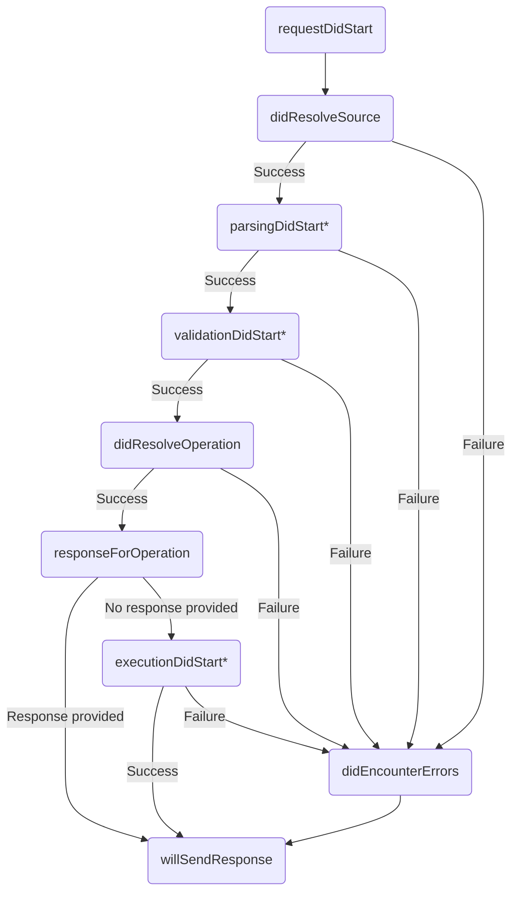

> Plugins are available in Apollo Server 2.2.x and later.

**Plugins** enable you to extend Apollo Server's core functionality by performing
custom operations in response to certain events. Currently, these events correspond
to individual phases of the GraphQL request lifecycle, and to the startup of Apollo Server itself.

For example, a basic logging plugin might log the GraphQL query string associated
with each request that's sent to Apollo Server.

## Creating a plugin

Plugins are JavaScript objects that implement one or more functions that respond to
events. Here's a basic plugin that responds to the `serverWillStart` event:

```js:title=index.js
const myPlugin = {
  serverWillStart() {
    console.log('Server starting up!');
  },
};
```

> If you're using TypeScript to create a plugin, the `apollo-server-plugin-base` module exports the [`ApolloServerPlugin` interface](https://github.com/apollographql/apollo-server/blob/main/packages/apollo-server-plugin-base/src/index.ts) for plugins to implement.

You can define a plugin in the same file where you initialize Apollo Server, or
you can export it as a separate module:

```js:title=myplugin.js
module.exports = {
  serverWillStart() {
    console.log('Server starting up!');
  },
};
```

To create a plugin that accepts options, create a function that accepts an
`options` object and returns a properly structured plugin object, like so:

```js:title=myplugin.js
module.exports = (options) => {
  return {
    serverWillStart() {
      console.log(options.logMessage);
    },
  };
};
```


### Responding to events

A plugin specifies exactly which [events](#apollo-server-event-reference)
it responds to by implementing functions that correspond to those events.
The plugin in the examples above responds to the `serverWillStart` event, which
fires when Apollo Server is preparing to start up.

A plugin can respond to any combination of supported events.

#### Responding to request lifecycle events

Plugins can respond to the following events associated with the GraphQL request
lifecycle:

* [`parsingDidStart`](#parsingdidstart)
* [`validationDidStart`](#validationdidstart)
* [`didResolveOperation`](#didresolveoperation)
* [`responseForOperation`](#responseforoperation)
* [`executionDidStart`](#executiondidstart)
* [`didEncounterErrors`](#didencountererrors)
* [`willSendResponse`](#willsendresponse)

**However**, the way you define these functions is slightly different from the
`serverWillStart` example above. First, your plugin must define the `requestDidStart` function:

```js
const myPlugin = {
  requestDidStart() {
    console.log('Request started!');
  },
};
```

The `requestDidStart` event fires whenever Apollo Server receives a GraphQL request,
_before_ any of the lifecycle events listed above. You can respond to this event
just like you respond to `serverWillStart`, but you _also_ use this function
 to define responses for a request's lifecycle events, like so:

```js
const myPlugin = {
  requestDidStart(requestContext) {
    console.log('Request started!');

    return {

      parsingDidStart(requestContext) {
        console.log('Parsing started!');
      },

      validationDidStart(requestContext) {
        console.log('Validation started!');
      }

    }
  },
};
```

As shown, the `requestDidStart` function can optionally return an object that
defines functions that respond to request lifecycle events. This structure
organizes and encapsulates all of your plugin's request lifecycle logic, making it
easier to reason about.

#### Request lifecycle event flow

The following diagram illustrates the sequence of events that fire for each request. Each of these events is documented [below](#request-lifecycle-events).



<sup>*The indicated events also support <a href="#end-hooks">end hooks</a> that fire when their associated step <em>completes</em>.</sup>

#### End hooks

Event handlers for the following events can optionally return a function
that is invoked after the corresponding lifecycle phase _ends_:

* [`parsingDidStart`](#parsingdidstart)
* [`validationDidStart`](#validationdidstart)
* [`executionDidStart`](#executiondidstart)

These **end hooks** are passed any errors that occurred during the
execution of that lifecycle phase. For example, the following plugin logs
any errors that occur during any of the above lifecycle events:

```js
const myPlugin = {
  requestDidStart() {
    return {
      parsingDidStart() {
        return (err) => {
          if (err) {
            console.error(err);
          }
        }
      },
      validationDidStart() {
        // This end hook is unique in that it can receive an array of errors,
        // which will contain every validation error that occurred.
        return (errs) => {
          if (errs) {
            errs.forEach(err => console.error(err));
          }
        }
      },
      executionDidStart() {
        return (err) => {
          if (err) {
            console.error(err);
          }
        }
      }
    }
  }
}
```

Note that the `validationDidStart` end hook receives an _array_ of errors that
contains every validation error that occurred (if any). The arguments to each
end hook are documented in the type definitions in [Request lifecycle events](#request-lifecycle-events).

### Inspecting request and response details

As the example above shows, `requestDidStart` and request lifecycle functions accept a `requestContext`
parameter. This parameter is of type `GraphQLRequestContext`, which includes a
`request` (of type `GraphQLRequest`), along with a `response` field (of type `GraphQLResponse`) if it's available.

These types and their related subtypes are all defined in [`apollo-server-types/src/index.ts`](https://github.com/apollographql/apollo-server/blob/main/packages/apollo-server-types/src/index.ts).

## Installing a plugin

Add your plugin to Apollo Server by providing a `plugins` configuration
option to the `ApolloServer` constructor, like so:

```js
const { ApolloServer } = require('apollo-server');
const ApolloServerOperationRegistry =
  require('apollo-server-plugin-operation-registry');

/* This example doesn't provide `typeDefs` or `resolvers`,
   both of which are required to start the server. */
const { typeDefs, resolvers } = require('./separatelyDefined');

const server = new ApolloServer({
  typeDefs,
  resolvers,

  // You can import plugins or define them in-line, as shown:
  plugins: [

    /* This plugin is from a package that's imported above. */
    ApolloServerOperationRegistry({ /* options */ }),

    /* This plugin is imported in-place. */
    require('./localPluginModule'),

    /* This plugin is defined in-line. */
    {
      serverWillStart() {
        console.log('Server starting up!');
      },
    }
  ],
})
```

## Apollo Server event reference

Apollo Server fires two types of events that plugins can hook into: **server lifecycle
events** and **request lifecycle events**.

Server lifecycle events are high-level events related to the lifecycle of Apollo Server itself.
Currently, two server lifecycle events are supported: [`serverWillStart`](#serverwillstart) and [`requestDidStart`](#requestdidstart).

Request lifecycle events are associated with a specific request. You define responses to these events _within_ the response to a `requestDidStart` event, as described in [Responding to request lifecycle events](#responding-to-request-lifecycle-events).

### Server lifecycle events

### `serverWillStart`

The `serverWillStart` event fires when Apollo Server is preparing to start serving GraphQL requests. If you respond to this event with an `async` function (or if the function returns a `Promise`), the server doesn't start until the asynchronous operation completes. If the `Promise` is _rejected_, startup _fails_ (**unless you're using [Express middleware](/integrations/middleware/)**). This helps you make sure all
of your server's dependencies are available before attempting to begin serving requests.

#### Example

```js
const server = new ApolloServer({
  /* ... other necessary configuration ... */

  plugins: [
    {
      serverWillStart() {
        console.log('Server starting!');
      }
    }
  ]
})
```

### `requestDidStart`

The `requestDidStart` event fires whenever Apollo Server begins fulfilling a GraphQL request.

```typescript
requestDidStart?(
  requestContext: WithRequired<
    GraphQLRequestContext<TContext>,
    'request' | 'context' | 'logger'
  >
): GraphQLRequestListener<TContext> | void;
```

This function can optionally return an object that includes functions for responding
to request lifecycle events that might follow `requestDidStart`.

```js
const server = new ApolloServer({
  /* ... other necessary configuration ... */

  plugins: [
    {
      requestDidStart(requestContext) {

        /* Within this returned object, define functions that respond
           to request-specific lifecycle events. */
        return {

          /* The `parsingDidStart` request lifecycle event fires
             when parsing begins. The event is scoped within an
             associated `requestDidStart` server lifecycle event. */
          parsingDidStart(requestContext) {
            console.log('Parsing started!')
          },
        }
      }
    }
  ],
})
```

If your plugin doesn't need to respond to any request lifecycle events, `requestDidStart`
should not return a value.

### Request lifecycle events

> If you're using TypeScript to create your plugin, implement the [ `GraphQLRequestListener` interface](https://github.com/apollographql/apollo-server/blob/main/packages/apollo-server-plugin-base/src/index.ts) from the `apollo-server-plugin-base` module to define functions for request lifecycle events.

### `didResolveSource`

The `didResolveSource` event is invoked after Apollo Server has determined the
`String`-representation of the incoming operation that it will act upon.  In the
event that this `String` was not directly passed in from the client, this
may be retrieved from a cache store (e.g., Automated Persisted Queries).

At this stage, there is not a guarantee that the operation is not malformed.

```typescript
didResolveSource?(
  requestContext: WithRequired<
    GraphQLRequestContext<TContext>, 'source' | 'logger'>,
  >,
): ValueOrPromise<void>;
```

### `parsingDidStart`

The `parsingDidStart` event fires whenever Apollo Server will parse a GraphQL
request to create its associated `document` AST.

If Apollo Server receives a request with a query string that matches a _previous_
request, the associated `document` might already be available in Apollo Server's cache.
In this case, `parsingDidStart` is _not_ called for the request, because parsing
does not occur.

```typescript
parsingDidStart?(
  requestContext: WithRequired<
    GraphQLRequestContext<TContext>,
    'metrics' | 'source' | 'logger'
  >,
): (err?: Error) => void | void;
```

### `validationDidStart`

The `validationDidStart` event fires whenever Apollo Server will validate a
request's `document` AST against your GraphQL schema.

Like `parsingDidStart`, this event does _not_ fire if a request's `document` is
already available in Apollo Server's cache (only successfully validated `document`s are cached by Apollo Server).

The `document` AST is guaranteed to be
available at this stage, because parsing must succeed for validation to occur.

```typescript
validationDidStart?(
  requestContext: WithRequired<
    GraphQLRequestContext<TContext>,
    'metrics' | 'source' | 'document' | 'logger'
  >,
): (err?: ReadonlyArray<Error>) => void | void;
```

### `didResolveOperation`

The `didResolveOperation` event fires after the `graphql` library successfully
determines the operation to execute from a request's `document` AST. At this stage,
both the `operationName` string and `operation` AST are available.

> If the operation is anonymous (i.e., the operation is `query { ... }` instead of `query NamedQuery { ... }`), then `operationName` is `null`.

```typescript
didResolveOperation?(
  requestContext: WithRequired<
    GraphQLRequestContext<TContext>,
    'metrics' | 'source' | 'document' | 'operationName' | 'operation' | 'logger'
  >,
): ValueOrPromise<void>;
```

### `responseForOperation`

The `responseForOperation` event is fired immediately before GraphQL execution
would take place. If its return value resolves to a non-null `GraphQLResponse`,
that result is used instead of executing the query. Hooks from different plugins
are invoked in series, and the first non-null response is used.

```typescript
responseForOperation?(
  requestContext: WithRequired<
    GraphQLRequestContext<TContext>,
    'metrics' | 'source' | 'document' | 'operationName' | 'operation' | 'logger'
  >,
): ValueOrPromise<GraphQLResponse | null>;
```

### `executionDidStart`

The `executionDidStart` event fires whenever Apollo Server begins executing the
GraphQL operation specified by a request's `document` AST.

```typescript
executionDidStart?(
  requestContext: WithRequired<
    GraphQLRequestContext<TContext>,
    'metrics' | 'source' | 'document' | 'operationName' | 'operation' | 'logger'
  >,
): (err?: Error) => void | void;
```

### `didEncounterErrors`

The `didEncounterErrors` event fires when Apollo Server encounters errors while
parsing, validating, or executing a GraphQL operation.

```typescript
didEncounterErrors?(
  requestContext: WithRequired<
    GraphQLRequestContext<TContext>,
    'metrics' | 'source' | 'errors' | 'logger'
  >,
): ValueOrPromise<void>;
```

### `willSendResponse`

The `willSendResponse` event fires whenever Apollo Server is about to send a response
for a GraphQL operation. This event fires (and Apollo Server sends a response) even
if the GraphQL operation encounters one or more errors.

```typescript
willSendResponse?(
  requestContext: WithRequired<
    GraphQLRequestContext<TContext>,
    'metrics' | 'response' | 'logger'
  >,
): ValueOrPromise<void>;
```
