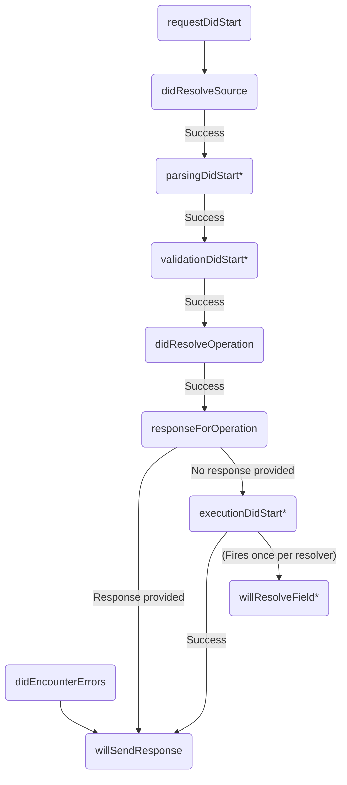

> All plugin lifecycle methods are `async`, _except for [`willResolveField`](./plugins-event-reference/#willresolvefield) and [`schemaDidLoadOrUpdate`](./plugins-event-reference/#schemadidloadorupdate)_.

You can create your own Apollo Server plugins to perform custom operations in response to certain events. For example, a basic logging plugin might log the GraphQL query string associated with each request that's sent to Apollo Server.

## The anatomy of a plugin

> If you're using TypeScript to create a plugin, your plugins should implement the [`ApolloServerPlugin` interface](https://github.com/apollographql/apollo-server/blob/cc447c5687f67938efb976d7aa282f7a95e313db/packages/server/src/externalTypes/plugins.ts#L34).

Plugins are JavaScript objects that implement one or more functions that respond to events. Here's a basic plugin that responds to the `serverWillStart` event:


<MultiCodeBlock>

```ts title="index.ts"
const myPlugin = {
  async serverWillStart() {
    console.log('Server starting up!');
  },
};
```

</MultiCodeBlock>


You can define a plugin in the same file where you initialize Apollo Server, or
you can export it as a separate module:

<MultiCodeBlock>

```ts title="myPlugin.ts"
export default {
  async serverWillStart() {
    console.log('Server starting up!');
  },
};
```

</MultiCodeBlock>

To create a plugin that accepts options, create a function that accepts an
`options` object and returns a properly structured plugin object, like so:

<MultiCodeBlock>

```ts title="myPlugin.ts"
export default (options: { logMessage: string }) => {
  return {
    async serverWillStart() {
      console.log(options.logMessage);
    },
  };
};
```

</MultiCodeBlock>

If your plugin needs to read the [`contextValue`](../data/context) of a request (i.e., `requestContext.contextValue`), you must declare your plugin as an `ApolloServerPlugin<YourContextType>`, like so:

<MultiCodeBlock>

```ts title="myPlugin.ts"
interface MyContext {
  token: string
}

export default function (): ApolloServerPlugin<MyContext> {
  return {
    async requestDidStart({ contextValue }) {
      // token is properly inferred as a string
      console.log(contextValue.token);
    },
  };
};
```

</MultiCodeBlock>

## Responding to events

A plugin specifies exactly which events it responds to by implementing functions that correspond to those events. The plugin in the examples above responds to the `serverWillStart` event, which fires when Apollo Server is preparing to start up. Almost all plugin events are `async` functions (i.e., functions that return `Promise`s). The only exceptions
are [`willResolveField`](./plugins-event-reference/#willresolvefield) and [`schemaDidLoadOrUpdate`](./plugins-event-reference/#schemadidloadorupdate).

A plugin can respond to any combination of [supported events](./plugins-event-reference/).

### Responding to request lifecycle events

Plugins can respond to the following events associated with the GraphQL request
lifecycle:

* [`didResolveSource`](./plugins-event-reference/#didresolvesource)
* [`parsingDidStart`](./plugins-event-reference/#parsingdidstart)
* [`validationDidStart`](./plugins-event-reference/#validationdidstart)
* [`didResolveOperation`](./plugins-event-reference/#didresolveoperation)
* [`responseForOperation`](./plugins-event-reference/#responseforoperation)
* [`executionDidStart`](./plugins-event-reference/#executiondidstart)
* [`didEncounterErrors`](./plugins-event-reference/#didencountererrors)
* [`willSendResponse`](./plugins-event-reference/#willsendresponse)

**However**, the way you define these functions is slightly different from the
`serverWillStart` example above. First, your plugin must define the `requestDidStart` function:

<MultiCodeBlock>

```ts
const myPlugin = {
  async requestDidStart() {
    console.log('Request started!');
  },
};
```

</MultiCodeBlock>

The `requestDidStart` event fires whenever Apollo Server receives a GraphQL request,
_before_ any of the lifecycle events listed above. You can respond to this event
just like you respond to `serverWillStart`, but you _also_ use this function
 to define responses for a request's lifecycle events, like so:

<MultiCodeBlock>

```ts
const myPlugin = {
  async requestDidStart(requestContext) {
    console.log('Request started!');

    return {
      async parsingDidStart(requestContext) {
        console.log('Parsing started!');
      },

      async validationDidStart(requestContext) {
        console.log('Validation started!');
      }
    }
  },
};
```

</MultiCodeBlock>

As shown, the `requestDidStart` function can optionally return an object that
defines functions that respond to request lifecycle events. This structure
organizes and encapsulates all of your plugin's request lifecycle logic, making it
easier to reason about.

### Request lifecycle event flow

The following diagram illustrates the sequence of events that fire for each request. Each of these events is documented in [Apollo Server plugin events](./plugins-event-reference/).

> **Important:** Any event below that can result in "Success" can also result in an error. Whenever an error occurs, the `didEncounterErrors` event fires and the remainder of the "Success" path does _not_.



<sup>*The indicated events also support <a href="#end-hooks">end hooks</a> that are called when their associated step <em>completes</em>.</sup>

### End hooks

Event handlers for the following events can optionally return a function that is invoked after the corresponding lifecycle phase _ends_:

* [`parsingDidStart`](./plugins-event-reference/#parsingdidstart)
* [`validationDidStart`](./plugins-event-reference/#validationdidstart)
* [`willResolveField`](./plugins-event-reference/#willresolvefield)

The [`executionDidStart`](./plugins-event-reference/#executiondidstart) hook returns an _object_ containing an `executionDidEnd` function instead of just a function as an end hook. This is because the returned object can also contain `willResolveField`.

Just like the event handlers themselves, these end hooks are async functions (except for the end hook for `willResolveField`).

End hooks are passed any errors that occurred during the execution of that lifecycle phase. For example, the following plugin logs any errors that occur during any of the above lifecycle events:

<MultiCodeBlock>

```ts
const myPlugin = {
  async requestDidStart() {
    return {
      async parsingDidStart() {
        return async (err) => {
          if (err) {
            console.error(err);
          }
        }
      },
      async validationDidStart() {
        // This end hook is unique in that it can receive an array of errors,
        // which will contain every validation error that occurred.
        return async (errs) => {
          if (errs) {
            errs.forEach(err => console.error(err));
          }
        }
      },
      async executionDidStart() {
        return {
          async executionDidEnd(err) {
            if (err) {
              console.error(err);
            }
          }
        };
      },
    };
  },
}
```

</MultiCodeBlock>

Note that the `validationDidStart` end hook receives an _array_ of errors that contains every validation error that occurred (if any). The `willResolveField` end hook receives the error thrown by the resolver as the first argument and the result of the resolver as the second argument. The arguments to each end hook are documented in the type definitions in [Request lifecycle events](./plugins-event-reference/#request-lifecycle-events).

### Inspecting request and response details

As the example above shows, `requestDidStart` and request lifecycle functions accept a `requestContext` parameter. This parameter is of type `GraphQLRequestContext`, which includes a `request` (of type `GraphQLRequest`), along with a `response` field (of type `GraphQLResponse`) if it's available.

These types and their related subtypes are all defined in [`@apollo/server`](https://github.com/apollographql/apollo-server/blob/6b4945935a786d06e7ff904be94c0035fe27aeb1/packages/server/src/externalTypes/index.ts).

## Installing custom plugins

Add your plugins to Apollo Server by providing a `plugins` configuration option to the `ApolloServer` constructor, like so:

<MultiCodeBlock>

```ts
import { ApolloServer } from '@apollo/server';
import ApolloServerOperationRegistry from '@apollo/server-plugin-operation-registry';

/* This example doesn't provide `typeDefs` or `resolvers`,
   both of which are required to start the server. */
import { typeDefs, resolvers } from './separatelyDefined';

const server = new ApolloServer({
  typeDefs,
  resolvers,
  // You can import plugins or define them in-line, as shown:
  plugins: [
    /* This plugin is from a package that's imported above. */
    ApolloServerOperationRegistry({
      /* options */
    }),

    /* This plugin is imported in-place. */
    require('./localPluginModule'),

    /* This plugin is defined in-line. */
    {
      async serverWillStart() {
        console.log('Server starting up!');
      },
    },
  ],
});
```

</MultiCodeBlock>
