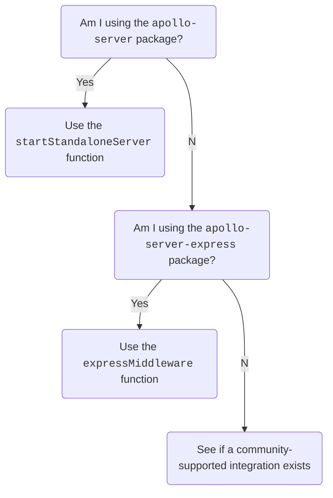

import TopLevelAwait from "./shared/top-level-await.mdx"
import IntegrationTable from "./shared/integration-table.mdx"

> 📣 **Apollo Server 4 is [generally available](/resources/product-launch-stages#general-availability)!**

Apollo Server 4 focuses on improving Apollo Server's extensibility and making it simpler to use, maintain, and document. To learn more about the inspiration behind this release, see the [Apollo Server Roadmap](https://github.com/apollographql/apollo-server/blob/24a841bc68d/ROADMAP.md).

Apollo Server 4 provides the following features:
* A well-defined API with a stable HTTP abstraction, enabling contributors to easily [build and maintain integrations](./integrations/building-integrations) in their preferred frameworks.
* A new `@apollo/server` package, combining numerous [smaller packages](#packages-merged-into-apolloserver) and including the [`startStandaloneServer`](#migrate-from-apollo-server) and [`expressMiddleware`](#migrate-from-apollo-server-express) functions.
* Packages that can be used as either ECMAScript or CJS modules.
* Experimental support for [incremental delivery](./workflow/requests#incremental-delivery-experimental) when combined with a pre-release of `graphql-js`.

> For a list of all breaking changes, see the [changelog](https://github.com/apollographql/apollo-server/blob/main/packages/server/CHANGELOG.md).

> 🚚 This guide helps you migrate from Apollo Server 3 to Apollo Server 4. If you are using Apollo Server 2, you must first [migrate to Apollo Server 3](https://www.apollographql.com/docs/apollo-server/v3/migration) before following this guide.

We recommend that all users of Apollo Server upgrade to Apollo Server 4 as soon as possible. Apollo Server 2 and Apollo Server 3 are [deprecated, with an end-of-life date of October 22nd, 2023](./previous-versions).

## The new `@apollo/server` package

Apollo Server 3 is distributed as a [fixed set of packages](/apollo-server/v3/integrations/middleware) for integrating with different web frameworks and environments. The main "batteries-included" [`apollo-server` package](/apollo-server/v3/integrations/middleware#apollo-server) reduces setup time by providing a minimally customizable GraphQL server.

In Apollo Server 3, the `apollo-server-core` package defines an `ApolloServer` "base" class, which each integration package (`apollo-server-express`,`apollo-server-lambda`, etc.) subclasses with a slightly different API. This packaging structure means that new integration package releases are lockstep versioned to Apollo Server itself, making it challenging to support major versions of frameworks and add integration-specific changes. Additionally, Apollo Server 3 doesn't provide a way to add new integrations for additional frameworks.

Apollo Server 4 takes a different approach to integrations by providing a stable web framework integration API, which includes explicit support for serverless framework life cycles.

The new `@apollo/server` package contains:

- The `ApolloServer` class
- An [Express 4 integration](#migrate-from-apollo-server-express) (similar to Apollo Server 3's `apollo-server-express` package)
- A [standalone server](#migrate-from-apollo-server) (similar to Apollo Server 3's `apollo-server` package)
- A set of [core plugins](#plugins-are-in-deep-imports) (similar to Apollo Server 3's `apollo-server-core` package)

There are no integration-specific subclasses in Apollo Server 4. Instead, there's a single `ApolloServer` class with a single API that all integrations use.

In Apollo Server 3, the Apollo Server core team was responsible for maintaining every integration package. With Apollo Server 4, the AS core team no longer directly maintains most integration packages. Instead, we work with the broader open source community [to maintain Apollo Server integrations](./integrations/integration-index/), enabling those who regularly use different web frameworks to make the best choices for their framework's integration.

For those migrating from Apollo Server 3 to Apollo Server 4, use the below flowchart to see your migration path:



- If you're currently using the `apollo-server` package, you should use the [`startStandaloneServer`](#migrate-from-apollo-server) function.
- If you're currently using the `apollo-server-express` package, you should use the [`expressMiddleware`](#migrate-from-apollo-server-express) function.

The [`@apollo/server` package](https://www.npmjs.com/package/@apollo/server) exports these functions alongside the  `ApolloServer` class.

If you are using another Apollo Server 3 framework integration package (such as `apollo-server-koa` or `apollo-server-lambda`), check out our [list of integrations](./integrations/integration-index) to see if a community-maintained integration package exists for your framework of choice.

If there is no Apollo Server integration for your favorite framework _yet_, help the broader community by [building a new integration](./integrations/building-integrations)! You can also [join the discussions about maintaining our existing integrations](https://github.com/apollographql/apollo-server/labels/integration-collaborators).

Below are a few high-level changes for using framework integrations:

- You can pass your [`context` initialization function](#context-initialization-function) directly to your framework's integration function (e.g., `expressMiddleware` or `startStandaloneServer`) instead of the `ApolloServer` constructor.
- You are responsible for [setting up HTTP body parsing and CORS](#body-parser-and-cors) using your framework integration's standard functionality.
- If you want your server to listen on a specific URL path, pass that path directly to your framework's router instead of using the [`path` option](#path-parsing). If you did not specify a URL path, the default in Apollo Server 3 was `/graphql`, so to preserve existing behavior, you should specify that path explicitly.

The following sections show how servers using `apollo-server` or `apollo-server-express` can update to Apollo Server 4.

<TopLevelAwait />

### Migrate from `apollo-server`

In Apollo Server 3, the `apollo-server` package is a "batteries-included" package that wraps `apollo-server-express`, providing an HTTP server with minimal HTTP-level customization.

If you used the "batteries included" `apollo-server` package in Apollo Server 3, use the `startStandaloneServer` function in Apollo Server 4.

This Apollo Server 3 code:

<MultiCodeBlock>

```ts title="apollo-server-3-standalone.ts"
// npm install apollo-server graphql
import { ApolloServer } from 'apollo-server';
import { typeDefs, resolvers } from './schema';

interface MyContext {
  token?: String;
}

const server = new ApolloServer({
  typeDefs,
  resolvers,
  context: async ({ req }) => ({ token: req.headers.token }),
});
const { url } = await server.listen(4000);
console.log(`🚀  Server ready at ${url}`);
```

</MultiCodeBlock>

looks like this in Apollo Server 4:

<MultiCodeBlock>

```ts title="apollo-server-4-standalone.ts"
// npm install @apollo/server graphql
import { ApolloServer } from '@apollo/server';
import { startStandaloneServer } from '@apollo/server/standalone';
import { typeDefs, resolvers } from './schema';

interface MyContext {
  token?: String;
}


const server = new ApolloServer<MyContext>({ typeDefs, resolvers });
const { url } = await startStandaloneServer(server, {
  context: async ({ req }) => ({ token: req.headers.token }),
  listen: { port: 4000 },
});
console.log(`🚀  Server ready at ${url}`);
```

</MultiCodeBlock>

The `startStandaloneServer` function accepts two arguments; the first is the instance of `ApolloServer` that should begin listening for incoming requests. The second is an object for configuring your server's options, which most notably accepts the following properties:

<table class="field-table">
  <thead>
    <tr>
      <th>Name /<br/>Type</th>
      <th>Description</th>
    </tr>
  </thead>

<tbody>
<tr>

<td>

  ##### `context`

  `Function`

</td>

<td>

  An optional `context` initialization function. The `context` function receives `req` and `res` options ([see below for more details.](#context-initialization-function)).

  In Apollo Server 3, you pass the `context` function to the constructor. In Apollo Server 4, you pass the `context` function to `startStandaloneServer`.

</td>

</tr>

<tr>

<td>

  ##### `listen`

  `Object`

</td>

<td>

  An optional `listen` configuration option. The `listen` option accepts an object with the same properties as the [`net.Server.listen` options object](https://nodejs.org/api/net.html#serverlistenoptions-callback).

  For example, in Apollo Server 3, if you used `server.listen(4321)`, you'll now pass `listen: { port: 4321 }` to the `startStandaloneServer` function in Apollo Server 4. If you didn't pass any arguments to Apollo Server 3's `server.listen()` method; you don't need to specify this `listen` option.
</td>

</tr>

</tbody>
</table>

The `startStandaloneServer` function doesn't enable you to configure your server's CORS behavior. If you previously used the `cors` constructor option to customize your CORS settings in Apollo Server 3, use the [`expressMiddleware` function](#migrate-from-apollo-server-express) in Apollo Server 4.

Similarly, if you used the `stopGracePeriodMillis` constructor option in Apollo Server 3, use the [`expressMiddleware` function](#migrate-from-apollo-server-express) and specify `stopGracePeriodMillis` to the `ApolloServerPluginDrainHttpServer` plugin.

### Migrate from `apollo-server-express`

If you used the `apollo-server-express` package in Apollo Server 3, use the `expressMiddleware` function in Apollo Server 4 (i.e., instead of using `server.applyMiddleware` or `server.getMiddleware`).

To migrate from Apollo Server 3's `apollo-server-express` package to using the `expressMiddleware` function, do the following:

1. Install the `@apollo/server`, `cors`, and `body-parser` packages.
2. Import symbols from `@apollo/server` (i.e., instead of from `apollo-server-express` and `apollo-server-core`).
3. Add `cors` and `bodyParser.json()` to your server setup.
4. Remove the Apollo Server 3 `apollo-server-express` and `apollo-server-core` packages.
5. If you are using `apollo-server-express`'s default `/graphql` URL path (i.e., not specifying another URL with the [path option](/apollo-server/v3/api/apollo-server/#path)), you can mount `expressMiddleware` at `/graphql` to maintain behavior. To use another URL path, mount your server (with `app.use`) at the specified path.

This Apollo Server 3 code:

<MultiCodeBlock>

```ts title="apollo-server-3.ts"
// npm install apollo-server-express apollo-server-core express graphql
import { ApolloServer } from 'apollo-server-express';
import { ApolloServerPluginDrainHttpServer } from 'apollo-server-core';
import express from 'express';
import http from 'http';
import { typeDefs, resolvers } from './schema';

interface MyContext {
  token?: String;
}

const app = express();
const httpServer = http.createServer(app);
const server = new ApolloServer({
  typeDefs,
  resolvers,
  context: async ({ req }) => ({ token: req.headers.token }),
  plugins: [ApolloServerPluginDrainHttpServer({ httpServer })],
});
await server.start();
server.applyMiddleware({ app });
await new Promise<void>(resolve => httpServer.listen({ port: 4000 }, resolve));
console.log(`🚀 Server ready at http://localhost:4000${server.graphqlPath}`);
```

</MultiCodeBlock>

looks like this in Apollo Server 4:

<MultiCodeBlock>

```ts title="apollo-server-4.ts"
// npm install @apollo/server express graphql cors body-parser
import { ApolloServer } from '@apollo/server';
import { expressMiddleware } from '@apollo/server/express4';
import { ApolloServerPluginDrainHttpServer } from '@apollo/server/plugin/drainHttpServer';
import express from 'express';
import http from 'http';
import cors from 'cors';
import { json } from 'body-parser';
import { typeDefs, resolvers } from './schema';

interface MyContext {
  token?: String;
}

const app = express();
const httpServer = http.createServer(app);
const server = new ApolloServer<MyContext>({
  typeDefs,
  resolvers,
  plugins: [ApolloServerPluginDrainHttpServer({ httpServer })],
});
await server.start();
app.use('/graphql',
  cors<cors.CorsRequest>(),
  json(),
  expressMiddleware(server, {
    context: async ({ req }) => ({ token: req.headers.token }),
  }),
);

await new Promise<void>(resolve => httpServer.listen({ port: 4000 }, resolve));
console.log(`🚀 Server ready at http://localhost:4000/graphql`);
```

</MultiCodeBlock>


### Removed integrations

Apollo Server 4 takes a fundamentally different approach to web framework integrations. By offering a well-defined API with a stable HTTP abstraction, Apollo Server 4 enables contributors to build and maintain integrations for the first time.

To that end, the Apollo Server core team no longer maintains the following integration packages in Apollo Server 4:
* [`apollo-server-fastify`](https://www.npmjs.com/package/apollo-server-fastify)
* [`apollo-server-hapi`](https://www.npmjs.com/package/apollo-server-hapi)
* [`apollo-server-koa`](https://www.npmjs.com/package/apollo-server-koa)
* [`apollo-server-lambda`](https://www.npmjs.com/package/apollo-server-lambda)
* [`apollo-server-micro`](https://www.npmjs.com/package/apollo-server-micro)
* [`apollo-server-cloud-functions`](https://www.npmjs.com/package/apollo-server-cloud-functions)
* [`apollo-server-cloudflare`](https://www.npmjs.com/package/apollo-server-cloudflare)
* [`apollo-server-azure-functions`](https://www.npmjs.com/package/apollo-server-azure-functions)

Instead, we now work with the broader community to maintain the following open-source integrations for Apollo Server:

<IntegrationTable />

> If an integration doesn't exist for your framework, you can always [build your own](./integrations/building-integrations)!

In Apollo Server 3, the `apollo-server-express` package supported both Express and its older predecessor [Connect](https://github.com/senchalabs/connect). In Apollo Server 4, `expressMiddleware` no longer supports Connect. An interested developer could [build a Connect-specific middleware](./integrations/building-integrations), and a PR to this migration guide is welcome if someone does this!

### Packages merged into `@apollo/server`

As shown above, Apollo Server 4 combines the functionality of the  `apollo-server`, `apollo-server-express`, and `apollo-server-core` packages into a new `@apollo/server` package.

But wait: there's more! The `@apollo/server` package also combines the following packages:
- [`apollo-server-errors`](https://www.npmjs.com/package/apollo-server-errors)
- [`apollo-server-plugin-base`](https://www.npmjs.com/package/apollo-server-plugin-base)
- [`apollo-server-types`](https://www.npmjs.com/package/apollo-server-types)


### Plugins are in deep imports

In Apollo Server 3, the `apollo-server-core` package exports built-in plugins, like `ApolloServerUsageReporting`, at the top level. To use these plugins, you must install *both* the `apollo-server-core` package and the package you use to import `ApolloServer` (e.g., `apollo-server` or `apollo-server-express`).

In Apollo Server 4, these built-in plugins are part of the main `@apollo/server` package, which also imports the `ApolloServer` class. The  `@apollo/server` package exports these built-in plugins with deep exports. This means you use deep imports for each built-in plugin, enabling you to evaluate only the plugin you use in your app and making it easier for bundlers to eliminate unused code.

There's one exception: the `ApolloServerPluginLandingPageGraphQLPlayground` plugin is now in its own package `@apollo/server-plugin-landing-page-graphql-playground`, which you can install separately.

This plugin installs the [unmaintained](https://github.com/graphql/graphql-playground/issues/1143) GraphQL Playground project as a landing page and is provided for compatibility with Apollo Server 2. This package will **not** be supported after Apollo Server 4 is released. We strongly recommend you switch to Apollo Server's 4's [default landing page](./api/plugin/landing-pages), which installs the actively maintained Apollo Sandbox.

 Apollo Server exports the following plugins:

| Plugin | Import path |
|--------|-------------|
| `ApolloServerPluginCacheControl` | `@apollo/server/plugin/cacheControl` |
| `ApolloServerPluginCacheControlDisabled` | `@apollo/server/plugin/disabled` |
| `ApolloServerPluginDrainHttpServer` | `@apollo/server/plugin/drainHttpServer` |
| `ApolloServerPluginInlineTrace` | `@apollo/server/plugin/inlineTrace` |
| `ApolloServerPluginInlineTraceDisabled` | `@apollo/server/plugin/disabled` |
| `ApolloServerPluginLandingPageDisabled` | `@apollo/server/plugin/disabled` |
| `ApolloServerPluginLandingPageGraphQLPlayground` | `@apollo/server-plugin-landing-page-graphql-playground` |
| `ApolloServerPluginLandingPageLocalDefault` | `@apollo/server/plugin/landingPage/default` |
| `ApolloServerPluginLandingPageProductionDefault` | `@apollo/server/plugin/landingPage/default` |
| `ApolloServerPluginSchemaReporting` | `@apollo/server/plugin/schemaReporting` |
| `ApolloServerPluginUsageReporting` | `@apollo/server/plugin/usageReporting` |
| `ApolloServerPluginUsageReportingDisabled` | `@apollo/server/plugin/disabled` |

For example, replace this Apollo Server 3 code:

```ts
import { ApolloServerPluginUsageReporting } from 'apollo-server-core';
```

with this Apollo Server 4 code:

```ts
import { ApolloServerPluginUsageReporting } from '@apollo/server/plugin/usageReporting';
```

You can also import each plugin's associated TypeScript types (e.g., `ApolloServerPluginUsageReportingOptions`) from the same deep import as that plugin.

Once you've updated your imports, you can remove your project's dependency on `apollo-server-core`.

## Known regressions

### Appropriate 400 status codes

Apollo Server v4 responds to an invalid `variables` object with a 200 status code, whereas v3 responds appropriately with a 400 status code. This regression was introduced in [PR #6502](https://github.com/apollographql/apollo-server/pull/6502) and brought to our attention in [Issue #7462](https://github.com/apollographql/apollo-server/issues/7462).

Specifically, this regression affects cases where _input variable coercion_ fails. Variables of an incorrect type (i.e. `String` instead of `Int`) or unexpectedly `null` are examples that fail variable coercion. Additionally, missing or incorrect fields on input objects as well as custom scalars that throw during validation will also fail variable coercion. For additional specifics on variable coercion, see the "Input Coercion" sections in the [GraphQL spec](https://spec.graphql.org/June2018/#sec-Scalars).

We recommend mitigating this regression unless you've already modified your application to work around it. To do so, add the `status400ForVariableCoercionErrors: true` option to your `ApolloServer` constructor:

<MultiCodeBlock>

```ts
new ApolloServer({
  // ...
  status400ForVariableCoercionErrors: true,
})
```

</MultiCodeBlock>

This option will no longer be needed (and will be ignored) in Apollo Server v5.

## Bumped dependencies

### Node.js

Apollo Server 4 supports Node.js 14.16.0 and later. (Apollo Server 3 supports Node.js 12.) This includes all [LTS and Current major versions at the time of release](https://nodejs.org/en/about/releases/).

If you're using Node.js 12, upgrade your runtime before upgrading to Apollo Server 4.

(Apollo Server 4 specifically requires v14.16.0 instead of merely v14.0.0, because that is the minimum version of Node.js 14 supported by our minimum supported version of `graphql`, as described in the next section.)

### `graphql`

Apollo Server has a peer dependency on [`graphql`](https://www.npmjs.com/package/graphql) (the core JS GraphQL implementation). Apollo Server 4 supports `graphql` v16.6.0 and later. (Apollo Server 3 supports `graphql` v15.3.0 through v16.)

If you're using an older version of `graphql`, upgrade it to a supported version before upgrading to Apollo Server 4.

Note that upgrading `graphql` may require you to upgrade other libraries that are installed in your project. For example, if you use Apollo Server with Apollo Gateway, you should upgrade Apollo Gateway to at least v0.50.1 or any v2.x version for full `graphql` 16 support before upgrading to Apollo Server 4.

### TypeScript

If you use Apollo Server with TypeScript, you must use TypeScript v4.7.0 or newer.

For background, Apollo Server uses type system features introduced in v4.7. We want to put out ["downleveled"](https://github.com/sandersn/downlevel-dts) versions of `@apollo/server`'s type definitions for older versions of TypeScript, but have found TypeScript's `typesVersions` feature [challenging to use](https://github.com/apollographql/apollo-server/issues/6423).

If supporting older versions of TypeScript is important to you and you'd like to help us get `typesVersions` working, we'd appreciate PRs!

## Removed constructor options

The following `ApolloServer` constructor options have been removed in favor of other features or configuration methods.

### `dataSources`

> 📣 See our new [Fetching Data](./data/fetching-data) article for more information on how the _concept_ of a data source has changed in Apollo Sever 4.

In Apollo Server 3, the top-level [`dataSources` constructor option](/apollo-server/v3/data/data-sources#adding-data-sources-to-apollo-server) essentially adds a post-processing step to your app's context function, creating `DataSource` subclasses and adding them to a `dataSources` field on your [`context`](/apollo-server/v3/data/resolvers/#the-context-argument) object. This means the TypeScript type the `context` function returns is _different_ from the `context` type your resolvers and plugins receive. Additionally, this design obfuscates that `DataSource` objects are created once per request (i.e., like the rest of the context object).

Apollo Server 4 removes the `dataSources` constructor option. You can now treat `DataSources` like any other part of your `context` object.

In Apollo Server 3, immediately after constructing each `DataSource` subclass, Apollo Server invokes the `dataSource.initialize({ cache, context })` function on each new `DataSource`. If you need to replicate this behavior in Apollo Server 4, you can pass the `cache` and `context` arguments to each `DataSource` constructor. In Apollo Server 4, you can find `cache` as a new readonly field on `ApolloServer`.

For example, below, we use the `RESTDataSource` class to create a `DataSource` with Apollo Server 3:

<MultiCodeBlock>

```ts title="Apollo Server 3"
import { RESTDataSource, RequestOptions } from 'apollo-datasource-rest';
import { ApolloServer } from 'apollo-server';

// highlight-start
class MoviesAPI extends RESTDataSource {
  // highlight-end
  override baseURL = 'https://movies-api.example.com/';

  override willSendRequest(request: RequestOptions) {
    request.headers.set('Authorization', this.context.token);
  }

  async getMovie(id: string): Promise<Movie> {
    return this.get<Movie>(`movies/${encodeURIComponent(id)}`);
  }

  async updateMovie(movie: Movie): Promise<Movie>  {
    return this.patch(
      'movies',
      // Syntax for passing a request body
      { id: movie.id, movie }, //highlight-line
    );
  }
}

interface ContextValue {
  token: string;
  dataSources: {
    moviesAPI: MoviesAPI;
  }
};

const server = new ApolloServer({
  typeDefs,
  resolvers,
  //highlight-start
  context: ({ req: ExpressRequest }): Omit<ContextValue, 'dataSources'> => {
    //highlight-end
    return {
      token: getTokenFromRequest(req),
    };
  },
  //highlight-start
  dataSources: (): ContextValue['dataSources'] => {
    return {
      moviesAPI: new MoviesAPI(),
    };
  },
  //highlight-end
});

await server.listen();
```

</MultiCodeBlock>

Below is how you write the same code in Apollo Server 4.

<MultiCodeBlock>

```ts title="Apollo Server 4"
import { RESTDataSource, AugmentedRequest } from '@apollo/datasource-rest';
// KeyValueCache is the type of Apollo server's default cache
import type { KeyValueCache } from '@apollo/utils.keyvaluecache';
import { ApolloServer } from '@apollo/server';
import { startStandaloneServer } from '@apollo/server/standalone';

class MoviesAPI extends RESTDataSource { // highlight-line
  override baseURL = 'https://movies-api.example.com/';
  private token: string;

  constructor(options: { token: string; cache: KeyValueCache }) {
    super(options); // this sends our server's `cache` through
    this.token = options.token;
  }

  override willSendRequest(path: string, request: AugmentedRequest) {
    request.headers.authorization = this.token;
  }

  async getMovie(id: string): Promise<Movie> {
    return this.get<Movie>(`movies/${encodeURIComponent(id)}`);
  }

  async updateMovie(movie: Movie): Promise<Movie>  {
    return this.patch(
      'movies',
      // Note the way we pass request bodies has also changed!
      { body: { id: movie.id, movie } }, //highlight-line
    );
  }
}
// highlight-start
interface ContextValue {
  token: string;
  dataSources: {
    moviesAPI: MoviesAPI;
  };
}
// highlight-end

const server = new ApolloServer<ContextValue>({
  typeDefs,
  resolvers,
});

const { url } = await startStandaloneServer(server, {
  context: async ({ req }) => {
    const token = getTokenFromRequest(req);
    const { cache } = server;
    return {
      token,
      //highlight-start
      dataSources: {
        moviesAPI: new MoviesAPI({ cache, token }),
      },
      //highlight-end
    };
  },
});

console.log(`🚀  Server ready at ${url}`);
```

</MultiCodeBlock>

> In Apollo Server 4, we've moved `apollo-datasource-rest` to the new [`@apollo/datasource-rest`](https://www.npmjs.com/package/@apollo/datasource-rest) package. Most of the functionality between the two packages is the same. However, some small syntax differences exist in how we pass a request's `headers`, `params`, `cacheOptions`, and `body`. See [Fetching from REST](./data/fetching-rest#method-parameters) for more details.

If you want to access your entire context's value within your `DataSource`, you can do so by making your context value a `class` (enabling it to refer to itself via `this` in its constructor):

<MultiCodeBlock>

```ts
import { RESTDataSource, WillSendRequestOptions } from '@apollo/datasource-rest'; //highlight-line
import { KeyValueCache } from '@apollo/utils.keyvaluecache';
import { ApolloServer } from '@apollo/server';
import { startStandaloneServer } from '@apollo/server/standalone';
import { IncomingMessage } from 'http';

class MoviesAPI extends RESTDataSource {
  override baseURL = 'https://movies-api.example.com/';
  private contextValue: ContextValue;

  constructor(options: { contextValue: ContextValue; cache: KeyValueCache }) {
    super(options); // this should send `cache` through
    this.contextValue = options.contextValue;
  }

  override willSendRequest(path: string, request: WillSendRequestOptions) {
    request.headers['authorization'] = this.contextValue.token;
  }

  async getMovie(id):Promise<Movie> {
    return this.get<Movie>(`movies/${encodeURIComponent(id)}`);
  }
}

// highlight-start
class ContextValue {
  public token: string;
  public dataSources: {
    moviesAPI: MoviesAPI;
  };

  constructor({ req, server }: { req: IncomingMessage; server: ApolloServer<ContextValue> }) {
    this.token = getTokenFromRequest(req);
    const { cache } = server;
    this.dataSources = {
      moviesAPI: new MoviesAPI({ cache, contextValue: this }),
    };
  }
}
// highlight-end

const server = new ApolloServer<ContextValue>({
  typeDefs,
  resolvers,
});

await startStandaloneServer(server, {
  context: async ({ req }) => new ContextValue({ req, server }), //highlight-line
});
```

</MultiCodeBlock>

If you want to migrate quickly to Apollo Server 4 *without* altering your data sources, the snippet below replicates Apollo Server 3's `dataSources` behavior with a custom plugin.

<ExpansionPanel title="Click to expand">

```ts
import { ApolloServerPlugin, BaseContext } from "@apollo/server";
import type { DataSource } from "apollo-datasource";

type DataSources = Record<string, DataSource>;
type DataSourcesFn = () => DataSources;

interface ContextWithDataSources extends BaseContext {
  dataSources?: DataSources;
}

export const ApolloDataSources = (options: {
  dataSources: DataSourcesFn,
}): ApolloServerPlugin<ContextWithDataSources> => ({
  requestDidStart: async (requestContext) => {
    const dataSources = options.dataSources();
    const initializers = Object.values(dataSources).map(async (dataSource) => {
      if (dataSource.initialize)
        dataSource.initialize({
          cache: requestContext.cache,
          context: requestContext.contextValue,
        });
    });

    await Promise.all(initializers);

    requestContext.contextValue.dataSources = dataSources;
  },
});

const server = new ApolloServer({
  schema,
  plugins: [ApolloDataSources({ dataSources })],
});
```

</ExpansionPanel>

We include this as a short-term fix and encourage you to [create custom data source classes](./data/fetching-data#creating-data-source-classes) best suited for each source.

### `modules`

In Apollo Server 3, there are [several ways](https://github.com/apollographql/apollo-server/issues/6062) to provide your `ApolloServer` instance with a schema. One of the most common ways is to provide `typeDefs` and `resolvers` options (each of which can optionally be an array). Another way is using the `modules` option with an array of objects, each object containing `typeDefs` and `resolvers` keys.  Under the hood, these two options use entirely different logic to do the same thing.

To simplify its API, Apollo Server 4 removes the `modules` constructor option. You can replace any previous usage of `modules` with the following syntax:

```ts
new ApolloServer({
  typeDefs: modules.map({ typeDefs } => typeDefs),
  resolvers: modules.map({ resolvers } => resolvers),
})
```

Additionally, the corresponding `GraphQLSchemaModule` TypeScript type is no longer exported.

### `mocks` and `mockEntireSchema`
In Apollo Server 3, the `mocks` and `mockEntireSchema` constructor options enable Apollo Server to return simulated data for GraphQL operations based on your server's schema. Under the hood, Apollo Server 3's mocking functionality is provided via an outdated version of the [`@graphql-tools/mocks`](https://www.npmjs.com/package/@graphql-tools/mock) library.

Apollo Server 4 removes both the `mocks` and `mockEntireSchema` constructor options. You can instead directly incorporate the `@graphql-tools/mock` package into your app, enabling you to get the most up-to-date mocking features. For more details on configuring mocks, see the [`@graphql-tools/mocks` docs](https://www.graphql-tools.com/docs/mocking).

The following examples compare the `mocks` and `mockEntireSchema` constructor options in Apollo Server 3 on the left and a replacement using `@graphql-tools/mock` on the right. You can also incrementally apply these changes in Apollo Server 3 without affecting behavior.

<CodeColumns>

```ts title="Apollo Server 3"
new ApolloServer({
  mocks: true,
});
```

```ts  title="Apollo Server 4"
import { addMocksToSchema } from '@graphql-tools/mock';
import { makeExecutableSchema } from '@graphql-tools/schema';

new ApolloServer({
  schema: addMocksToSchema({
    schema: makeExecutableSchema({ typeDefs, resolvers }),
  }),
});
```

</CodeColumns>

<CodeColumns>

```ts title="Apollo Server 3"
const mocks = {
  Int: () => 6,
};

new ApolloServer({
  mocks,
});
```

```ts title="Apollo Server 4"
import { addMocksToSchema } from '@graphql-tools/mock';
import { makeExecutableSchema } from '@graphql-tools/schema';

const mocks = {
  Int: () => 6,
};

new ApolloServer({
  schema: addMocksToSchema({
    schema: makeExecutableSchema({ typeDefs, resolvers }),
    mocks,
  }),
});
```

</CodeColumns>

<CodeColumns>

```ts {6}  title="Apollo Server 3"
const mocks = {
  Int: () => 6,
};
new ApolloServer({
  mocks,
  mockEntireSchema: false,
});
```

```ts {11} title="Apollo Server 4"
import { addMocksToSchema } from '@graphql-tools/mock';
import { makeExecutableSchema } from '@graphql-tools/schema';

const mocks = {
  Int: () => 6,
};
new ApolloServer({
  schema: addMocksToSchema({
    schema: makeExecutableSchema({ typeDefs, resolvers }),
    mocks,
    preserveResolvers: true,
  }),
});
```

</CodeColumns>


### `debug`

In Apollo Server 3, the `debug` constructor option (which defaults to `true` unless the `NODE_ENV` environment variable is either `production` or `test`) controls several unrelated aspects of Apollo Server:
- If `debug` is `true`, GraphQL responses with errors include stack traces.
- If `debug` is `true` and `ApolloServer` uses the default `logger`,  Apollo Server prints all `DEBUG` log-level messages.
   - Apollo Server 3 rarely sends messages at the `DEBUG` level, so this primarily affects plugins that use the provided `logger` to send `DEBUG` messages.
- The `debug` flag is also available to plugins on `GraphQLRequestContext` to use as they wish.

Apollo Server 4 removes the `debug` constructor option. In its place is a new `includeStacktraceInErrorResponses` option which controls its namesake feature. Like `debug`, this option defaults to `true` unless the `NODE_ENV` environment variable is either `production` or `test`.

If you use `debug` in Apollo Server 3, you can use `includeStacktraceInErrorResponses` with the same value in Apollo Server 4:

```ts
const apolloServerInstance = new ApolloServer<MyContext>({
  typeDefs,
  resolvers,
  includeStacktraceInErrorResponses: true,
});
```

Additionally, if your app or a plugin uses `DEBUG`-level log messages and your server doesn't use a custom `logger`, you are responsible for setting the default log level. For example, you can use the same `Logger` implementation that Apollo Server uses by default:

```ts
import loglevel from 'loglevel';

const logger = loglevel.getLogger('apollo-server');
logger.setLevel(shouldShowDebugMessages ? loglevel.levels.DEBUG : loglevel.levels.INFO);
const server = new ApolloServer({
  logger,
  // ...
});
```

(Note that the stack traces themselves have moved from `extensions.exception.stacktrace` to `extensions.stacktrace`.)

### `formatResponse` hook

Apollo Server 3 provides the `formatResponse` hook as a top-level constructor argument. The `formatResponse` hook is called after an operation successfully gets to the "execution" stage, enabling you to transform the structure of GraphQL response objects before sending them to a client.

The `formatResponse` hook receives a successful operation's `response` and `requestContext` (containing an unset `response` field). If the `formatResponse` hook returns a non-null `GraphQLResponse`, it uses that response instead of the initially received `response` argument.

Apollo Server 4 removes the `formatResponse` hook. We instead recommend using the `willSendResponse` plugin hook, which enables you to do everything you previously did with `formatResponse`. The `willSendResponse` plugin hook receives an operation's `requestContext`, which has a `response` field containing a `GraphQLResponse` object. Note that the `willSendResponse` hook is allowed to mutate the `requestContext.response` field.

> Apollo Server 4 changes the structure of `GraphQLResponse`, [see below for more details](#graphqlresponse).

Apollo Server calls the `willSendResponse` plugin hook for all requests that get far enough along to invoke `requestDidStart` (i.e., requests with a parsable JSON body, etc. ). This means that Apollo Server calls the `willSendResponse` hook in _more_ contexts than the previous `formatResponse` hook.

To only use `willSendResponse` after an operation's "execution" stage (i.e., like the previous `formatResponse` hook), you can make a filter checking for the existence of a `data` field in the result. If an operation has a `data` field in the result, it has made it to the execution phase. Note, there are some edge cases: for example, an error in the coercion of variable values calls `formatResponse` but doesn't have `data` in the result. If differentiating these edge cases is important to you, please open an issue, and we'll help.

For example, if your Apollo Server 3 code used `formatResponse` like this:

```ts
new ApolloServer({
  typeDefs,
  resolvers,
  formatResponse({ response, requestContext }) {
    return {
      ...response,
      extensions: {
        ...(response.extensions),
        hello: 'world',
      },
    },
  },
}),
```

your Apollo Server 4 code can use `willSendResponse`, like so:

```ts
new ApolloServer<MyContext>({
  typeDefs,
  resolvers,
  plugins: [
    {
      async requestDidStart() {
        return {
          async willSendResponse(requestContext) {
            const { response } = requestContext;
            // Augment response with an extension, as long as the operation
            // actually executed. (The `kind` check allows you to handle
            // incremental delivery responses specially.)
            if (response.body.kind === 'single' && 'data' in response.body.singleResult) {
              response.body.singleResult.extensions = {
                ...response.body.singleResult.extensions,
                hello: 'world',
              };
            }
          },
        };
      },
    },
  ],
});
```

### `executor`

In Apollo Server 3, there are two different ways to specify a replacement for `graphql-js`'s execution functionality. Both of them involve defining a function of the type `GraphQLExecutor`. One way is to specify that function directly as the `executor` constructor option. The other way involves using the `gateway` option.

In Apollo Server 4, this redundancy has been removed: there is no longer an `executor` constructor option. (Additionally, the TypeScript `GraphQLExecutor` type has been renamed `GatewayExecutor` and moved to the `@apollo/server-gateway-interface` package.)

If your Apollo Server 3 code defined an `executor` function and used it like this:

<MultiCodeBlock>

```ts
new ApolloServer({
  executor,
  // ...
});
```

</MultiCodeBlock>

your Apollo Server code can use `gateway`, like so:

<MultiCodeBlock>

```ts
new ApolloServer({
  gateway: {
    async load() {
      return { executor };
    },
    onSchemaLoadOrUpdate() {
      return () => {};
    },
    async stop() {},
  },
});
```

</MultiCodeBlock>


## Removed features

Several small features have been removed from Apollo Server 4.

### Health checks

In Apollo Server 3, the health check feature supports a simple `HTTP`-level health check that always returns a 200 status code.

Apollo Server 4 no longer supports built-in health checks. We found that running a trivial GraphQL query was a better way of checking the status of your server, because a query ensures your server successfully serves traffic _and_ performs GraphQL operations.

Every GraphQL server supports a trivial query that requests the [`__typename`](./schema/schema/#the-__typename-field) of the top-level `Query` type.  This means every GraphQL server can respond to a `GET` request to a URL, such as:

```bash
https://your.server/?query=%7B__typename%7D
```

> You should also send an `apollo-require-preflight: true` header alongside your health check, so it isn't blocked by the [CSRF prevention](./security/cors/#preventing-cross-site-request-forgery-csrf) feature.

If you want a health check for your HTTP server unrelated to the health of the GraphQL execution engine (i.e., like Apollo Server 3's health check feature), you can add a `GET` handler that always succeeds to your web framework.

### Path parsing

In Apollo Server 3, many framework integrations enable you to use the `path` option to configure the [URL path](/apollo-server/v3/api/apollo-server/#path) where Apollo Server processes requests. By default, the `path` option uses the `/graphql` URL path.

In Apollo Server 4, you should use your framework's routing feature to mount your integration at the URL path where you want Apollo Server to process requests.  For example, if you are using `apollo-server-express` in Apollo Server 3 and would like to continue using the default `/graphql` path, you should now mount the `expressMiddleware` function at the `/graphql` path.

> Apollo Server 3's batteries-included `apollo-server` package, replaced by `startStandaloneServer` in Apollo Server 4,  serves all URLs (i.e., rather than only listening on `/graphql`).

### `body-parser` and `cors`

In Apollo Server 3, framework integrations automatically set up HTTP body parsing and CORS response headers. You can customize your integration's CORS or body parsing functionality using the Apollo Server API; these configuration options [vary by integration](/apollo-server/v3/api/apollo-server#cors-1).

In Apollo Server 4, it's your responsibility to set up HTTP body parsing and CORS headers for your web framework. Specifically, when using [`expressMiddleware`](#migrate-from-apollo-server-express), you should install the `body-parser` and `cors` npm packages and use them in your Express app, just like with any other JSON-based API server. If you passed a `cors` option to `applyMiddleware` or `getMiddleware`, pass the same value to the `cors` function. If you passed a `bodyParserConfig` option to `applyMiddleware` or `getMiddleware`, pass the same value to the `body-parser` package's `json` function.

Note that [`startStandaloneServer`](#migrate-from-apollo-server) sets up body parsing and CORS functionality for you, but you can't configure this behavior. In Apollo Server 3, you could configure the batteries-included `apollo-server`'s CORS behavior via the `cors` constructor option. In Apollo Server 4, if you need to configure CORS behavior, use `expressMiddleware` rather than `startStandaloneServer`.

### `gql` GraphQL tag

Apollo Server 3 depends on the [`graphql-tag`](https://www.npmjs.com/package/graphql-tag) npm package and re-exports its `gql` template literal tag. The `gql` tag is essentially a caching wrapper around `graphql-js`'s parser, and most IDEs know to treat the contents of `gql` strings as GraphQL.

Apollo Server 4 does not depend on the `graphql-tag` library, nor does it export the `gql` tag. If you want to continue using the `gql` tag, you can directly install `graphql-tag` into your app,  then update your import, replacing this line:

```ts
import { gql } from 'apollo-server';
```

with this line:

```ts
import gql from 'graphql-tag';
```

The `apollo-server` package exports `gql`  as a named export, whereas the `gql` tag is the default export for `graphql-tag`.


### `ApolloError`

Apollo Server 4 removes both `ApolloError` and `toApolloError` in favor of using `GraphQLError`.

The `graphql` package exports `GraphQLError`, and you can use it like so:
```ts
import { GraphQLError } from 'graphql';

// ...
throw new GraphQLError(message, {
  extensions: { code: 'YOUR_ERROR_CODE' },
});
```

If you used the optional `code` argument with `ApolloError`:
```
throw new ApolloError(message, 'YOUR_ERROR_CODE');
```

you should now pass your error code to `GraphQLError`'s `extensions` option; see the above code snippet for an example.

### Built-in error classes

Apollo Server 3 exports several error classes. Apollo Server uses some of these error classes in specific situations (e.g., `SyntaxError`, `ValidationError`, and `UserInputError`), while other classes (`ForbiddenError` and `AuthenticationError`) are for users to use in their apps. All of these error classes are subclasses of the main `ApolloError` class.

In Apollo Server 4, [`ApolloError` no longer exists](#apolloerror), so Apollo Server doesn't export specific error classes. Instead, you can create your own error codes using `graphql`'s `GraphQLError` class.  Additionally, Apollo Server now provides an enum of error codes ([`ApolloServerErrorCode`](https://github.com/apollographql/apollo-server/blob/main/packages/server/src/errors/index.ts)) that you can check against to see if a given error is one of the types recognized by Apollo Server.

In Apollo Server 3, you can throw a new `ForbiddenError`, like so:

```ts
import { ForbiddenError } from 'apollo-server';
throw new ForbiddenError("my message", { myExtension: "foo" })
```

In Apollo Server 4, you should define your own error using `GraphQLError`, like so:

```ts
import { GraphQLError } from 'graphql';
throw new GraphQLError("my message", {
  extensions: {
    code: 'FORBIDDEN',
    myExtension: "foo",
  },
});
```

For an `AuthenticationError`, use the code `'UNAUTHENTICATED'`.

In Apollo Server 3, you can check the type of an error, like so:

```ts
if (error instanceof SyntaxError)
```

In Apollo Server 4, you can use the `ApolloServerErrorCode` enum to check if an error is one of the types recognized by Apollo Server, like so:

```ts
import { ApolloServerErrorCode } from '@apollo/server/errors';
if (error.extensions?.code === ApolloServerErrorCode.GRAPHQL_PARSE_FAILED)
```

For `ValidationError`, use `ApolloServerErrorCode.GRAPHQL_VALIDATION_FAILED`. For `UserInputError`, use `ApolloServerErrorCode.BAD_USER_INPUT`.

### `__resolveObject`

Apollo Server 4 removes the dependency on `@apollographql/apollo-tooling`, additionally removing the `__resolveObject` pseudo-resolver. The `__resolveObject` function was an undocumented predecessor to
the [`__resolveReference`](./using-federation/api/apollo-subgraph/#__resolvereference) method. While we believe `__resolveObject` is a useful feature, it would work better if implemented directly in `graphql-js` rather than in Apollo Server.

### `requestAgent` option to `ApolloServerPluginUsageReporting`

Apollo Server's usage reporting plugin (i.e., `ApolloServerPluginUsageReporting`) lets you replace its HTTP client using the [`fetcher` option](./api/plugin/usage-reporting/#fetcher). In Apollo Server 3, you can use an older `requestAgent` option, passed to the `fetcher` function via the non-standard `agent` option.

Apollo Server 4 removes the `requestAgent` option from `ApolloServerPluginUsageReporting`. Now, all of the options you pass to `ApolloServerPluginUsageReporting`'s `fetcher` are part of the Fetch API spec.

If you are using `requestAgent` in Apollo Server 3, you can use the `node-fetch` npm package to override `fetcher`.

So, where you previously wrote:

```ts
ApolloServerPluginUsageReporting({ requestAgent })
```

You can now write:

```ts
import fetch from 'node-fetch';
ApolloServerPluginUsageReporting({
  fetcher: (url, options) => fetch(url, {
    ...options,
    agent: requestAgent,
  }),
});
```

### `rewriteError` plugin option

In Apollo Server 3, you can specify a function to rewrite errors before sending them to Apollo's server via the `rewriteError` option to `ApolloServerPluginUsageReporting` (for monoliths) and `ApolloServerPluginInlineTrace` (for subgraphs).

In Apollo Server 4, you specify the same function as the `transform` option on the `sendErrors` option to `ApolloServerPluginUsageReporting` and the `includeErrors` option to `ApolloServerPluginInlineTrace`.

(Additionally, the [default behavior has changed to mask errors](#usage-reporting-and-inline-trace-plugins-mask-errors-by-default).)

So, where you previously wrote:

```ts
// monoliths
new ApolloServer({
  plugins: [ApolloServerPluginUsageReporting({ rewriteError })],
  // ...
})

// subgraphs
new ApolloServer({
  plugins: [ApolloServerPluginInlineTrace({ rewriteError })],
  // ...
})
```

you can now write:

```ts
// monoliths
new ApolloServer({
  plugins: [ApolloServerPluginUsageReporting({
    sendErrors: { transform: rewriteError },
  })],
  // ...
})

// subgraphs
new ApolloServer({
  plugins: [ApolloServerPluginInlineTrace({
    includeErrors: { transform: rewriteError },
  })],
  // ...
})
```


### Doubly-escaped `variables` and `extensions` in requests

Apollo Server 3 and 4 both accept `POST` requests with a JSON body.

Apollo Server 3 supports an edge case where the `variables` and
`extensions` fields inside a `POST` request's JSON-encoded body can be JSON-encoded strings.

Apollo Server 4 requires that within a `POST` request's JSON-encoded body, the `variables` and `extensions` fields must be objects (not doubly-encoded).

For example, below is a valid query:

```json
{
  "query": "{ __typename }", "extensions": { "foo": 1 }
}
```

Whereas this query would be invalid:

```json
{
  "query": "{ __typename }", "extensions": "{ \"foo\": 1 }"
}
```

(Moreover, Apollo Server 4 responds with a 400 status code if `variables` and `extensions` are provided in a `POST` body with any type other than object, such as array, boolean, or null. Similarly, it responds with a 400 status code if `operationName` is provided in a `POST` body with any type other than string.)

If you'd like to restore the previous behavior, you can `JSON.parse` the `variables` and `extensions` fields after your framework has parsed the request body. In Express that might look like:

```ts
app.use(json());
app.use((req, res, next) => {
  if (typeof req.body?.variables === 'string') {
    try {
      req.body.variables = JSON.parse(req.body.variables);
    } catch (e) {
      // https://github.com/graphql/graphql-over-http/blob/main/spec/GraphQLOverHTTP.md#json-parsing-failure
      res.status(400).send(e instanceof Error ? e.message : e);
    }
  }
  next();
});
app.use(expressMiddleware(server));
```


## Changed features

### New approach to serverless frameworks

In Apollo Server 3, our approach to creating serverless frameworks involves subclassing `ApolloServer` and overriding the [`serverlessFramework()`](https://github.com/apollographql/apollo-server/blob/5188b1ee408b5e2a983662b0f3a15283c071e522/packages/apollo-server-core/src/ApolloServer.ts#L813) method.

In Apollo Server 4,  serverless integrations differentiate themselves by using the `startInBackgroundHandlingStartupErrorsByLoggingAndFailingAllRequests` method. The length of this function's name discourages its use when building non-serverless apps.

Users of serverless integrations shouldn't call any start-related functions before passing in an `ApolloServer` instance:

```ts
const server = new ApolloServer({
  typeDefs,
  resolvers,
});

exports.handler = startServerAndCreateLambdaHandler(server);
```

In the above example, the `startServerAndCreateLambdaHandler` serverless integration function should call the
`server.startInBackgroundHandlingStartupErrorsByLoggingAndFailingAllRequests()`
method.

Apollo Server 4's other non-serverless framework integrations expect the developer to await the `server.start()` method, before validating that the server has started by calling `server.assertStarted()`.

### `context` initialization function

In Apollo Server 3, you could provide an initial [`context`](/apollo-server/v3/data/resolvers#the-context-argument) to your resolvers by adding a `context` initialization function to the `ApolloServer` constructor:

```ts
// Apollo Server 3 Constructor
const server = new ApolloServer({
  typeDefs,
  resolvers,
  csrfPrevention: true,
  context: ({ req }) => ({
    authScope: getScope(req.headers.authorization)
  })
});
```

In Apollo Server 4, the `context` function is a named argument passed into your web integration function (e.g., `expressMiddleware` or `startStandaloneServer`). `ApolloServer` itself now has a generic type parameter specifying the type of your context value. The `context` function should return an object, which is then accessible to your server's resolvers and plugins (via the [`contextValue` field](./data/context)).

Below is an example of providing a `context` initialization function to the `startStandaloneServer` function:

<MultiCodeBlock>

```ts {13-15}
interface MyContext {
  token: String;
}

const server = new ApolloServer<MyContext>({
  typeDefs,
  resolvers,
});

const { url } = await startStandaloneServer(server, {
  // A named context function is required if you are not
  // using ApolloServer<BaseContext>
  context: async ({req, res}) => ({
    token: await getTokenForRequest(req),
  }),
  listen: { port: 4000 }
})
```

</MultiCodeBlock>

The `context` function's syntax is similar for the `expressMiddleware` function:

<MultiCodeBlock>

```ts {17-19}
interface MyContext {
  token: String;
}

const server = new ApolloServer<MyContext>({
  typeDefs,
  resolvers,
});

await server.start();
const app = express();

app.use(
  // A named context function is required if you are not
  // using ApolloServer<BaseContext>
  expressMiddleware(server, {
    context: async ({ req, res }) => ({
      token: await getTokenForRequest(req),
    }),
  }),
);
```

</MultiCodeBlock>

In the [`expressMiddleware`](#migrate-from-apollo-server-express) function, the `req` and `res` objects passed to the `context` function are `express.Request` and `express.Response` types.  In the [`startStandaloneServer`](#migrate-from-apollo-server) function, the `req` and `res` objects are `http.IncomingMessage` and `http.ServerResponse` types. If you need to use Express-specific properties in your `context` function, use `expressMiddleware`.

### `executeOperation` accepts context value

The [`server.executeOperation`](./api/apollo-server/#executeoperation) method enables you to execute GraphQL operations by specifying an operation's text directly instead of doing so via an HTTP request. You can use `executeOperation` to [test your server](./testing/testing).

In Apollo Server 3, you can indirectly specify an operation's context value by passing a second optional argument to `executeOperation`; `ApolloServer` then passes this argument to its `context` function. For example, if you're using `apollo-server-express`, you can create an Express request and response then pass them to `executeOperation` as a `{ req, res }` object.

In Apollo Server 4, the `executeOperation` method optionally receives a context value directly, bypassing your `context` function. If you want to test the behavior of your `context` function, we recommend running actual HTTP requests against your server.

Additionally, the [structure of the returned `GraphQLResponse` has changed](#graphqlresponse), as described below.

So a test for Apollo Server 3 that looks like this:

<MultiCodeBlock>

```ts
const server = new ApolloServer({
  typeDefs: "type Query { hello: String!}",
  resolvers: {
    Query: {
      hello: (_, __, context) => `Hello ${context.name}!`,
    },
  },
  context: async ({ req }) => ({ name: req.headers.name }),
});

const result = await server.executeOperation({
  query: 'query helloContext { hello }',
}, {
  // highlight-start
  // A half-hearted attempt at making something vaguely like an express.Request,
  // and not bothering to make the express.Response at all.
  req: { headers: { name: 'world' } },
  // highlight-end
});

expect(result.data?.hello).toBe('Hello world!'); // -> true
```

</MultiCodeBlock>

looks like this in Apollo Server 4:

<MultiCodeBlock>

```ts
interface MyContext {
  name: string;
}

const server = new ApolloServer<MyContext>({
  typeDefs: "type Query { hello: String!}",
  resolvers: {
    Query: {
      hello: (_, __, context) => `Hello ${context.name}!`,
    },
  },
});

const { body } = await server.executeOperation({
  query: 'query helloContext { hello }',
}, {
  // highlight-start
  contextValue: {
    name: 'world',
  }
  // highlight-end
});

// Note the use of Node's assert rather than Jest's expect; if using
// TypeScript, `assert` will appropriately narrow the type of `body`
// and `expect` will not.
assert(body.kind === 'single');
expect(body.singleResult.data?.hello).toBe('Hello world!'); // -> true
```

</MultiCodeBlock>

### Error formatting changes

#### `formatError` improvements

Apollo Server 3 supports the `formatError` hook, which has the following signature:

```ts
(error: GraphQLError) => GraphQLFormattedError
```

This hook receives an `error` already altered by Apollo Server 3, and differs from the initially thrown error.

In Apollo Server 4, this becomes:

```ts
(formattedError: GraphQLFormattedError, error: unknown) => GraphQLFormattedError
```

Above, `formattedError` is the default JSON object sent in the response according to the [GraphQL specification](https://spec.graphql.org/draft/#sec-Errors), and `error` is the originally thrown error. If you need a field from the original error that isn't in `GraphQLFormattedError`, you can access that value from the `error` argument.

One caveat: if the error was thrown inside a resolver, `error` is not the error your resolver code threw; it is a `GraphQLError` wrapping it and adding helpful context such as the `path` in the operation to the resolver's field. If you want the exact error you threw, Apollo Server 4 provides the `unwrapResolverError` function in `@apollo/server/errors`, which removes this outer layer if you pass it a resolver error (and returns its argument otherwise).

So, you can format errors like this:

```ts
import { unwrapResolverError } from '@apollo/server/errors';

new ApolloServer({
  formatError: (formattedError, error) => {
    // Don't give the specific errors to the client.
    if (unwrapResolverError(error) instanceof CustomDBError) {
      return { message: 'Internal server error' };
    }

    // Strip `Validation: ` prefix and use `extensions.code` instead
    if (formattedError.message.startsWith('Validation:')) {
      return {
        ...formattedError,
        message: formattedError.message.replace(/^Validation: /, ''),
        extensions: { ...formattedError?.extensions, code: 'VALIDATION' },
      };
    }

    // Otherwise, return the original error. The error can also
    // be manipulated in other ways, as long as it's returned.
    return formattedError;
  },
  // ...
});
```

#### `error.extensions.exception` is removed

When Apollo Server 3 formats an error, it may add an extension called `exception`. This extension is an object with a field for every *enumerable* property of the originally thrown error. (This does not apply if the originally thrown error was already a `GraphQLError`.) In addition, [when in dev/debug mode](#debug), `exception` contains an array of strings called `stacktrace`.

For example, if this code runs in a resolver:

```ts
const e = new Error("hello");
e.extraProperty = "bye";
throw e;
```

then (in debug mode) Apollo Server 3 will format the error like this:

```ts
{
  "errors": [
    {
      "message": "hello",
      "locations": [
        {
          "line": 2,
          "column": 3
        }
      ],
      "path": ["x"],
      "extensions": {
        "code": "INTERNAL_SERVER_ERROR",
        "exception": {
          "extraProperty": "bye",
          "stacktrace": [
            "Error: hello",
            "    at Object.x (file:///private/tmp/as3-t/server.mjs:8:27)",
            "    at field.resolve (/private/tmp/as3-t/node_modules/apollo-server-core/dist/utils/schemaInstrumentation.js:56:26)",
            // more lines elided
          ]
        }
      }
    }
  ]
}
```

It was often hard to predict exactly which properties of which errors would be publicly exposed in this manner, which could lead to surprising information leaks.

In Apollo Server 4, there is no `exception` extension. The `stacktrace` is provided directly on `extensions`. If you'd like to copy some or all properties from the original error onto the formatted error, you can do that with the `formatError` hook.

If you'd like your errors to be formatted like they are in Apollo Server 3 (with the stack trace and the enumerable properties of the original error on the `exception` extension), you can provide this `formatError` implementation:

<MultiCodeBlock>

```ts
function formatError(
  formattedError: GraphQLFormattedError,
  error: unknown,
) {
  const originalError = unwrapResolverError(error);
  const exception: Record<string, unknown> = {
    ...(typeof originalError === 'object' ? originalError : null),
  };
  delete exception.extensions;
  if (formattedError.extensions?.stacktrace) {
    exception.stacktrace = formattedError.extensions.stacktrace;
  }
  const extensions: Record<string, unknown> = {
    ...formattedError.extensions,
    exception,
  };
  delete extensions.stacktrace;
  return {
    ...formattedError,
    extensions,
  };
}
```

</MultiCodeBlock>

Apollo Server 3.5.0 and newer included a TypeScript `declare module` declaration that teaches TypeScript that `error.extensions.exception.stacktrace` is an array of strings on *all* `GraphQLError` objects. Apollo Server 4 does not provide a replacement for this: that is, we do not tell TypeScript the type of `error.extensions.code` or `error.extensions.stacktrace`. (The Apollo Server 3 `declare module` declaration also incorrectly teaches TypeScript that `error.extensions.exception.code` is a string, which should have been `error.extensions.code` instead.)


### Improvements to error handling outside of resolvers

Apollo Server 3 returns some errors relating to GraphQL operations over HTTP/JSON as `text/plain` error messages.

Apollo Server 4 now returns all non-landing-page-related responses as `application/json` JSON responses. This means all single-error responses render like any other GraphQL error:

```json disableCopy
{
  "errors":[{"message": "..."}]
}
```

Additionally, the [`formatError` hook](./data/errors/#for-client-responses) receives and can format all of these error instances.

Apollo Server 4 also introduces new plugin hooks `startupDidFail`, `contextCreationDidFail`, `invalidRequestWasReceived`, and `unexpectedErrorProcessingRequest`, enabling plugins to observe errors in new settings.

In Apollo Server 3, if your `context` function throws, then the string `"Context creation failed: "` is *always* prepended to its message, and the error is rendered with HTTP status code 500 (if the error is a GraphQLError with `extensions.code` equal to `INTERNAL_SERVER_ERROR`) or 400. You cannot select a different HTTP status code or control HTTP response headers.

In Apollo Server 4, if your `context` function throws, the string `"Context creation failed: "` is only prepended to the message if the thrown error was not a `GraphQLError`. There is no special-casing of `extensions.code`; instead, you can use [`extensions.http`](./data/errors/#setting-http-status-code-and-headers) to set the HTTP status code or headers. If this extension is not provided, the status code defaults to 500 (not 400).

In Apollo Server 4, if the `execute` function throws an error, that error is rendered with the HTTP status code 500 (rather than 400). Note that the `execute` function commonly returns a non-empty list of errors rather than throwing an explicit error.

### Warning for servers without draining

Versions of Apollo Server 3.2 and above add a "draining" phase to server shutdown, enabling a server to complete in-progress operations before continuing to shut down. Without this draining phase, operations can reach your server even after it has stopped, causing those operations to fail.

In Apollo Server 4, if your server _hasn't_ set up draining and it receives an operation as the server is shutting down, the server logs a warning before failing that operation.

If you are using the `startStandaloneServer` function, your server drains automatically. If you are using `expressMiddleware` or another `http.Server`-based web server, you can add draining using the  [`ApolloServerPluginDrainHttpServer` plugin](./api/plugin/drain-http-server/#using-the-plugin).

### Cache control plugin sets `cache-control` header for uncached requests

The cache control plugin is installed by default. It does two things: it calculates `requestContext.overallCachePolicy` based on static and dynamic hints, and it sets the `Cache-Control` response HTTP header.

In Apollo Server 3, the cache control plugin only sets the `Cache-Control` header when the response is cacheable.

In Apollo Server 4, the cache control plugin also sets the `Cache-Control` header (to the value `no-store`) when the response is not cacheable.

To restore the behavior from Apollo Server 3, you can install the cache control plugin and set `calculateHttpHeaders: 'if-cacheable'`:

<MultiCodeBlock>

```ts
import { ApolloServer } from '@apollo/server';
import { ApolloServerPluginCacheControl } from '@apollo/server/plugin/cacheControl';

new ApolloServer({
  // ...
  plugins: [
    ApolloServerPluginCacheControl({ calculateHttpHeaders: 'if-cacheable' }),
  ],
});
```

</MultiCodeBlock>


### `CacheScope` type

In Apollo Server 4,  `CacheScope` is now a union of strings (`PUBLIC` or `PRIVATE`) rather than an enum:

```ts
export type CacheScope = 'PUBLIC' | 'PRIVATE';
```

You can no longer type `CacheScope.Public` or `CacheScope.Private`. Instead, just use the string `'PUBLIC'` or `'PRIVATE'`. Values defined as `CacheScope` will only accept those two values, so any typos are still caught at compile time.

You can now import `CacheScope` from the new `@apollo/cache-control-types` package (instead of importing it from an Apollo Server package). This enables libraries that work with multiple GraphQL servers (such as `@apollo/subgraph`) to refer to `CacheScope` without depending on `@apollo/server`.


### `parseOptions` only affects operation parsing

In Apollo Server 3, the `parseOptions` constructor option is used to modify how GraphQL parsing works in two unrelated places: when parsing GraphQL operations, and when parsing the schema if the schema is provided via `typeDefs`. If you are using `typeDefs`, you cannot control these options (such as `noLocation`) independently. In addition, the TypeScript definition of the `parseOptions` option uses a type (from the `@graphql-tools/schema` package whose `makeExecutableSchema` function implements the `typeDefs` option) that contains options such as `assumeValidSDL` which are only relevant for parsing schemas.

In Apollo Server 4, the `parseOptions` constructor option is only used when parsing GraphQL operations, and its TypeScript type only contains options relevant to parsing operations.

If you used both of the `parseOptions` and `typeDefs` constructor options in Apollo Server 3 like this:

```ts
const parseOptions = { noLocation: true };
new ApolloServer({
  typeDefs,
  resolvers,
  parseOptions,
});
```

and you would like to continue to apply the same options to both operation and schema parsing in Apollo Server 4, run `npm install @graphql-tools/schema`, and change your code to this:

```ts
import { makeExecutableSchema } from '@graphql-tools/schema';


const parseOptions = { noLocation: true };
new ApolloServer({
  schema: makeExecutableSchema({
    typeDefs,
    resolvers,
    // Note that if you're using `@graphql-tools/schema` v9 or newer, the parse
    // options such as noLocation are passed *directly* to makeExecutableSchema,
    // which we accomplish here with the `...` syntax.
    // In older versions, pass it as a single option named `parseOptions`
    // (ie, remove the `...`).
    ...parseOptions,
  }),
  // This one affects operation parsing. Note that if you set any SDL-specific
  // options in parseOptions, you'll need to pass a `parseOptions` here that
  // does not contain those options.
  parseOptions,
});
```

### Content-Type response header

In Apollo Server 3, the `Content-Type` response header is `application/json`. Apollo Server 4 includes the encoding via the `charset` parameter: `application/json; charset=utf-8` as recommended by the [GraphQL over HTTP spec](https://github.com/graphql/graphql-over-http/blob/main/spec/GraphQLOverHTTP.md#media-types).

## "Disabled" plugins cannot be combined with their enabled counterpart

Apollo Server has several plugins that are installed by default in certain conditions. To override this behavior, each of these plugins has a "disabled" counterpart that prevents this default installation.

But what happens if you combine the manual installation of a plugin with its disabled counterpart? Consider the following code:

```ts
const server = new ApolloServer({
  schema,
  plugins: [
    ApolloServerPluginUsageReporting(),
    ApolloServerPluginUsageReportingDisabled(),
  ]
});
await server.start();
```

In Apollo Server 3, the "disabled" plugin is simply ignored if combined with its enabled counterpart. This could lead to confusion, as it can appear that an attempt to disable a feature is completely ignored.

In Apollo Server 4, `await server.start()` will throw if you combine a "disabled" plugin with its enabled counterpart, with an error like `You have tried to install both ApolloServerPluginUsageReporting and ApolloServerPluginUsageReportingDisabled`. If your server throws this error, choose whether you want the feature enabled or disabled, and install only the appropriate plugin.

(This change affects the usage reporting, inline trace, and cache control features. It also affects the schema reporting feature, although `ApolloServerPluginSchemaReportingDisabled` did not exist in Apollo Server 3. For technical reasons, it does not affect the landing page feature: combining `ApolloServerPluginLandingPageDisabled` with a landing page plugin should be considered as unspecified behavior which may change in a future release of Apollo Server 4.)

## Plugin API changes

### Fields on `GraphQLRequestContext`

Most plugin API hooks take a `GraphQLRequestContext` object as their first argument. Apollo Server 4 makes several changes to the `GraphQLRequestContext` object.

The `context` field has been renamed `contextValue` for consistency with the `graphql-js` API and to help differentiate from the `context` option of integration functions (the *function* which returns a context value).

The `GraphQLRequestContext.logger` field is now `readonly`. If you depended on the ability to change the `logger`, please file an issue.

Apollo Server 4 removes the `schemaHash` field from `GraphQLRequestContext`. This field is an unstable hash of a JSON encoding resulting from running a GraphQL introspection query against your schema. The `schemaHash` field is not guaranteed to change when the schema changes (e.g., it is not affected by changes to schema directive applications). If you want a schema hash, you can use `graphql-js`'s `printSchema` function on the `schema` field and then hash the output.

Apollo Server 4 removes the `debug` field from `GraphQLRequestContext` because `ApolloServer` no longer has a [vague `debug` option](#debug). There is no direct replacement for this field. If this is a problem for you, please open a GitHub issue, and we can find an appropriate improvement.


### Fields on `GraphQLServerContext`

Apollo Server 4 makes several changes to the `GraphQLServerContext` object.

Apollo Server 4 renames the TypeScript type for the argument to the `serverWillStart` plugin hook from  `GraphQLServiceContext` to `GraphQLServerContext`, for consistency with the hook name.

Apollo Server 4 removes the `schemaHash` field (see the [previous section](#fields-on-graphqlrequestcontext) for details).

Apollo Server 4 removes the `persistedQueries` field from `GraphQLServerContext`. We don't have a reason for providing this particular configuration to plugins, but if having this field is important for you, please file a GitHub issue.

Apollo Server 4 removes the `serverlessFramework` field, with the new `startedInBackground` field providing essentially the same information. In Apollo Server 3, the `serverlessFramework` field returns `true` if using a subclass of `ApolloServer` for a serverless framework. In Apollo Server 4, there are no subclasses, and the [new API](#new-approach-to-serverless-frameworks) handles startup errors in a serverless-friendly way. The `startedInBackground` field returns `true` if your server is started using the `server.startInBackgroundHandlingStartupErrorsByLoggingAndFailingAllRequests()` method (which should be done by your serverless integration).

### `GraphQLRequest`

Apollo Server 4 refactors the `GraphQLRequest` object, which is available to plugins as `requestContext.request` and as an argument to `server.executeOperation`.

Specifically, the `http` field is now an `HTTPGraphQLRequest` type instead of a type based on the Fetch API's `Request` object. The `HTTPGraphQLRequest` object does not contain a URL path, and its `headers` field is a `Map` (with lower-case keys) rather than a Fetch API `Headers` object.

### `GraphQLResponse`

Apollo Server 4 refactors the [`GraphQLResponse` object](https://github.com/apollographql/apollo-server/blob/main/packages/server/src/externalTypes/graphql.ts#L25), which is available to plugins as `requestContext.response` and is the type `server.executeOperation` returns.

In Apollo Server 3, the  `data`, `errors`, and `extensions` fields existed at the top level, right beside `http`.

Because Apollo Server 4 supports incremental delivery directives such as `@defer` and `@stream` (when combined with an appropriate version of `graphql-js`), the structure of the response can now represent either a single result or multiple results, so these fields no longer exist at the top level of `GraphQLResponse`.

Instead, there is a `body` field at the top level of `GraphQLResponse`. `response.body.kind` is either `'single'` or `'incremental'`. If it is `'single'`, then incremental delivery has not been used, and `response.body.singleResult` is an object with `data`, `errors`, and `extensions` fields. If it is `'incremental'`, then `response.body.initialResult` is the initial result of the operation, and `response.body.subsequentResults` is an async iterator that will yield subsequent results. (The precise structure of `initialResult` and `subsequentResults` is defined by `graphql-js` and may change between the current pre-release of `graphql-js` v17 and its final release; if you write code that processes these values before `graphql-js` v17 has been released you may have to adapt it when the API is finalized.)

Additionally, the  `data` and `extensions` fields are both type `Record<string, unknown>`, rather than `Record<string, any>`.

The value of `http.headers` is now a `Map` rather than a Fetch API `Headers` object. All keys in this map must be lower-case; if you insert any header name with capital letters, it will throw.

### `plugins` constructor argument does not take factory functions

In Apollo Server 3, each element of the `plugins` array provided to `new ApolloServer` could either be an `ApolloServerPlugin` (ie, an object with fields like `requestDidStart`) or a zero-argument "factory" function returning an `ApolloServerPlugin`.

In Apollo Server 4, each element must be an `ApolloServerPlugin`. If you used a factory function in order to refer to the `ApolloServer` object itself when setting up your plugin, you may want to use the new `ApolloServer.addPlugin` method which you may call on your `ApolloServer` before you call `start` or `startStandaloneServer`.

For example, if your Apollo Server 3 code looked like this:

<MultiCodeBlock>

```ts
const server = new ApolloServer({
  typeDefs,
  plugins: [
    makeFirstPlugin,
    () => makeSecondPlugin(server),
  ],
});
```

</MultiCodeBlock>

then your Apollo Server 4 code can look like this:

<MultiCodeBlock>

```ts
const server = new ApolloServer({
  typeDefs,
  plugins: [
    makeFirstPlugin(),
  ],
});
server.addPlugin(makeSecondPlugin(server));
```

</MultiCodeBlock>

### Changes to plugin semantics

In Apollo Server 4, `requestDidStart` hooks are called in parallel rather than in series.

Apollo Server 4 more consistently handles errors thrown by multiple plugin hooks.  Each error is wrapped in an "Unexpected error handling request" error and invoked using the new `unexpectedErrorProcessingRequest` plugin hook.

In Apollo Server 3, if a `didResolveOperation` hook threw a `GraphQLError`, the server would return a 400 error by default. In Apollo Server 4, the server will return a 500 by default, but this can be configured by setting [`extensions.http`](./data/errors/#setting-http-status-code-and-headers) on the `GraphQLError` object.

### Custom `gateway` and `GraphQLDataSource` implementations

The `gateway` option to the `ApolloServer` constructor is designed to be used with the `ApolloGateway` class from the `@apollo/gateway` package. Apollo Server 4 changes the details of how Apollo Server interacts with this object. If you use [any version of `@apollo/gateway` that supports `graphql` 16](#graphql) as your server's `gateway`, these changes won't affect you. However, if you provide something _other_ than an `ApolloGateway` instance to this option, you might need to adjust your custom code.

All the TypeScript types you need to define your `gateway` are now part of the `@apollo/server-gateway-interface` package rather than being exported from an Apollo Server package directly. Additionally, many of these types have been renamed.

In Apollo Server 2, the TypeScript type used for the `gateway` constructor option is called `GraphQLService`. In Apollo Server 3, the TypeScript type changed to `GatewayInterface`, but the `apollo-server-core` package continued to export an identical `GraphQLService` type. Apollo Server 4 no longer exports the legacy `GraphQLService` type. Instead, use `GatewayInterface`, now exported from `@apollo/server-gateway-interface`.

In Apollo Server 3, your `gateway` may define either `onSchemaChange` or the newer `onSchemaLoadOrUpdate`. In Apollo Server 4, your `gateway` must define `onSchemaLoadOrUpdate`.

In Apollo Server 3, the `GatewayInterface.load` method returns `Promise<GraphQLServiceConfig>`, which contains a `schema` and an `executor`. Apollo Server 4 renames `GraphQLServiceConfig` to `GatewayLoadResult` (exported from `@apollo/server-gateway-interface`), which now only has an `executor` field. You can use the `onSchemaLoadOrUpdate` hook if you want to receive the schema.

In Apollo Server 3, the `executor` function took an argument of type `GraphQLRequestContextExecutionDidStart`. While Apollo Server 4 still has a type with this name, that type is *not* the argument to the `executor`. Instead, the argument to the executor has type `GatewayGraphQLRequestContext` (exported from `@apollo/server-gateway-interface`). The structure of this data type matches the structure of `GraphQLRequestContextExecutionDidStart` from *Apollo Server 3*, not the structure in Apollo Server 4.

Similarly, if you create a custom `GraphQLDataSource` type (returned from `@apollo/gateway`'s `buildService` hook), the argument to its `process` method has changed from being Apollo Server 3's `GraphQLRequestContext` to the same `GatewayGraphQLRequestContext`. (For clarity: `GraphQLDataSource` is the class which Apollo Gateway uses to talk to subgraphs; it is unrelated to the Apollo Server 3 [`dataSources` option](#datasources).)

Additionally, the following types have been renamed and are now exported from `@apollo/server-gateway-interface`:
- `GraphQLExecutor` is now `GatewayExecutor`
- `SchemaLoadOrUpdateCallback` is now `GatewaySchemaLoadOrUpdateCallback`
- `Unsubscriber` is now `GatewayUnsubscriber`

With the exception of requiring `onSchemaLoadOrUpdate`, all the changes described above are about the *names* and exporting packages of the TypeScript types; the actual runtime API between Apollo Server and Apollo Gateway is unchanged in Apollo Server 4. That is, you should just have to update type declarations, not the runtime code itself.

## Changes to defaults

Apollo Server 3 introduced several recommended features after the initial v3.0.0 release, but these features were turned off by default for backward compatibility. In Apollo Server 4, the recommended behavior _is_ the default. In each case, you can still configure your server to match the default behavior of Apollo Server 3 if you want to.


### CSRF prevention is on by default

Apollo Server 3.7 added a recommended security feature called CSRF prevention, which you can enable with the constructor option `csrfPrevention: true`. In Apollo Server 4, `true` is the default value. If you want to disable this recommended security feature, pass `csrfPrevention: false`. For more information about CSRF prevention and CORS, see [Configuring CORS](./security/cors).


### HTTP batching is off by default

Apollo Server supports [batching HTTP requests](./workflow/requests/#batching), enabling a single HTTP request to execute multiple GraphQL operations. In Apollo Server 3, support for HTTP batching was on by default.

In Apollo Server 4, you must explicitly enable this feature by passing `allowBatchedHttpRequests: true` to the `ApolloServer` constructor.

Not all GraphQL clients support HTTP batching, and batched requests do not support incremental delivery. HTTP batching can help performance by sharing a `context` object across operations, but it can make it harder to understand the amount of work any given request does.


### Default cache is bounded

Each Apollo Server has a cache backend used in several features, including APQs, the response cache plugin, and `RESTDataSource`. Apollo Server uses an in-memory cache by default, but you can configure it to use a different backend (such as Redis or Memcached) using the `cache` constructor option.

In Apollo Server 3, the default cache is an _unbounded_ in-memory cache. This cache is vulnerable to denial of service attacks via memory exhaustion, and we do not recommend that users use the default cache.

In Apollo Server 4, the default cache is a _bounded_ in-memory cache backend (which _is safe_ for production use). This is equivalent to passing `cache: 'bounded'` in Apollo Server 3.9 or newer.

If you want to customize the cache Apollo Server uses, Apollo provides two wrapper packages to help with this process:
* [`@apollo/utils.keyvadapter`](https://github.com/apollographql/apollo-utils/tree/main/packages/keyvAdapter) - provides a [`KeyvAdapter`](https://github.com/apollographql/apollo-utils/tree/main/packages/keyvAdapter#keyvadapter-class) wrapper class to use alongside the [`keyv`](https://www.npmjs.com/package/keyv) package.
* [`@apollo/utils.keyvaluecache`](https://github.com/apollographql/apollo-utils/tree/main/packages/keyValueCache) - provides both the [`KeyValueCache`](https://github.com/apollographql/apollo-utils/tree/main/packages/keyValueCache#keyvaluecache-interface) TypeScript interface and a [`InMemoryLRUCache`](https://github.com/apollographql/apollo-utils/tree/main/packages/keyValueCache#inmemorylrucache) class (a wrapper around the `lru-cache` package).

For examples of using both `KeyvAdapter` and `InMemoryLRUCache`, see [Configuring external caching](./performance/cache-backends#configuring-external-caching).

If you want your server to use an unbounded in-memory cache (which might make your server vulnerable to memory exhaustion attacks), you can use the default `Keyv` implementation with no arguments:

<MultiCodeBlock>

```ts
import { ApolloServer } from '@apollo/server';
import { KeyvAdapter } from '@apollo/utils.keyvadapter';
import Keyv from 'keyv';

new ApolloServer({
  // DANGEROUS: Match the unsafe default behavior of Apollo Server 3's with an
  // unbounded in-memory cache.
  cache: new KeyvAdapter(new Keyv()),
  // ...
});

```

</MultiCodeBlock>


### Local landing page defaults to Embedded Apollo Sandbox

In Apollo Server 3, the default development landing page is a splash page containing a link to the Apollo Sandbox (hosted at `https://studio.apollographql.com/`). This Sandbox only works if your server's CORS configuration allows the origin `https://studio.apollographql.com/`. The [`ApolloServerPluginLandingPageLocalDefault`](./workflow/build-run-queries/#configuring-the-default-landing-page) plugin enables you to embed Apollo Sandbox directly on your server's landing page. Passing `embed: true` to the `ApolloServerPluginLandingPageLocalDefault` plugin allows your Sandbox to make same-origin requests to your server with no additional CORS configuration.

In Apollo Server 4, the default development landing page is the *embedded* Apollo Sandbox.  Note that nothing changes about the default production landing page.

To use the splash page from Apollo Server 3, you can add the following to your Apollo Server 4 constructor:

<MultiCodeBlock>

```ts
import { ApolloServer } from '@apollo/server';
import { ApolloServerPluginLandingPageLocalDefault, ApolloServerPluginLandingPageProductionDefault }
  from '@apollo/server/plugin/landingPage/default';

new ApolloServer({
  // ...
  plugins: [
    process.env.NODE_ENV === 'production'
      ? ApolloServerPluginLandingPageProductionDefault()
      : ApolloServerPluginLandingPageLocalDefault({ embed: false })
  ],
});
```

</MultiCodeBlock>


### Usage reporting and inline trace plugins mask errors by default

In Apollo Server 3, traces sent to Apollo's servers from monolith servers by the usage reporting plugin contain the full message and extensions of every GraphQL error that occurs in the operation by default. Similarly, inline traces sent from subgraphs to Apollo Gateways (which are then sent to Apollo's servers) contain full error details by default. You can modify or drop these errors with `rewriteError` options to the appropriate plugins.

In Apollo Server 4, error details are *not* included in traces by default. By default, error messages are replaced with `<masked>` and error extensions are replaced with a single extension `maskedBy` naming the plugin which performed the masking (`ApolloServerPluginUsageReporting` or `ApolloServerPluginInlineTrace`).

To restore the Apollo Server 3 behavior, you can pass `{ unmodified: true }` to an option on each plugin:

```ts
// monoliths
new ApolloServer({
  plugins: [ApolloServerPluginUsageReporting({
    sendErrors: { unmodified: true },
  })],
  // ...
})

// subgraphs
new ApolloServer({
  plugins: [ApolloServerPluginInlineTrace({
    includeErrors: { unmodified: true },
  })],
  // ...
})
```

(As [described above](#rewriteerror-plugin-option), the `rewriteError` option has been replaced by a `transform` option on `sendErrors` or `includeErrors`.)


### Usage reporting plugin is off by default on subgraphs

In an Apollo Federation supergraph, your Apollo Gateway or Apollo Router sends [usage reports](./api/plugin/usage-reporting/) to Apollo's servers; information about what happens inside individual subgraph servers is sent from the subgraphs to the Gateway or Router via [inline traces](./api/plugin/inline-trace/). That is to say: the usage reporting plugin is *not* designed for use in federated subgraphs.

In Apollo Server 3, if you provide an Apollo API key and graph ref and do not explicitly install the `ApolloServerPluginUsageReporting` or `ApolloServerPluginUsageReportingDisabled` plugins, the `ApolloServerPluginUsageReporting` plugin will be installed with its default configuration, even if the server is a subgraph.

In Apollo Server 4, this automatic installation does not occur in federated subgraphs. You still can explicitly install `ApolloServerPluginUsageReporting` in your subgraph, though this is not recommended and a warning will be logged.

## Renamed packages

The following packages have been renamed in Apollo Server 4:
  - `apollo-datasource-rest` is now [`@apollo/datasource-rest`](https://www.npmjs.com/package/@apollo/datasource-rest).
  - `apollo-server-plugin-response-cache` is now [`@apollo/server-plugin-response-cache`](https://www.npmjs.com/package/@apollo/server-plugin-response-cache).
  - `apollo-server-plugin-operation-registry` is now [`@apollo/server-plugin-operation-registry`](https://www.npmjs.com/package/@apollo/server-plugin-operation-registry).
  - `apollo-reporting-protobuf` (an internal implementation detail for the usage reporting plugin) is now [`@apollo/usage-reporting-protobuf`](https://www.npmjs.com/package/@apollo/usage-reporting-protobuf).

Note that once Apollo Server 4 is released, all actively maintained Apollo packages will start with `@apollo/`. This leaves the `apollo-` namespace open for community integration packages (e.g., `apollo-server-integration-fastify`).


## TypeScript type changes

Several Apollo Server 4 changes only affect TypeScript typings, not runtime behavior. For example, we rename several specific TypeScript interfaces to be more straightforward and change which packages we use to define other interfaces.

### Improved typing for `context`

In Apollo Server 3, you never explicitly specify the type of your context value when setting up your server. This means there is no compile-time check to ensure your `context` function return type matches the type of your context value (read by your resolvers and plugins). `ApolloServer` has a generic parameter, but that parameter is the type of the *arguments passed* to your `context` function, _not_ the type of your app's context value.

In Apollo Server 4, you specify the type of your context value as a generic parameter to `ApolloServer`. This gives you proper `context` typing throughout, ensuring that the type returned from your `context` function matches the type available in your resolvers and plugins. For example:

```ts
// You can optionally create a TS interface to set up types
// for your context
interface MyContext {
  token: String
}

// Create a new ApolloServer instance, passing in your
// context's types to ApolloServer's integration function.
const server = new ApolloServer<MyContext>({
  typeDefs,
  resolvers: {
    Query: {
      hello: (root, args, { token }) {
        return token;  // token is properly inferred as a string
      },
    },
  },
  plugins: [{
    async requestDidStart({ contextValue }) {
      // token is properly inferred as a string; note that in Apollo Server 4 you
      // write `contextValue` rather than `context` in plugins.
      console.log(contextValue.token);
    },
  }],
});

const { url } = await startStandaloneServer(apolloServerInstance, {
  context: async ({req, res}) => ({
    // You now get proper type inference within your context function!
    token: await getTokenForRequest(req),
  }),
  listen: { port: 4000 }
});
```

### Improved typing for `validationRules`

In Apollo Server 3, the `validationRules` option was declared as a list of functions that returned `any`. However, at runtime the functions actually needed to return a `graphql-js` `ASTVisitor`. In Apollo Server 4, the TypeScript type ensures that `validationRules` is a list of `graphql-js` `ValidationRule`s. If your `validationRules` has a TypeScript error, you will need to fix one or more of your rules to correctly return `ASTVisitor`s.

### `@apollo/utils.fetcher` replaces `apollo-server-env`

In Apollo Server 3, the `apollo-server-env` package primarily provides TypeScript typings and polyfills for the `fetch` and `URL` APIs.

Apollo Server 4 introduces `@apollo/utils.fetcher`, which defines a minimal fetch API (`Fetcher`) that provides Fetch API TypeScript typings.

The `@apollo/utils.fetcher` package has a more precise name and only supports argument structures that are likely to be compatible across implementations of the Fetch API. Specifically, `@apollo/utils.fetcher` doesn't permit you to pass `Request` or `Headers` objects to `fetch` because libraries often can only recognize their implementations of these interfaces.

### `@apollo/cache-control-types`

In Apollo Server 3, you could import the `CacheScope`, `CacheHint`, `CacheAnnotation`, `CachePolicy`, and `ResolveInfoCacheControl` types from your chosen Apollo Server package.

In Apollo Server 4,  the new `@apollo/cache-control-types` package exports the [`CacheScope`](#cachescope-type), `CacheHint`, `CacheAnnotation`, `CachePolicy`, and `ResolveInfoCacheControl` types. This enables libraries that work with multiple GraphQL servers (such as `@apollo/subgraph`) to refer to these types without depending on `@apollo/server`.

Apollo Server 4 no longer uses the `declare module` TypeScript feature to declare that all `GraphQLResolveInfo` objects (i.e., the `info` argument to resolvers) have a `cacheControl` field. Instead, `@apollo/cache-control-types` provides a `GraphQLResolveInfoWithCacheControl` interface that you can cast `info` to (if you don't want run-time validation), or if you do want runtime validation, you can use the `maybeCacheControlFromInfo` and `cacheControlFromInfo` functions.

For example, if you had this resolver in Apollo Server 3:

```ts
  someField(parent, args, context, { cacheControl }) {
    cacheControl.setCacheHint({ maxAge: 100 });
  }
```

you can write this in Apollo Server 4:

```ts
import { cacheControlFromInfo } from '@apollo/cache-control-types';

// ...
  someField(parent, args, context, info) {
    cacheControlFromInfo(info).setCacheHint({ maxAge: 100 });
  }
```

Alternatively, you can declare `info` to be of type `GraphQLResolveInfoWithCacheControl`. For example, if using `graphql-code-generator` with `typescript-resolvers`, you can use the `customResolveInfo` option.

Note: this is a TypeScript-specific change. The runtime representation hasn't changed, and JavaScript code can continue to access `info.cacheControl` directly.

The `CacheAnnotation` type is no longer exported from any package.

### Renamed types

This section lists the TypeScript-only types (i.e., interfaces, not classes) that Apollo Server 4 changes (not including those mentioned elsewhere in this article).

Apollo Server 4 changes the name of the constructor options type from `Config` to `ApolloServerOptions`.  In Apollo Server 3, some integration packages export their own versions of this type (e.g., `ApolloServerExpressConfig`). In Apollo Server 4, there is only one `ApolloServer` type with only one constructor, so these additional types are no longer necessary.

Two types in `apollo-server-express` now have more explicit names exported from `@apollo/server/express4`. `GetMiddlewareOptions` is now `ExpressMiddlewareOptions` and `ExpressContext` is now `ExpressContextFunctionArgument`.

### Removed types

This section lists the TypeScript-only types (i.e., interfaces, not classes)  that Apollo Server 4 removes (not including those mentioned elsewhere in this article).

In Apollo Server 3, the `GraphQLOptions` type was internally used to create integrations and was exported for technical reasons; it is now gone in Apollo Server 4.

Apollo Server 4 removes the `applyMiddleware` function and its related `ServerRegistration` type.

In Apollo Server 3, the `CorsOptions` and `OptionsJson` types are re-exported from the `cors` and `body-parser` packages. Apollo Server 4 no longer handles these tasks for you, so these types aren't exported.

The `ServerInfo` type (returned from `server.listen()` in `apollo-server`) is gone in Apollo Server 4. The `startStandaloneServer` function now returns a simpler data structure with no type name.
