> ⚠️ **Apollo Server 4 is out in public alpha.** It is not yet feature-complete, and breaking changes might occur between this release and general availability. [Learn about release stages.](https://www.apollographql.com/docs/resources/release-stages/#open-source-release-stages)
>
> At this time, this alpha is intended primarily for community members to start to developing integrations between Apollo Server and their favorite web frameworks. Not all users can upgrade their servers to this alpha yet. For example, this alpha can't host an Apollo Gateway and doesn't work with `RESTDataSource`.
>
>  Apollo Server 4 introduces many across-the-board changes, and we are working on updating our documentation to reflect these changes. This article explains which features _do_ require code changes and how to make them.

<!-- TODO(AS4): before releasing, double-check imports & links -->

This major release focuses on improving Apollo Server's extensibility and making it simpler to use, maintain, and document. To learn more about the inspiration behind this release, see the [Apollo Server Roadmap](https://github.com/apollographql/apollo-server/blob/main/ROADMAP.md).

The Apollo Server 4 alpha provides the following features, with more to come in the full release:
* A simple well-defined API with a stable HTTP abstraction, enabling contributors to easily [build and maintain integrations](/integrations/building-integrations) in their preferred frameworks.
* A new `@apollo/server` package, combining numerous [smaller packages](#combining-packages-into-apolloserver) and including the [`startStandaloneServer`](#startstandaloneserver) and [`expressMiddleware`](#expressmiddleware) functions.

During Apollo Server 4's alpha, we are actively looking to gather feedback and [issues](https://github.com/apollographql/apollo-server/issues/new/choose) from community members and customers.

> For a list of all breaking changes, see the [changelog](https://github.com/apollographql/apollo-server/blob/main/CHANGELOG.md).

## The new `@apollo/server` package

Apollo Server 3 is distributed as a [fixed set of packages](/apollo-server/integrations/middleware) for integrating with different web frameworks and environments.  The main "batteries-included" [`apollo-server` package](/apollo-server/integrations/middleware#apollo-server) reduces setup time by providing a minimally customizable GraphQL server. Apollo Server 3 doesn't provide a way to add new integrations for additional frameworks.

In Apollo Server 3, the `apollo-server-core` package defines an `ApolloServer` "base" class, which each integration package (e.g., `apollo-server-express`,`apollo-server-lambda`, etc. ) exports as a subclass with the same name and a slightly different API.  This packaging structure means that new integration package releases are lockstep versioned to Apollo Server itself, making it challenging to support major versions of frameworks and add integration-specific changes.

Apollo Server 4 takes a different approach to integrations. Apollo Server 4 has a stable web framework integration API, which includes explicit support for serverless framework life cycles. The new `@apollo/server` package contains the `ApolloServer` class, an [Express 4 integration](#migrating-from-apollo-server-express) (similar to AS3's `apollo-server-express` package), a [standalone server](#migrating-from-apollo-server) (similar to AS3's `apollo-server` package), and a set of [core plugins](#plugins-are-now-in-apollo-server) (similar to AS3's `apollo-server-core` package). There are no subclasses in AS4; there is a single `ApolloServer` class with a single API that all integrations use.

In Apollo Server 3, the Apollo Server core team is responsible for maintaining all integration packages. With Apollo Server 4, the AS core team will stop directly maintaining most integration packages. We will instead work with the broader open source community to maintain Apollo Server integrations, enabling those who regularly use different web frameworks to make the best choices for their framework's integration.  If you'd like to help maintain an integration, please [see this issue calling for integration maintainers](https://github.com/apollographql/apollo-server/labels/integration-collaborators).

For those migrating from Apollo Server 3 to Apollo Server 4, use the below flowchart to see your migration path:

```mermaid
graph TB;
  server("Am I using the apollo-server package?");
  server--No-->express("Am I using the apollo-server-express package?");
  server--Yes-->useStandAlone("Use the <code>startStandaloneServer</code> function");
  express--No-->buildIntegration("You can’t upgrade during the alpha <b>yet*</b>");
  express--Yes-->useExpressMiddleware("Use the <code>expressMiddleware</code> function");
  class useStandAlone,useExpressMiddleware secondary;
```



If you are currently using the `apollo-server` package, you should use the [`startStandaloneServer`](#migrating-from-apollo-server) function. If you are using the `apollo-server-express` package, you should use the [`expressMiddleware`](#migrating-from-apollo-server-express) function. These functions and the `ApolloServer` class are all exported from the [`@apollo/server` package](https://www.npmjs.com/package/@apollo/server).

If you are using any other Apollo Server 3 framework integration package, you can’t upgrade during the AS4 alpha release _yet_. Please help us by [building new integrations](/building-integrations) or [discussing how to maintain existing integrations](https://github.com/apollographql/apollo-server/labels/integration-collaborators) to ensure there is an Apollo Server 4 integration for your favorite framework.

Below are a few high-level changes for using framework integrations:

- Your [`context` function](#context-initialization-function) is passed to your integration function (eg, `expressMiddleware` or `startStandaloneServer`) instead of the `ApolloServer` constructor.
- When using a framework integration, you now need to [set up HTTP body parsing and CORS yourself](#body-parser-and-cors) using your framework's standard functionality.
- Instead of [telling the framework integration function what URL path to listen](#path-parsing) on with a `path` option, pass that path directly to your framework's router. If you did not specify a path, the default in Apollo Server 3 was `/graphql`, so to preserve existing behavior you should explicitly specify that path now.

The following sections shows how servers using `apollo-server` and `apollo-server-express` need to change to use the new API.

### Migrating from `apollo-server`

In Apollo Server 3, the `apollo-server` package is a "batteries-included" package that wraps `apollo-server-express`, providing an HTTP server with minimal HTTP-level customization.

If you used the "batteries included" `apollo-server` package in Apollo Server 3, you'll now use the `startStandaloneServer` function in Apollo Server 4.

This Apollo Server 3 code:

<MultiCodeBlock>

```ts title="apollo-server-3-standalone.ts"
// npm install apollo-server graphql
import { ApolloServer } from 'apollo-server';
import { typeDefs, resolvers } from './schema';

interface MyContext {
  token?: String;
}

async function startApolloServer() {
  const server = new ApolloServer({
    typeDefs,
    resolvers,
    context: async ({ req }) => ({ token: req.headers.token }),
  });
  const { url } = await server.listen(4000);
  console.log(`🚀  Server ready at ${url}`);
}
```

</MultiCodeBlock>

changes to look like this in Apollo Server 4:

<MultiCodeBlock>

```ts title="apollo-server-4-standalone.ts"
// npm install @apollo/server graphql
import { ApolloServer } from '@apollo/server';
import { startStandaloneServer } from '@apollo/server/standalone';
import { typeDefs, resolvers } from './schema';

interface MyContext {
  token?: String;
}

async function startApolloServer() {
  const server = new ApolloServer<MyContext>({ typeDefs, resolvers });
  const { url } = await startStandaloneServer(server, {
    context: async ({ req }) => ({ token: req.headers.token }),
    listen: { port: 4000 },
  });
  console.log(`🚀  Server ready at ${url}`);
}
```

</MultiCodeBlock>

The `startStandaloneServer` function accepts two arguments; the first is the instance of `ApolloServer` that should begin listening for incoming requests. The second is an object for configuring your server's options, which most notably accepts the following properties:

| Name  | Description  |
|---|---|
| `context` | <p>The optional [`context` initialization function](#context-initialization-function).</p><p>In Apollo Server 3, this is provided to the constructor.</p><p>In Apollo Server 4, this is provided to `startStandaloneServer`.</p><br/><p>This function receives `req` and `res` options. Note that in Apollo Server 4, these are based on Node's built-in `http.IncomingMessage` and `http.ServerResponse` types rather than Express's similar types; if you need to access Express-specific properties in your `context` function, use `expressMiddleware` instead.</p> |
| `listen` |  <p>You can optionally provide a `listen` option. The `listen` option accepts an object with the same type as the [options argument passed to Node's `net.Server.listen`](https://nodejs.org/api/net.html#serverlistenoptions-callback). For example, if you called `server.listen(4321)` in Apollo Server 3, pass `listen: { port: 4321 }` in Apollo Server 4. If you didn't pass any arguments to Apollo Server 3's `server.listen()` method, you don't need to specify a `listen` option in Apollo Server 4.</p> |

The `startStandaloneServer` function doesn't enable you to configure your server's CORS behavior. If you used the `cors` constructor option in Apollo Server 3 to customize your CORS settings, use the [`expressMiddleware` function](#migrating-from-apollo-server-express) instead.

Similarly, if you used the `stopGracePeriodMillis` constructor option in Apollo Server 3, use the [`expressMiddleware` function](#migrating-from-apollo-server-express) and specify `stopGracePeriodMillis` to the `ApolloServerPluginDrainHttpServer` plugin.


### Migrating from `apollo-server-express`

If you used the `apollo-server-express` package in Apollo Server 3, you'll now use the `expressMiddleware` function in Apollo Server 4 (i.e., instead of using `server.applyMiddleware` or `server.getMiddleware`).

To migrate from AS3's `apollo-server-express` package to using the `expressMiddleware` function, you'll need to do the following:
- Install the `@apollo/server`, `cors`, and `body-parser` packages.
- Import symbols from `@apollo/server` (i.e., instead of from `apollo-server-express` and `apollo-server-core`).
- Add `cors` and `bodyParser.json()` to your server setup.
- Remove the Apollo Server 3 `apollo-server-express` and `apollo-server-core` packages.

If using `apollo-server-express`'s default `/graphql` URL path (i.e., not specifying another URL with the [path option](/apollo-server/api/apollo-server/#path)), you can mount `expressMiddleware` at `/graphql` to maintain the same behavior.  To use another URL path, mount your server (with `app.use`) at the specified path.

This Apollo Server 3 code:

<MultiCodeBlock>

```ts title="apollo-server-3.ts"
// npm install apollo-server-express apollo-server-core express graphql
import { ApolloServer } from 'apollo-server-express';
import { ApolloServerPluginDrainHttpServer } from 'apollo-server-core';
import express from 'express';
import http from 'http';
import { typeDefs, resolvers } from './schema';

interface MyContext {
  token?: String;
}

async function startApolloServer() {
  const app = express();
  const httpServer = http.createServer(app);
  const server = new ApolloServer({
    typeDefs,
    resolvers,
    context: async ({ req }) => ({ token: req.headers.token }),
    plugins: [ApolloServerPluginDrainHttpServer({ httpServer })],
  });
  await server.start();
  server.applyMiddleware({ app });
  await new Promise<void>(resolve => httpServer.listen({ port: 4000 }, resolve));
  console.log(`🚀 Server ready at http://localhost:4000${server.graphqlPath}`);
}
```

</MultiCodeBlock>

changes to look like this in Apollo Server 4:

<MultiCodeBlock>

```ts title="apollo-server-4.ts"
// npm install @apollo/server express graphql cors body-parser
import { ApolloServer } from '@apollo/server';
import { expressMiddleware } from '@apollo/server/express4';
import { ApolloServerPluginDrainHttpServer } from '@apollo/server/plugin/drainHttpServer';
import express from 'express';
import http from 'http';
import cors from 'cors';
import { json } from 'body-parser';
import { typeDefs, resolvers } from './schema';

interface MyContext {
  token?: String;
}

async function startApolloServer() {
  const app = express();
  const httpServer = http.createServer(app);
  const server = new ApolloServer<MyContext>({
    typeDefs,
    resolvers,
    plugins: [ApolloServerPluginDrainHttpServer({ httpServer })],
  });
  await server.start();
  app.use('/graphql',
    cors<cors.CorsRequest>(),
    json(),
    expressMiddleware(server, {
      context: async ({ req }) => ({ token: req.headers.token }),
    }),
  );
  await new Promise<void>(resolve => httpServer.listen({ port: 4000 }, resolve));
  console.log(`🚀 Server ready at http://localhost:4000/graphql`);
}
```

</MultiCodeBlock>


### Removed integrations

The Apollo Server core team no longer maintains the following integration packages in Apollo Server 4. We are [looking for collaborators](https://github.com/apollographql/apollo-server/labels/integration-collaborators) who actively use these platforms to maintain AS4-compatible integration packages.

Apollo Server 4 removes the below integration packages:
* [`apollo-server-fastify`](https://www.npmjs.com/package/apollo-server-fastify)
* [`apollo-server-hapi`](https://www.npmjs.com/package/apollo-server-hapi)
* [`apollo-server-koa`](https://www.npmjs.com/package/apollo-server-koa)
* [`apollo-server-lambda`](https://www.npmjs.com/package/apollo-server-lambda)
* [`apollo-server-micro`](https://www.npmjs.com/package/apollo-server-micro)
* [`apollo-server-cloud-functions`](https://www.npmjs.com/package/apollo-server-cloud-functions)
* [`apollo-server-cloudflare`](https://www.npmjs.com/package/apollo-server-cloudflare)
* [`apollo-server-azure-functions`](https://www.npmjs.com/package/apollo-server-azure-functions)

In Apollo Server 3, the `apollo-server-express` package supported both Express and its older predecessor [Connect](https://github.com/senchalabs/connect). In Apollo Server 4, `expressMiddleware` no longer supports Connect. An interested developer could [build a Connect-specific middleware](/integrations/building-integrations), and a PR to this migration guide is welcome if someone does this!

### Packages merged into `@apollo/server`

As shown above, Apollo Server 4 combines the functionality of the  `apollo-server`, `apollo-server-express`, and `apollo-server-core` packages into a new `@apollo/server` package.

But wait: there's more! The `@apollo/server` package also combines the following packages:
- [`apollo-server-errors`](https://www.npmjs.com/package/apollo-server-errors)
- [`apollo-server-plugin-base`](https://www.npmjs.com/package/apollo-server-plugin-base)
- [`apollo-server-types`](https://www.npmjs.com/package/apollo-server-types)


### Plugins are in deep imports

In Apollo Server 3, the `apollo-server-core` package exports built-in plugins, such as `ApolloServerUsageReporting`, at the top level. This means you have to install both the `apollo-server-core` package and the package you use to import `ApolloServer` (e.g., `apollo-server` or `apollo-server-express`).

In Apollo Server 4, these built-in plugins are part of the main `@apollo/server` package, which also imports the `ApolloServer` class. The  `@apollo/server` package exports these built-in plugins with deep exports. This means you use deep imports for each built-in plugin, enabling you to evaluate only the plugin you use in your app and making it easier for bundlers to eliminate unused code.

 The  `@apollo/server` package exports the following plugins:

| Plugin | Import path |
|--------|-------------|
| `ApolloServerPluginCacheControl` | `@apollo/server/plugin/cacheControl` |
| `ApolloServerPluginCacheControlDisabled` | `@apollo/server/plugin/disabled` |
| `ApolloServerPluginDrainHttpServer` | `@apollo/server/plugin/drainHttpServer` |
| `ApolloServerPluginInlineTrace` | `@apollo/server/plugin/inlineTrace` |
| `ApolloServerPluginInlineTraceDisabled` | `@apollo/server/plugin/disabled` |
| `ApolloServerPluginLandingPageDisabled` | `@apollo/server/plugin/disabled` |
| `ApolloServerPluginLandingPageGraphQLPlayground` | `@apollo/server/plugin/landingPage/graphqlPlayground` |
| `ApolloServerPluginLandingPageLocalDefault` | `@apollo/server/plugin/landingPage/default` |
| `ApolloServerPluginLandingPageProductionDefault` | `@apollo/server/plugin/landingPage/default` |
| `ApolloServerPluginSchemaReporting` | `@apollo/server/plugin/schemaReporting` |
| `ApolloServerPluginUsageReporting` | `@apollo/server/plugin/usageReporting` |
| `ApolloServerPluginUsageReportingDisabled` | `@apollo/server/plugin/disabled` |

For example, replace this Apollo Server 3 code:

```ts
import { ApolloServerPluginUsageReporting } from 'apollo-server-core';
```

with this Apollo Server 4 code:

```ts
import { ApolloServerPluginUsageReporting } from '@apollo/server/plugin/usageReporting';
```

Once you've updated your imports, you can remove your project's dependency on `apollo-server-core`.

You can export each plugin's associated TypeScript types (e.g., `ApolloServerPluginUsageReportingOptions`) from the same deep import as that plugin.

## Bumped dependencies

### Node.js

Apollo Server 4 supports Node.js 14 and later. (Apollo Server 3 supports Node.js 12.) This includes all [LTS and Current versions at the time of release](https://nodejs.org/en/about/releases/).

If you're using Node.js 12, upgrade your runtime before upgrading to Apollo Server 4.

### `graphql`

Apollo Server has a peer dependency on [`graphql`](https://www.npmjs.com/package/graphql) (the core JS GraphQL implementation). Apollo Server 4 supports `graphql` v16.5.0 and later. (Apollo Server 3 supports `graphql` v15.3.0 through v16.)

If you're using an older version of `graphql`, upgrade it to a supported version before upgrading to Apollo Server 4.


### TypeScript

If you use Apollo Server with TypeScript, you must use TypeScript v4.7.0 or newer.

For background, Apollo Server uses type system features introduced in v4.7. We'd like to put out ["downleveled"](https://github.com/sandersn/downlevel-dts) versions of `@apollo/server`'s type definitions for older versions of TypeScript, but have found TypeScript's `typesVersions` feature [challenging to use](https://github.com/apollographql/apollo-server/issues/6423).

If supporting older versions of TypeScript is important to you and you'd like to help us get `typesVersions` working, we'd appreciate PRs!


### `@apollo/gateway`

<!-- TODO(AS4): Fix before release -->

> ⚠️ Note: The alpha version of Apollo Server does **not** work as an Apollo Gateway. You can still use the alpha to serve subgraphs, just not Gateways. We will fix this before the v4.0.0 release.

If you use Apollo Server with Apollo Gateway, Apollo Server 4 drops support for [`@apollo/gateway` versions](/federation/api/apollo-gateway/) below v0.35.0.


## Removed constructor options

The following `ApolloServer` constructor options have been removed in favor of other features or configuration methods.

### `dataSources`

> ⚠️ This feature is in active development and does not currently work as described.
>
> The Apollo Server 4 alpha doesn't support importing from the `apollo-datasource-rest` package. We intend to [rename](https://github.com/apollographql/apollo-server/issues/6048) the `apollo-datasource-rest` package to `@apollo/datasource-rest` and update it to be fully compatible with Apollo Server 4.
In Apollo Server 3, the top-level [`dataSources` constructor option](/apollo-server/data/data-sources#adding-data-sources-to-apollo-server) essentially adds a post-processing step to your app's context function, creating `DataSource` subclasses and adding them to a `dataSources` field on your [`context`](/apollo-server/data/resolvers/#the-context-argument) object. This means the TypeScript types returned by the `context` function and the `context` types received in the resolvers and plugins are _different_. Additionally, this design obfuscates that `DataSource` objects are created once per request (i.e., like the rest of the context object).

Apollo Server 4 removes the `dataSources` constructor option. You can now treat `DataSources` like any other part of your `context` object.

In Apollo Server 3, immediately after constructing each `DataSource` subclass, Apollo Server invokes the `dataSource.initialize({ cache, context })` function on each new `DataSource`. If you need to replicate this behavior in Apollo Server 4, you can pass the `cache` and `context` arguments to each `DataSource` constructor. In Apollo Server 4, you can find `cache` as a new readonly field on `ApolloServer`.

For example, below, we use the `RESTDataSource` class to create a `DataSource` with Apollo Server 3:

<MultiCodeBlock>

```ts {4-14, 21-35}
import { RESTDataSource } from 'apollo-datasource-rest';
import { ApolloServer } from 'apollo-server';

class MoviesAPI extends RESTDataSource {
  baseURL = 'https://movies-api.example.com/';

  willSendRequest(request: RequestOptions) {
    request.headers.set('Authorization', this.context.token);
  }

  async getMovie(id: string): Movie {
    return this.get(`movies/${encodeURIComponent(id)}`);
  }
}

interface ContextValue {
  token: string;
  dataSources: {
    moviesAPI: MoviesAPI;
  }
};

const server = new ApolloServer({
  typeDefs,
  resolvers,
  context: ({ req: ExpressRequest }): Omit<ContextValue, 'dataSources'> => {
    return {
      token: getTokenFromRequest(req),
    };
  },
  dataSources: (): ContextValue['dataSources'] => {
    return {
      moviesAPI: new MoviesAPI(),
    };
  },
});

await server.listen();
```

</MultiCodeBlock>

<!-- TODO(AS4): Update the next line before release -->

Here's how you would write the same code in Apollo Server 4. (Note that `RESTDataSource` has moved to a new package name (or at least it will [by the time AS4 is released](https://github.com/apollographql/apollo-server/issues/6048)).)

<MultiCodeBlock>

```ts {25-27, 37, 40-42}
import { RESTDataSource, RESTDataSourceOptions } from '@apollo/datasource-rest';
import { ApolloServer } from '@apollo/server';
import { startStandaloneServer } from '@apollo/server/standalone';

class MoviesAPI extends RESTDataSource {
  baseURL = 'https://movies-api.example.com/';
  private token: string;

  constructor(options: { token: string } & RESTDataSourceOptions) {
    super(options);  // this should send `cache` through
    this.token = options.token;
  }

  willSendRequest(request: RequestOptions) {
    request.headers.set('Authorization', this.token);
  }

  async getMovie(id: string): Movie {
    return this.get(`movies/${encodeURIComponent(id)}`);
  }
}

interface ContextValue {
  token: string;
  dataSources: {
    moviesAPI: MoviesAPI;
  }
};

const server = new ApolloServer<ContextValue>({
  typeDefs,
  resolvers,
});

await startStandaloneServer(server, {
  context: ({ req }) => {
    const token = getTokenFromRequest(req);
    const { cache } = server;
    return {
      token,
      dataSources: {
        moviesAPI: new MoviesAPI({ cache, token }),
      },
    };
  },
});
```

</MultiCodeBlock>

If you want to access your entire context's value within your `DataSource`, you can do so by making your context value a `class` (enabling it to refer to itself via `this` in its constructor):

<MultiCodeBlock>

```ts {24-36}
import { RESTDataSource, RESTDataSourceOptions } from '@apollo/datasource-rest';
import { ApolloServer } from '@apollo/server';
import { startStandaloneServer } from '@apollo/server/standalone';
import { IncomingMessage } from 'http';

class MoviesAPI extends RESTDataSource {
  baseURL = 'https://movies-api.example.com/';
  private contextValue: ContextValue;

  constructor(options: { contextValue: ContextValue } & RESTDataSourceOptions) {
    super(options);  // this should send `cache` through
    this.contextValue = options.contextValue;
  }

  willSendRequest(request: RequestOptions) {
    request.headers.set('Authorization', this.contextValue.token);
  }

  async getMovie(id: string): Movie {
    return this.get(`movies/${encodeURIComponent(id)}`);
  }
}

class ContextValue {
  public token: string;
  public dataSources: {
    moviesAPI: MoviesAPI;
  }
  constructor({ req, server }: { req: IncomingMessage, server: ApolloServer }) {
    this.token = getTokenFromRequest(req);
    const { cache } = server;
    this.dataSources = {
      moviesAPI: new MoviesAPI({ cache, contextValue: this }),
    };
  }
}

const server = new ApolloServer<ContextValue>({
  typeDefs,
  resolvers,
});
await startStandaloneServer(server, {
  context: ({ req }) => new ContextValue({ req, server }),
});
```

</MultiCodeBlock>


### `modules`
In Apollo Server 3, there are [several ways](https://github.com/apollographql/apollo-server/issues/6062) to provide your `ApolloServer` instance with a schema. One of the most common ways is to provide `typeDefs` and `resolvers` options (each of which can optionally be an array). Another way is using the `modules` option with an array of objects, each object containing `typeDefs` and `resolvers` keys.  Under the hood, these two options use entirely different logic to do the same thing.

To simplify its API, Apollo Server 4 removes the `modules` constructor option. You can replace any previous usage of `modules` with the following syntax:

```js
new ApolloServer({
  typeDefs: modules.map({ typeDefs } => typeDefs),
  resolvers: modules.map({ resolvers } => resolvers),
})
```

The corresponding `GraphQLSchemaModule` TypeScript type is no longer exported.

### `mocks` and `mockEntireSchema`
In Apollo Server 3, the `mocks` and `mockEntireSchema` constructor options enable Apollo Server to return simulated data for GraphQL operations based on your server's schema. Under the hood, Apollo Server 3's mocking functionality is provided via an outdated version of the [`@graphql-tools/mocks`](https://www.npmjs.com/package/@graphql-tools/mock) library.

Apollo Server 4 removes both the `mocks` and `mockEntireSchema` constructor options. You can directly incorporate the `@graphql-tools/mock` package into your app, enabling you to get the most up-to-date mocking features. For more details on configuring mocks, see the [`@graphql-tools/mocks` docs](https://www.graphql-tools.com/docs/mocking).

The following examples compare using the `mocks` and `mockEntireSchema` constructor options in Apollo Server 3 on the left and a replacement using `@graphql-tools/mock` on the right. You can also incrementally apply these changes in Apollo Server 3 without affecting behavior.

<CodeColumns>

```ts title="Apollo Server 3"
new ApolloServer({
  mocks: true,
});
```

```ts  title="Apollo Server 4"
import { addMocksToSchema } from '@graphql-tools/mock';
import { makeExecutableSchema } from '@graphql-tools/schema';

new ApolloServer({
  schema: addMocksToSchema({
    schema: makeExecutableSchema({ typeDefs, resolvers }),
  }),
});
```

</CodeColumns>

<CodeColumns>

```ts title="Apollo Server 3"
const mocks = {
  Int: () => 6,
};

new ApolloServer({
  mocks,
});
```

```ts title="Apollo Server 4"
import { addMocksToSchema } from '@graphql-tools/mock';
import { makeExecutableSchema } from '@graphql-tools/schema';

const mocks = {
  Int: () => 6,
};

new ApolloServer({
  schema: addMocksToSchema({
    schema: makeExecutableSchema({ typeDefs, resolvers }),
    mocks,
  }),
});
```

</CodeColumns>

<CodeColumns>

```ts {6}  title="Apollo Server 3"
const mocks = {
  Int: () => 6,
};
new ApolloServer({
  mocks,
  mockEntireSchema: false,
});
```

```ts {11} title="Apollo Server 4"
import { addMocksToSchema } from '@graphql-tools/mock';
import { makeExecutableSchema } from '@graphql-tools/schema';

const mocks = {
  Int: () => 6,
};
new ApolloServer({
  schema: addMocksToSchema({
    schema: makeExecutableSchema({ typeDefs, resolvers }),
    mocks,
    preserveResolvers: true,
  }),
});
```

</CodeColumns>


### `debug`

In Apollo Server 3, the `debug` constructor option (which defaults to `true` unless the `NODE_ENV` environment is either `production` or `test`) controls several unrelated aspects of Apollo Server:
- When `debug` is `true`, GraphQL responses with errors include stack traces.
-  When `debug` is `true` and `ApolloServer` uses the default `logger`,  all `DEBUG` log-level messages are printed.
   - Apollo Server 3's core code rarely sends messages at the `DEBUG` level, so this primarily affects plugins that use the provided `logger` to send `DEBUG` messages.
- The `debug` flag is available to plugins on `GraphQLRequestContext` to use as they wish.

In Apollo Server 4, the `debug` constructor option has been removed. In its place is a new `includeStackTracesInErrorResponses` option which controls its namesake feature. Like `debug`, this option defaults to `true` unless the `NODE_ENV` environment variable is either `production` or `test`. If you use `debug` in Apollo Server 3, you can use `includeStackTracesInErrorResponses` with the same value in Apollo Server 4:

```ts
const apolloServerInstance = new ApolloServer<MyContext>({
  typeDefs,
  resolvers,
  includeStackTracesInErrorResponses: true,
});
```

Additionally, if your app or a plugin uses `DEBUG`-level log messages and your server doesn't use a custom `logger`, you are responsible for setting the default log level. For example, you can use the same `Logger` implementation that Apollo Server uses by default:

```ts
import loglevel from 'loglevel';

const logger = loglevel.getLogger('apollo-server');
logger.setLevel(shouldShowDebugMessages ? loglevel.levels.DEBUG : loglevel.levels.INFO);
const server = new ApolloServer({
  logger,
  // ...
});
```

### `formatResponse` hook

Apollo Server 3 provides the `formatResponse` hook as a top-level constructor argument. The `formatResponse` hook is called after an operation successfully gets to the "execution" stage, and it enables you to transform the structure of GraphQL response objects before they're sent to a client.

The `formatResponse` hook receives a successful operation's `response` and `requestContext` (whose `response` field is not yet set). If the `formatResponse` hook returns a non-null `GraphQLResponse`, it uses that response instead of the initially received `response` argument.


Apollo Server 4 removes the `formatResponse` hook. We instead recommend using the `willSendResponse` plugin hook, which enables you to do everything you previously did with `formatResponse`. The `willSendResponse` plugin hook receives an operation's `requestContext`, which has a `response` field containing the `GraphQLResponse` object. Note that the `willSendResponse` hook is allowed to mutate the `requestContext.response` field.

> Note that Apollo Server 4 changes the structure of `GraphQLResponse`; [see below for more details](#graphqlresponse).

Apollo Server calls the `willSendResponse` plugin hook for all requests that get far enough to invoke `requestDidStart` (i.e., requests with a parsable JSON body, etc. ). This means that Apollo Server calls the `willSendResponse` hook in more contexts than the previous `formatResponse` hook.

To only use the `willSendResponse` hook after an operation's "execution" stage (i.e., like the previous `formatResponse` hook), you can make a filter checking for the existence of a `data` field in the result. If an operation has a `data` field in the result, it has made it to the execution phase. Note, there are some edge cases: for example, an error in the coercion of variable values calls `formatResponse` but doesn't have `data` in the result. If differentiating these edge cases is important to you, please open an issue, and we'll help.

For example, if your Apollo Server 3 code used `formatResponse` like this:

```ts
new ApolloServer({
  typeDefs,
  resolvers,
  formatResponse({ response, requestContext }) {
    return {
      ...response,
      extensions: {
        ...(response.extensions),
        hello: 'world',
      },
    },
  },
}),
```

your Apollo Server 4 code can use `willSendResponse`, like so:

```ts
new ApolloServer<MyContext>({
  typeDefs,
  resolvers,
  plugins: [
    {
      async requestDidStart() {
        return {
          async willSendResponse(requestContext) {
            const { response } = requestContext;
            // Augment response with an extension, as long
            // as the operation actually executed.
            if ('data' in response.result) {
              response.result.extensions = {
                ...(response.result.extensions),
                hello: 'world',
              };
            }
          },
        };
      },
    },
  ],
});
```


## Removed features

Several small features have been removed from Apollo Server 4.

### Health checks

In Apollo Server 3, the health check feature supports a simple `HTTP`-level health check that always returns a 200 status code.

Apollo Server 4 no longer supports built-in health checks. We found that running a trivial GraphQL query was a better way of checking the status of your server, because a query ensures your server successfully serves traffic _and_ performs GraphQL operations.

Every GraphQL server supports a trivial query that requests the [`__typename`](/apollo-server/schema/schema/#the-__typename-field) of the top-level `Query` type.  This means every GraphQL server can respond to a `GET` request to a URL, such as:

```bash
https://your.server/?query=%7B__typename%7D
```

> You should also send an `apollo-require-preflight: true` header alongside your health check, so it isn't blocked by the [CSRF prevention](/apollo-server/security/cors/#preventing-cross-site-request-forgery-csrf) feature.

If you want a health check for your HTTP server unrelated to the health of the GraphQL execution engine (i.e., like Apollo Server 3's health check feature), you can add a GET handler that always succeeds to your web framework.

### Path parsing

In Apollo Server 3, many framework integrations enable you to use the `path` option to configure the [URL path](/apollo-server/api/apollo-server/#path) where Apollo Server processes requests. By default, the `path` option uses the `/graphql` URL path.

In Apollo Server 4, you should use your framework's routing feature to mount your integration at the URL path where you want Apollo Server to process requests.  For example, if you are using `apollo-server-express` in AS3 and would like to continue using the default `/graphql` path, you should now mount the `expressMiddleware` function at the `/graphql` path.

> Apollo Server 3's batteries-included `apollo-server` package, replaced by `startStandaloneServer` in Apollo Server 4,  serves all URLs (i.e., rather than only listening on `/graphql`).


### `body-parser` and `cors`

In Apollo Server 3, framework integrations automatically set up their framework's HTTP body parsing and CORS response header functionality for you, and you could configure that functionality in a framework-specific way via the Apollo Server API. The details of this configuration varied by integration, but typically involved options passed to either the `ApolloServer` constructor or a method such as `applyMiddleware`, with names such as `bodyParserConfig` and `cors`.

In Apollo Server 4, it's your responsibility to set up these standard features yourself when using a web framework. Specifically, when using `expressMiddleware`, you should install the `body-parser` and `cors` npm packages and use them in your Express app, just like with any other JSON-based API server. If you passed a `cors` option to `applyMiddleware` or `getMiddleware`, you should pass the same value to the `cors` function. If you passed a `bodyParserConfig` option to `applyMiddleware` or `getMiddleware`, you should pass the same value to the `body-parser` package's `json` function.

Note that `startStandaloneServer` does set up body parsing and CORS functionality for you, but does not allow you to configure their behavior. In Apollo Server 3, you could configure the batteries-included `apollo-server`'s CORS behavior via the `cors` constructor option (although you could not configure body parsing). In Apollo Server 4, if you need to configure CORS behavior, use `expressMiddleware` rather than `startStandaloneServer`.


### `gql` GraphQL tag

Apollo Server 3 depends on the [`graphql-tag`](https://www.npmjs.com/package/graphql-tag) npm package and re-exports its `gql` template literal tag. The `gql` tag is essentially a caching wrapper around `graphql-js`'s parser, and most IDEs know to treat the contents of `gql` strings as GraphQL.

Apollo Server 4 does not depend on the `graphql-tag` library, nor does it export the `gql` tag. If you want to continue using the `gql` tag, you can directly install `graphql-tag` into your app,  then update your import, replacing this line:

```ts
import { gql } from 'apollo-server';
```

with this line:

```ts
import gql from 'graphql-tag';
```

The `apollo-server` package exports `gql`  as a named export, whereas the `gql` tag is the default export for `graphql-tag`.


### `ApolloError`

Apollo Server 4 removes both `ApolloError` and `toApolloError`  in favor of directly using `GraphQLError`.
The `graphql` package exports `GraphQLError`, and you can use it like so:
```ts
import { GraphQLError } from 'graphql';

// ...
throw new GraphQLError(message, {
  extensions: { code: 'YOUR_ERROR_CODE' },
});
```

If you use the optional `code` argument with `ApolloError`, like so:
```
throw new ApolloError(message, 'YOUR_ERROR_CODE');
```

you should now pass your error code to the `extensions` option; see the above code snippet for an example.

### Built-in error classes

Apollo Server 3 exports several specific error classes. Apollo Server's code produces some of them (`SyntaxError`, `ValidationError`, and `UserInputError`). Others (`ForbiddenError` and `AuthenticationError`) are provided for users to use in their apps. All of these are subclasses of the `ApolloError` class.

In Apollo Server 4, [`ApolloError` no longer exists](#apolloerror), so Apollo Server doesn't export specific error classes. You can create your own error codes using `graphql`'s `GraphQLError` class.  Additionally, Apollo Server now provides an enum of error codes ([`ApolloServerErrorCode`](https://github.com/apollographql/apollo-server/blob/version-4/packages/server/src/errors/index.ts)) that you can check against to see if a given error is one of the error types recognized by Apollo Server.

In Apollo Server 3, you can throw a new `ForbiddenError`, like so:

```ts
import { ForbiddenError } from 'apollo-server';
throw new ForbiddenError("my message", { myExtension: "foo" })
```

In Apollo Server 4, you should define your own error using `GraphQLError`, like so:

```ts
import { GraphQLError } from 'graphql';
throw new GraphQLError("my message", {
  extensions: {
    code: 'FORBIDDEN',
    myExtension: "foo",
  },
});
```

For an `AuthenticationError`, use the code `'UNAUTHENTICATED'`.

In Apollo Server 3, you can check the type of an error, like so:

```ts
if (error instanceof SyntaxError)
```

In Apollo Server 4, you can use the `ApolloServerErrorCode` enum to check if an error is one of the types recognized by Apollo Server, like so:

```ts
import { ApolloServerErrorCode } from '@apollo/server/errors';
if (error.extensions?.code === ApolloServerErrorCode.GRAPHQL_PARSE_FAILED)
```

For `ValidationError`, use `ApolloServerErrorCode.GRAPHQL_VALIDATION_FAILED`. For `UserInputError`, use `ApolloServerErrorCode.BAD_USER_INPUT`.

### `__resolveObject`

Apollo Server 4 removes the dependency on `@apollographql/apollo-tooling`, additionally removing the `__resolveObject` pseudo-resolver. The `__resolveObject` function was an undocumented predecessor to
the [`__resolveReference`](/federation/api/apollo-subgraph/#__resolvereference) method. While we believe `__resolveObject` is a useful feature, it would work better if implemented directly in `graphql-js` rather than in Apollo Server.

### `requestAgent` option to `ApolloServerPluginUsageReporting`

The usage reporting plugin lets you entirely replace its HTTP client via the `fetcher` option. Additionally, in Apollo Server 3, you could use an older `requestAgent` option, which is passed to the `fetcher` function via the non-standard `agent` option.

Apollo Server 4 removes the `requestAgent` operation from `ApolloServerPluginUsageReporting`, which means that the options passed to its `fetcher` are now all part of the Fetch API spec. If you are using `requestAgent` in Apollo Server 3, you can use the `node-fetch` npm package to override `fetcher` yourself. So, where you previously wrote:

```ts
ApolloServerPluginUsageReporting({ requestAgent })
```

You can now write:

```ts
import fetch from 'node-fetch';
ApolloServerPluginUsageReporting({
  fetcher: (url, options) => fetch(url, {
    ...options,
    agent: requestAgent,
  }),
});
```


### Doubly-escaped `variables` and `extensions` in requests

Apollo Server 3 and 4 both accept `POST` requests with a JSON body.

Apollo Server 3 supports an edge case where the `variables` and
`extensions` fields inside a `POST` request's JSON-encoded body can be JSON-encoded strings.

Apollo Server 4 requires that within a `POST` request's JSON-encoded body, the `variables` and `extensions` fields must be objects (not doubly-encoded).

For example, below is a valid query:

```json
{
  "query": "{ __typename }", "extensions": { "foo": 1 }
}
```

Whereas this query would be invalid:

```json
{
  "query": "{ __typename }", "extensions": "{ \"foo\": 1 }"
}
```


## Changed features

### New approach to serverless frameworks

In Apollo Server 3, our approach to creating serverless frameworks involves subclassing `ApolloServer` and overriding the [`serverlessFramework()`](https://github.com/apollographql/apollo-server/blob/5188b1ee408b5e2a983662b0f3a15283c071e522/packages/apollo-server-core/src/ApolloServer.ts#L813) method.

In Apollo Server 4,  serverless integrations differentiate themselves by using the `startInBackgroundHandlingStartupErrorsByLoggingAndFailingAllRequests` method. The length of this function's name discourages its use when building non-serverless apps.

This means the users of serverless integrations shouldn't call any start-related functions before passing in an `ApolloServer` instance:

```ts
const server = new ApolloServer({
  typeDefs,
  resolvers,
});

exports.handler = lambdaHandler(server);
```

In the above example, the `lambdaHandler` serverless middleware function should call the
`server.startInBackgroundHandlingStartupErrorsByLoggingAndFailingAllRequests()`
method.

Apollo Server 4's other non-serverless framework integrations expect the developer to await the `server.start()` method, before validating that the server has started by calling `server.assertStarted()`.

### `context` initialization function

In Apollo Server 3, you could provide an initial [`context`](/apollo-server/data/resolvers#the-context-argument) to your resolvers by adding a `context` initialization function to the `ApolloServer` constructor:

```js
// Apollo Server 3 Constructor
const server = new ApolloServer({
  typeDefs,
  resolvers,
  csrfPrevention: true,
  context: ({ req }) => ({
    authScope: getScope(req.headers.authorization)
  })
}));
```

In Apollo Server 4, the `context` function is a named argument passed into your web integration function (such as `expressMiddleware` or `startStandaloneServer`). `ApolloServer` itself now has a generic type parameter specifying the type of your context value. The `context` function should return an object, which is then accessible to your [server's resolvers](/apollo-server/data/resolvers/#the-context-argument) and plugins (via the `contextValue` field).

Below is an example of providing a `context` initialization function to the `startStandaloneServer` function:

<MultiCodeBlock>

```ts {13-15}
interface MyContext {
  token: String;
}

const server = new ApolloServer<MyContext>({
  typeDefs,
  resolvers,
});

const { url } = await startStandaloneServer(server, {
  // A named context function is required if you are not
  // using ApolloServer<BaseContext>
  context: async ({req, res}) => ({
    token: await getTokenForRequest(req),
  }),
  listen: { port: 4000 }
})
```

</MultiCodeBlock>

The `context` function's syntax is similar for the `expressMiddleware` function:

<MultiCodeBlock>

```ts {17-19}
interface MyContext {
  token: String;
}

const server = new ApolloServer<MyContext>({
  typeDefs,
  resolvers,
});

await server.start();
const app = express();

app.use(
  // A named context function is required if you are not
  // using ApolloServer<BaseContext>
  expressMiddleware(server, {
    context: async ({ req, res }) => ({
      token: await getTokenForRequest(req),
    }),
  }),
);
```

</MultiCodeBlock>

If you are using [`expressMiddleware`](#migrating-from-apollo-server-express), the `req` and `res` objects passed to the `context` function are type `express.Request` and `express.Response`.  If you are using [`startStandaloneServer`](#migrating-from-apollo-server), the `req` and `res` objects are of type `http.IncomingMessage` and `http.ServerResponse`. If you need to use Express-specific properties in your `context` function, use `expressMiddleware`.


### `executeOperation` accepts context value

The [`server.executeOperation`](/apollo-server/api/apollo-server/#executeoperation) method enables you to execute GraphQL operations by specifying an operation's text directly instead of doing so via an HTTP request. This is especially helpful for testing.

In Apollo Server 3, you specify an operation's context value indirectly by passing a second optional argument to `executeOperation `, which is then passed to your `ApolloServer` instance's `context` function. For example, if you're using `apollo-server-express`, you can construct an Express request and response and then pass them to `executeOperation` as a `{ req, res }` object.

In Apollo Server 4, the `executeOperation` method optionally receives a context value directly, bypassing your `context` function. If you want to test the behavior of your `context` function, we recommend running actual HTTP requests against your server.

So a test for Apollo Server 3 that looks like this:

<MultiCodeBlock>

```ts {17-21}
interface MyContext {
  name?: string;
}

const server = new ApolloServer<MyContext>({
  typeDefs: "type Query { hello: String!}",
  resolvers: {
    Query: {
      hello: (_, __, context) => `Hello ${context.name}!`,
    },
  },
  context: async ({ req }) => ({ name: req.headers.name }),
});

const { result } = await server.executeOperation({
  query: 'query helloContext { hello }',
}, {
  // A half-hearted attempt at making something vaguely like an express.Request,
  // and not bothering to make the express.Response at all.
  req: { headers: { name: 'world' } },
});

expect(result.data?.hello).toBe('Hello world!'); // -> true
```

</MultiCodeBlock>

can be rewritten in Apollo Server 4, like so:

<MultiCodeBlock>

```ts {16-18}
interface MyContext {
  name: string;
}

const server = new ApolloServer<MyContext>({
  typeDefs: "type Query { hello: String!}",
  resolvers: {
    Query: {
      hello: (_, __, context) => `Hello ${context.name}!`,
    },
  },
});

const { result } = await server.executeOperation({
  query: 'query helloContext { hello }',
}, {
  name: 'world',
});

expect(result.data?.hello).toBe('Hello world!'); // -> true
```

</MultiCodeBlock>

### `formatError` hook improvements

Apollo Server 3 supports the `formatError` hook with the following signature:
```
(error: GraphQLError) => GraphQLFormattedError
```
The `error` received by the hook has already been transformed a bit by Apollo Server 3 from the original thrown error.

In Apollo Server 4, it becomes:
```
(formattedError: GraphQLFormattedError, error: unknown) => GraphQLFormattedError
```
Here, `formattedError` is the default JSON object that will be sent in a response according to the [GraphQL specification](https://spec.graphql.org/draft/#sec-Errors), and `error` is the exact original error that was thrown.
If you need some field from the error that isn't part of `GraphQLFormattedError`, you can access the value that was thrown initially as an `error` argument.

So now you can format errors as such:
```
  formatError: (formattedError, error) => {
    // Don't give the specific errors to the client.
    if (error instanceof CustomDBError) {
      return { message: 'Internal server error' };
    }

    // Strip `Validation: ` prefix and use `extensions.code` instead
    if (formattedError.message.startsWith('Validation:')) {
      return {
        ...formattedError,
        message: formattedError.message.replace(/^Validation: /, ''),
        extensions: { ...formattedError?.extensions, code: 'VALIDATION' },
      };
    }

    // Otherwise, return the original error. The error can also
    // be manipulated in other ways, as long as it's returned.
    return formattedError;
  },
```

### HTTP error handling changes

Apollo Server 3 returns specific errors relating to GraphQL operations over HTTP/JSON as `text/plain` error messages.

Apollo Server 4 returns all non-landing-page-related responses as `application/json` JSON responses. This means all single-error responses render like any other GraphQL error:

```json disableCopy
{
  "errors":[{"message": "..."}]
}
```

Additionally, the [`formatError` hook](/apollo-server/data/errors/#for-client-responses) receives and can format all of these error instances.

Apollo Server 4 also introduces new plugin hooks `startupDidFail`, `contextCreationDidFail`, `invalidRequestWasReceived`, and `unexpectedErrorProcessingRequest`, enabling plugins to observe errors in new settings.

In Apollo Server 4, if either the `resolveOperation` or `execute` function throws an error, that error is rendered with the HTTP status code 500 (rather than 400). Note that the `execute` function commonly returns a non-empty list of errors, rather than throwing an explicit error.


### Warning for servers without draining

Versions of Apollo Server 3.2 and above add a "draining" phase to server shutdown, enabling a server to complete in-progress operations before continuing to shut down. Without this draining phase, operations can reach your server even after it has stopped, causing those operations to fail.

In Apollo Server 4, if your server _hasn't_ set up draining and it receives an operation as the server is shutting down, the server logs a warning before failing that operation.

If you are using the `startStandaloneServer` function, your server drains automatically. If you are using `expressMiddleware` or another `http.Server`-based web server, you can add draining using the  [`ApolloServerPluginDrainHttpServer` plugin](/apollo-server/api/plugin/drain-http-server/#using-the-plugin).

### `CacheScope` type
In Apollo Server 4,  `CacheScope` is now a union of strings (`PUBLIC` or `PRIVATE`) rather than an enum:

```ts
export type CacheScope = 'PUBLIC' | 'PRIVATE';
```

You can no longer type `CacheScope.Public` or `CacheScope.Private`. Instead, just use the string `'PUBLIC'` or `'PRIVATE'`. Values defined as `CacheScope` will only accept those two values, so any typos are still caught at compile time.


## Plugin API changes

### Fields on `GraphQLRequestContext`

Most plugin API hooks take a `GraphQLRequestContext` object as their first argument. Apollo Server 4 makes several changes to the `GraphQLRequestContext` object.

The `context` field has been renamed `contextValue`, for consistency with the `graphql-js` API and to help differentiate from the `context` option of integration functions (the *function* which returns a context value).

The `logger` and `cache` fields have been removed from `GraphQLRequestContext`, and are only available as `public readonly` fields on the `ApolloServer` object.  `GraphQLRequestContext` now provides the `ApolloServer` object in a new field named `server`. This means `requestContext.logger` and `requestContext.cache` can be replaced with `requestContext.server.logger` and `requestContext.server.cache` respectively.

The `schemaHash` field has been removed. This field is an unstable hash of a JSON encoding of the result of running the GraphQL introspection query against the schema. The `schemaHash` field is not guaranteed to change when the schema changes (e.g., it is not affected by changes to schema directive applications). If you want a schema hash, you can hash the output of applying `graphql-js`'s `printSchema` function to the `schema` field (perhaps using some sort of memorization).

The `debug` field has been removed because `ApolloServer` no longer has a [vague `debug` option](#debug) that affects multiple unrelated features. There is no direct replacement for this field; if this is a problem for you, please open a GitHub issue, and we can find an appropriate improvement.


### Fields on `GraphQLServerContext`

The TypeScript type for the argument to the `serverWillStart` plugin hook has been renamed from `GraphQLServiceContext` to `GraphQLServerContext`, for consistency with the hook name.

The `logger` field has been removed. This field is now available as a `public readonly` field on the `ApolloServer` object, which `GraphQLServerContext` provides via a new field named `server`. This means `serviceContext.logger` can be replaced with `serverContext.server.logger`.

The `schemaHash` field has been removed; see the [previous section](#fields-on-graphqlrequestcontext) for details.

The `persistedQueries` field has been removed. We don't have a current reason for providing this particular configuration to plugins. If having this available in plugins is important for you, please file a GitHub issue.

The `serverlessFramework` field has been removed, with the new `startedInBackground` field providing essentially the same information. In Apollo Server 3,  the`serverlessFramework` field returns true if you are using a subclass of `ApolloServer` for a serverless framework (which mostly affected startup error handling). In Apollo Server 4, there are no subclasses, and the [new API](#new-approach-to-serverless-frameworks) handles startup errors in a serverless-friendly way. The `startedInBackground` field returns `true` if your server starts using the `server.startInBackgroundHandlingStartupErrorsByLoggingAndFailingAllRequests()` method.

### `GraphQLRequest`

Apollo Server 4 refactors the `GraphQLRequest` object, which is available to plugins as `requestContext.request` and as an argument to `server.executeOperation`. Specifically, the `http` field is now a `HTTPGraphQLRequest` type instead of a type based on the Fetch API's `Request` object. The `HTTPGraphQLRequest` object does not contain a URL path, and its `headers` field is a `Map` (with lower-case keys) rather than a Fetch API `Headers` object.

### `GraphQLResponse`

Apollo Server 4 refactors the [`GraphQLResponse` object](https://github.com/apollographql/apollo-server/blob/version-4/packages/server/src/externalTypes/graphql.ts#L25), which is available to plugins as `requestContext.response` and is returned by `server.executeOperation`.

The `data`, `errors`, and `extensions` fields are now nested within an object returned by the `result` field:

```ts disableCopy
export interface GraphQLResponse {
  // The below result field contains an object with the
  //  data, errors, and extensions fields
  result: FormattedExecutionResult;
  http: HTTPGraphQLHead;
}
```

Additionally, the  `data` and `extensions` fields are both type `Record<string, unknown>`, rather than `Record<string, any>`.

The value of `http.headers` is now a `Map` (with lower-case keys) rather than a Fetch API `Headers` object.

> We plan to implement experimental support for incremental delivery (`@defer`/`@stream`) before the v4.0.0 release and expect this to change the structure of `GraphQLResponse` further.


### Changes to plugin semantics

In Apollo Server 4, `requestDidStart` hooks are called in parallel rather than in series.

Apollo Server 4 more consistently handles errors thrown by multiple plugin hooks.  Each error is wrapped in an "Unexpected error handling request" error and invoked using the new `unexpectedErrorProcessingRequest` plugin hook.

### Custom `gateway` implementations

<!-- TODO(AS4): Fix before release -->

> ⚠️ Note: The alpha version of Apollo Server does **not** work as an Apollo Gateway. You can still use the alpha to serve subgraphs, just not Gateways. We will fix this before the v4.0.0 release.

The `gateway` option to the `ApolloServer` constructor is designed for use with the `ApolloGateway` class from the `@apollo/gateway` package. Apollo Server 4 changes the details of how Apollo Server interacts with this object. If you are using a [supported version of `@apollo/gateway`](#apollo-gateway) as your server's `gateway`, the changes will not affect you. However, if you provide something other than an `ApolloGateway` instance to this option, you might need to adjust your custom code.

In Apollo Server 2, the TypeScript type used for the `gateway` constructor option is called `GraphQLService`. In Apollo Server 3, the TypeScript type is called `GatewayInterface`, but the `apollo-server-core` package continued to export an identical `GraphQLService` type as well. In Apollo Server 4, the legacy `GraphQLService` type is no longer exported; use `GatewayInterface` instead.

In Apollo Server 3, your `gateway` may define either `onSchemaChange` or the newer `onSchemaLoadOrUpdate`. In Apollo Server 4, your `gateway` must define `onSchemaLoadOrUpdate`.

In Apollo Server 3, the `GatewayInterface.load` method returns `Promise<GraphQLServiceConfig>`, which contains a `schema` and an `executor`. In Apollo Server 4, `GraphQLServiceConfig` has been renamed `GatewayLoadResult`, and it only has an `executor` field; you can use the `onSchemaLoadOrUpdate` hook if you want to receive the schema.

The TypeScript type `GraphQLExecutor` (the type of the `executor` field in the object returned from `GatewayInterface.load`) now returns the `ExecutionResult` type from `graphql-js` rather than the similar `GraphQLExecutionResult` type defined by Apollo Server 3. The types are essentially the same, except that `data` and `extensions` are now `Record<string, unknown>`, rather than `Record<string, any>`.


## Changes to defaults

Apollo Server 3 introduced several recommended features after the initial v3.0.0 release, but these features were turned off by default for backward compatibility. In Apollo Server 4, the recommended behavior _is_ the default. In each case, you can still configure your server to match the default behavior of Apollo Server 3 if you want to.


### CSRF prevention is on by default

Apollo Server 3.7 added a recommended security feature called CSRF prevention, which could be enabled with the constructor option `csrfPrevention: true`. In Apollo Server 4, `true` is the default value. If you want to disable this recommended security feature, pass `csrfPrevention: false`. For more information about CSRF prevention and CORS, see [Configuring CORS](/apollo-server/security/cors).


### HTTP batching is off by default

Apollo Server supports [batching HTTP requests](/apollo-server/requests/#batching), enabling a single HTTP request to execute multiple GraphQL operations. In Apollo Server 3, support for HTTP batching was on by default.

In Apollo Server 4, you must explicitly enable this feature by passing `allowBatchedHttpRequests: true` to the `ApolloServer` constructor.

Not all GraphQL clients support HTTP batching, and batched requests will not support incremental delivery when Apollo Server implements that feature. HTTP batching can help performance by sharing a `context` object across operations, but it can make it harder to understand the amount of work any given request does.


### Default cache is bounded

Each Apollo Server has a cache backend used in several features, including APQs, the response cache plugin, and `RESTDataSource`. Apollo Server uses an in-memory cache by default, but you can configure it to use a different backend (such as Redis or Memcached) using the `cache` constructor option.

In Apollo Server 3, the default cache is an _unbounded_ in-memory cache. This cache is vulnerable to denial of service attacks via memory exhaustion, and we do not recommend that users use the default cache.

In Apollo Server 4, the default cache is a _bounded_ in-memory cache backend (which _is safe_ for production use). This is equivalent to passing `cache: 'bounded'` in Apollo Server 3.9 or newer.

If you want to customize the cache Apollo Server uses, Apollo provides two wrapper packages to help with this process:
* [`@apollo/utils.keyvadapter`](https://github.com/apollographql/apollo-utils/tree/main/packages/keyvAdapter) - provides a [`KeyvAdapter`](https://github.com/apollographql/apollo-utils/tree/main/packages/keyvAdapter#keyvadapter-class) wrapper class to use alongside the [`keyv`](https://www.npmjs.com/package/keyv) package.
* [`@apollo/utils.keyvaluecache`](https://github.com/apollographql/apollo-utils/tree/main/packages/keyValueCache) - provides both the [`KeyValueCache`](https://github.com/apollographql/apollo-utils/tree/main/packages/keyValueCache#keyvaluecache-interface) TypeScript interface and a [`InMemoryLRUCache`](https://github.com/apollographql/apollo-utils/tree/main/packages/keyValueCache#inmemorylrucache) class (a wrapper around the `lru-cache` package).

For examples of using both `KeyvAdapter` and `InMemoryLRUCache`, see [Configuring external caching](/apollo-server/performance/cache-backends#configuring-external-caching).

If you want your server to use an unbounded in-memory cache (which might make your server vulnerable to memory exhaustion attacks), you can use the default `Keyv` implementation with no arguments:

<MultiCodeBlock>

```ts
import { ApolloServer } from '@apollo/server';
import { KeyvAdapter } from '@apollo/utils.keyvadapter';
import Keyv from 'keyv';

new ApolloServer({
  // DANGEROUS: Match the unsafe default AS3 behavior with an
  // unbounded in-memory cache.
  cache: new KeyvAdapter(new Keyv()),
  // ...
});

```

</MultiCodeBlock>


### Local landing page defaults to Embedded Apollo Sandbox

In Apollo Server 3, the default development landing page is a splash page containing a link to the Apollo Sandbox (hosted at `https://studio.apollographql.com/`). This Sandbox only works if your server's CORS configuration allows the origin `https://studio.apollographql.com/ `. The [`ApolloServerPluginLandingPageLocalDefault`](/apollo-server/testing/build-run-queries/#configuring-the-default-landing-page) plugin enables you to embed Apollo Sandbox directly on your server's landing page. Passing `embed: true` to the `ApolloServerPluginLandingPageLocalDefault` plugin allows your sandbox to make same-origin requests to your server with no additional CORS configuration.

In Apollo Server 4, the default development landing page is the *embedded* Apollo Sandbox.  Note that nothing changes about the default production landing page.

To use the splash page from Apollo Server 3, you can add the following to your Apollo Server 4 constructor:

<MultiCodeBlock>

```ts
import { ApolloServer } from '@apollo/server';
import { ApolloServerPluginLandingPageLocalDefault, ApolloServerPluginLandingPageProductionDefault }
  from '@apollo/server/plugin/landingPage/default';

new ApolloServer({
  // ...
  plugins: [
    process.env.NODE_ENV === 'production'
      ? ApolloServerPluginLandingPageProductionDefault()
      : ApolloServerPluginLandingPageLocalDefault({ embed: false })
  ],
});
```

</MultiCodeBlock>

## Renamed packages

The following packages have been renamed in Apollo Server 4:
 * `apollo-server-plugin-response-cache` is now [`@apollo/server-plugin-response-cache`](https://www.npmjs.com/package/@apollo/server-plugin-response-cache).
 * `apollo-server-plugin-operation-registry` is now [`@apollo/server-plugin-operation-registry`](https://www.npmjs.com/package/@apollo/server-plugin-operation-registry).
 * `apollo-reporting-protobuf` (an internal implementation detail for the usage reporting plugin) is now [`@apollo/usage-reporting-protobuf`](https://www.npmjs.com/package/@apollo/usage-reporting-protobuf).

Note that once AS4 is released, all actively maintained Apollo packages will start with `@apollo/`. This leaves the `apollo-` namespace open for community integration packages (e.g., `apollo-server-integration-fastify`).


## TypeScript-only changes

Several Apollo Server 4 changes only affect TypeScript typings, not runtime behavior. For example, we renamed specific TypeScript interfaces to be more straightforward and changed which packages we used to define other interfaces. Changes that affect more than just typings (e.g., renaming `GraphQLServiceContext` and `GraphQLServiceConfig`) are described elsewhere.


### Improved typing for `context`

In Apollo Server 3, you never specify the type of your context value when setting your server. This means there is no compile-time check that the type `context` function returns matches the type of your context value (read by your resolvers and plugins). `ApolloServer` has a generic parameter, but that parameter is the type of the *arguments passed* to your `context` function , _not_ the type of your app's context value.

In Apollo Server 4, you specify the type of your context value as a generic parameter to `ApolloServer`. This gives you proper `context` typing throughout, ensuring that the type returned from your `context` function matches the type available in your resolvers and plugins. For example:

```ts
// You can optionally create a TS interface to set up types
// for your context
interface MyContext {
  token: String
}

// Create a new ApolloServer instance, passing in your
// context's types to ApolloServer's integration function.
const server = new ApolloServer<MyContext>({
  typeDefs,
  resolvers: {
    Query: {
      hello: (root, args, { token }) {
        return token;  // token is properly inferred as a string
      },
    },
  },
  plugins: [{
    async requestDidStart({ contextValue }) {
      // token is properly inferred as a string; note that in AS4 you
      // write `contextValue` rather than `context` in plugins.
      console.log(contextValue.token);
    },
  }],
});

const { url } = await startStandaloneServer(apolloServerInstance, {
  context: async ({req, res}) => ({
    // You now get proper type inference within your context function!
    token: await getTokenForRequest(req),
  }),
  listen: { port: 4000 }
});
```

### `@apollo/utils.fetcher` replaces `apollo-server-env`

In Apollo Server 3, the `apollo-server-env` package primarily provides TypeScript typings and polyfills for the `fetch` and `URL` APIs.

Apollo Server 4 introduces `@apollo/utils.fetcher`, which defines a minimal fetch API (`Fetcher`) that provides Fetch API TypeScript typings. It is similar to `apollo-server-env` but has a clearer name and only supports argument structures that are likely to be compatible across many implementations of the Fetch API. (Specifically, it does not allow you to pass `Request` or `Headers` objects to `fetch`, because libraries often only know how to recognize their own implementations of these interfaces.)


### Renamed types

This section lists the TypeScript-only types (i.e.,  interfaces, not classes) whose names changed in Apollo Server 4 (not including those mentioned elsewhere in this guide).

The name of the constructor options type has changed from `Config` to the more aptly named `ApolloServerOptions`.  In Apollo Server 3, some integration packages export their own versions of this type (e.g., `ApolloServerExpressConfig`). In Apollo Server 4, there is only one `ApolloServer` type with only one constructor, so these additional types are no longer necessary.

Two types in `apollo-server-express` now have more explicit names exported from `@apollo/server/express4`. `GetMiddlewareOptions` is now `ExpressMiddlewareOptions` and `ExpressContext` is now `ExpressContextFunctionArgument`.

### Removed types

This section lists the TypeScript-only types (i.e.,  interfaces, not classes) whose names are removed in Apollo Server 4 (not including those mentioned elsewhere in this guide).

`GraphQLOptions` was an internal type used to create integrations and was exported for technical reasons; it is now gone.

`ServerRegistration` was related to `applyMiddleware`, which no longer exists.

`CorsOptions` and `OptionsJson` were re-exported from the `cors` and `body-parser` packages. Because Apollo Server 4 no longer handles these tasks for you, these types are no longer re-exported.

`ServerInfo` (returned from `server.listen()` in `apollo-server`) no longer exists. The `startStandaloneServer` function returns a simpler data structure with no type name.
