> ⚠️ **Apollo Server 4 is out in public alpha.** It is not yet feature-complete, and breaking changes might occur between this release and general availability. [Learn about release stages.](https://www.apollographql.com/docs/resources/release-stages/#open-source-release-stages)
>
>  Apollo Server 4 introduces many across-the-board changes, and we are working on updating our documentation to reflect these changes. This article explains which features _do_ require code changes and how to make them.

<!-- TODO: before releasing, double-check imports & links -->

This major release focuses on improving Apollo Server's extensibility and making it simpler to use, maintain, and document. To learn more about the inspiration behind this release, see the [Apollo Server Roadmap](https://github.com/apollographql/apollo-server/blob/main/ROADMAP.md).

The Apollo Server 4 alpha provides the following features, with more to come in the full release:
* A simple well-defined API with a stable HTTP abstraction, enabling contributors to easily [build and maintain integrations](/integrations/building-integrations) in their preferred frameworks.
* A new `@apollo/server` package, combining numerous [smaller packages](#combining-packages-into-apolloserver) and including the [`startStandaloneServer`](#startstandaloneserver) and [`expressMiddleware`](#expressmiddleware) functions.

During Apollo Server 4's alpha, we are actively looking to gather feedback and [issues](https://github.com/apollographql/apollo-server/issues/new/choose) from community members and customers.

> For a list of all breaking changes, see the [changelog](https://github.com/apollographql/apollo-server/blob/main/CHANGELOG.md).

## Basic migration examples

(TODO: better name for this section.)

This migration guide describes everything that has changed in Apollo Server 4 in detail. But first, here's a high-level example of how using Apollo Server changes in the most common cases.

### Migrating from `apollo-server` to `startStandaloneServer`

If you used the batteries-included `apollo-server` package in Apollo Server 3, you'll want to use the `startStandaloneServer` function in Apollo Server 4. Call `startStandaloneServer(server)` instead of `server.listen()`. Note that you cannot configure CORS settings with `startStandaloneServer`; if you want to change CORS settings from the default, use `expressMiddleware` instead.

<MultiCodeBlock>

```ts title="apollo-server-3-standalone.ts"
// npm install apollo-server graphql
import { ApolloServer } from 'apollo-server';
import { typeDefs, resolvers } from './schema';

interface MyContext {
  token?: String;
}

async function startApolloServer() {
  const server = new ApolloServer({
    typeDefs,
    resolvers,
    context: async ({ req }) => ({ token: req.headers.token }),
  });
  const { url } = await server.listen(4444);
  console.log(`🚀  Server ready at ${url}`);
}
```

</MultiCodeBlock>

<MultiCodeBlock>

```ts title="apollo-server-4-standalone.ts"
// npm install @apollo/server graphql
import { ApolloServer } from '@apollo/server';
import { startStandaloneServer } from '@apollo/server/standalone';
import { typeDefs, resolvers } from './schema';

interface MyContext {
  token?: String;
}

async function startApolloServer() {
  const server = new ApolloServer<MyContext>({ typeDefs, resolvers });
  const { url } = await startStandaloneServer(server, {
    context: async ({ req }) => ({ token: req.headers.token }),
    listen: { port: 4444 },
  });
  console.log(`🚀  Server ready at ${url}`);
}
```

</MultiCodeBlock>


### Migrating from `apollo-server-express` to `expressMiddleware`

If you used the `apollo-server-express` package in Apollo Server 3, you'll want to use the `expressMiddleware` function in Apollo Server 4 instead of the `applyMiddleware` method. Note that by default, `apollo-server-express` in AS3 would only actually respond to operations on `/graphql`, so we explicitly mount `expressMiddleware` at that path in AS4.

<MultiCodeBlock>

```ts title="apollo-server-3.ts"
// npm install apollo-server-express apollo-server-core express graphql
import { ApolloServer } from 'apollo-server-express';
import { ApolloServerPluginDrainHttpServer } from 'apollo-server-core';
import express from 'express';
import http from 'http';
import { typeDefs, resolvers } from './schema';

interface MyContext {
  token?: String;
}

async function startApolloServer() {
  const app = express();
  const httpServer = http.createServer(app);
  const server = new ApolloServer({
    typeDefs,
    resolvers,
    context: async ({ req }) => ({ token: req.headers.token }),
    plugins: [ApolloServerPluginDrainHttpServer({ httpServer })],
  });
  await server.start();
  server.applyMiddleware({ app });
  await new Promise<void>(resolve => httpServer.listen({ port: 4000 }, resolve));
  console.log(`🚀 Server ready at http://localhost:4000${server.graphqlPath}`);
}
```

</MultiCodeBlock>

<MultiCodeBlock>

```ts title="apollo-server-4.ts"
// npm install @apollo/server express graphql
import { ApolloServer } from '@apollo/server';
import { expressMiddleware } from '@apollo/server/express4';
import { ApolloServerPluginDrainHttpServer } from '@apollo/server/plugin/drainHttpServer';
import express from 'express';
import http from 'http';
import { typeDefs, resolvers } from './schema';

interface MyContext {
  token?: String;
}

async function startApolloServer() {
  const app = express();
  const httpServer = http.createServer(app);
  const server = new ApolloServer<MyContext>({
    typeDefs,
    resolvers,
    plugins: [ApolloServerPluginDrainHttpServer({ httpServer })],
  });
  await server.start();
  app.use('/graphql', expressMiddleware(server, {
    context: async ({ req }) => ({ token: req.headers.token }),
  }));
  await new Promise<void>(resolve => httpServer.listen({ port: 4000 }, resolve));
  console.log(`🚀 Server ready at http://localhost:4000/graphql`);
}
```

</MultiCodeBlock>


## Bumped dependencies

### Node.js
Apollo Server 4 supports Node.js 14 and later. (Apollo Server 3 supports Node.js 12.) This includes all [LTS and Current versions at the time of release](https://nodejs.org/en/about/releases/).

If you're using Node.js 12, upgrade your runtime before upgrading to Apollo Server 4.

### `graphql`

Apollo Server has a peer dependency on [`graphql`](https://www.npmjs.com/package/graphql) (the core JS GraphQL implementation). Apollo Server 4 supports `graphql` v16.3.0 and later. (Apollo Server 3 supported `graphql` v15.3.0 through v16.)

If you're using an older version of `graphql`, upgrade it to a supported version before upgrading to Apollo Server 4.

## Removed integrations

Apollo Server 3 ships with a fixed set of integrations with a variety of web frameworks and serverless environments, but does not provided a supported mechanism for integrating with additional frameworks. In Apollo Server 3, changes to framework integrations could only be released with lockstep versioning with Apollo Server itself, which has made it challenging to support multiple major versions of frameworks or make other integration-specific changes.

Apollo Server 4 takes a different approach. The Apollo Server core team no longer maintains most of these integrations. Instead, Apollo Server now has a simple stable web framework integration API (including explicit support for serverless framework life cycles). The core `@apollo/server` package contains an Express 4 integration (similar to AS3's `apollo-server-express` package) and a standalone server (similar to AS3's `apollo-server` package). All other integrations can be maintained by the broader open source community, allowing users of other web frameworks to make the best choices for their framework's integrations rather than expecting the core team to be intimately familiar with the best practices of a dozen different projects.

For those migrating from Apollo Server 3 to Apollo Server 4, use the below flowchart to see your migration path:

```mermaid
graph TB;
  server("Am I using the apollo-server package?");
  server--No-->express("Am I using the apollo-server-express package?");
  server--Yes-->useStandAlone("Use the <code>startStandaloneServer</code> function");
  express--No-->buildIntegration("You can’t upgrade during the alpha <b>yet*</b>");
  express--Yes-->useExpressMiddleware("Use the <code>expressMiddleware</code> function");
  class useStandAlone,useExpressMiddleware secondary;
```



If you are currently using the `apollo-server` package, you should use the [`startStandaloneServer`](#startstandaloneserver-function) function. If you are using the `apollo-server-express` package, you should use the [`expressMiddleware`](#expressmiddleware) function.

If you are using any other Apollo Server 3 framework integration package, you can’t upgrade during the AS4 alpha release _yet_. Please help us by [building new integrations](/building-integrations) or [discussing how to maintain existing integrations](https://github.com/apollographql/apollo-server/labels/integration-collaborators) to ensure there is an Apollo Server 4 integration for your favorite framework.

Apollo Server 4 also removes the built-in dependency on the `cors` and `body-parser` libraries (excluding the `startStandaloneServer` function).

TODO: show exact changes to use expressMiddleware and startStandaloneServer

### Wrapping of framework-specific libraries

Apollo Server 3 is distributed as a [collection of different packages](/apollo-server/integrations/middleware) for different environments and web frameworks.

For [several reasons](https://github.com/apollographql/apollo-server/blob/main/ROADMAP.md#replace-9-core-maintained-bindings-with-a-stable-http-abstraction), these additional core-maintained integrations have caused friction in the development process, slowing down work on Apollo Server.

Apollo Server 4 replaces this static set of hard-coded integrations
with a stable API. Apollo Server 4's well-defined API enables collaborating developers to [maintain](https://github.com/apollographql/apollo-server/labels/integration-collaborators) and [build new integrations](/building-integrations) for the frameworks they know best.

Apollo Server 4 removes the below integration packages:
* [`apollo-server-fastify`](https://www.npmjs.com/package/apollo-server-fastify)
* [`apollo-server-hapi`](https://www.npmjs.com/package/apollo-server-hapi)
* [`apollo-server-koa`](https://www.npmjs.com/package/apollo-server-koa)
* [`apollo-server-lambda`](https://www.npmjs.com/package/apollo-server-lambda)
* [`apollo-server-micro`](https://www.npmjs.com/package/apollo-server-micro)
* [`apollo-server-cloud-functions`](https://www.npmjs.com/package/apollo-server-cloud-functions)
* [`apollo-server-cloudflare`](https://www.npmjs.com/package/apollo-server-cloudflare)
* [`apollo-server-azure-functions`](https://www.npmjs.com/package/apollo-server-azure-functions)

> We are looking for volunteers to help [build](/integrations/building-integrations) and maintain these integrations!  [Join the discussion](https://github.com/apollographql/apollo-server/labels/integration-collaborators) about your favorite web framework today.


### `body-parser` & `cors`

In Apollo Server 3, each web framework integration was responsible for three things: applying CORS configuration, parsing the request message's body as JSON, and processing the JSON body as a GraphQL operation. Typically, the integration used CORS and body-parsing middleware from the framework (such as the [`cors`](https://github.com/expressjs/cors) or [`body-parser`](https://www.npmjs.com/package/body-parser) libraries for Express) to implement the first two steps, taking `cors` and `bodyParserConfig` options which were directly passed through to the underlying libraries. The types of these arguments differed across web frameworks, and some integrations didn't support them at all (eg, serverless integrations where body parsing is built into the infrastructure).

Apollo Server 4's framework integrations are now only responsible for the third step. Users are expected to use their framework's CORS and body-parsing tools directly just like with any other JSON-based API server. When migrating from a package such as `apollo-server-express` to a function such as `expressMiddleware`, you should now set up CORS and body parsing yourself.

TODO: Rewrite example as before and after (or just refer to the main example)

Below is an example of setting up `cors` and `body-parser` using the [`expressMiddleware`](#expressmiddleware) function:

<MultiCodeBlock>

```ts
import { ApolloServer, ApolloServerPluginDrainHttpServer } from '@apollo/server';
import { expressMiddleware } from '@apollo/server/express4';
import express from 'express';
import http from 'http';
import cors from 'cors';
import bodyParser from 'body-parser';

// Set up Express
const app = express();
const httpServer = http.createServer(app);

// Set up Apollo Server
const server = new ApolloServer({
  typeDefs,
  resolvers,
  plugins: [ApolloServerPluginDrainHttpServer({ httpServer })],
});
await server.start();

// We set up our Express server's middleware:
// 1. using the `cors` and `body-parser` libraries, and
// 2. passing in an `ApolloServer` instance to the `expressMiddleware` function,
// attaching Apollo Server to our Express server
app.use(cors(), bodyParser.json(), expressMiddleware(server));
await new Promise<void>((resolve) => httpServer.listen({ port: 4000 }, resolve));

console.log(`🚀 Server ready at http://localhost:4000`);
```

</MultiCodeBlock>

Apollo Server 4's new [`startStandaloneServer`](#apolloserverstandalone-and-startstandaloneserver) function (e.g., the replacement for the batteries-included `apollo-server` package) does not require you to manually set up CORS or body parsing, but does not provide a mechanism for configuring these features.

### Connect

[Connect](https://github.com/senchalabs/connect) is a predecessor of Express. In Apollo Server 3, the `apollo-server-express` package supported Connect in addition to Express.

In Apollo Server 4, `expressMiddleware` no longer supports Connect. An interested developer could [build a Connect-specific middleware](/integrations/building-integrations) using the Apollo Server 4 API. A PR to this migration guide is welcome if someone does this!

## Removed constructor options

The following `ApolloServer` constructor options have been removed in favor of other features or configuration methods.

### `dataSources`

In Apollo Server 3, the top-level [`dataSources` constructor option](/apollo-server/data/data-sources#adding-data-sources-to-apollo-server) essentially added a post-processing step to your app's context function which created `DataSource` subclasses and added them to a `dataSources` field on your [`context`](/apollo-server/data/resolvers/#the-context-argument) object. This meant that the type returned by your `context` function and the context type received by resolvers and plugins were actually different. This also obfuscated the fact that the `DataSource` objects were created once per request like the rest of the context object.

In Apollo Server 4, we have removed the `dataSources` constructor option. You can treat `DataSources` like any other part of your `context` object.

TODO: rewrite as before and after (and fully review)

<MultiCodeBlock>

```ts {12, 20, 35-44}
// Simple example data source
class DogsDataSource {
  constructor() {}

  async getDogs() {
    return [{ name: 'Fido' }];
  }
}

// We can create a TS interface to ensure our dataSources are
// correctly typed in our context
interface MyContext {
  dataSources: {
    dogs: DogsDataSource;
  }
}

// Create a new ApolloServer instance passing in the
// MyContext interface
const server = new ApolloServer<MyContext>({
  typeDefs: `
    type Query { dog: Dog }
    type Dog { name: String }
  `,
  resolvers: {
    Query: {
      dog: async (_, __, context) => {
        return (await context.dataSources.dogs.getDogs())[0];
      },
    },
  },
});

const { url } = await startStandaloneServer(server, {
  async context() {
    // This function is called for every incoming operation, and
    // returns the context object
    return {
      // Create a new instance of each data source for every operation
      dataSources: {
        dogs: new DogsDataSource(),
      },
    };
  },
  listen: { port: 4000 },
});

console.log(`Server ready at ${url}`);
```

```js {25-34}
// Simple example data source
class DogsDataSource {
  constructor() {}

  async getDogs() {
    return [{ name: 'Fido' }];
  }
}

const server = new ApolloServer({
  typeDefs: `
    type Query { dog: Dog }
    type Dog { name: String }
  `,
  resolvers: {
    Query: {
      dog: async (_, __, context) => {
        return (await context.dataSources.dogs.getDogs())[0];
      },
    },
  },
});

const { url } = await startStandaloneServer(server, {
  async context() {
    // This function is called for every incoming operation, and
    // returns the context object
    return {
      // Create a new instance of each data source for every operation
      dataSources: {
        dogs: new DogsDataSource(),
      },
    };
  },
  listen: { port: 4000 },
});

console.log(`Server ready at ${url}`);
```

</MultiCodeBlock>

In the above example, we create a `DogsDataSource` class and then instantiate a new `DogsDataSource` within our `context` initialization function. Now, with every incoming operation, our `context` initialization function returns an object containing a new instance of `DogsDataSource`, accessible to our resolvers from `context.dataSources.dogs`.

> For more details about creating `context` in Apollo Server 4, see [`context` initialization function](#context-initialization-function).

Expand the panel below to see another example of setting up a data source with the `RESTDataSource` class:

TODO: fully review example

<ExpansionPanel title="Click to expand">

<MultiCodeBlock>

```ts
import { ApolloServer, startStandaloneServer } from '@apollo/server';
import { RESTDataSource } from 'apollo-datasource-rest';
import { KeyValueCache } from '@apollo/utils.keyvaluecache';

// RESTDataSource example
class BooksAPI extends RESTDataSource {
  private cache: KeyValueCache<string>;
  constructor(cache) {
    super();
    this.baseURL = 'https://the-one-api.dev/v2/';
    // initialize the data source with our cache
    this.initialize(cache);
  }

  async getBooks() {
    const { docs } = await this.get(`book/`);
    return docs;
  }
}

// We can create a TS interface to ensure our dataSources are
// correctly typed in our context
interface MyContext {
  dataSources: {
    booksAPI: BooksAPI;
  }
}

const server = new ApolloServer<MyContext>({
  typeDefs: `
    type Query { getBooks: [Book] }
    type Book { name: String, _id: String }
  `,
  resolvers: {
    Query: {
      getBooks: async (_, __, context) => {
        return await context.dataSources.booksAPI.getBooks();
      },
    },
  },
});

const { url } = await startStandaloneServer(server, {
  async context() {
    return {
      dataSources: {
        booksAPI: new BooksAPI({ cache: server['internals'].cache }),
      },
    };
  },
  listen: { port: 4000 },
});

console.log(`Server ready at ${url}`);
```

```js
import { ApolloServer, startStandaloneServer } from '@apollo/server';
import { RESTDataSource } from 'apollo-datasource-rest';

// RESTDataSource example
class BooksAPI extends RESTDataSource {
  constructor(cache) {
    super();
    this.baseURL = 'https://the-one-api.dev/v2/';
    // initialize the data source with our cache
    this.initialize(cache);
  }

  async getBooks() {
    const { docs } = await this.get(`book/`);
    return docs;
  }
}


const server = new ApolloServer({
  typeDefs: `
    type Query { getBooks: [Book] }
    type Book { name: String, _id: String }
  `,
  resolvers: {
    Query: {
      getBooks: async (_, __, context) => {
        return await context.dataSources.booksAPI.getBooks();
      },
    },
  },
});

const { url } = await startStandaloneServer(server, {
  async context() {
    return {
      dataSources: {
        booksAPI: new BooksAPI({ cache: server['internals'].cache }),
      },
    };
  },
  listen: { port: 4000 },
});

console.log(`Server ready at ${url}`);
```

</MultiCodeBlock>

</ExpansionPanel>

### `modules`
In Apollo Server 3, there are [several ways](https://github.com/apollographql/apollo-server/issues/6062) to provide your `ApolloServer` instance with a schema. One of these ways is to provide `typeDefs` and `resolvers` options (each of which can optionally be an array). Another way is to use the `modules` option with an array of objects, each of which have `typeDefs` and `resolvers` keys. Surprisingly, these two options used entirely different implementations of "create a schema from `typeDefs` and `resolvers`" under the hood.

To simplify its API, Apollo Server 4 removes the `modules` constructor option. You can replace any previous usage of `modules` with the following syntax:

```js
new ApolloServer({
  typeDefs: modules.map({ typeDefs } => typeDefs),
  resolvers: modules.map({ resolvers } => resolvers),
})
```

### `mocks` and `mockEntireSchema`
In Apollo Server 3, the `mocks` and `mockEntireSchema` constructor options enabled Apollo Server to return simulated data for GraphQL operations based on your server's schema.

```ts
// Apollo Server 3 constructor
const server = new ApolloServer({
  typeDefs,
  mocks: true,
});
```

Under the hood, Apollo Server 3's mocking functionality is provided via an outdated version of the [`@graphql-tools/mocks`](https://www.npmjs.com/package/@graphql-tools/mock)  library.

Apollo Server 4 removes both the `mocks` and `mockEntireSchema` constructor options. You can directly incorporate the `@graphql-tools/mock` package into your app, enabling you to get the most up-to-date mocking features. For more details on configuring mocks, see the [`@graphql-tools/mocks` docs](https://www.graphql-tools.com/docs/mocking).

TODO: show as before/after, including being clear that mockEntireSchema is the opposite of preserveResolvers

```ts {5-10}
import { addMocksToSchema } from '@graphql-tools/mock';
import { makeExecutableSchema } from '@graphql-tools/schema';

const server = new ApolloServer({
  schema: addMocksToSchema({
    schema: makeExecutableSchema({ typeDefs, resolvers }),
    // you can set preserveResolvers to false to make the server skip
    // your resolvers and return the default mocked data
    preserveResolvers: false,
  }),
});

const { url } = await startStandaloneServer(server, { listen: { port: 4000 } });

// Querying your server returns mocked data!
console.log(`🚀 Server listening at: ${url}`);
```

## Removed features

Several small features have been removed from Apollo Server 4.

### Health checks

In Apollo Server 3, the health check feature supports a simple `HTTP`-level health check that always returns a 200 status code.

Apollo Server 4 no longer supports built-in health checks. We found that running a trivial GraphQL query was a better way of checking the status of your server, because a query ensures your server successfully serves traffic _and_ performs GraphQL operations.

Every GraphQL server supports a trivial query that requests the [`__typename`](/apollo-server/schema/schema/#the-__typename-field) of the top-level `Query` type.  This means every GraphQL server can respond to a `GET` request to a URL, such as:

```bash
https://your.server/?query=%7B__typename%7D
```

If you really want to have a health check in your HTTP server that is unrelated to the actual health of the GraphQL execution engine (like Apollo Server 3's health check feature), you can implement that in your web framework by just adding a GET handler that always succeeds.

### Path parsing

In Apollo Server 3, several web framework integrations allowed you to "mount" them at a particular URL path and then use the `path` option (which defaults to `/graphql`) to specify that they should actually only process requests at a deeper path.

In Apollo Server 4, web framework integrations such as `expressMiddleware` expect that they will be mounted at the appropriate path in the first place using the web framework's routing features. If you used an integration such as `apollo-server-express` and did not configure `path` in AS3, then to maintain the same behavior you should explicitly mount your middleware at `/graphql`.  (Note that the batteries-included `apollo-server` package in AS3 (replaced by `startStandaloneServer` in AS4) served at all URLs instead of having the default of `/graphql`.)

### `__resolveObject`

Apollo Server 4 removes the dependency on `@apollographql/apollo-tooling`, additionally removing the `__resolveObject` pseudo-resolver. The `__resolveObject` function was an undocumented predecessor to
the [`__resolveReference`](/federation/api/apollo-subgraph/#__resolvereference) method. While we believe `__resolveObject` is a useful feature, it would work better if implemented directly in `graphql-js` rather than in Apollo Server.

### `formatResponse` hook
In Apollo Server 3, the `formatResponse` hook enables you to transform the structure of GraphQL response objects before they're sent to a client.

Apollo Server 4 removes the `formatResponse` hook. We instead recommend using the `willSendResponse` plugin to do the same thing:

TODO: write as before and after

```ts
const apolloServerInstance = new ApolloServer<MyContext>({
  typeDefs,
  resolvers,
  plugins: [
    {
      async requestDidStart() {
        return {
            // The willSendResponse event fires whenever Apollo Server is
            // about to send a response for a GraphQL operation.
          async willSendResponse({ response }) {
            // Transform the response's structure as needed
          },
        };
      },
    },
  ],
});
```

### Support for older gateway versions

TODO: double check this

Apollo Server 4 drops support for [`@apollo/gateway` versions](/federation/api/apollo-gateway/) below v0.35.0.

### Fields on `GraphQLRequestContext`

Most plugin API hooks take a `GraphQLRequestContext` object as their first argument. There are several changes to this object.

The `context` field has been renamed to `contextValue`, for consistency with the `graphql-js` API and to differentiate from the `context` option to integration functions, which is a *function* returning a context value.

The `logger` and `cache` fields have been removed. These fields are now available as public readonly fields on the `ApolloServer` object, and `GraphQLRequestContext` now provides the `ApolloServer` object in a new field `server`, so `requestContext.logger` and `requestContext.cache` can be replaced with `requestContext.server.logger` and `requestContext.server.cache` respectively.

The `schemaHash` field has been removed. This field was a not particularly stable hash of a JSON encoding of the result of running the GraphQL introspection query against the schema. It was not guaranteed to change when the schema changed (eg, it is not affected by changes to schema directive applications). If you need a hash of the schema, you can hash the output of applying the `graphql-js` `printSchema` function to the `schema` field (perhaps with some sort of memoization).

The `debug` field has been removed, because `ApolloServer` no longer has a vague `debug` option that affects multiple unrelated features. There is no direct replacement for it; if this is a problem for you, please open a GitHub issue and we can come up with an appropriate improvement (perhaps making `nodeEnv` or `includeStackTracesInErrorResponses` available as public readonly fields on `ApolloServer`).

### Fields on `GraphQLServerContext`

The TypeScript type for the argument to the `serverWillStart` plugin hook has been renamed from `GraphQLServiceContext` to `GraphQLServerContext`, for consistency with the hook name.

The `logger` field has been. This field is now available as a public readonly field on the `ApolloServer` object, and `GraphQLServerContext` now provides the `ApolloServer` object in a new field `server`, so `serviceContext.logger` can be replaced with `serverContext.server.logger`.

The `schemaHash` field has been removed; see the previous section for details.

The `persistedQueries` field has been removed. We did not know of a use case for providing this particular bit of configuration to plugins (other than to a very old version of the operation cache plugin that used it). If having this available in plugins is important for you, please file a GitHub issue.

The `serverlessFramework` field has been removed. The new `startedInBackground` field provides essentially the same information. (In AS3, `serverlessFramework` was true if you were using a subclass of `ApolloServer` designed for a serverless framework, which mostly affected startup error handling. In AS4, there are no subclasses; the API that implements startup error handling in a serverless-friendly way is the new `server.startInBackgroundHandlingStartupErrorsByLoggingAndFailingAllRequests()` method, and the `startedInBackground` field is true if the server was started with this method instead of with `server.start()` or something that calls `server.start()` such as `startStandaloneServer()`.)

### Older Gateway types

The `gateway` option to the `ApolloServer` constructor is designed to be used with Apollo Gateway, but can also be used with your own implementation of the gateway interface. Several changes have been made to that interface in Apollo Server 4.

In Apollo Server 2, the TypeScript type used for the `gateway` constructor option is called `GraphQLService`. In Apollo Server 3, the TypeScript type is called `GatewayInterface`, but the `apollo-server-core` package continued to export an identical `GraphQLService` type as well.

In Apollo Server 4, the legacy `GraphQLService` type is no longer exported; use `GatewayInterface` instead.

In Apollo Server 3, the method `GatewayInterface.load` was declared to return `Promise<GraphQLServiceConfig>`, which has a `schema` and an `executor`. In Apollo Server 4, `GraphQLServiceConfig` has been renamed to `GatewayLoadResult`, and it only has an `executor` field; the `onSchemaLoadOrUpdate` hook is sufficient to receive the schema.

The TypeScript type `GraphQLExecutor` (the type of the `executor` field in the object returned from `GatewayInterface.load`) now returns the `ExecutionResult` type from `graphql-js` rather than the similar `GraphQLExecutionResult` type defined by Apollo Server 3. The types are essentially the same, except that `data` and `extensions` are now `Record<string, unknown>`, rather than `Record<string, any>`.

## Changes to framework integrations

Apollo Server 4 [removes built-in framework integrations](#removed-integrations) and fundamentally changes the Apollo Server API by no longer subclassing `ApolloServer`.

### `expressMiddleware`

> If you are using Apollo Server 3's `apollo-server-express` package, you want to use the `expressMiddleware` function from the `@apollo/server` package in Apollo Server 4.

In Apollo Server 3, you can use the `apollo-server-express` package to attach Apollo Server to an [`Express` server](https://expressjs.com/).

Apollo Server 4 introduces the [`expressMiddleware`](https://github.com/apollographql/apollo-server/blob/main/packages/server/src/express/index.ts) function from the `@apollo/server` package, enabling you to attach an `ApolloServer` instance to an [Express](https://expressjs.com/) server without switching packages.

The `expressMiddleware` function accepts an `ApolloServer` instance, and as its name implies, you can set up `expressMiddleware` while adding other middleware to your `Express` server. Note that while Apollo Server 3's middleware invisibly defaulted to serving requests on the URL path `/graphql`, you need to specify this explicitly when attaching your middleware to Express in Apollo Server 4.

<MultiCodeBlock>

```ts {18}
import express from 'express';
import http from 'http';
import cors from 'cors';
import { json } from 'body-parser';
import { ApolloServer, ApolloServerPluginDrainHttpServer } from '@apollo/server';
import { expressMiddleware } from '@apollo/server/express4';
import { typeDefs, resolvers } from './schema';

// Set up Express
const app = express();
const httpServer = http.createServer(app);

// Set up Apollo Server
const server = new ApolloServer({
  typeDefs,
  resolvers,
  plugins: [ApolloServerPluginDrainHttpServer({ httpServer })],
});
await server.start();

// Pass an ApolloServer instance to the expressMiddleware function.
app.use('/graphql', cors(), json(), expressMiddleware(server));
await new Promise<void>((resolve) => httpServer.listen({ port: 4000 }, resolve));

console.log(`🚀 Server ready at http://localhost:4000`);
```

</MultiCodeBlock>

Note: the `expressMiddleware` function has no runtime dependency on `express` (or any other package).


### New approach to serverless frameworks

In Apollo Server 3, our approach to creating serverless frameworks involves subclassing `ApolloServer` and overriding the [`serverlessFramework()`](https://github.com/apollographql/apollo-server/blob/5188b1ee408b5e2a983662b0f3a15283c071e522/packages/apollo-server-core/src/ApolloServer.ts#L813) method.

In Apollo Server 4,  serverless integrations differentiate themselves by using the `startInBackgroundHandlingStartupErrorsByLoggingAndFailingAllRequests` method. The length of this function's name discourages its use when building non-serverless apps.

This means the users of serverless integrations shouldn't call any start-related functions before passing in an `ApolloServer` instance:

```ts
const server = new ApolloServer({
  typeDefs,
  resolvers,
});

exports.handler = lambdaHandler(server);
```

In the above example, the `lambdaHandler` serverless middleware function should call the
`server.startInBackgroundHandlingStartupErrorsByLoggingAndFailingAllRequests()`
method.

Apollo Server 4's other non-serverless framework integrations expect the developer to await the `server.start()` method, before validating that the server has started by calling `server.assertStarted()`.

## Changed constructor options

### `debug`

In Apollo Server 3, the `debug` constructor option (which defaulted to true unless the `NODE_ENV` environment variable was set to `production` or `test`) controlled several unrelated aspects of Apollo Server:
- When `debug` was set to true, stack traces are included on errors in GraphQL responses.
- If Apollo Server was using its default `logger` implementation, messages sent at the `DEBUG` log level would be printed when `debug` was set to true. (Note that Apollo Server 3's core code wrote almost no messages at the `DEBUG` level, so this only made a difference if your plugins used the provided `logger` to send `DEBUG` messages.)
- The `debug` flag was made available to plugins on `GraphQLRequestContext` to use as they wish.

In Apollo Server 4, the `debug` constructor option has been removed. In its place is a new `includeStackTracesInErrorResponses` option which controls its namesake feature. Like `debug`, this option defaults to true unless the `NODE_ENV` environment variable is set to `production` or `test`. If you set `debug` in Apollo Server 3, you may want to set `includeStackTracesInErrorResponses` to the same value in Apollo Server 4.

```ts
const apolloServerInstance = new ApolloServer<MyContext>({
  typeDefs,
  resolvers,
  includeStackTracesInErrorResponses: true,
});
```

Additionally, if your server did not pass a custom `logger` to `new ApolloServer` and your app or a plugin makes use of `DEBUG`-level log messages, you will need to set the default level yourself. For example, using the same `Logger` implementation that Apollo Server uses by default:

```ts
import loglevel from 'loglevel';

const logger = loglevel.getLogger('apollo-server');
logger.setLevel(shouldShowDebugMessages ? loglevel.levels.DEBUG : loglevel.levels.INFO);
const server = new ApolloServer({
  logger,
  // ...
});
```


### `Config` type name

In Apollo Server 4, the TypeScript name of the constructor options object has changed from `Config` to the more aptly named `ApolloServerOptions`.

## Changed Features

The below features have changed in Apollo Server 4.

### `startStandaloneServer`

> If you are using Apollo Server 3's "batteries included" `apollo-server` package, you want to use the `startStandaloneServer` function from the `@apollo/server` package in Apollo Server 4.

Apollo Server 3 has a "batteries-included" `apollo-server` package designed to help developers get started quickly. The "batteries-included" version of `ApolloServer`  is less configurable but includes useful defaults to reduce setup time.

In Apollo Server 4, we introduce the `startStandaloneServer` function in the main `@apollo/server` package. The concept of the `startStandaloneServer` function is similar to the "batteries-included" `ApolloServer`, providing you with a streamlined setup experience without offering as much configuration.

Below is the high-level syntax for setting up the `startStandaloneServer` function:

<MultiCodeBlock>

```ts {19}
import { ApolloServer } from "@apollo/server";
import { startStandaloneServer } from "@apollo/server/standalone";

// You can optionally create a TS interface to set up types
// for your context
interface MyContext {
  token: String;
}

// Create a new ApolloServer instance, passing in your
// context's types to ApolloServer's integration function.
const server = new ApolloServer<MyContext>({
  // The ApolloServer constructor requires two parameters: your schema
  // definition and your set of resolvers.
  typeDefs,
  resolvers,
});

// startStandaloneServer returns a promise containing the URL where
// your server is listening
const { url } = await startStandaloneServer(server, options)
```

</MultiCodeBlock>

The `startStandaloneServer` function accepts two arguments, the first is the instance of `ApolloServer` that should begin listening for incoming requests. The second argument is an object for setting up your server's options, which accepts the following properties:

| Name  | Description  |
|---|---|
| `context` | <p>You can optionally provide a [`context` initialization _function_](#context-initialization-function), which should return an object.</p> |
| `listen` |  <p>These options are passed to the `listen` method of the under-the-hood `http.Server`, similar to the arguments passed to `server.listen()` in Apollo Server 3. Note that this only supports the object form of listen options, such as `{port: 4000}` instead of the number `4000` implying port. <p></p>Supported options are listed in the documentation for [net.Server.listen](https://nodejs.org/api/net.html#net_server_listen_options_callback).</p> |

Below is a complete example of setting up the `startStandaloneServer` function:

<MultiCodeBlock>

```ts
import { ApolloServer, startStandaloneServer } from "@apollo/server";
import { typeDefs, resolvers } from "./schema";

interface MyContext {
  token: string;
}

const apolloServerInstance = new ApolloServer<MyContext>({
  typeDefs,
  resolvers,
});

const { url } = await startStandaloneServer(apolloServerInstance, {
  // This function is called for every incoming GraphQL request
  context: async ({req, res}) => ({
    token: await getTokenForRequest(req),
  }),
  listen: { port: 4000 }
});

console.log(`🚀 Server listening at: ${url}`);
```

</MultiCodeBlock>

### Default CSRF prevention

Apollo Server 3.7 added a recommended security feature called CSRF prevention, which could be enabled with the constructor option `csrfPrevention: true`. In Apollo Server 4, `true` is the default value. If you want to disable this recommended security feature, pass `csrfPrevention: false`. For more information about CSRF prevention and CORS, see [Configuring CORS](/apollo-server/security/cors).

### Combining packages into `@apollo/server`

Apollo Server 4 takes many previously separate npm packages from Apollo Server 3 and combines them into a single, easy-to-remember `@apollo/server` package.

The following packages have all been incorporated into the `@apollo/server` package:
- [`apollo-server-core`](https://www.npmjs.com/package/apollo-server-core)
- [`apollo-server`](https://www.npmjs.com/package/apollo-server) (the previous "batteries-included" package)
- [`apollo-server-express`](https://www.npmjs.com/package/apollo-server-express)
- [`apollo-server-errors`](https://www.npmjs.com/package/apollo-server-errors)
- [`apollo-reporting-protobuf`](https://www.npmjs.com/package/apollo-reporting-protobuf)
- [`apollo-server-plugin-base`](https://www.npmjs.com/package/apollo-server-plugin-base)
- [`apollo-server-types`](https://www.npmjs.com/package/apollo-server-types)

A side effect of this change is all actively maintained Apollo packages now start with `@apollo/`. This leaves the `apollo-` namespace open for community integration packages (e.g., `apollo-server-fastify`).

### `context` initialization function

In Apollo Server 3, you could provide an initial [`context`](/apollo-server/data/resolvers#the-context-argument) to your resolvers by adding a `context` initialization function to the `ApolloServer` constructor:

```js
// Apollo Server 3 Constructor
const server = new ApolloServer({
  typeDefs,
  resolvers,
  csrfPrevention: true,
  context: ({ req }) => ({
    authScope: getScope(req.headers.authorization)
  })
}));
```

In Apollo Server 4, the `context` function is a named argument passed into your web integration function (such as `expressMiddleware` or `startStandaloneServer`). `ApolloServer` itself now has a generic type parameter specifying the type of your context value. The `context` function should return an object, which is then accessible to your [server's resolvers](/apollo-server/data/resolvers/#the-context-argument) and to plugins as the `contextValue` field.

Below is an example of providing a `context` initialization function to the `startStandaloneServer` function:

<MultiCodeBlock>

```ts {13-15}
interface MyContext {
  token: String;
}

const server = new ApolloServer<MyContext>({
  typeDefs,
  resolvers,
});

const { url } = await startStandaloneServer(server, {
  // A named context function is required if you are not
  // using ApolloServer<BaseContext>
  context: async ({req, res}) => ({
    token: await getTokenForRequest(req),
  }),
  listen: { port: 4000 }
})
```

</MultiCodeBlock>

The `context` function's syntax is similar for the `expressMiddleware` function:

<MultiCodeBlock>

```ts {17-19}
interface MyContext {
  token: String;
}

const server = new ApolloServer<MyContext>({
  typeDefs,
  resolvers,
});

await server.start();
const app = express();

app.use(
  // A named context function is required if you are not
  // using ApolloServer<BaseContext>
  expressMiddleware(server, {
    context: async ({ req, res }) => ({
      token: await getTokenForRequest(req),
    }),
  }),
);
```

</MultiCodeBlock>

Note that when using `expressMiddleware`, the `req` and `res` objects passed to the `context` function are of type `express.Request` and `express.Response`, but when using `startStandaloneServer`, they are of type `http.IncomingMessage` and `http.ServerResponse`. If you need to use Express-specific properties in your context function, you should use `expressMiddleware`.

### Improved typing for `context`

In Apollo Server 3, you don't tell TypeScript what type your context value is, so there is no compile-time check that the type returned by your `context` function matches the context value type read by your resolvers and plugins. `ApolloServer` does have a generic parameter, but that parameter is the type of the arguments *passed to* your context function (and is specified by your web integration) rather than your app's context value type.

In Apollo Server 4, you can type your `context` by passing an argument to `ApolloServer`'s integration function. This gives you proper `context` typing throughout, providing you with `context` type inference and enabling you to ensure your `context` object is complete before executing requests. (We no longer need a generic parameter for the type of the arguments to the context function, since the context function is passed directly to the framework-specific middleware function such as `expressMiddleware` which can define the correct type directly.)

You can set up `context` TypeScript typing with  `ApolloServer`, like so:

```ts
// You can optionally create a TS interface to set up types
// for your context
interface MyContext {
  token: String
}

// Create a new ApolloServer instance, passing in your
// context's types to ApolloServer's integration function.
const server = new ApolloServer<MyContext>({
  typeDefs,
  resolvers,
  plugins: [
    // Plugins declared to be <BaseContext> still work.
    ApolloServerPluginCacheControlDisabled(),
  ],
});

const { url } = await startStandaloneServer(apolloServerInstance, {
  context: async ({req, res}) => ({
    // You now get proper type inference within your context function!
    token: await getTokenForRequest(req),
  }),
  listen: { port: 4000 }
});
```

### `executeOperation` accepts `context` object

The [`server.executeOperation`](/apollo-server/api/apollo-server/#executeoperation) method enables you to execute GraphQL operations by specifying the operation text directly rather than by specifying them as an HTTP request. This is especially helpful for testing.

In Apollo Server 3, you specify the operation's context value indirectly by passing a second optional argument which is then passed to your `ApolloServer` instance's `context` function. So for example, if you're using `apollo-server-express`, you would somehow construct an Express request and response and pass them to `executeOperation` as a `{ req, res }` object.

In Apollo Server 4, the `executeOperation` method instead takes a context value directly. This bypasses your `context` function. (If you'd like to test the behavior of the context function, we recommend running actual HTTP requests against your server.)

So a test like this in Apollo Server 3:

<MultiCodeBlock>

interface MyContext {
  name?: string;
}

const server = new ApolloServer<MyContext>({
  typeDefs: "type Query { hello: String!}",
  resolvers: {
    Query: {
      hello: (_, __, context) => `Hello ${context.name}!`,
    },
  },
  context: async ({ req }) => ({ name: req.headers.name }),
});

const { result } = await server.executeOperation({
  query: 'query helloContext { hello }',
}, {
  // A half-hearted attempt at making something vaguely like an express.Request,
  // and not bothering to make the express.Response at all.
  req: { headers: { name: 'world' } },
});

expect(result.data?.hello).toBe('Hello world!'); // -> true
```

</MultiCodeBlock>

could be changed to something like this in Apollo Server 4:

<MultiCodeBlock>

```ts {17-20}
interface MyContext {
  name: string;
}

const server = new ApolloServer<MyContext>({
  typeDefs: "type Query { hello: String!}",
  resolvers: {
    Query: {
      hello: (_, __, context) => `Hello ${context.name}!`,
    },
  },
});

const { result } = await server.executeOperation({
  query: 'query helloContext { hello }',
}, {
  name: 'world',
});

expect(result.data?.hello).toBe('Hello world!'); // -> true
```

</MultiCodeBlock>

### HTTP batching is opt-in

Apollo Server supports [batching HTTP requests](/apollo-server/requests/#batching), enabling a single HTTP request to execute multiple GraphQL operations. In Apollo Server 3, support for HTTP batching was on by default.

In Apollo Server 4, you must explicitly enable this feature by passing `allowBatchedHttpRequests: true` to the `ApolloServer` constructor.

Not all GraphQL clients support HTTP batching, and batched requests will not support incremental delivery when Apollo Server implements that feature. HTTP batching can help performance by sharing a `context` object across operations, but it can make it harder to understand the amount of work any given request does.

### `@apollo/utils.fetcher` for TypeScript typing

In Apollo Server 3, the `apollo-server-env` package primarily provides TypeScript typings and polyfills for the `fetch` and `URL` APIs.

Apollo Server 4 introduces `@apollo/utils.fetcher`, which defines a minimal fetch API (`Fetcher`) that provides Fetch API TypeScript typings.

With this change, we are also removing the `requestAgent` option from the [usage reporting plugin](/apollo-server/api/plugin/usage-reporting/), because  `requestAgent` is specific to the `node-fetch` implementation of the Fetch API. If you used `requestAgent` like this:
```ts
  ApolloServerPluginUsageReporting({ requestAgent })
```

You can now write:
```ts
  import fetch from 'node-fetch';

  ApolloServerPluginUsageReporting({
    fetcher: (url, options) => fetch(url, {
      ...options,
      agent: requestAgent,
    }),
  });
```

### Default cache is bounded

Each Apollo Server has a cache that is used for several features, such as APQs, the response cache plugin, and `RESTDataSource`. This cache can be in-memory or use a server such as Redis, and is configured with the `cache` constructor option.

In Apollo Server 3, the default cache is an unbounded in-memory cache. This is vulnerable to denial of service attacks via memory exhaustion, and we recommend that users do not use this default cache.

In Apollo Server 4, the default cache is a bounded in-memory cache backend (which _is safe_ for production use). This is equivalent to passing `cache: 'bounded'` in Apollo Server 3.9 or newer.

If you want to customize the cache Apollo Server uses, Apollo provides two wrapper packages to help with this process:
* [`@apollo/utils.keyvadapter`](https://github.com/apollographql/apollo-utils/tree/main/packages/keyvAdapter) - provides a [`KeyvAdapter`](https://github.com/apollographql/apollo-utils/tree/main/packages/keyvAdapter#keyvadapter-class) wrapper class to use alongside the [`keyv`](https://www.npmjs.com/package/keyv) package.
* [`@apollo/utils.keyvaluecache`](https://github.com/apollographql/apollo-utils/tree/main/packages/keyValueCache) - provides both the [`KeyValueCache`](https://github.com/apollographql/apollo-utils/tree/main/packages/keyValueCache#keyvaluecache-interface) TypeScript interface and a [`InMemoryLRUCache`](https://github.com/apollographql/apollo-utils/tree/main/packages/keyValueCache#inmemorylrucache) class (a wrapper around the `lru-cache` package).

For examples of using both `KeyvAdapter` and `InMemoryLRUCache`, see [Configuring external caching](/apollo-server/performance/cache-backends#configuring-external-caching).

### Top-level error handling changes

Apollo Server 3 returns specific errors relating to GraphQL operations over HTTP/JSON as `text/plain` error messages.

Apollo Server 4 returns all non-landing-page-related responses as `application/json` JSON responses. This means all single-error responses render like any other GraphQL error:

```json disableCopy
{
  "errors":[{"message": "..."}]
}
```

Additionally, the [`formatError` hook](/apollo-server/data/errors/#for-client-responses) receives and can format all of these error instances.

Apollo Server 4 also introduces new plugin hooks `startupDidFail`, `contextCreationDidFail`, `invalidRequestWasReceived`, and `unexpectedErrorProcessingRequest`, enabling plugins to observe errors in new settings.

In Apollo Server 4, if either the `resolveOperation` or `execute` function throws an error, that error is rendered with the HTTP status code 500 (rather than 400). Note that the `execute` function commonly returns a non-empty list of errors, rather than throwing an explicit error.

### `variables` and `extensions` fields

Apollo Server 3 and 4 both accept `POST` requests with a JSON body.

Apollo Server 3 supports an edge case where the `variables` and
`extensions` fields inside a `POST` request's JSON-encoded body can be JSON-encoded strings.

Apollo Server 4 requires that within a `POST` request's JSON-encoded body, the `variables` and `extensions` fields must be objects (not doubly-encoded).

For example, below is a valid query:

```json
{
  "query": "{ __typename }", extensions: { "foo": 1 }
}
```

Whereas this query would be invalid:

```json
{
  "query": "{ __typename }", extensions: "{ \"foo\": 1 }"
}
```

### Local landing page defaults to Embedded Apollo Sandbox

In Apollo Server 3, the default development landing page is a splash page containing a link to Apollo Sandbox hosted at https://studio.apollographql.com/. This hosted Sandbox only works if your server's CORS configuration allows the origin https://studio.apollographql.com/ to talk to it. You can also configure `ApolloServerPluginLandingPageLocalDefault` with `embed: true` to embed Apollo Sandbox directly in the landing page; in this mode, Sandbox is able to make same-origin requests to your server and no CORS configuration is necessary.

In Apollo Server 4, the default development landing page is the embedded Apollo Sandbox.  Note that nothing changes about the default production landing page.

To restore the splash page, write:

<MultiCodeBlock>

```ts
import { ApolloServer } from '@apollo/server';
import { ApolloServerPluginLandingPageLocalDefault, ApolloServerPluginLandingPageProductionDefault }
  from '@apollo/server/plugin/landingPage/default';

new ApolloServer({
  // ...
  plugins: [
    process.env.NODE_ENV === 'production'
      ? ApolloServerPluginLandingPageProductionDefault()
      : ApolloServerPluginLandingPageLocalDefault({ embed: false })
  ],
});
```

</MultiCodeBlock>


### Warning for servers without draining

Versions of Apollo Server 3.2 and above add a "draining" phase to server shutdown, enabling a server to complete in-progress operations before continuing to shut down. Without this draining phase, operations can reach your server even after it has stopped, causing those operations to fail.

In Apollo Server 4, if your server _hasn't_ set up draining and it receives an operation as the server is shutting down, the server logs a warning before failing that operation.

If you are using the `startStandaloneServer` function, your server drains automatically. If you are using `expressMiddleware` or another `http.Server`-based web server, you can add draining using the  [`ApolloServerPluginDrainHttpServer` plugin](/apollo-server/api/plugin/drain-http-server/#using-the-plugin).

### `CacheScope` type
In Apollo Server 4,  `CacheScope` is now a union of strings (`PUBLIC` or `PRIVATE`) rather than an enum:

```ts
export type CacheScope = 'PUBLIC' | 'PRIVATE';
```

You can no longer type `CacheScope.Public` or `CacheScope.Private`. Instead, just use the string `'PUBLIC'` or `'PRIVATE'`. Values defined as `CacheScope` will only accept those two values, so typos will still be caught at compile time.


### `GraphQLRequest`

Apollo Server 4 refactors the `GraphQLRequest` object (e.g., `requestContext.request`). Specifically, its `http` field is now a new `HTTPGraphQLRequest` type instead of a type based on the Fetch API `Request` object. This object does not contain the URL path, and its `headers` field is a `Map` (with lower-case keys) rather than a Fetch API `Headers` object.


### `GraphQLResponse`

Apollo Server 4 refactors the [`GraphQLResponse` object](https://github.com/apollographql/apollo-server/blob/version-4/packages/server/src/externalTypes/graphql.ts#L25) (e.g., `requestContext.response`). The `data`, `errors`, and `extensions` fields are now nested within an object returned by the `result` field:

```ts disableCopy
export interface GraphQLResponse {
  // The below result field contains an object with the
  //  data, errors, and extensions fields
  result: FormattedExecutionResult;
  http: HTTPGraphQLHead;
}
```


Additionally, the  `data` and `extensions` fields are both type `Record<string, unknown>`, rather than `Record<string, any>`.

`http.headers` is now a `Map` (with lower-case keys) rather than a Fetch API `Headers` object.

Note: we plan to implement experimental support for incremental delivery (`@defer`/`@stream`) before the v4.0.0 release, and we expect that this will change the structure of `GraphQLResponse` further.

### `@apollo/server-plugin-operation-registry`
The plugin `apollo-server-plugin-operation-registry` has been renamed `@apollo/server-plugin-operation-registry`.


## Plugin semantics changes

requestDidStart hooks are called in parallel rather than in series.
