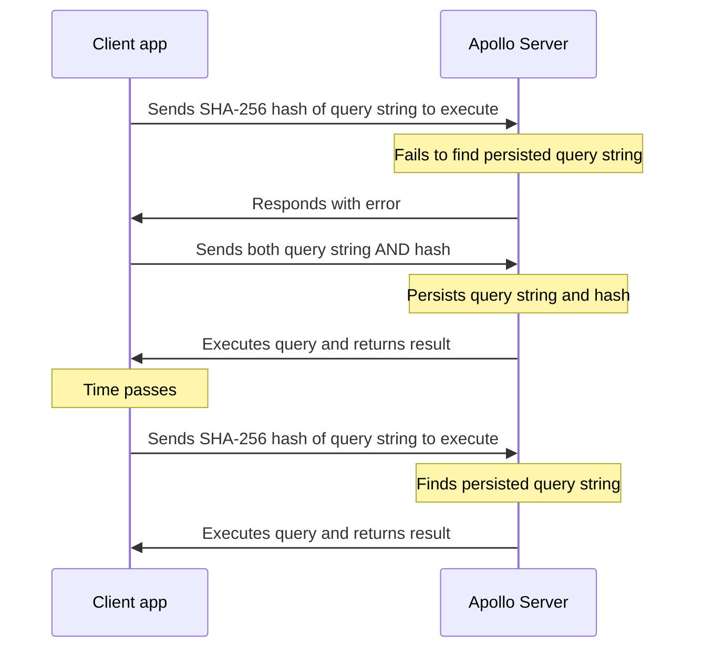

Clients send queries to Apollo Server as HTTP requests that include the GraphQL string of the query to execute. Depending on your graph's schema, the size of a valid query string might be arbitrarily large. As query strings become larger, increased latency and network usage can noticeably degrade client performance.

To improve network performance for large query strings, Apollo Server supports **Automatic Persisted Queries** (**APQ**). A persisted query is a query string that's cached on the server side, along with its unique identifier (always its SHA-256 hash). Clients can send this identifier _instead of_ the corresponding query string, thus reducing request sizes dramatically (response sizes are unaffected).

To persist a query string, Apollo Server must first receive it from a requesting client. Consequently, each unique query string must be sent to Apollo Server at least once. After _any_ client sends a query string to persist, _every_ client that executes that query can then benefit from APQ.



Persisted queries are especially effective when clients send queries as `GET` requests. This enables clients to take advantage of the browser cache and [integrate with a CDN](#using-get-requests-with-apq-on-a-cdn).

Because query identifiers are deterministic hashes, clients can generate them at runtime. No additional build steps are required.

## Apollo Client setup

Apollo Server supports APQ without any additional configuration. However, some _client-side_ configuration is required.

To set up APQ in Apollo Client, first import the `createPersistedQueryLink` function in the same file where you initialize `ApolloClient`:

```ts title="index.ts"
import { createPersistedQueryLink } from '@apollo/client/link/persisted-queries';
```

This function creates a link that you can add to your client's [Apollo Link chain](/react/api/link/introduction/). The link takes care of generating APQ identifiers, using `GET` requests for hashed queries, and retrying requests with query strings when necessary.

Add the persisted query link anywhere in the chain before the terminating link. This example shows a basic two-link chain:

```ts
import { ApolloClient, InMemoryCache, HttpLink } from '@apollo/client';
import { createPersistedQueryLink } from '@apollo/client/link/persisted-queries';
import { sha256 } from 'crypto-hash';

const linkChain = createPersistedQueryLink({ sha256 }).concat(
  new HttpLink({ uri: 'http://localhost:4000/graphql' }),
);

const client = new ApolloClient({
  cache: new InMemoryCache(),
  link: linkChain,
});
```

## Command-line testing

You can test out APQ directly from the command line. This section also helps illustrate the shape of APQ requests, so you can use it to add APQ support to GraphQL clients besides Apollo Client.

> This section assumes your server is running locally at `http://localhost:4000/graphql`.

Every GraphQL server supports the following query (which requests the `__typename` field from the `Query` type):

```graphql
{
  __typename
}
```

The SHA-256 hash of this query string is the following:

```none
ecf4edb46db40b5132295c0291d62fb65d6759a9eedfa4d5d612dd5ec54a6b38
```

1. Attempt to execute this query on your running server by providing its hash in a `curl` command, like so:

   ```shell
   curl --get http://localhost:4000/graphql \
     --header 'content-type: application/json' \
     --data-urlencode 'extensions={"persistedQuery":{"version":1,"sha256Hash":"ecf4edb46db40b5132295c0291d62fb65d6759a9eedfa4d5d612dd5ec54a6b38"}}'
   ```

   The first time you try this, Apollo Server responds with an error with the code `PERSISTED_QUERY_NOT_FOUND`. This tells us that Apollo Server hasn't yet received the associated query string.

2. Send a followup request that includes both the query string _and_ its hash, like so:

   ```shell
     curl --get http://localhost:4000/graphql \
     --header 'content-type: application/json' \
     --data-urlencode 'query={__typename}' \
     --data-urlencode 'extensions={"persistedQuery":{"version":1,"sha256Hash":"ecf4edb46db40b5132295c0291d62fb65d6759a9eedfa4d5d612dd5ec54a6b38"}}'
   ```

   This time, the server persists the query string and then responds with the query result as we'd expect.

   > The hash you provide _must_ be the exact SHA-256 hash of the query string. If it isn't, Apollo Server returns an error.

3. Finally, attempt the request from step 1 again:

   ```shell
     curl --get http://localhost:4000/graphql \
     --header 'content-type: application/json' \
     --data-urlencode 'extensions={"persistedQuery":{"version":1,"sha256Hash":"ecf4edb46db40b5132295c0291d62fb65d6759a9eedfa4d5d612dd5ec54a6b38"}}'
   ```

   This time, the server responds with the query result because it successfully located the associated query string in its cache.

## Using `GET` requests with APQ on a CDN

A great application for APQ is running Apollo Server behind a CDN. Many CDNs only cache GET requests, but many GraphQL queries are too long to fit comfortably in a cacheable GET request. When the APQ link is created with `createPersistedQueryLink({useGETForHashedQueries: true})`, Apollo Client automatically sends the short hashed queries as GET requests enabling a CDN to serve those requests. For full-length queries and for all mutations, Apollo Client will continue to use POST requests.

## CDN Integration

Content Delivery Networks (CDNs) such as [fly.io](https://fly.io), [Cloudflare](https://www.cloudflare.com/), [Akamai](https://www.akamai.com/), and [Fastly](https://www.fastly.com/) enable content caching close to clients, delivering data with low latency from a nearby server. Apollo Server makes it straightforward to use CDNs with GraphQL queries to cache full responses while still executing more dynamic queries.

Apollo Server works well with a Content Distribution Network (CDN) to cache full GraphQL query results. By adding the appropriate cache hints, Apollo Server can calculate `Cache-Control` headers that a CDN can use to determine how long a request should be cached. For subsequent requests, the result will be served directly from the CDN's cache. A CDN paired with Apollo Server's persisted queries is especially powerful since GraphQL operations can be shortened and sent with an HTTP GET request.

### Step 1: Add cache hints to the GraphQL schema

Add cache hints as [directives](../schema/directives/) to GraphQL schema so that Apollo Server knows which fields and types are cacheable and for how long. For example, this schema indicates that all fields that return an `Author` should be cached for 60 seconds, and that the `posts` field should itself be cached for 180 seconds:

```graphql
type Author @cacheControl(maxAge: 60) {
  id: Int
  firstName: String
  lastName: String
  posts: [Post] @cacheControl(maxAge: 180)
}
```

To learn how to define the `@cacheControl` directive, specify hints dynamically inside resolvers, set a default `maxAge` for all fields, and cache fields only for specific users (enabling CDNs to ignore those fields), see [Caching](./caching).

For example, to set a default max age other than `0` you can modify the Apollo Server constructor to include `cacheControl`:

```ts
import { ApolloServerPluginCacheControl } from '@apollo/server/plugin/cacheControl';

const server = new ApolloServer({
  typeDefs,
  resolvers,
  // The max age is calculated in seconds
  plugins: [ApolloServerPluginCacheControl({ defaultMaxAge: 5 })],
});
```

After this step, Apollo Server will serve the HTTP `Cache-Control` header on fully cacheable responses, so that any CDN in front of Apollo Server will know which responses can be cached and for how long. A "fully cacheable" response contains only data with non-zero `maxAge`; the header will refer to the minimum `maxAge` value across the whole response, and it will be `public` unless some of the data is tagged `scope: PRIVATE`. To observe this header, use any browser's network tab in its dev tools.

### Step 2: Enable automatic persisted queries

Often, GraphQL requests are big POST requests and most CDNs will only cache GET requests. Additionally, GET requests generally work best when the URL has a bounded size. Enabling automatic persisted queries means that short hashes are sent over the wire instead of full queries, and Apollo Client can be configured to use GET requests for those hashed queries.

To do this, update the **client** code. Add the persisted queries link to the Apollo Client constructor before the HTTP link:

```ts
import { ApolloClient, InMemoryCache, HttpLink } from '@apollo/client';
import { createPersistedQueryLink } from '@apollo/client/link/persisted-queries';
import { sha256 } from 'crypto-hash';

const link = createPersistedQueryLink({
  sha256,
  useGETForHashedQueries: true,
}).concat(new HttpLink({ uri: '/graphql' }));

const client = new ApolloClient({
  cache: new InMemoryCache(),
  link,
});
```

> If you are testing locally, make sure to include the full [URI](https://developer.mozilla.org/en-US/docs/Glossary/URI) including the port number. For example: `uri: "http://localhost:4000/graphql"`.

Make sure to include `useGETForHashedQueries: true`. Note that the client will still use POSTs for mutations because it's generally best to avoid GETs for non-idempotent requests.

If configured correctly, browser's dev tools should verify that queries are now sent as GET requests, and receive appropriate `Cache-Control` response headers.

### Step 3: Set up a CDN

How exactly this works depends on exactly which CDN you chose. Configure your CDN to send requests to Apollo Server. Some CDNs may need to be specially configured to honor origin Cache-Control headers. If all is well, cacheable queries should now be stored by the CDN.

> Note that requests served directly by a CDN will not show up in the Studio dashboard.

## Cache configuration

By default, Apollo Server stores its APQ registry within its local in-memory cache. If you provide a different `cache` as a top-level option to the `ApolloServer` constructor, Apollo Server uses that cache instead.

You can also designate a cache _specifically_ for the APQ registry. To do so, provide an instance of your preferred cache class to the `ApolloServer` constructor as a `cache` option nested within the `persistedQueries` options object. The `persistedQueries.cache` option is a [`KeyValueCache`](https://github.com/apollographql/apollo-utils/tree/main/packages/keyValueCache#keyvaluecache-interface), which accepts the same configuration options as Apollo Server's `cache` object (also a `KeyValueCache`).

To learn how to configure the in-memory cache, set up an external cache, or write your own cache implementation, see [Configuring cache backends](./cache-backends).

## Adjusting cache time-to-live (TTL)

The cache time-to-live (TTL) value determines how long a registered APQ remains in the cache. If a cached query's TTL elapses and the query is purged, it's re-registered the next time it's sent by a client.

Apollo Server's default in-memory store does not specify a TTL for APQs (an APQ remains cached until it is overwritten by the cache's standard eviction policy). For all other [supported stores](#cache-configuration), the default TTL is 300 seconds. You can override or disable this value by setting the `ttl` attribute of the `persistedQueries` option, in seconds:

```ts
const server = new ApolloServer({
  typeDefs,
  resolvers,
  persistedQueries: {
    // highlight-start
    ttl: 900, // 15 minutes
    // highlight-end
  },
});
```

To disable TTL entirely, specify `null` for the value of `ttl`:

```ts
const server = new ApolloServer({
  typeDefs,
  resolvers,
  persistedQueries: {
    ttl: null, // highlight-line
  },
});
```

As with the default behavior of the in-memory cache, this leaves APQs in the cache until they are overwritten by the cache's standard eviction policy.

## Disabling APQ

You can disable APQ entirely by setting the `persistedQueries` attribute to `false` in the `ApolloServer` constructor options:

```javascript
const server = new ApolloServer({
  typeDefs,
  resolvers,
  persistedQueries: false, // highlight-line
});
```

## Additional resources

This [Apollo Solutions repository](https://github.com/apollosolutions/apq-hasher) provides a simple web app for generating the hash of a query that is used in APQ requests.
This demonstrates how Apollo Client formats and hashes queries.

<SolutionsNote />
