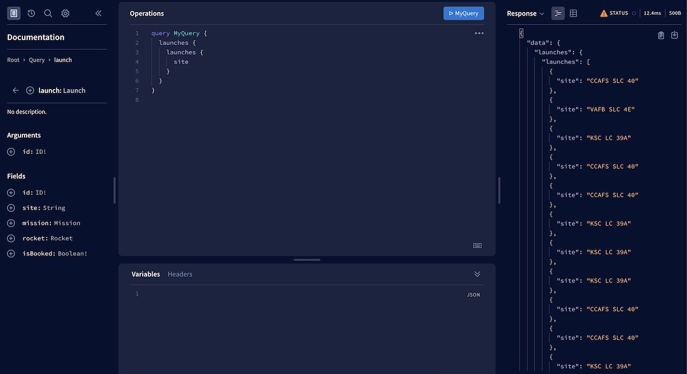

In non-production environments, Apollo Server 3 serves the following landing page from its base URL (`http://localhost:4000` by default):


> Apollo Server serves a different landing page [in production](#production-vs-non-production).

## Apollo Sandbox

The landing page above provides a link to [Apollo Sandbox](https://studio.apollographql.com/sandbox), a powerful web IDE that enables you to build and run operations against your server (or any other reachable server). Sandbox is a special instance of the [Apollo Studio Explorer](https://www.apollographql.com/docs/studio/explorer/) that doesn't require an Apollo account.



## Production vs. non-production

In production environments (when `NODE_ENV` is `production`), Apollo Server serves a different landing page:


This is partly because Apollo Server disables introspection in production by default, which means that tools like Apollo Sandbox don't work.

For this reason, if you choose to [change your Apollo Server landing page](#changing-the-landing-page), we recommend using different settings for production and non-production environments (potentially even [disabling your landing page](#disabling-the-landing-page) in production).

## Changing the landing page

You can change the landing page that's served from Apollo Server's base URL. In addition to [configuring the default landing page](#configuring-the-default-landing-page), you can serve [GraphQL Playground](#graphql-playground) (an open-source GraphQL IDE), a completely [custom landing page](#custom-landing-page), or you can [disable the landing page entirely](#disabling-the-landing-page).

You do this by installing one of a few different Apollo Server **plugins**.

### Configuring the default landing page

Apollo Server uses one of these plugins to display its default landing page, depending on the environment:

* `ApolloServerPluginLandingPageLocalDefault` (non-production environments)
* `ApolloServerPluginLandingPageProductionDefault` (production)

You can install either of these plugins manually to configure its behavior.

This sample replicates Apollo Server's default behavior, except it removes the footer that each landing page displays:

```js{1-4,10-12}:title=index.js
const { 
  ApolloServerPluginLandingPageProductionDefault
  ApolloServerPluginLandingPageLocalDefault,
} = require('apollo-server-core');

const server = new ApolloServer({
  typeDefs,
  resolvers,
  plugins: [
    process.env.NODE_ENV === 'production' ?
      ApolloServerPluginLandingPageProductionDefault({ footer: false }) :
      ApolloServerPluginLandingPageLocalDefault({ footer: false })
  ]
});
```

For all available configuration options for these plugins, [see the API reference](../api/plugin/landing-pages/).

### GraphQL Playground

> **Note:** The GraphQL Playground project is [retired](https://github.com/graphql/graphql-playground/issues/1143) in favor of GraphiQL. This functionality is provided to help developers migrating from Apollo Server 2.

 The previous version of Apollo Server (v2) serves GraphQL Playground from its base URL:


You can replicate this behavior in Apollo Server 3 by providing the following plugin to the `ApolloServer` constructor:

```js{1,7-9}:title=index.js
const { ApolloServerPluginLandingPageGraphQLPlayground } = require('apollo-server-core');

const server = new ApolloServer({
  typeDefs,
  resolvers,
  plugins: [
    ApolloServerPluginLandingPageGraphQLPlayground({
      // options
    })
  ]
});
```

You can configure GraphQL Playground's behavior by [providing options to this plugin](../api/plugin/landing-pages/#graphql-playground-landing-page).

### Custom landing page

You can serve a custom HTML landing page from Apollo Server's base URL. To do so, define your own [custom plugin](../integrations/plugins/) that calls the [`renderLandingPage` method](../integrations/plugins-event-reference/#renderlandingpage), like so:

```js{5-22}:title=index.js
const server = new ApolloServer({
  typeDefs,
  resolvers,
  plugins: [
    {
      async serverWillStart() {
        return {
          async renderLandingPage() {
            const html = `
<!DOCTYPE html>
<html>
  <head>
  </head>
  <body>
    <h1>Hello world!</h1>
  </body>
</html>`;
            return { html };
          }
        }
      }
    }
  ]
});
```


### Disabling the landing page

You can disable Apollo Server's landing page by providing the following plugin to the `ApolloServer` constructor:

```js{1,7}:title=index.js
const { ApolloServerPluginLandingPageDisabled } = require('apollo-server-core');

const server = new ApolloServer({
  typeDefs,
  resolvers,
  plugins: [
    ApolloServerPluginLandingPageDisabled()
  ]
});
```
