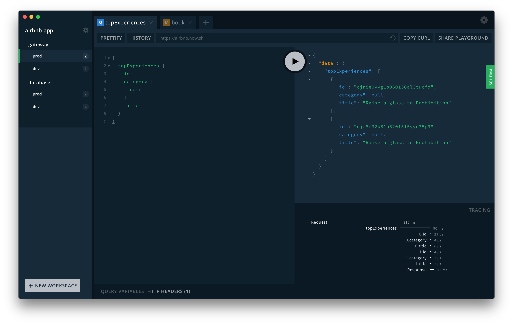

import {
  ExpansionPanel,
} from 'gatsby-theme-apollo-docs/src/components/expansion-panel';
import { Button } from '@apollo/space-kit/Button';
import { Link } from 'gatsby';
import { colors } from 'gatsby-theme-apollo-core';

<ExpansionPanel title="📣 The Apollo Studio Explorer now supports local development">

**Apollo Sandbox** is a special instance of the Apollo Studio Explorer that you can use for local development without an Apollo account.

<p>
  <Button
    size="large"
    color={colors.primary}
    as={<Link to="https://studio.apollographql.com/sandbox/" target="_blank" />}
  >
    Launch Sandbox
  </Button>
</p>

Sandbox automatically attempts to connect to a GraphQL server running at `http://localhost:4000`. You can use the box at the top of the page to change this URL to any local or remote GraphQL endpoint that's accessible by your browser.

</ExpansionPanel>

[GraphQL Playground](https://github.com/prismagraphql/graphql-playground) is a graphical, interactive, in-browser GraphQL IDE, created by [Prisma](https://www.prisma.io/) and based on [GraphiQL](https://github.com/graphql/graphiql).

In development, Apollo Server enables GraphQL Playground on the same URL as the GraphQL server itself (e.g. `http://localhost:4000/graphql`) and automatically serves the GUI to web browsers.  When `NODE_ENV` is set to `production`, GraphQL Playground (as well as introspection) is disabled as a production best-practice.



## Configuring Playground

The Apollo Server constructor contains the ability to configure GraphQL Playground with the `playground` configuration option. The options can be found on GraphQL Playground's [documentation](https://github.com/prismagraphql/graphql-playground/#usage).

```js
new ApolloServer({
typeDefs,
resolvers,
playground: {
  settings: {
    'editor.theme': 'light',
  },
  tabs: [
    {
      endpoint,
      query: defaultQuery,
    },
  ],
},
});
```

## Enabling GraphQL Playground in production

To enable GraphQL Playground in production, introspection and the playground can be enabled explicitly in the following manner.

```js{7-8}
const { ApolloServer } = require('apollo-server');
const { typeDefs, resolvers } = require('./schema');

const server = new ApolloServer({
  typeDefs,
  resolvers,
  introspection: true,
  playground: true,
});


server.listen().then(({ url }) => {
  console.log(`🚀 Server ready at ${url}`);
});
```
