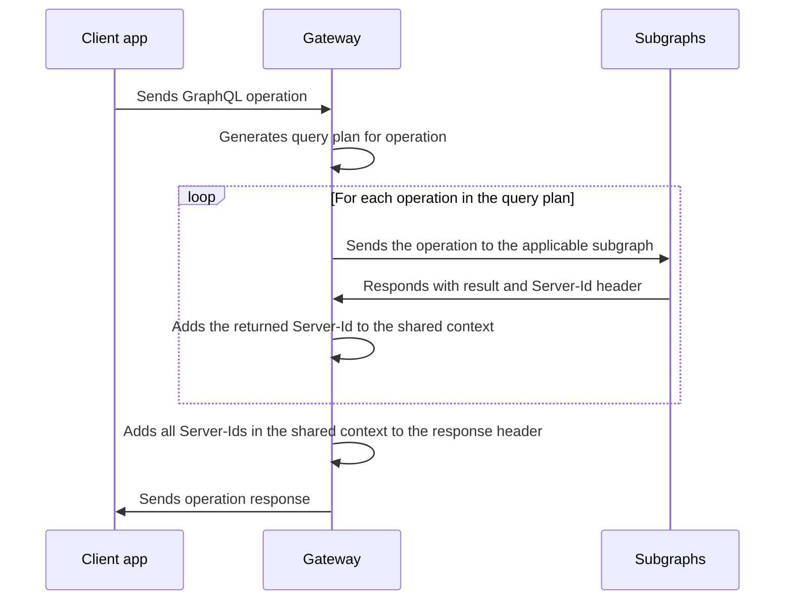

import FederationArchitecture from '../shared/diagrams/federation-architecture.mdx';

After you set up at least one federation-ready [subgraph](/federation/building-supergraphs/subgraphs-overview), you can configure a **graph router** (also known as a gateway) to sit in front of your subgraphs.

<FederationArchitecture />

> 📣 In the majority of cases, **we recommend using [the GraphOS Router](/federation/building-supergraphs/router) as your graph router.** It's faster to configure, it's more performant (especially with high request loads), and it rarely requires writing custom code.

In certain cases, you might need to use Apollo Server as your graph router if your subgraphs use a custom authentication method that is currently difficult to configure with the GraphOS Router.

Regardless of which graph router library you start with, you can swap to the other without making any changes to other parts of your supergraph.

## Node.js gateway setup

This section walks through setting up a basic graph router using Apollo Server and the `@apollo/gateway` library. It currently requires [Node.js version 14 or 16](https://nodejs.org/en/download/).

Create a new Node.js project with `npm init`, then install the necessary packages:

```shell
npm install @apollo/gateway @apollo/server graphql
```

The `@apollo/gateway` package includes the [`ApolloGateway` class](./api/apollo-gateway/). To configure Apollo Server to act as a graph router, you pass an instance of `ApolloGateway` to the `ApolloServer` constructor, like so:

<MultiCodeBlock>

```ts title="index.ts"
import { ApolloServer } from '@apollo/server';
import { startStandaloneServer } from '@apollo/server/standalone';
import { ApolloGateway } from '@apollo/gateway';
import { readFileSync } from 'fs';

const supergraphSdl = readFileSync('./supergraph.graphql').toString();

// Initialize an ApolloGateway instance and pass it
// the supergraph schema as a string
// highlight-start
const gateway = new ApolloGateway({
  supergraphSdl,
});
// highlight-end

// Pass the ApolloGateway to the ApolloServer constructor
// highlight-start
const server = new ApolloServer({
  gateway,
});
// highlight-end

// Note the top-level `await`!
const { url } = await startStandaloneServer(server);
console.log(`🚀  Server ready at ${url}`);
```

</MultiCodeBlock>

### Composing the supergraph schema

In the above example, we provide the `supergraphSdl` option to the `ApolloGateway` constructor. This is the string representation of our [supergraph schema](/federation/federated-schemas/#supergraph-schema), which is composed from all of our subgraph schemas.

To learn how to compose your supergraph schema, see [Supported methods](/federation/federated-schemas/composition/#supported-methods).

> In production, we strongly recommend running the gateway in a **managed mode** with Apollo Studio, which enables your gateway to update its configuration without a restart. For details, see [Setting up managed federation](/federation/managed-federation/setup/).

On startup, the gateway processes your `supergraphSdl`, which includes routing information for your subgraphs. It then begins accepting incoming requests and creates query plans for them that execute across one or more subgraphs.

### Updating the supergraph schema

In the above example, we provide a _static_ supergraph schema to the gateway. This approach requires the gateway to restart in order to update the supergraph schema. This is undesirable for many applications, so we also provide the ability to update the supergraph schema dynamically.

<MultiCodeBlock>

```ts title="index.ts"
import { ApolloServer } from '@apollo/server';
import { startStandaloneServer } from '@apollo/server/standalone';
import { ApolloGateway } from '@apollo/gateway';
import { readFile } from 'fs/promises';

let supergraphUpdate;
const gateway = new ApolloGateway({
  async supergraphSdl({ update }) {
    // `update` is a function that we'll save for later use
    supergraphUpdate = update;
    return {
      supergraphSdl: await readFile('./supergraph.graphql', 'utf-8'),
    };
  },
});

// Pass the ApolloGateway to the ApolloServer constructor
const server = new ApolloServer({
  gateway,
});

const { url } = await startStandaloneServer(server);
console.log(`🚀  Server ready at ${url}`);
```

</MultiCodeBlock>

There are a few things happening here. Let's take a look at each of them individually.

Note that `supergraphSdl` is now an `async` function. This function is called exactly once, when `ApolloServer` initializes the gateway. It has the following responsibilities:

- It receives the `update` function, which we use to update the supergraph schema.
- It returns the initial supergraph schema, which the gateway uses at startup.

With the `update` function, we can now programmatically update the supergraph schema. Polling, webhooks, and file watchers are all examples of ways we can go about doing this.

The code below demonstrates a more complete example using a file watcher. In this example, assume that we're updating the `supergraphSdl.graphql` file with the Rover CLI.

<MultiCodeBlock>

```ts title="index.ts"
import { ApolloServer } from '@apollo/server';
import { startStandaloneServer } from '@apollo/server/standalone';
import { ApolloGateway } from '@apollo/gateway';
import { watch } from 'fs';
import { readFile } from 'fs/promises';

const server = new ApolloServer({
  gateway: new ApolloGateway({
    async supergraphSdl({ update, healthCheck }) {
      // create a file watcher
      const watcher = watch('./supergraph.graphql');
      // subscribe to file changes
      watcher.on('change', async () => {
        // update the supergraph schema
        try {
          const updatedSupergraph = await readFile(
            './supergraph.graphql',
            'utf-8',
          );
          // optional health check update to ensure our services are responsive
          await healthCheck(updatedSupergraph);
          // update the supergraph schema
          update(updatedSupergraph);
        } catch (e) {
          // handle errors that occur during health check or while updating the supergraph schema
          console.error(e);
        }
      });

      return {
        supergraphSdl: await readFile('./supergraph.graphql', 'utf-8'),
        // cleanup is called when the gateway is stopped
        async cleanup() {
          watcher.close();
        },
      };
    },
  }),
});

const { url } = await startStandaloneServer(server);
console.log(`🚀  Server ready at ${url}`);
```

</MultiCodeBlock>

This example is a bit more complete. Let's take a look at what we've added.

In the `supergraphSdl` callback, we also receive a `healthCheck` function. This enables us to run a health check against each of the services in our future supergraph schema. This is useful for ensuring that our services are responsive and that we don't perform an update when it's unsafe.

We've also wrapped our call to `update` and `healthCheck` in a `try` block. If an error occurs during either of these, we want to handle this gracefully. In this example, we continue running the existing supergraph schema and log an error.

Finally, we return a `cleanup` function. This is a callback that's called when the gateway is stopped. This enables us to cleanly shut down any ongoing processes (such as file watching or polling) when the gateway is shut down via a call to `ApolloServer.stop`. The gateway expects `cleanup` to return a `Promise` and `await`s it before shutting down.

#### Advanced usage

In a more complex application, you might want to create a class that handles the `update` and `healthCheck` functions, along with any additional state. In this case, you can instead provide an object (or class) with an `initialize` function. This function is called just like the `supergraphSdl` function discussed above. For an example of this, see the [`IntrospectAndCompose` source code](https://github.com/apollographql/federation/blob/main/gateway-js/src/supergraphManagers/IntrospectAndCompose/index.ts).

### Composing subgraphs with `IntrospectAndCompose`

<ExpansionPanel title="Looking for serviceList?">

In `@apollo/gateway` version 0.46.0 and later, `IntrospectAndCompose` is the new drop-in replacement for the `serviceList` option. The `serviceList` option will be removed in an upcoming release of `@apollo/gateway`, but `IntrospectAndCompose` will continue to be supported. We recommend using the Rover CLI to manage local composition, but `IntrospectAndCompose` is still useful for various development and testing workflows.

</ExpansionPanel>

> ⚠️ **We strongly recommend _against_ using `IntrospectAndCompose` in production.** For details, see [Limitations of `IntrospectAndCompose`](#limitations-of-introspectandcompose).

Instead of providing a composed supergraph schema to the gateway, you can instruct the gateway to fetch all of your subgraph schemas and perform composition _itself_. To do so, provide an instance of the `IntrospectAndCompose` class with a `subgraphs` array, like so:

<MultiCodeBlock>

```ts title="index.ts"
const { ApolloGateway, IntrospectAndCompose } = require('@apollo/gateway');

const gateway = new ApolloGateway({
  supergraphSdl: new IntrospectAndCompose({
    subgraphs: [
      { name: 'accounts', url: 'http://localhost:4001' },
      { name: 'products', url: 'http://localhost:4002' },
      // ...additional subgraphs...
    ],
  }),
});
```

</MultiCodeBlock>

Each item in the `subgraphs` array is an object that specifies the `name` and `url` of one of your subgraphs. You can specify any string value for `name`, which is used primarily for query planner output, error messages, and logging.

On startup, the gateway fetches each subgraph's schema from its `url` and composes those schemas into a supergraph schema. It then begins accepting incoming requests and creates query plans for them that execute across one or more subgraphs.

Additional configuration options can be found in the [`IntrospectAndCompose` API documentation](./api/apollo-gateway#class-introspectandcompose).

However, `IntrospectAndCompose` has important [limitations](#limitations-of-introspectandcompose).

#### Limitations of `IntrospectAndCompose`

The `IntrospectAndCompose` option can sometimes be helpful for local development, but it's strongly discouraged for any other environment. Here are some reasons why:

- **Composition might fail.** With `IntrospectAndCompose`, your gateway performs composition dynamically on startup, which requires network communication with each subgraph. If composition fails, your gateway [throws errors](/federation/errors/) and experiences unplanned downtime.
  - With the static or dynamic `supergraphSdl` configuration, you instead provide a supergraph schema that has _already_ been composed successfully. This prevents composition errors and enables faster startup.
- **Gateway instances might differ.** If you deploy multiple instances of your gateway _while_ deploying updates to your subgraphs, your gateway instances might fetch different schemas from the _same_ subgraph. This can result in sporadic composition failures or inconsistent supergraph schemas between instances.
  - When you deploy multiple instances with `supergraphSdl`, you provide the exact same static artifact to each instance, enabling more predictable behavior.

## Updating the gateway

> Before updating your gateway's version, check the [changelog](https://github.com/apollographql/federation/blob/main/gateway-js/CHANGELOG.md) for potential breaking changes.
>
> We strongly recommend updating your gateway in local and test environments before deploying updates to staging or production.

You can confirm the currently installed version of the `@apollo/gateway` library with the `npm list` command:

```bash
npm list @apollo/gateway
```

To update the library, use the [`npm update`](https://docs.npmjs.com/cli/v7/commands/npm-update) command:

```bash
npm update @apollo/gateway
```

This updates the library to the most recent version allowed by your `package.json` file. [Learn more about dependency constraints.](https://docs.npmjs.com/cli/v7/commands/npm-update#example)

To update to a particular version (including a version that _exceeds_ your dependency constraints), use `npm install` instead:

```bash
npm install @apollo/gateway@2.0.0
```

## Customizing requests and responses

The gateway can modify the details of an incoming request before executing it across your subgraphs. For example, your subgraphs might all use the same authorization token to associate an incoming request with a particular user. The gateway can add that token to each operation it sends to your subgraphs.

Similarly, the gateway can modify the details of its response to a client, based on the result returned by each subgraph.

### Customizing requests

In the following example, each incoming request to the gateway includes an `Authorization` header. The gateway sets the shared `contextValue` for an operation by pulling the value of that header and using it to fetch the associated user's ID.

After adding the `userId` to the shared `contextValue` object, the gateway can then add that value to a header that it includes in its requests to each subgraph.

<ExpansionPanel title="Expand example">

```ts
import { ApolloServer } from '@apollo/server';
import { startStandaloneServer } from '@apollo/server/standalone';
import { ApolloGateway, RemoteGraphQLDataSource } from '@apollo/gateway';
import { readFileSync } from 'fs';

// highlight-start
class AuthenticatedDataSource extends RemoteGraphQLDataSource {
  willSendRequest({ request, context }) {
    // Pass the user's id from the context to each subgraph
    // as a header called `user-id`
    request.http.headers.set('user-id', context.userId);
  }
}
// highlight-end

const supergraphSdl = readFileSync('./supergraph.graphql').toString();
const gateway = new ApolloGateway({
  supergraphSdl,
  //highlight-start
  buildService({ name, url }) {
    return new AuthenticatedDataSource({ url });
  },
  //highlight-end
});

const server = new ApolloServer({
  gateway,
});

const { url } = await startStandaloneServer(server, {
  //highlight-start
  context: async ({ req }) => {
    // Get the user token from the headers
    const token = req.headers.authorization || '';
    // Try to retrieve a user with the token
    const userId = getUserId(token);
    // Add the user ID to the contextValue
    return { userId };
  },
  //highlight-end
});

console.log(`🚀  Server ready at ${url}`);
```

</ExpansionPanel>

> The fields of the object passed to your `context` function might differ if you're using a different [Apollo Server integration](../integrations/integration-index).

The `buildService` function enables us to customize the requests that are sent to our subgraphs. In this example, we return a custom `RemoteGraphQLDataSource`. This datasource enables us to modify the outgoing request with information from Apollo Server's `contextValue` before it's sent. Here, we add the `user-id` header to pass an authenticated user ID to downstream services.

### Customizing responses

Let's say that whenever a subgraph returns an operation result to the gateway, it includes a `Server-Id` header in the response. The value of the header uniquely identifies the subgraph in our graph.

When the gateway then responds to a client, we want _its_ `Server-Id` header to include the identifier for _every_ subgraph that contributed to the response. In this case, we can tell the gateway to aggregate the various server IDs into a single, comma-separated list.

The flow for processing a single operation from a client application then looks like this:



To implement this flow, we can use the `didReceiveResponse` callback of the `RemoteGraphQLDataSource` class to inspect each subgraph's result as it comes in. We can add the `Server-Id` to the shared `context` in this callback, then pull the full list from the `context` when sending the final response to the client.

<ExpansionPanel title="Expand example">

```ts
import { ApolloServer } from '@apollo/server';
import { startStandaloneServer } from '@apollo/server/standalone';
import { ApolloGateway, RemoteGraphQLDataSource } from '@apollo/gateway';
import { readFileSync } from 'fs';

const supergraphSdl = readFileSync('./supergraph.graphql').toString();

class DataSourceWithServerId extends RemoteGraphQLDataSource {
  // highlight-start
  async didReceiveResponse({ response, request, context }) {
    // Parse the Server-Id header and add it to the array on context
    const serverId = response.http.headers.get('Server-Id');
    if (serverId) {
      context.serverIds.push(serverId);
    }

    // Return the response, even when unchanged.
    return response;
  }
  // highlight-end
}

const gateway = new ApolloGateway({
  supergraphSdl,
  // highlight-start
  buildService({ url }) {
    return new DataSourceWithServerId({ url });
  },
  // highlight-end
});

const server = new ApolloServer({
  gateway,
  plugins: [
    // highlight-start
    {
      requestDidStart() {
        return {
          async willSendResponse({ contextValue, response }) {
            // Append our final result to the outgoing response headers
            response.http.headers.set(
              'Server-Id',
              contextValue.serverIds.join(','),
            );
          },
        };
      },
    },
    // highlight-end
  ],
});

const { url } = await startStandaloneServer(server, {
  context() {
    return { serverIds: [] };
  },
});

console.log(`🚀  Server ready at ${url}`);
```

</ExpansionPanel>

> In this example, multiple calls to `didReceiveResponse` are `push`ing a value onto the shared `contextValue.serverIds` array. The order of these calls cannot be guaranteed. If you write logic that modifies the shared `contextValue` object, make sure that modifications are not destructive, and that the order of modifications doesn't matter.

To learn more about `buildService` and `RemoteGraphQLDataSource`, see the [API docs](./api/apollo-gateway/).

## Custom directive support

The `@apollo/gateway` library supports the use of custom [directives](../schema/directives/) in your subgraph schemas. This support differs depending on whether a given directive is a **type system directive** or an **executable directive**.

### Type system directives

Type system directives are directives that are applied to one of [these locations](http://spec.graphql.org/June2018/#TypeSystemDirectiveLocation). These directives are _not_ used within operations, but rather are applied to locations within the schema itself.

The `@deprecated` directive below is an example of a type system directive:

```graphql
directive @deprecated(
  reason: String = "No longer supported"
) on FIELD_DEFINITION | ENUM_VALUE

type ExampleType {
  newField: String
  oldField: String @deprecated(reason: "Use `newField`.")
}
```

The gateway strips all definitions _and_ uses of type system directives from your graph's [API schema](/federation/federated-schemas/#api-schema). This has no effect on your subgraph schemas, which retain this information.

Effectively, the gateway supports type system directives by _ignoring_ them, making them the responsibility of the subgraphs that define them.

### Executable directives

Executable directives are directives that are applied to one of [these locations](http://spec.graphql.org/June2018/#ExecutableDirectiveLocation). These directives are _defined_ in your schema, but they're _used_ in operations that are sent by clients.

Here's an example of an executable directive definition:

```graphql
# Uppercase this field's value (assuming it's a string)
directive @uppercase on FIELD
```

And here's an example of a query that uses that directive:

```graphql
query GetUppercaseUsernames {
  users {
    name @uppercase
  }
}
```

> It's strongly recommended that all of your subgraphs use the exact same logic for a given executable directive. Otherwise, operations might produce inconsistent or confusing results for clients.
