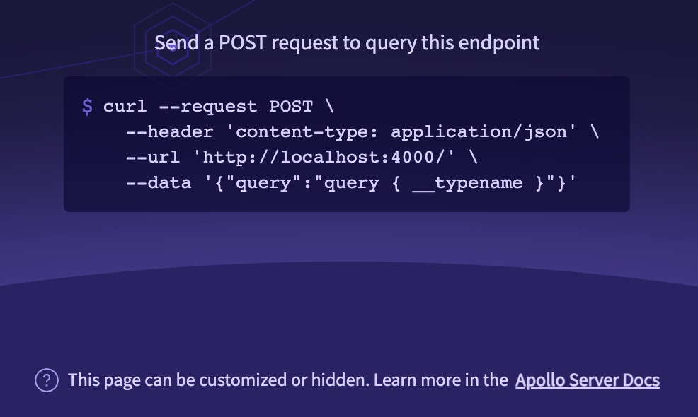

> Check out this post from the Apollo blog: [Making GraphQL Requests using HTTP Methods](https://www.apollographql.com/blog/graphql/basics/making-graphql-requests-using-http-methods/).

By default, almost every GraphQL IDE and client library takes care of sending operations in a format that Apollo Server supports. This article describes that format, which is also described on [graphql.org](https://graphql.org/learn/serving-over-http/) and in [this preliminary spec](https://github.com/graphql/graphql-over-http).

Apollo Server accepts queries and mutations sent as `POST` requests. It also accepts queries sent as `GET` requests.

## POST requests

Apollo Server accepts `POST` requests with a JSON body. A valid request contains a `query` field, along with optional `variables`, `extensions`, and an `operationName` (clarifying which `query` to run if the request contains multiple possible operations). You must specify a `Content-Type` HTTP header with type `application/json`.

Let's say we want to execute the following query:

```graphql
query GetBestSellers($category: ProductCategory) {
  bestSellers(category: $category) {
    title
  }
}
```

Here's an example of a valid POST request body for that query:

```json
{
  "query": "query GetBestSellers($category: ProductCategory){bestSellers(category: $category){title}}",
  "operationName": "GetBestSellers",
  "variables": { "category": "BOOKS" }
}
```

Note that `operationName` _isn't_ required for this particular request body, because `query` includes only one operation definition.

You can execute this query against an Apollo-hosted example server right now with the following `curl` command:

```sh
curl --request POST \
  -H 'Content-Type: application/json' \
  --data '{"query":"query GetBestSellers($category: ProductCategory){bestSellers(category: $category){title}}", "operationName":"GetBestSellers", "variables":{"category":"BOOKS"}}' \
  https://rover.apollo.dev/quickstart/products/graphql
```

> Apollo Server's default production landing page provides a `curl` command you can use to execute a test query on your own server:
>
> 

### Batching

By default, Apollo Server 4 [doesn't support batching HTTP requests](../api/apollo-server#allowbatchedhttprequests). To enable HTTP batching, you must explicitly pass `allowBatchedHttpRequests: true` to the `ApolloServer` constructor.

If you have enabled HTTP batching, you can send a batch of queries in a single `POST` request by providing a JSON-encoded array of query objects, like so:

```json
[
  {
    "query": "query { testString }"
  },
  {
    "query": "query AnotherQuery{ test(who: \"you\" ) }"
  }
]
```

If you send a batched request, Apollo Server responds with a corresponding array of GraphQL responses.

> Note: If multiple operations in a request try to set the same HTTP response header ([via error extensions or plugins](../data/errors#setting-http-status-code-and-headers)), headers from later operations will take precedence on a per-header basis.

## GET requests

Apollo Server also accepts `GET` requests for queries (but not mutations). With a `GET` request, query details (`query`, `operationName`, `variables`) are provided as URL query parameters. The `variables` option is a URL-escaped JSON object.

> Sending queries as `GET` requests can help with [CDN caching](../performance/caching/#caching-with-a-cdn).

Here's the same query from [POST requests](#post-requests) formatted for a `curl` `GET` request:

```sh
curl --request GET \
  https://rover.apollo.dev/quickstart/products/graphql?query=query%20GetBestSellers%28%24category%3A%20ProductCategory%29%7BbestSellers%28category%3A%20%24category%29%7Btitle%7D%7D&operationName=GetBestSellers&variables=%7B%22category%22%3A%22BOOKS%22%7D
```

Unlike with `POST` requests, `GET` requests do not require a `Content-Type` header. However, if you have Apollo Server 4's default [CSRF prevention](../security/cors#preventing-cross-site-request-forgery-csrf) feature enabled, `GET` requests that don't contain a `Content-Type` header must contain one of the following:

- A non-empty `X-Apollo-Operation-Name` header
- A non-empty `Apollo-Require-Preflight` header

For more details, see [the CSRF prevention documentation](../security/cors#preventing-cross-site-request-forgery-csrf).

## Incremental delivery (experimental)

Incremental delivery is a [Stage 2: Draft Proposal](https://github.com/graphql/graphql-spec/pull/742) to the GraphQL specification which adds `@defer` and `@stream` executable directives. These directives allow clients to specify that parts of an operation can be sent after an initial response, so that slower fields do not delay all other fields. As of September 2022, the `graphql` library (also known as `graphql-js`) upon which Apollo Server is built implements incremental delivery only in the unreleased major version 17. If a pre-release of `graphql@17.0.0-alpha.2` is installed in your server, Apollo Server 4 can execute these incremental delivery directives and provide streaming [`multipart/mixed`](https://github.com/graphql/graphql-over-http/blob/main/rfcs/IncrementalDelivery.md) responses.

Support for incremental delivery in graphql version 17 is [opt-in](https://github.com/robrichard/defer-stream-wg/discussions/12), meaning the directives are not defined by default. In order to use `@defer` or `@stream`, you must provide the appropriate definition(s) in your SDL. The definitions below can be pasted into your schema as-is:

```graphql
directive @defer(if: Boolean, label: String) on FRAGMENT_SPREAD | INLINE_FRAGMENT
directive @stream(if: Boolean, label: String, initialCount: Int = 0) on FIELD
```

If you are creating the schema object yourself, the appropriate directive(s) must be provided to the schema constructor like so:
```typescript
import {
  GraphQLSchema,
  GraphQLDeferDirective,
  GraphQLStreamDirective,
  specifiedDirectives,
} from 'graphql';

const schema = new GraphQLSchema({
  query,
  directives: [
    ...specifiedDirectives,
    GraphQLDeferDirective,
    GraphQLStreamDirective,
  ],
});
```

Clients sending operations with incremental delivery directives need to explicitly indicate that they are expecting to receive `multipart/mixed` responses in an `accept` header. Moreover, because incremental delivery has not yet been finalized in the GraphQL spec and may change before the final version, they need to specify that they expect the particular response format that Apollo Server produces today via a `deferSpec` parameter. Specifically, clients prepared to accept incremental delivery responses should send an `accept` header like `multipart/mixed; deferSpec=20220824`. Note that this header implies that *only* multipart responses should be accepted; typically, clients will send an accept header like `multipart/mixed; deferSpec=20220824, application/json` indicating that either multipart or single-part responses are acceptable.

You cannot combine [batching](#batching) with incremental delivery in the same request.
